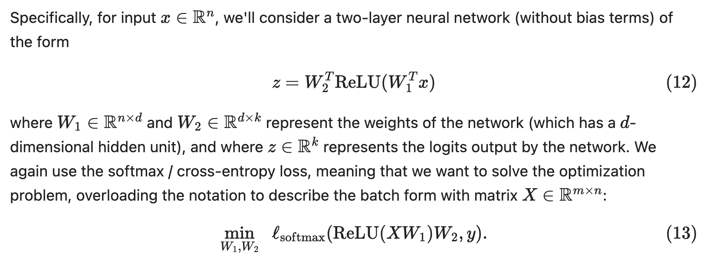
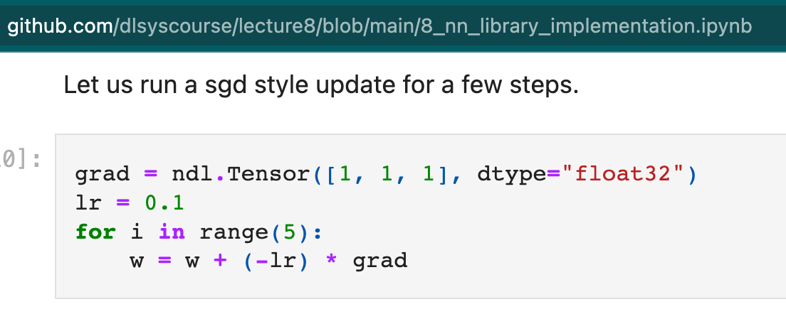
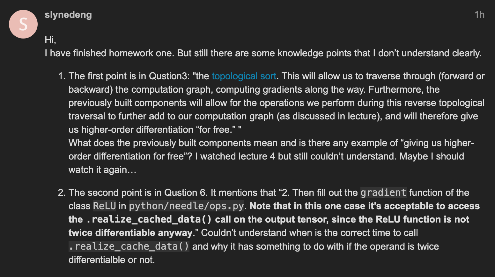
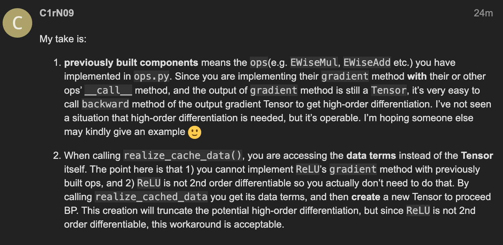
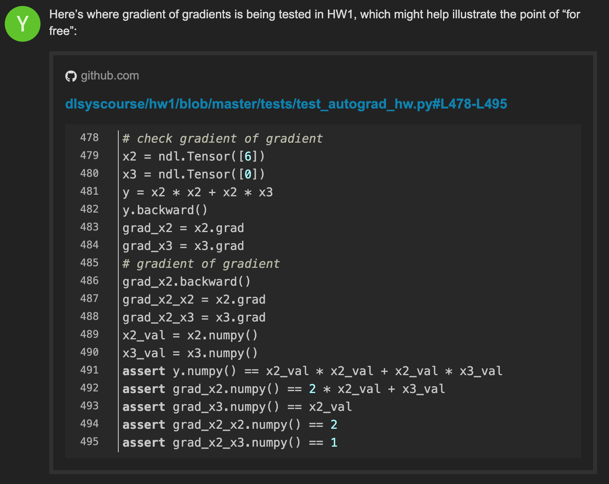
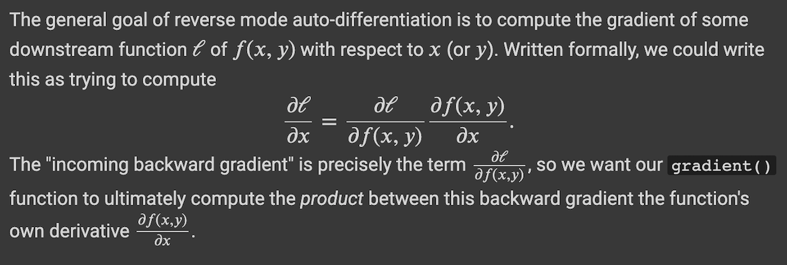
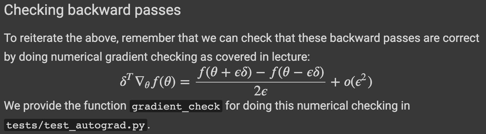

Hướng dẫn làm bài tập
https://github.com/telexyz/kim/blob/main/10714/hw1/hw1.ipynb

needle framework code walk through
https://www.youtube.com/watch?v=cNADlHfHQHg

!! Nên đọc `tests/test_autograd_hw.py` trước để hiểu đầu ra của mỗi hàm cần impl là gì !!

## Question 6: SGD for a two-layer neural network [10 pts]

1/ Begin by filling out the function ReLU operator in python/needle/ops.py.

2/ Then fill out the gradient function of the class ReLU in python/needle/ops.py. Note that in this one case it's acceptable to access the `.realize_cached_data()` call on the output tensor, since the ReLU function is not twice differentiable anyway.



3/ Fill out the nn_epoch method in the apps/simple_ml.py file.

Again, you can use your solution in Homework 0 for the nn_epoch function as a starting point. Note that unlike in Homework 0, the inputs W1 and W2 are Tensors. 

Inputs X and y however are still numpy arrays - you should iterate over mini-batches of the numpy arrays X and y as you did in Homework 0, and then cast each X_batch as a Tensor, and one hot encode y_batch and cast as a Tensor. 

While last time we derived the backpropagation equations for this two-layer ReLU network directly, this time we will be using our auto-differentiation engine to compute the gradients generically by calling the `.backward()` method of the Tensor class.

For each mini-batch, after calling `.backward()`, you should compute the updated values for W1 and W2 in numpy, and then create new Tensors for W1 and W2 with these numpy values. Your solution should return the final W1 and W2 Tensors.

CHÚ Ý: chỉ dùng `lr` để update W1, W2 (không dùng lr / batch). Hint ở đây:


```sh
e ./apps/simple_ml.py:116
# impl nn_epoch()
python3 -m pytest -k "nn_epoch_ndl"
```

https://forum.dlsyscourse.org/t/not-understand-several-sentences-meaning-in-hw1/2090






(( continue discussion ))

*punitb*
In general, whenever you write a function of tensors, the library creates a computational graph. Say, c = a+b. Now, c will contain a list of inputs and information about the operation performed on them. If you look at the flow of calls made when you perform an operation (TensorOp.call → Tensor.make_from_op), if the library is in lazy eval mode then it’s not going to actually perform that operation and store result. So, to get the actual result of the operation, we can force the tensor to perform its op by making a call to calculate the cached data.


*slynedeng*
As for the example, maybe we can take f(x) = x ^ 2

We first call the gradient function of Pow and then we get f’(x) = 2 * x
2 is scalar and x is Tensor and therefore f’(x) is also a tensor, which is made from the op - MulScalar. When MulScalar is called, Tensor.make_from_op is also called and generating the result tensor f’(x)

So if we want to further take the derivative of the tensor f’(x), we can simply get the derivation by calling the gradient function of op - MulScalar, which returns the scalar (when out_grad=1): f’'(x) = 2

**For realize_cache_data(), since we create a new Tensor from ndarray, we cannot trace back the input of the new Tensor and we cannot get its high-order differentiation.**


## Question 5: Softmax loss [10 pts]

First, copy and paste your solution to Question 2 of Homework 0 to the parse_mnist function in the `apps/simple_ml.py` file.


```sh
e ./apps/simple_ml.py:49
# impl softmax_loss()
python3 -m pytest -k "softmax_loss_ndl"
```


## Question 4: Implementing reverse mode differentiation [25 pts]


For this question, implement the Reverse AD algorithm in the 
`compute_gradient_of_variables` function in `python/needle/autograd.py`.

As discussed in lecture the result of reverse mode AD is still a computational graph. We can extend that graph further by composing more operations and run reverse mode AD again on the gradient (the last two tests of this problem).

```sh
e ./python/needle/autograd.py:422
python3 -m pytest -k "compute_gradient"
```

## Backward

## reshape, summation

https://forum.dlsyscourse.org/t/intuiton-and-math-behind-the-backward-summation-and-broadcast-operations/2068/4


Cách dễ nhất để thực hiện các phép tính này một lần nữa là lấy đạo hàm riêng "giả" (giả sử mọi thứ đều là vô hướng), sau đó so khớp các kích thước: ở đây các bài kiểm tra chúng tôi cung cấp sẽ tự động kiểm tra các giá trị đạo hàm để đảm bảo rằng giải pháp của bạn là chính xác.



"incomming backward gradient" là `out_grad` trong `def gradient(self, out_grad, node)`.
$out_grad = {del l} / {del f(x,y)}$. Ta cần tính ${del f(x,y)} / {del x}$.

Và kết quả cuối cùng là: $ {del l} / {del x } = out_grad * {del f(x,y)} / {del x} $

- - -

Hint: while gradients of multiplication, division, etc, may be relatively intuitive to compute it can seem a bit less intuitive to compute backward passes of items like Broadcast or Summation. To get a handle on these, you can check gradients numerically and print out their actual values, if you don't know where to start (see the tests/test_autograd_hw.py, specifically the check_gradients() function within that file to get a sense about how to do this). And remember that the size of out_grad will always be the size of the output of the operation, whereas the sizes of the Tensor objects returned by gradient() have to always be the same as the original inputs to the operator.

> If the matrix is batched, the size of either one of the Tensor objects will not match the size of the corresponding original input. You can check that.

- - -

Gợi ý: mặc dù gradient của phép nhân, phép chia, v.v., có thể tương đối trực quan để tính toán, nhưng sẽ kém trực quan hơn một chút khi tính toán backward pass của các mục như Broadcast hoặc Summation. 

Để xử lý điều này, bạn có thể kiểm tra các gradient bằng số và in ra giá trị thực của chúng, nếu bạn không biết bắt đầu từ đâu (xem các bài kiểm tra / test_autograd_hw.py, cụ thể là hàm check_gradients () trong tệp đó để hiểu về cách thực hiện điều này). Và hãy nhớ rằng kích thước của out_grad sẽ luôn là kích thước của đầu ra của hoạt động, trong khi kích thước của các đối tượng Tensor được trả về bởi gradient () phải luôn giống với các đầu vào ban đầu cho toán tử.



- - -

Bạn sẽ triển khai thư viện `kim` (các yếu tố cần thiết của học sâu) mà bạn sẽ phát triển trong suốt khóa học này. Mục tiêu là xây dựng một khung phân biệt tự động cơ bản (autodiff), sau đó sử dụng khung này để triển khai lại mạng nơ ron hai lớp đơn giản mà bạn đã sử dụng cho bài toán phân loại chữ số MNIST trong HW0.

## Introduction to `needle`

Mặc dù khung cơ bản cho AD đã được thiết lập trong tệp `autograd.py`, bạn nên tự làm quen với các khái niệm cơ bản của thư viện. Cụ thể, bạn nên làm quen với các khái niệm cơ bản sau:

- `Value`: Một giá trị được tính toán trong một đồ thị tính toán, tức là, hoặc là đầu ra của một số hoạt động được áp dụng cho các đối tượng `Giá trị` khác hoặc một đối tượng `Giá trị` hằng số (lá). Chúng tôi sử dụng một lớp chung ở đây để cho phép sử dụng các cấu trúc dữ liệu khác, nhưng hiện tại bạn sẽ tương tác với lớp này chủ yếu thông qua lớp con của nó `Tensor` (xem bên dưới).

- `Op`: Một toán tử trong đồ thị tính toán. Các toán tử cần xác định "forward" pass của chúng trong phương thức `compute()` (tức là cách tính toán toán tử trên dữ liệu cơ bản của các đối tượng `Giá trị`), cũng như "backward" pass qua phương thức `gradient()`, which defines how to multiply by incoming output gradients. Chi tiết về cách viết các toán tử như vậy sẽ được đưa ra dưới đây.

- `Tensor`: Đây là một lớp con của `Giá trị` tương ứng với đầu ra tensor thực tế, tức là một mảng nhiều chiều trong một đồ thị tính toán. Tất cả mã của bạn cho nhiệm vụ này (và hầu hết những điều sau) sẽ sử dụng lớp con này của `Giá trị` thay vì lớp chung chung ở trên. Chúng tôi đã cung cấp một số hàm tiện lợi (ví dụ: nạp chồng toán tử) cho phép bạn hoạt động trên tensor bằng cách sử dụng các quy ước Python thông thường, nhưng chúng sẽ không hoạt động bình thường cho đến khi bạn triển khai các hoạt động tương ứng.

- `TensorOp`: Đây là lớp con của `Op` dành cho các toán tử trả về Tensor. Tất cả các hoạt động bạn thực hiện cho bài tập này sẽ thuộc loại này.


### TensorOp: triển khai cụ thể

Các toán tử là lớp con của `Tensor` được thực thi như sau: Hàm `compute()` computes the "forward" pass, i.e., just computes the operation itself. Đầu vào là hai `NDArray` objects (hiện tại là `numpy.ndarray` objects, chúng ta sẽ tự thực thi NDArray của riêng mình sau).

Hàm `gradient()` (thảo luận ở phần sau) khác forward ở chỗ nó bao gồm toán hạng `Tensor`. Nghĩa là mọi lệnh bạn thực hiện _nên_ thông qua `TensorOp` (để bạn có thể lấy gradients of gradients).

Cuối cùng chúng ta bổ xung thêm hàm hỗ trợ `add()` để tránh phải gọi `EWiseAdd()(a,b)` khi cộng hai `Tensor` objects.

Phần này bạn cần cài đặt `compute` cho mỗi lớp sau. Các lệnh rất đơn giản và thường chỉ 1 dòng khi sử dụng numpy. Lưu ý, ở các bài tập sau bạn sẽ tự thực hiện phần hậu kỳ tính toán của riêng mình nên bạn cần `import numpy as array_api`. Các lớp toán tử bạn cần thực thi bao gồm:

- `PowerScalar`: raise input to an integer (scalar) power
- `EWiseDiv`: true division of the inputs, element-wise (2 inputs)
- `DivScalar`: true division of the input by a scalar, element-wise (1 input, `scalar` - number)
- `MatMul`: matrix multiplication of the inputs (2 inputs)
- `Summation`: sum of array elements over given axes (1 input, `axes` - tuple)
- `BroadcastTo`: broadcast an array to a new shape (1 input, `shape` - tuple)
- `Reshape`: gives a new shape to an array without changing its data (1 input, `shape` - tuple)
- `Negate`: numerical negative, element-wise (1 input)
- `Transpose`: reverses the order of two axes (axis1, axis2), defaults to the last two axes (1 input, `axes` - tuple)