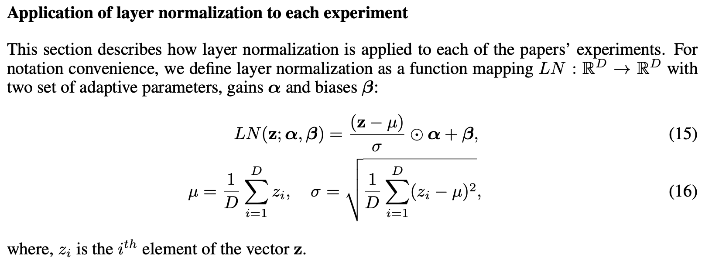
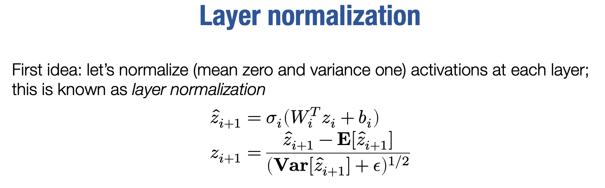
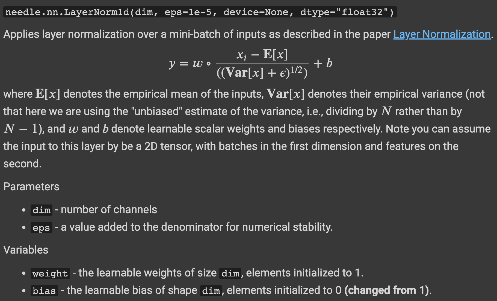
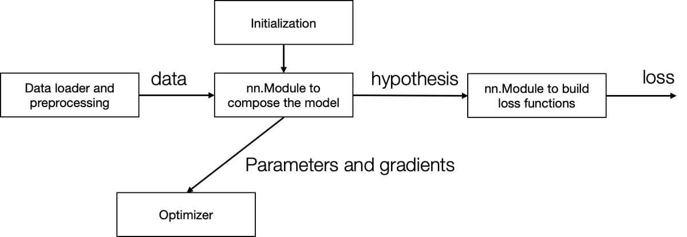

# Homework 2

Overview
https://github.com/dlsyscourse/lecture8/blob/main/8_nn_library_implementation.ipynb

Hướng dẫn làm bài tập
https://colab.research.google.com/github/dlsyscourse/hw2/blob/master/hw2.ipynb

### LayerNorm1d

*From https://arxiv.org/pdf/1607.06450.pdf*

## Q0

Copy các hàm `autograd.py` và `ops.py` từ `hw1` sang. Đừng ghi đè files vì trong đó đã có những đoạn code mới.

## Q1

Bạn cần thực thi một số cách khởi tạo tham số khác nhau trong file `python/needle/init.py`. Sử dụng những hướng dẫn ở những khởi tạo có sẵn (init.rand, init.randn, ..) để thực thi những khởi tạo thường được sử dụng. Hàm mới cần trả về `fan_in` và `fan_out` 2D tensors (mở rộng ra các shape khác có thể được thực hiện bởi thao tác rehape)

### Designing a Neural Network Library

