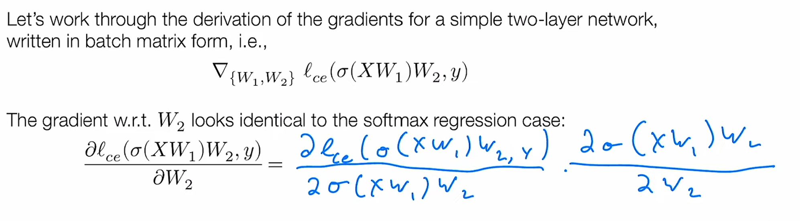

# Manual Neural Networks (doing gradient by hand)
https://www.youtube.com/watch?v=OyrqSYJs7NQ

- Học phần trước ta sử dụng hàm giả thiết tuyến tính, học phần này chúng ta sẽ sử dụng hàm giả thiết phi tuyến tính (nonlinear hypothesis classes)

- Mạng nơ-ron là một hàm giả thiết phi tuyến tính

- Thuật toán lan truyền ngược (backpropagation) - tính toán gradient cho mạng nơ-ron

Mọi thứ ở đây khá giống học phần trước, ta vẫn có tập dữ liệu (gồm vector đầu vào x và nhãn y), hàm giả thiết, hàm mất mát, và tối ưu hóa bằng gradient descent.
Khác biệt ở đây là cách tính gradient cho một lớp hàm giả thiết phức tạp hơn, đó là mạng nơ-ron.

Với hàm giả thiết tuyến tính, chúng ta cần một hàm ánh xạ từ tập đầu vào inputs thuộc R^n tới tập đầu ra outputs (class logits) thuộc R^k (ánh xạ vector n chiều vào vector k chiều). Bộ phân lớp này tạo ra k hàm tuyến tính cho 1 đầu vào và dự đoán lớp là lớp có giá trị đầu ra lớn nhất (xác xuất xảy ra cao nhất):
Điều này tương ứng với việc phân chia đầu vào vào k vùng tuyến tính khác nhau, mỗi vùng tương ứng với 1 lớp.

Ở hình trên, mỗi hàm giả thiết tuyến tính tương ứng với 1 mũi tên màu đỏ, mỗi mũi tên chỉ theo 1 hướng khác nhau.
Hướng nào đồng nhất nhiều nhất với mỗi điểm dữ liệu (x1, x2) thì điểm dữ liệu thuộc về hướng / lớp đó.

Với dữ liệu 2 lớp thì đường phân chia dữ liệu sẽ là 1 đường thẳng, nhiều lớp dữ liệu cần nhiều đường phân chia hơn.

Hạn chế của hàm giả thiết tuyến tính là không hoạt động được với dữ liệu không phân chia được bằng các vùng tuyến tính.
Ý tưởng đơn giản để giải quyết vđ trên là áp dụng phân lớp tuyến tính vào vài đặc trưng (features) của dữ liệu có (nhiều khả năng các features đó ở không gian cao hơn so với dữ liệu) `h_theta(x) = theta^T phi(x)` với theta thuộc R^{d x k} và phi là ánh xạ từ R^n tới R^d.

Đây là cách machine learning hoạt động trong một khoảng thời gian dài, nhất là trong thực hành, và hiện tại có nhiều machine learning đang hoạt động theo cách này. Cách chúng chạy các thuật toán học máy là tạo ra một hàm phi của tập dự liệu đầu vào, phi được hiểu là ánh xạ đặc trưng (feature mapping) đặc tả dữ liệu đầu vào theo cách mà chúng ta tin rằng chúng sẽ dễ dàng hơn cho việc phân loại tuyến tính. Đó là mấu chốt của vấn đề.

Chúng ta sẽ không đi sâu vào bản chất về sự chính xác của các đặc trưng này khi chúng ta thực hiện chúng thủ công. Nhưng khái niệm về lấy dữ liệu thô rồi triết xuất thủ công các đặc trưng từ nó, và sau đó cho vào bộ phân loại tuyến tính là một dạng thức / mẫu hình rất mạnh mẽ.

!!! Khi bạn biết cách trích xuất những tính năng có giá trị từ dữ liệu, đó vẫn là một cách rất hữu hiệu để thực hiện nhiều hoạt động học máy trong thực tế !!!

Với tập dữ liệu ở trên chúng ta có thể xác định thủ công `phi(x) = x_1^2 + x_2^2` là một feature tốt.

Liệu có cách nào để trích xuất đặc trưng có thể áp dụng cho bất kỳ vấn đề nào?

Tổng kết lại, có 2 cách để xây dựng hàm đặc trưng phi:
1. Xây dựng thủ công (cách cũ để làm học máy)
2. Theo cách nào đó để chúng tự học từ dữ liệu (cách mới để làm học máy)

Mạng nơ-ron là một cách, theo nghĩa nào đó, trích xuất những đặc trưng tốt nhất từ dữ liệu đầu vào và thực hiện nó theo cách hoàn toàn tự động không cần sự điều chỉnh của chúng ta. Khóa học này chúng ta sẽ tập trung vào việc suy nghĩ xem liệu chúng ta có thể làm cho máy học cách trích xuất dữ liệu tự động trực tiếp từ dữ liệu hay không?

Học phần trước cho thay dự đoán tuyến tính là một cách học mạnh mẽ, chúng ta thu được tỉ lệ lỗi chỉ ở 8% cho tập dữ liệu MNIST bằng cách chỉ sử dụng phân loại tuyến tính. Liệu chúng ta có thể sử dụng một hàm ánh xạ tuyến tính từ không gian n chiều (input vectors) sang không gian d chiều (feature vectors) hay không? Câu trả lời là không vì nếu làm như vậy hàm giả thiết cuối cùng của chúng ta cũng chỉ là phân loại tuyến tính. `h_theta(x) = theta_T phi(x) = theta_T W_T x` khi đó `theta_T W_T` chỉ là 1 ma trận (k, n). Cụ thể hơn với cách lựa chọn đặc trưng này, chúng ta chỉ mở rộng tập các giả thuyết đang được xem xét!

Rất may là có cách làm khác thực hiện được điều này.

## Nonlinear features https://youtu.be/OyrqSYJs7NQ?t=757

Chúng ta áp dụng một hàm phi tuyến tính vào sau ánh xạ tuyến tính `phi(x)=sigma(W_T x)` với W thuộc R^{n x d}, và sigma: R^d -> R^d, có thể là bất kỳ hàm phi tuyến tính nào.

Ví dụ: với W là một ma trận của các giá trị ngẫu nhiên trong phân bố Gaussian, và sigma là hàm cosine, ta thu được một loại "vector đặc trưng fourier ngẫu nhiên" hoạt động rất tốt với nhiều bài toán.

Chúng ta không muốn giới hạn trong việc chỉ lựa chọn một hai loại hàm đặc trưng. Thay vì sử dụng W như một ma trận có định, có lẽ chúng ta muốn huấn luyện W để tối thiểu hóa hàm mất mát? Hoặc có lẽ chúng ta muốn kết hợp nhiều (hàm) đặc trưng với nhau?

Và đó chính xác là những gì mạng nơ-ron làm. Mạng nơ-ron một cách hiệu quả theo cách giải thích này có thể được xem như một cách trích xuất các đặc trưng của dữ liệu theo cách mà chúng ta huấn luyện đồng thời cả bộ phân loại tuyến tính cuối cùng (theta) và các tham số của vector của hàm đặc trưng (ở đây W, về sau sẽ là các tập tham số phức tạp hơn rất nhiều).

## Neural network https://youtu.be/OyrqSYJs7NQ?t=1108

Mạng nơ-ron là một thuật ngữ tuyệt vời, phải không? Phải nói rằng ngành máy học làm rất tốt việc quảng bá và nghĩ ra những cái tên thông minh cho thuật toán của mình. Ngoài mạng nơ-ron còn có gradient boosting đến từ thống kê, rồi support vector machine, đó đều là nhưng cái tên rất tuyệt vời. Nó nghe thật "ngầu" và mạng nơ-ron cũng không phải là một ngoại lệ. Lần đầu tiên tôi được nghe về mạng nơ-ron tôi nghĩ rằng nó đến từ một thứ tương tự như "Star Trek" như là robot hoặc Android sử dụng mạng nơ-ron để lập trình. Đó là một cái tên tuyệt vời gợi nhớ về các nơ-ron thần kinh trong bộ não ...

Vậy thực sự mạng lưới thần kinh là gì? Nó không liên quan gì nhiều tới bộ não đâu :)

Mạng nơ-ron ám chỉ một lớp các hàm giả thiết bao gồm nhiều hàm tham số hóa có thể đạo hàm được (được gọi là layers) được kết hợp với nhau theo bất kỳ cách nào để tạo ra giá trị đầu ra.

Nó không phải được phân loại bằng cách học như bộ não học, cũng không phải mô phỏng bộ não, nó được phân loại bằng việc có nhiều hàm vi phân được tham số hóa được gọi là tầng (layer), được kết hợp với nhau để ánh xạ giá trị đầu vào (vector, tập vectors) thành giá trị đầu ra (vector, tập vectors). Và đó là định nghĩa xác thực về mạng nơ-ron.

Thuật ngữ mạng nơ-ron bắt nguồn / lấy cảm hứng từ sinh học, nhưng thực sự bất kỳ loại hàm nào thỏa mãn các điều kiện trên đều được gọi là mạng nơ-ron. Chúng ta không muốn loại trừ nguồn cảm hứng từ sinh học đó, bởi vì chắc chắn rằng rất nhiều sự phát triển của mạng lưới thần kinh đã đến từ việc tư duy về các quá trình dẫn truyền analog (tín hiệu tương tự) trong các quá trình sinh học. Và bộ não là một ví dụ sống về của một hệ thống thông minh.

Nhưng tôi cũng phải nhấn mạnh rằng, tại thời điểm này trong practical engineering, không có nhiều mối liên hệ giữa các loại mạng nơ-ron chúng ta đang thực sự phát triển và sử dụng trong thực tế với những gì chúng ta biết về bộ não. Mà tôi muốn nhấn mạnh về các hàm đặc trưng có thể đạo hàm được được kết hợp với nhau của mạng nơ-ron, bởi vì đó mới chính là mạng nơ-ron từ góc nhìn kỹ thuật.

Thuật ngữ deep network là một từ đồng nghĩa với neural network, và deep learning hay deep network đơn giản có nghĩa là máy học sử dụng một lớp các hàm giả thiết của mạng nơ-ron (đừng vờ như có những ràng buộc khác vượt trên "phi tuyến tính"). Nhưng cũng đúng là các mạng nơ-ron hiện đại kết hợp rất rất nhiều những hàm đặc trưng với nhau vì vậy từ "sâu" cũng mang ý nghĩa hợp lý.

Điểm khác biệt với phân loại tuyến tính là tập tham số theta ở đây bao gồm cả W1, và W2. Chúng đều là các tham số có thể điều chỉnh được mà chúng ta sẽ dùng để tối ưu hóa để giải bài toán học máy của chúng ta. Hiểu theo nghĩa rộng theta là tập hợp tất cả các tham số chúng ta có trong mô hình. sigma ở đây đơn giản chỉ là một ánh xạ phi tuyến tính các giá trị vô hướng của một vector (giá trị phần tử của vector). sigma có thể là sigmoid, relu, sin, cosin, tanh ... có thể là bất cứ hàm phi tuyến tính (có thể đạo hàm được) nào.

## Universal function approximation https://youtu.be/OyrqSYJs7NQ?t=1674

Chúng ta đang nói về một thuộc tính chung của mạng nơ-ron, và sẽ chứng minh với trường hợp 1D (đầu vào, đầu ra là vô hướng), nhưng định lý tổng quát cũng không phức tạp hơn thế. Tuyên bố ở đây là một mạng nơ-ron 2 lớp là một hàm xấp xỉ vạn năng và điều này có nghĩa là một mạng thần kinh hai lớp có khả năng biểu diễn bất kỳ hàm nào trên một vùng đóng. Điều quan trọng ở đây là một vùng đóng, tức là một tập hữu hạn của không gian vector đầu vào. Trên loại tập hợp con hữu hạn của không gian đầu vào này, chúng ta có thể xây dựng một mạng nơ-ron hai lớp, hay còn gọi là mạng nơ-ron một lớp ẩn, có thể xấp xỉ bất kỳ hàm trơn nào.

__Định lý (1D case)__: cho bất kỳ hàm trơn f: R -> R nào một vùng đóng D thuộc R và với bất kỳ epsilon > 0, chúng ta có thể xây dựng một mạng nơ-ron một lớp ẩn f_hat sao cho `max{x in D}(abs(f(x) - f_hat(x))) <= epsilon`.

__Chứng minh__: Chọn một tập các điểm lấy mẫu đậm đặc (x^(i), f(x^(i))) thuộc D. Tạo một hàm nơ-ron truyền qua các điểm đó. Bởi vì hàm mạng nơ-ron là tuyến tính theo từng đoạn (tưởng tượng các đoạn thẳng cực ngắn nối với nhau để xấp xỉ bất kỳ đường cong nào), và hàm f là trơn, bằng cách lựa chọn x^(i) đủ gần nhau, chúng ta có thể xấp xỉ hàm bất kỳ hàm cho trước nào.

Tôi nghĩ mọi người thường hiểu sai về phát biểu xấp xỉ hàm phổ quát này, coi rằng đó là một thuộc tính kỳ diệu của các hàm này. Thực tế không phải như thế. Ta sẽ làm rõ việc cho thêm một lớp ánh xạ phi tuyến tính lại có thể tăng sức mạnh biểu diễn của chúng lên rất rất nhiều. Và cũng để kéo bức màn bí mật về bí ẩn của tính chất xấp xỉ phổ quát bởi vì nó thực sự là một tính chất bình thường. Theo một cách nói khác, có rất nhiều hàm hoặc nhiều lớp hàm số có tính chất này, bằng hạn như nearest neighbors, hoặc đa thức (polynomial) và những thứ tương tự như thế. Có rất nhiều (lớp) hàm có cùng tính chất và chúng ta cũng không để tâm nhiều về điều đó. Người ta cũng không dùng nhiều các hàm có tính chất xấp phỉ phổ quát khác như là nơ-ron network. Và vì thế, xấp xỉ tổng quát không phải lý do làm nên điều tuyệt vời của mạng nơ-ron mà là ở một số thứ khác.
Đa thức thực sự rất khó, chúng chỉ là các xấp xỉ phổ quát ở một số lượng (some quantity) nhưng things like nearest neighbors hay thậm bí xấp xỉ spline trên thực tế là các xấp xỉ phổ quát.

Ý tưởng cơ bản ở đây là, với một hàm f cho trước (không gian 2 chiều x, f(x)), việc đầu tiên chúng ta làm là lấy mẫu hàm số này ở một số điểm khác nhau. Và bởi vì tập D chúng ta đang cố gắng ước tính là hữu hạn. Chúng ta sẽ tạo ra một mạng nơ-ron của một hàm trên không gian này, 1D là tập hợp các điểm, 2D là tập hợp các lưới, ... nD là lưới n chiều.

Tiếp theo chúng ta tạo ra một tập hợp các hàm tuyến tính "nối" các điểm gần nhau lại với nhau, và đây thực sự là xấp xỉ của chúng ta với hàm này, chúng ta sẽ xây dựng một loại phép nội suy tuyến tính này. Và bởi vì hàm là liên tục nên chúng ta thực sự có thể xấp xỉ gần như tùy ý cho hàm cho trước f, với loại xấp xỉ tuyến tính theo từng đoạn như thế này.

Để làm được điều này bạn cần một số lượng rất lớn số chiều của đơn vị ẩn, hay vector đặc trưng, lớn bằng số lượng điểm mẫu chúng ta có. Điều này khiến cho kích cỡ của mạng nơ-ron có thể tăng lớn tùy ý, và vì vậy nó không tốt trong ứng dụng thực tế.

- - -

Vậy làm thế nào chúng ta có thể tạo ra một mạng nơ-ron thực sự xấp xỉ được hàm f ở trên (hình vẽ)? Chúng ta sẽ sử dụng mạng ReLU một lớp ẩn, và chúng ta sẽ sử dụng một sai lệch (bias) ở đây, một điều tôi đã không đề cập trước đó là các hàm mà chúng ta đã sử dụng trước đây, thực sự không bao gồm bias term, chúng ta sẽ quay lại vấn đề đó về các mạng nơ-ron tổng quát hơn. Thực sự ở đây, trong phần lớn bài giảng này, chúng ta sẽ không sử dụng thuật ngữ sai lệch. Vì vậy, chúng ta sẽ chỉ sử dụng các hàm của mình, là hàm tuyến tính nào đó của đầu vào mà sẽ không cho thêm sai lệch vào đây.

Nhưng với việc xấp xỉ này chúng ta phải sử dụng sai lệch (bias). Hình trên thể hiện hàm ReLU, +/- thể hiện là hướng của hàm có thể đi lên hoặc đi xuống như hình vẽ. Và như vậy tùy thuộc vào việc kiểm soát sai lệch và độ dốc (theo hướng đi lên +, hoặc đi xuống -) mà chúng ta có thể kiểm soát vị trí trên trục x, đổi từ 0 sang dương hoặc âm. Nhưng về cơ bản, các hàm trong đó chúng trông giống như một trong 2 trường hợp (đường màu đỏ ở hình vẽ trên) mà thôi. 

Làm thế nào để chúng ta xấp sỉ hàm trơn bất kỳ f(x) (màu xanh)? Điều đầu tiên chúng ta có thể làm là lấy hàm của mình, và giả sử chúng muốn lấy xấp xỉ ở điểm đầu tiên chẳng hạn, chúng ta có thể bắt đầu với một hàm là hằng số (đường chạy ngang). Và hàm đó đơn giản là chúng ta gán w_i = 0 và b_i > 0 

Việc tiếp theo chúng ta làm là tìm một hàm ReLu nữa là 0 với x < 0 và có độ dốc tương ứng với đường xanh đứt đoạn ở hình vẽ trên. Tiếp tục lặp lại bước trên ... cho tới khi đi qua các điểm được chọn.

Đó là một ý tưởng đơn giản để xây dựng một tập hợp các hàm (ReLU) đi qua các điểm lấy mẫu, tuần tự từng mẫu một theo chiều tăng của x.

Như các bạn thấy, định lý này là bình thường (không có gì cao siêu ở đây cả), nhưng nó cũng thực sự có ý nghĩa khi nhận ra những điều được ngụ ý ở đây: các hàm tuyến tính trong 1D, chúng trông giống như các đường thẳng, đó là tất cả những gì hàm tuyến tính có thể làm, nhưng khi có tính chất phi tuyến tính mà ta có thể áp dụng (ReLU) trong các trường hợp trung gian, điều này cho phép ta có thể xấp xỉ bất kỳ hàm 1D trơn nào tốt một cách tùy ý (với bất kỳ epsilon > 0 nào). Không có phép màu nào ở đây cả, để có thể xấp xỉ tốt hơn, chúng ta cần tăng số lượng / độ phức tạp của hàm lên cấp số nhân, và nó không phải là một cách hiệu quả để xấp xỉ hàm trong thực tế. Nhưng nó thực sự nhấn mạnh về sức mạnh của của ngay cả chỉ một tính chất phi tuyến tính chúng ta có trong các hàm (trích chọn) đặc trưng.

## Fully-connected deep networks https://youtu.be/OyrqSYJs7NQ?t=2547

Mặc dù chúng ta nói deep network cũng chỉ là nơ-ron network, nhưng trong thực tế, hầu hết các deep networks có nhiều hơn 1 lớp ẩn (hoặc nhiều hơn rất nhiều). Một mạng kết nối đầy đủ (fully connected) thường được gọi là mạng perceptron nhiều lớp (MLP), feed-forward network, hoặc mạng kết nối đầy đủ (dưới dạng batch).

Chúng ta định nghĩa đầu vào của mạng là X sẽ được gọi là Z_1, và những Z_i (Z_1 và Z_i tiếp theo) được gọi là layers, đôi khi còn được gọi là activations, đôi khi (nên tránh) gọi là neurons, đó là những đặc trưng trung gian được hình thành ở các giai đoạn khác nhau của mạng nơ-ron. Bây giờ layers có lẽ là một thuật ngữ sai, nhưng ta vẫn sử dụng nó, đôi khi nó cũng được gọi là hidden layers. Có lẽ ta không nên sử dụng từ layer by itself, bởi vì layer đôi khi cũng được dùng để chỉ trọng số (weight) để biến đổi Z_i thành Z_i+1, ta sẽ sử dụng thuật ngữ hidden layer hoặc activation nhiều nhất có thể để mô tả Z_i.

Vậy định nghĩa thế nào là một mạng nơ-ron L lớp? Mạng L lớp bao gồm L bước biến đổi Z_i thành Z_i+1 
theo công thức `Z_i+1 = sigmoid_i(Zi Wi)`. Mạng L lớp cho phép không bị một ánh xạ đặc trưng mà là nhiều ánh xạ đặc trưng được áp dụng tuần tự. Và hàm giả thiết của cả mạng nơ-ron chính là lớp cuối cùng Z_L+1 sau khi áp dụng L phép biến đổi nói trên.

## Why deep network? https://youtu.be/OyrqSYJs7NQ?t=2948

Ở phần trước chúng ta đã chứng minh rằng mạng nơ-ron 1 lớp ẩn đã là một xấp xỉ tổng quát, vậy tại sao phải dùng nhiều hơn 1 hidden layer?

Một số người nói rằng deep network hoạt động giống não bộ, sự thực không phải như vậy. Đây là một lập luận thực sự truyền cảm hứng nhưng nó không thực sự nắm bắt được cách các mạng nơ-ron thực sự hoạt động trong thực tế. Vì thế tôi nghĩ rằng nó sẽ là một lập luận tồi nếu chỉ nói rằng, ồ, bộ não có các lớp khác nhau, và do đó, chúng ta cũng cần nhiều lớp cho mạng nơ-ron.

Một lập luận khác bạn thường thấy xuất phát từ lý thuyết mạch (deep circuits provably more efficient). Hóa ra là có một lớp các hàm có thể biểu diễn hiệu quả hơn nhiều bằng cách sử dụng kiến trúc nhiều tầng, về cơ bản là mạch nhiều lớp hơn là mạch một lớp. Một ví dụ cổ điển mặc dù tôi không muốn đi sâu vào, là hàm chẵn lẻ (parity function). Hàm này hoạt động như sau: cho trước một chuỗi bits, hàm này xác định xem có số lượng bit 1 là chẵn hay lẻ trong chuỗi bits cho trước đó. Và hàm này hóa ra, vì nhiều lý do, có thể được biểu diễn bằng mạch 2 lớp, về cơ bản giống như mạng nơ-ron 2 lớp. Và hóa ra nếu có một mạng thần kinh nhiều lớp, bạn có thể làm điều đó hiệu quả hơn. Hóa ra là nếu bạn có chuỗi bit độ dài N, bạn cần có 2^N chiều cho không gian vector đặc trưng, nếu bạn làm điều này với mạng nơ-ron 2 lớp, hoặc bạn có thể làm điều này với mạng N lớp với N là kích thước của chuỗi, nếu làm với N lớp thì bạn sẽ tiết kiệm được tham số theo cấp số nhân để biểu diễn hàm. Điều này là đúng nhưng nó là một ví dụ tồi, vì tính chẵn lẻ nổi tiếng là một hàm mà mạng nơ-ron thực sự học rất kém. Về cơ bản, theo một nghĩa nào đó, thực sự kinh khủng khi học các hàm như hàm chẵn lẻ.

Và vì vậy thật tuyệt khi bạn có loại lập luận kể trên, nhưng điều này là không cần thiết để chỉ ra cách thức của một loại mạng nơ-ron thực sự học trong thực tế. Lập luận mà tôi thực sự nghĩ là tốt nhất, một cách trung thực là dựa vào kinh nghiệm, nếu chúng ta xem xét các mạng nơ-ron với số lượng tham số là cố định, chúng ta có một số lượng nhất định các tham số có thể lưu trữ, và có vẻ tốt hơn là nên có một số chiều sâu đủ lớn cho cấu trúc mạng nơ-ron của chúng ta như mạng tích chận (CNN) hoặc mạng hồi quy (RNN) hoặc transformers (chúng ta sẽ nói tới ở các học phần sau), điều này có vẻ tốt hơn nhiều so với việc bạn chỉ có một lớp ẩn duy nhất!

Về cơ bản, lập luận kể trên ít thỏa mãn nhất, nhưng có lẽ là lập luận thực tế nhất, về lý do tại sao chúng ta lại sử dụng mạng nơ-ron nhiều lớp trong thực tế.

## Backpropagation
https://www.youtube.com/watch?v=JLg1HkzDsKI
Huấn luyện mạng nơ-ron bằng cách tính gradient và lan truyền ngược.

Ôn bài: nhớ rằng NN chỉ là một trong 3 thành phần của một thuật toán học máy, ngoài NN (hàm giả thiết) chúng ta còn cần:
- Hàm mất mát: cross entropy loss hay còn gọi là softmax loss
- Phương thức tối ưu hóa: SGD (stochatic gradient descent)

Sự khác biệt duy nhất trong việc triển khai NN so với hồi quy softmax (bài trước), là chúng ta chỉ cần một cách tính gradient cho với bộ tham số theta (ở đây là W_1 và W_2 ...)

Và để thực sự tìm ra những gradient này là gì? Và khi làm như vậy, chúng ta sẽ rút ra quy tắc lan truyền ngược thực sự!

## Gradient(s) of 2-layer network

Ta cần tính gradient của hàm mất mát với từng bộ tham số W_1 và W_2 `gradient_{W_1,W_2} l_ce(sigma(X W_1)W_2,y)`

Gradient w.r.t W_2 (w.r.t = with respect to), đạo hàm riêng của W_2 giống như softmax regsression:
`delta{l_ce(sigma(X W_1)W_2,y)} / delta{W_2} = 
 delta{l_ce(sigma(X W_1)W_2,y)} / delta{sigma(X W_1)W_2,y)} delta{sigma(X W_1)W_2} / delta{W_2}` (chain-rule)

Ở đây, `delta{sigma(X W_1)W_2} / delta{W_2} = sigma(X W_1)` và
`delta{l_ce(sigma(X W_1)W_2,y)} / delta{sigma(X W_1)W_2,y)}` giống trường hợp hồi quy softmax với sigma(X W_1) là vector đầu vào (cố định / hằng số vì nó không bị biến đổi khi W_2 thay đổi).

Vì thế `gradient_{W_2} l_ce(sigma(X W_1)W_2,y) = sigma(X W_1)^T (Z - e_y)`
Với Z = normalize(exp(sigma(X W_1)W_2)), e_y = vector{1[y=i] else 0} (kind of one-hot encoding across labels)

- - -

`delta{l_ce(sigma(X W1)W2, y)} / delta{W_1} = 
 delta{l_ce(sigma(X W1)W2, y)} / delta{sigma(X W1) W2} * 
 delta{sigma(X W1) W2} / delta{sigma(X W1)} * 
 delta{sigma(X W1)} / delta{X W1} *
 delta{X W1} / delta{W1}`

`delta{X W1} / delta{W1} = X`
`delta{sigma(X W1)} / delta{X W1} = sigma'(X W_1)`
`delta{sigma(X W1) W2} / delta{sigma(X W1)} = W2`
`delta{l_ce(sigma(X W1)W2, y)} / delta{sigma(X W1) W2}` giống như trên.

Vì thế `= (Z - e_y) W_2 sigma'(X W_1) X`

- Kết quả cuối cùng (n, d) và chỉ có X có n nên X^T (n, m) đứng đầu tiên
- Phần còn phải phải là (m, d) ta có sẵn sigma'(X W1) là (m, d)
- (Z - e_y) W_2^T cũng là (m, d)

Vậy cách kết hợp cuối cùng là  `gradient{W_1} l_ce(X W1)W2,y) = X^T @ (sigma'(X W_1) dot (Z - e_y)@W_2T^)` với dot là elementwise multiple.

## Backpropagation in general https://youtu.be/JLg1HkzDsKI?t=1187

Quay trở lại mạng nơ-ron nhiều lớp, Z_i ở đây đại diện cho layer i của mạng.
`Z_i+1 = sigma_i(Z_i W_i)`, i = 1 .. L

`delta{l(Z_L+1,y)} / delta{W_i} = 
 delta{l} / delta{Z_L+1} *
 delta{Z_L+1} / delta{Z_L} *
 delta{Z_L} / delta{Z_L-1} *
 ....
 delta{Z_i+2} / delta{Z_i+1} *
 delta{Z_i+1} / delta{W_i}`

Ta đặt `G_i+1 = delta{ l(Z_L+1, y) } / delta{Z_i+1}`
Ta có `G_i = G_i+1 . delta{Z_i+1} / delta{Z_i}`
=> Có thể sử dụng lại gradient của lớp trước để tính gradient của lớp sau!

Với `delta{Z_i+1} / delta{Z_i} = delta{ sigmoid_i(Z_i W_i) } / delta{ Z_i W_i } * delta{ Z_i W_i } / delta{ Z_i }` 

=> `G_i = G_i+1 . sigmoid_i'(Z_i W_i) . W_i`

Cách tính trên vẫn được coi là cheating vì chúng ta đang coi matrix / vector như là scalar (coi có hướng như là vô hướng). 

> This is last time we do it, at least last time you do it for a whole derivative, not just for sort of individual operations in automatic differentiation.

Ý muốn nói là đây là lần cuối cùng chúng ta tính đạo hàm bằng tay cho cả biểu thức lớn, vì sau này khi áp dụng autodiff ta chỉ phải tính gradient cho từng op một. Và với gradient của từng op ta vẫn có thể áp dụng mẹo coi có hướng là vô hướng để áp dụng chain-rule.

## Computing the real gradients https://youtu.be/JLg1HkzDsKI?t=1688

Bước trên được coi là cheating vì ta coi biến có hướng như biến vô hướng để áp dụng chain-rule vào biểu thức, làm cho việc tính gradient của layer trước sử dụng lại gradient của layer sau ... Ở bước này ta làm mịn công thức ở bước trên để tính được gradient thực sự phù hợp với kích thước của ma trận. Lưu ý: mẹo tính gradient này luôn cần phải được check lại với numerical diff.

Z_i: (m, n_i) với m là batch size, và n_i là chiều của feature vector của tầng thứ i.

Vì G_i = delta{ l(Z_L+1, y)} / delta{ Z_i } nên G_i: (m, n_i) => G_i+1: (m, n_i+1)

Quay trở lại công thức `G_i = G_i+1 . sigmoid_i'(Z_i W_i) . W_i`
- G_i: (m, n_i)
- W_i: (n_i, n_i+1)
- G_i+1: (m, n_i+1)
- sigmoid_i'(Z_i W_i): (m, n_i+1)

=> W_i^T: (n_i+1, n_i) đứng ở cuối `( .... ) W_i^T` và ( .... ) có hình dạng (m, n_i+1)
- G_i+1: (m, n_i+1) đã có sẵn hình dạng đó
- sigmoid_i'(Z_i W_i) đã có sẵn hình dạng đó

=> `G_i = (G_i+1 dot sigmoid_i'(Z_i W_i)) @ W_i^T`

Hiện giờ đã có công thức cụ thể để tính G_i, ta sẽ tính gradient cho từng tham số W_i như sau:

Trước hết xem lại công thức ở bước trên:

=> `delta{ l(Z_L+1, y) } / delta{ W_i } = G_i+1 . delta{ Z_i+1 } / delta{ W_i } =
    G_i+1 . delta{ sigmoid_i(Z_i W_i) } / delta{ Z_i W_i } / delta{ W_i } =
    G_i+1 . sigmoid_i'(Z_i W_i) . Z_i`

- W_i: (n_i, n_i+1) => delta{ l(Z_L+1, y) } / delta{ W_i }: (n_i, n_i+1)
- G_i+1: (m, n_i+1)
- sigmoid_i'(Z_i W_i): (m, n_i+1)
- Z_i: (m, n_i)

=> Z_i^T . ( ... ), với ( ... ): (m, n_i+1) =>
=> `delta{ l(Z_L+1, y) } / delta{ W_i } = Z_i^T @ (G_i+1 dot sigmoid_i'(Z_i W_i))`

Điều này có thể phức tạp hơn một chút, so với những biểu thức đạo hàm trước đó, vậy nên tôi muốn dừng ở đây một chút và tranh luận tại sao tôi lại làm theo cách này? Rất nhiều lần bạn sẽ thấy gradient cho NN sẽ được viết ra dưới dạng từng phần tử (element by element).

Chỉ vì vô hướng dễ làm việc với, bạn sẽ có đạo hàm của các số hạng khác nhau, các số hạng riêng lẻ của W_i, sẽ liên quan tới rất nhiều tổng và những thứ như thế. Thực tế là không ai muốn thực hiện nó theo cách đó. Ý tôi là không ai sẽ thực hiện nó cả bởi vì mọi người đã sử dụng autodiff. Nhưng ngay cả khi bạn đang thực sự triển khai loại lan truyền ngược như thế này ngay từ đầu, bạn sẽ luôn triển khai nó bằng cách sử dụng các phép toán ma trận. Và vì vậy, điều tôi thực sự muốn làm ngay từ đầu là chỉ cho bạn cách rút ra các biểu thức ma trận trên thực tế thực sự trông như thế nào, bởi vì bạn sẽ thực hiện phần nhỏ của điều đó khi bạn thực hiện các phép toán ma trận tương đương trong vi phân tự động (autodiff).

Vì vậy mặc dù theo một nghĩa nào đó, điều này có vẻ khó hiểu, chúng ta đang sử dụng các kích thước kì lạ và làm cho chúng vừa vặn theo cách thực sự khó hiểu này (ý là mẹo coi biến có hướng như biến vô hướng để áp dụng chain-rule rồi, tìm các phép toán ma trận phù hợp để kết hợp chúng lại với nhau để tạo ra kích thước ma trận cuối cùng là phù hợp). Tôi thừa nhận điều đó hơi khó hiểu, nhưng thực sự có lý do tại sao chúng ta làm theo cách này. Sẽ tốt hơn nhiều nếu tìm hiểu cách những thứ này thực sự hoạt động, và __hoạt động theo cách chúng ta sẽ thực sự triển khai chúng__, hơn là suy diễn từng biểu thức riêng lẻ, theo cách mà không ai thực sự triển khai nó.

Vì vậy, với tất cả những điều này, hình thức cuối cùng cho thuật toán của chúng ta là gì?

## Lan truyền ngược: forward and backward passes
https://youtu.be/JLg1HkzDsKI?t=2285

Thuật toán lan truyền ngược, có 2 lần lan truyền khác nhau qua các lớp của NN. Một lần lan truyền thuận và 1 lần lan truyền n gược. Về cơ bản ta tính toán các số hạng Z_i ở lần lan truyền thuận và các số hạng G_i ở lần lan truyền ngược. Để làm cho điều này rõ ràng hơn, cách chúng ta tính toán lan truyền thuận và lan truyền ngược là một cách tính toán tất cả các gradients cần thiết.  

Ta có thể tính mọi gradients ta cần cho một NN bằng các biểu thức sau:
1. Khởi tạo Z_1 = X
   Lặp lại Z_i+1 = sigmoid_i(Z_i W_i), i=1..L (forward pass)

Với forward, ta khởi tạo Z_1 = X và nó chỉ là quy ước để lặp lại cách tính Z_i+1 ở các bước tiếp theo với i=1..L

2. Khởi tạo G_L+1 = gradient_{Z_L+1} l(Z_L+1,y) = S - I_y 
   (với S = normalize(...), I_y one-hot encoding với I_y[i] = 2 nếu i==y otherwise 0)
   Lặp lại G_i = (G_i+1 dot sigma_i'(Z_i W_i)) Wi_T, i = L..1 (backward pass)

Với backward, ta khởi tạo G_L+1 là gradient của cross entropy loss.

Và ta có thể tính toán mọi gradient cần thiết bởi biểu thức:
`gradient{W_i} l(Z_L+1,y)`

Điều quan trọng cần ghi nhớ ở đây là, kiểu tính toán này đồng thời tất cả các tham số trong một lần truyền tiến, và một lần truyền ngược. Bởi vì ta có thể sử dụng các thuật ngữ G_i và Z_i để tính toán tất cả các thành phần cần thiết. Nhưng để làm được điều đó, chúng ta cần lưu trữ mọi thứ vào bộ nhớ (cache) để tái sử dụng chúng, vì chúng ta sẽ không tính toán lại từ đầu. Và theo nghĩa rộng hơn, tất cả thuật toán lan truyền ngược, chỉ là áp dụng chain-rule và ghi nhớ để sử dụng lại kết quả tính toán một cách thông minh !!!

Một điểm quan trọng tôi muốn nhấn mạnh đó là: hãy xem biểu thức được yêu cầu để tính toán gradient của hàm mất mát với từng biến có hướng W_i và nó chứa cả Z_i và G_i. Điều đó có nghĩa là để tính toán các gradient này, chúng ta phải lưu lại Z_i của tiến trình forward, chúng ta không thể loại bỏ bất kỳ số hạng trung gian nào trong lần truyền dẫn tiến, và phải giữ chúng lại để tái sử dụng trong tiến trình backward. Và vì vậy điều này có phần hiệu quả, vì chúng ta chỉ cần thực hiện 1 lần truyền dẫn tiến và một lần truyền dẫn ngược, nhưng cuối cùng nó thực sự chỉ phức tạp gấp đôi so với 1 lần truyền dẫn đơn lẻ. Thì theo một nghĩa nào đó, nó kém hiệu quả hơn về bộ nhớ, vì chúng ta phải lưu trữ tất cả các mục thông tin trên đường đi của mình, chúng ta không thể nếu tôi chỉ cố tính toán đầu ra Z_i+1 và có thể bỏ đi Z_i. Và khái niệm về việc duy trì các phần tử trung gian này trong tiến trình truyền dẫn tiến và truyền dẫn ngược thực sự quan trọng với thuật toán lan truyền ngược và trở thành một trong những loại đánh đổi của thuật toán lan truyền ngược. Nó cho phép tính toán gradient hiệu quả hơn, với chi phi là dùng nhiều bộ nhớ hơn. Hãy nhớ điều đó khi chúng ta nói về độ hiệu quả của thuật toán lan truyền ngược! Tức là không thể nói về độ hiệu quả trong tính toán của backpropagation mà quên đi chi phí phát sinh về bộ nhớ !!!

## A closer look at these operations
https://youtu.be/JLg1HkzDsKI?t=2617

Công thức trên là nền tảng chung của NN nhiều lớp ở dạng ma trận thực sự. Và tôi nghĩ thật công bằng khi nói rằng hầu hết các khóa học về học máy (ML courses) khi thảo luận về backprop, chúng thường kết thúc ở đó. Đại loại "đây là cách bạn thực hiện backprop", có thể họ sẽ nói về tích chập (convolution), nhưng họ thậm chí không nói về cách bạn lấy được, backprob cho một tích chập. Bạn biết đấy, họ chỉ nói về cách tính forward của một tích chập và cho rằng mọi thứ đều ổn. Khi bạn nói về backprob, hầu hết các khóa học đều dừng lại ở đó. Có thể thậm chí họ còn chưa đạt tới điều đó tức là chưa đạt được dạng ma trận thực sự.

Điều cuối cùng tôi muốn để lại cho các bạn, trước khi chúng ta không bao giờ đề cập lại những thứ này nữa, là suy nghĩ thêm một chút điều gì đã thực sự xảy ra trong quá trình lan truyền ngược?

Để tính toán gradient của, bạn cần G_i+1, và sau đó nhân nó với đạo hàm riêng chỉ ở lớp thứ i (delta Z_i+1 / delta W_i). Và một cách để thực hiện điều này là theo một nghĩa nào đó công việc của layer thứ i là gì? Layer thứ i trước hết là nó phải tự tính toán như là trách nhiệm của layer này, và đó là một cách diễn đạt kỳ lạ, nhưng trách nhiệm trước tiên là có thể tính toán phần việc của nó trong forward, tính toán lớp của nó, tính toán chính nó, nó cũng phải sử dụng G_i+1 (incomming backward gradient) và nhân với đạo hàm riêng của nó (đạo hàm của Z_i+1 từng phần W_i), đây thực sự là một thứ kiểu Jacobian, nhưng hãy bỏ qua điều này một chút, nó thực sự phải tìm ra cách nhân G_i+1 với đạo hàm riêng của nó (delta Z_i+1 / delta W_i) để kết quả đầu ra có kích cỡ thực sự có ý nghĩa. Và đây thực sự là một cái nhìn sâu sắc và quan trọng, trong việc làm cho toàn bộ quá trình trở nên mô-đun hóa hơn. Bởi vì đây là một tuyên bố rất chung chung.

Nói chung tất cả những gì mà bất kỳ layer nào phải có khả năng thực hiện để phù hợp với việc lan truyền ngược, là có thể nhân gradient ngược (incomming backward gradient) G_i+1 với đạo hàm riêng của nó. Trên thực tế, đây là một thứ phổ biến có tên riêng của nó là "tích Jacobian của vector". Thuật ngữ đó khá là sai lệch, bởi vì trong thực tế G_i+1 không phải là một vector (mà là ma trận) vì đầu vào là theo batch, nhưng nếu xét đầu vào chỉ là một input vector x, thì G_i+1 cũng sẽ chỉ là 1 vector. Điều cần xem xét ở đây là nếu bạn coi toàn bộ G_i+1 là một vector, và bạn coi đạo hàm riêng thực sự là một phép tính đa biến, như cái được gọi là Jacobian, phép toán nhân G_i+1 với đạo hàm riêng của layer i, đó được gọi là vector Jacobian product. 

Và điều rất thú vị ở đây là quá trình này có thể được thực hiện theo mô-đun hơn và tổng quá hơn nhiều ... Và đây chính xác là quá trình mà chúng ta sẽ học ở bài tiếp theo, có thể là vài bài tiếp theo và cả bài tập về nhà nữa. Đây chính xác là quá trình mà bạn sẽ thực hiện khi nói đến autodiff, mà sau đó một cách tuyệt vời, sẽ tránh được sự cần thiết của bất kỳ phép toán hóc búa nào và loại bỏ việc ứng dụng thủ công của chain-rule. Vì vậy, bạn phải làm điều đó một lần thật tốt, và là cần thiết khi tính gradient bằng tay cho mạng nơ-ron nhiều lớp một lần. Bây giờ, hãy treo nó lên, kệ nó đi, và lần tới hãy nói về autodiff :D hoặc cách chúng ta thực sự làm điều đó trong thực tế.

Xem thêm https://phamdinhkhanh.github.io/deepai-book/ch_calculus/nb_appendix_calculus.html