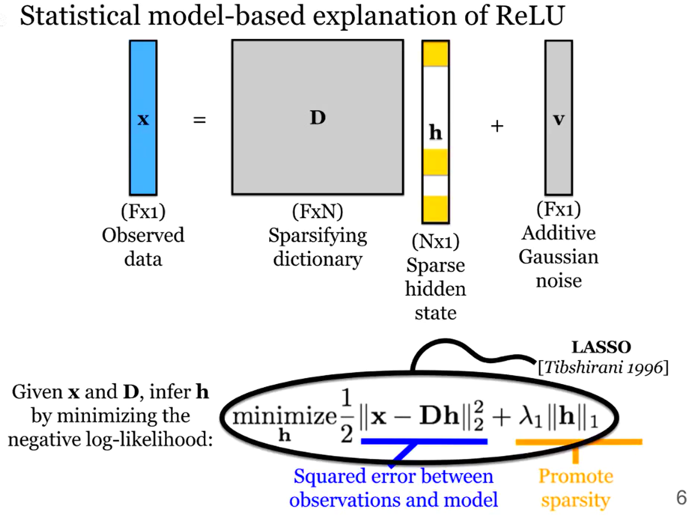
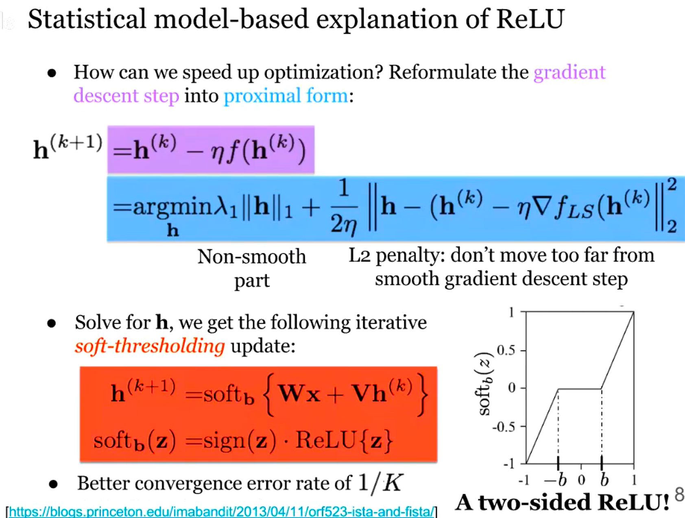
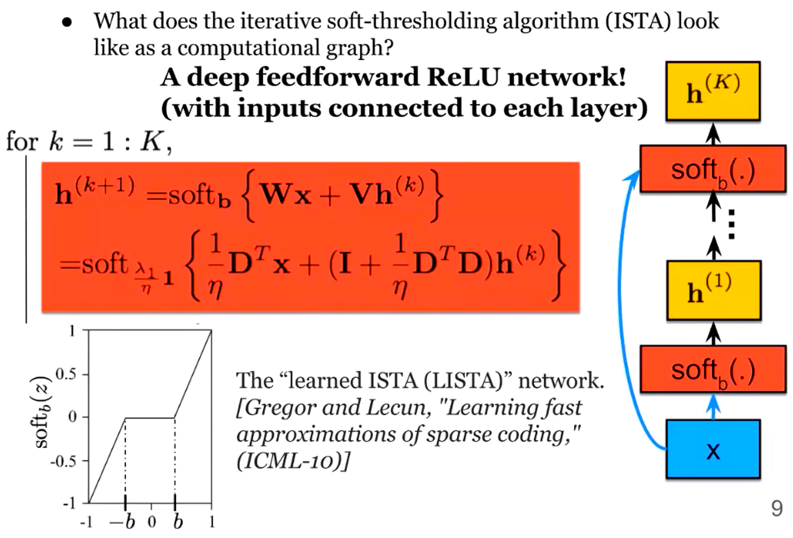
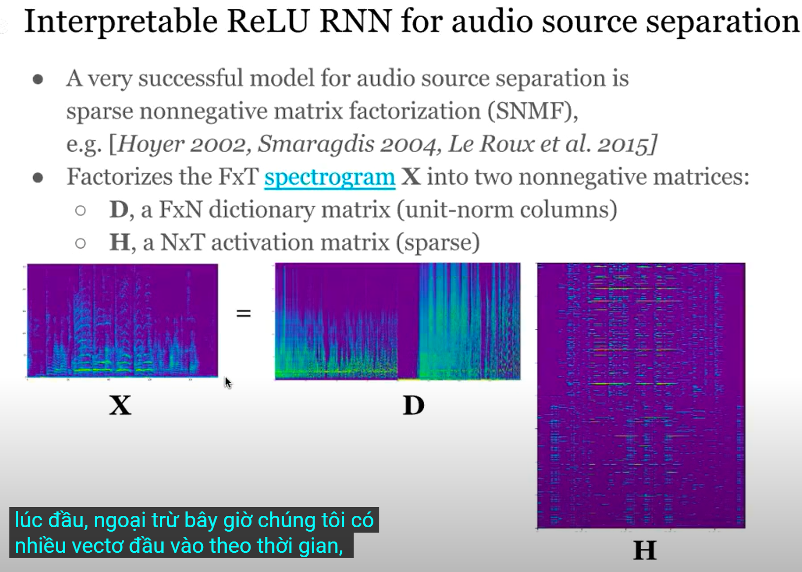

# Statistical model-based explaination of ReLU

## ReLU activations corespond to iterative LASSO optimiaztion https://youtu.be/3UuEmoLWFNg?t=316

### A Sparse Coding Model

Mô hình này thực sự đơn giản. Dữ liệu quan sát được ở dạng vector X, chúng ta sẽ giả sử một mô hình cho X rằng đó là một hệ số thưa (sparse cofficient) H, chạy qua một từ điển D, và sẽ có một số nhiễu Gaussian phụ gia trong các quan sát của chúng ta, 

https://youtu.be/3UuEmoLWFNg?t=929

