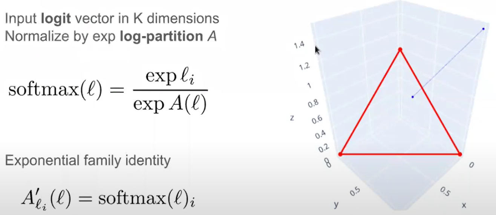
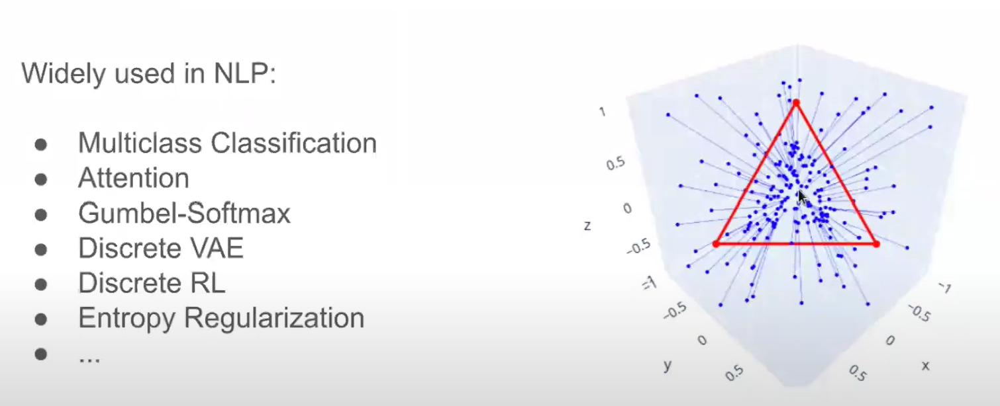
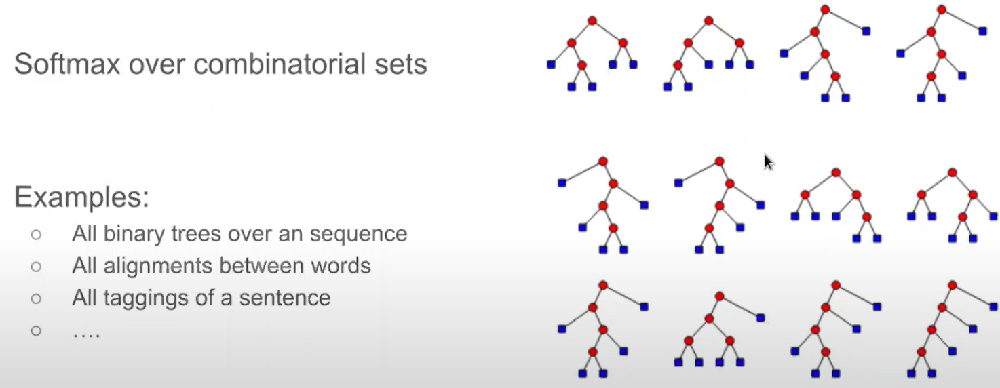
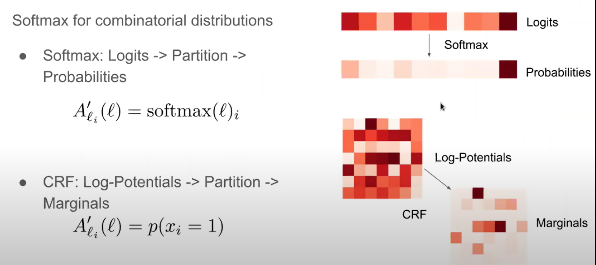
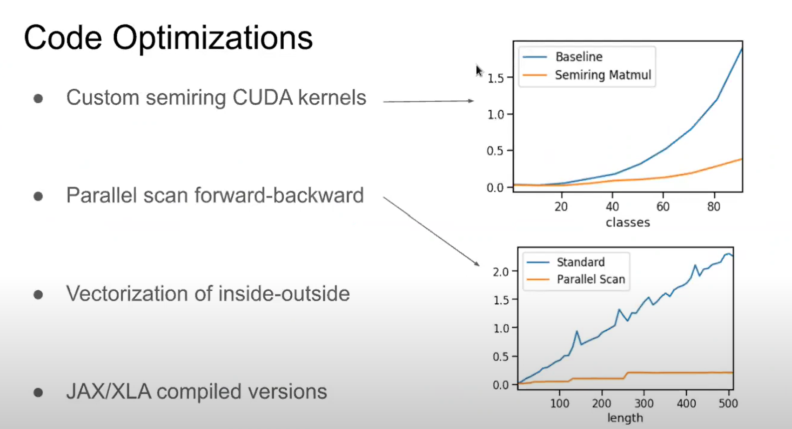
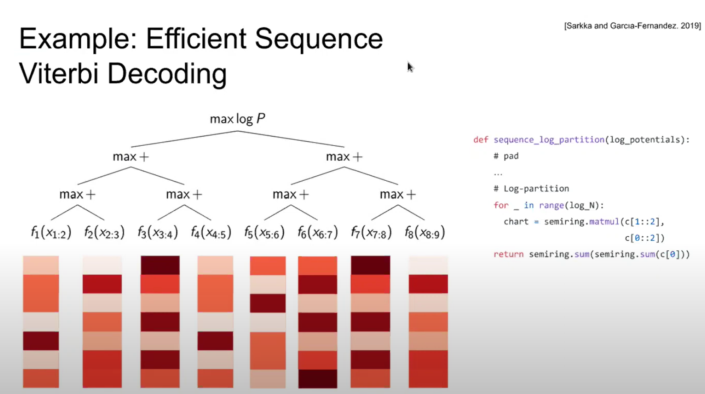
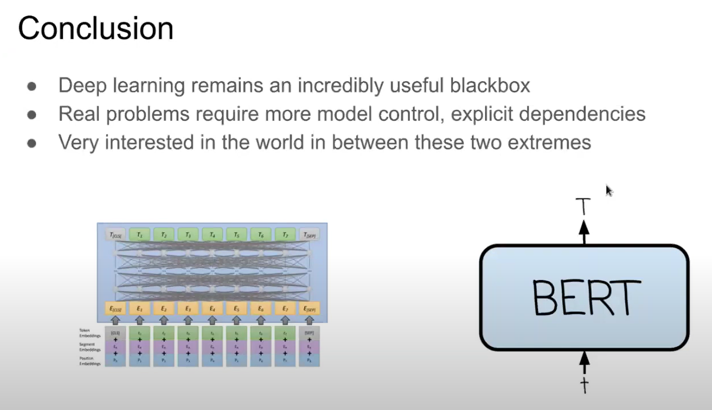

# Beyond Softmax: Deep Probabilistic Structure in NLP https://youtu.be/jYhI5jq0vTw?t=354
- more https://www.youtube.com/@LondonMachineLearningMeetup/videos

Deep structure models: manipulable structure
- expose /impose explicit conditional dependency constraints
- maximum use of deep neural papams / pretraining
- goals: improve robustness, control, and infer speed

Làm thế nào chúng ta có thể xây dựng được một mô hình dễ thao tác hơn? làm thế nào chúng ta có thể có một số loại trừu tượng có thể phơi bày rõ ràng hoặc áp đặt rõ ràng một số loại ràng buộc có điều kiện?

Nói như vậy không có nghĩa là tôi muốn dùng tất cả các công cụ tốt nhất từ DL, mà tôi muốn sử dụng chúng một cách TỐT NHẤT. Tôi muốn pre-train, params, nhưng tôi cũng muốn một số khả năng để xác định các ràng buộc có điều kiện này. Và tôi nghĩ ý tưởng cốt lõi này nằm sau rất nhiều ý tưởng trong NLP. chúng ta muốn cải thiện độ ổn định, khả năng kiểm soát và tốc độ suy luận.

Và để làm được điều này chúng ta cần một số loại ràng buộc !!!

- Tools for structured prediction
- Structured prediction for parallel translation

## Coding structured models https://youtu.be/jYhI5jq0vTw?t=429
- input logit vector in K dimensions
- norm by exp _log-partition_ A
`softmax(l) = exp(l_i) / exp(A(l))`
- exp familiy identitiy
`A'_l_i(l) = softmax(l)_i`

Trong NLP chúng ta yêu thích softmax, có lẽ đây là hàm được sử dụng rộng rãi nhất trong NLP, và nó thực hiện một số thứ thú vị. Chúng ta sẽ gọi script l (chữ l viết điệu) là một vector bất kỳ, và sao đó ánh xạ nó vào đơn hình sao cho nó biến điểm màu xanh ở trên thành điểm màu xanh ở trên mặt phẳng tam giác đỏ. Và bằng cách đó ta có thể __biến mọi vectors chúng ta có thành một phân phối xác xuất__:
- nó cung cấp cho chúng ta tất cả các vectors mà tổng theo một chiều là 1
- và tất cả chúng đều lớn hơn 0

Và để làm được điều này chúng ta làm nó đơn giản như sau, chúng ta lũy thừa số e với từng chiều của l, và thuật ngữ này được gọi là hàm log-partition, và hàm log-partition này có thể tính tổng của các chiều. Đó là hàm cốt lõi, và 2 thuật ngữ chúng ta sẽ sử dụng là: 
- logit để ám chỉ vector l,
- và log-partition để ám chỉ cho việc chuẩn hóa (norm).

Thứ quan trọng thứ 2 là là có một họ các hàm mũ e định danh quan trọng (exp family identity) của hàm softmax. Khi ta lấy đạo hàm của hàm log-partition này cho bất kỳ chiều nào của logit đầu vào, chúng ta sẽ lấy lại được giá trị softmax tại chiều đó.

Note: chiều ở đây ám chỉ một thành phần vô hướng (scalar value) của vector đầu vào l.

Về cơ bản ta có thể lấy identity này làm đạo hàm, và sử dụng đào hàm này để lấy lại một chiều hay xác suất khi cho trước một chiều. Vì thế that kind of core identity và sử dụng softmax được sử dụng vô cùng rộng rãi trong NLP.

Nó là cách chính để chúng ta thực hiện phân loại nhiều lớp, attention sử dụng rộng rãi trong transformers, trong các ứng  dụng của RL rời rạc, hay thậm chí bình thường hóa entropy (entropy regularization).

## Aim: structured softmax https://youtu.be/jYhI5jq0vTw?t=586

Vấn đề thú vị là làm thế nào để mở rộng ý tưởng softmax vào một tập có thể tổ hợp vào các thành phần khác nhau. Trong softmax tiêu chuẩn chúng ta có thể có tập các nhãn cố định, hay số lượng các từ cố định mà chúng ta muốn attend, nhưng trong structured softmax, chúng ta sẽ có một tổ hợp các tập hợp chúng ta cần sử dụng để cho phân phối của chúng ta và đưa ra các xác suất cho mỗi phần của quá trình. 

Ta sẽ tính phân phối với cây nhị phân hoặc tất cả alignment between words & languages, hoặc tất cả các dạng tagging khác nhau cho một câu. Và dạng cấu trúc softmax này có một cái tên, chúng ta gọi nó CRF: conditional random field.

Và tính chất quan trọng ở đây là softmax tiêu chuẩn sẽ được ánh xạ từ logits vào một partition function, rồi vào xác xuất (projection chúng ta đã thấy ở ví dụ trước), và chúng ta sẽ sử dụng this identity để đạo hàm hàm log-partition để trả lại xác xuất của từng phần tử.

Trong softmax chúng ta ánh xạ một vector đầu vào (scores, logits) vào phân bố xác xuất. Trong CRF, chúng ta sẽ làm gần giống như softmax nhưng ở shape khác, chúng ta sẽ lấy vào log-potentials, rồi log-partition, và dùng chúng để có được output marginals, và output-marginals sẽ cho chúng ta xác suất của một vài sự kiện xuất hiện trong phân phối của chúng ta.

Cụ thể hơn, trong setup trước, logits đại diện cho một score cho mọi phần tử có khả năng xuất hiện trong tập của chúng ta, như là score để tạo ra một từ nhất định, hay là điểm để tạo ra một sentiment khác trong phân loại đa lớp. Trong CRF, log-potentials chính là score của một vài sự kiện xuất hiện trong tập tổ hợp của chúng ta. Score của một node xuất hiện trong cây, hay score của một alignment giữ 2 từ trong 2 ngôn ngữ khác nhau. Và chúng ta sẽ lấy ra được phân phối xác xuất đem lại cho chúng ta xác xuất của một trong những sự kiện đó sẽ xảy ra ở đầu ra.

Hãy làm cho điều này trở nên rõ ràng hơn một chút thông qua ví dụ:

## Độ hiệu quả
- sử dụng tensor để biểu diễn cấu trúc
- có thể tính toán song song
- sử dụng tốt gpu

## Ứng dụng trong dịch máy https://youtu.be/jYhI5jq0vTw?t=1435

Markov Transformer (transformer with max n-gram dependency)

