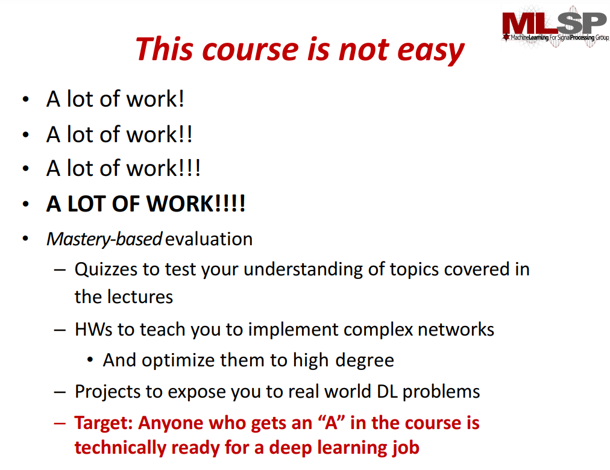

https://deeplearning.cs.cmu.edu/S23/index.html

https://www.youtube.com/channel/UC8hYZGEkI2dDO8scT8C5UQA

“Deep Learning” systems, typified by deep neural networks, are increasingly taking over all the AI tasks, ranging from language understanding, speech and image recognition, to machine translation, planning, and even game playing and autonomous driving. As a result, expertise in deep learning is fast changing from an esoteric desirable to a mandatory prerequisite in many advanced academic settings, and a large advantage in the industrial job market.

The course is well rounded in terms of concepts. It helps us understand the fundamentals of Deep Learning. The course starts off gradually with MLPs and it progresses into the more complicated concepts such as attention and sequence-to-sequence models. We get a complete hands on with PyTorch which is very important to implement Deep Learning models. As a student, you will learn the tools required for building Deep Learning models. The homeworks usually have 2 components which is Autolab and Kaggle. __The Kaggle components allow us to explore multiple architectures and understand how to fine-tune and continuously improve models__. The task for all the homeworks were similar and it was interesting to learn how the same task can be solved using multiple Deep Learning approaches. Overall, at the end of this course you will be confident enough to build and tune Deep Learning models.

## Kaggle: Data Science
Kaggle is where we test your understanding and ability to extend neural network architectures discussed in lecture. Similar to how AutoLab shows scores, Kaggle also shows scores, so don't feel intimidated -- we're here to help. We work on hot AI topics, like speech recognition, face recognition, and neural machine translation.

