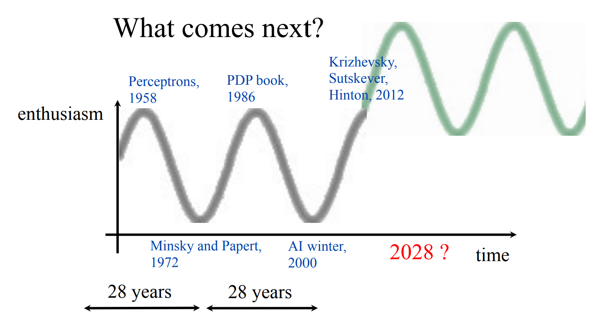

Trong suốt chiều dài lịch sử 78 năm, machine learning / AI đã trải qua 2 giai đoạn ngủ đông, mỗi giai đoạn 28 năm. Tuy nhiên tính chu kỳ này có lẽ đã bị phá vỡ sau năm 2014 AI tiếp tục phát triển rất nhanh tới tận 2023 và chưa có dấu hiệu giảm tốc độ. Có lẽ ta sẽ chứng kiến một bước nhảy vọt của AI lên một tầm mức mới.

## Deep learning
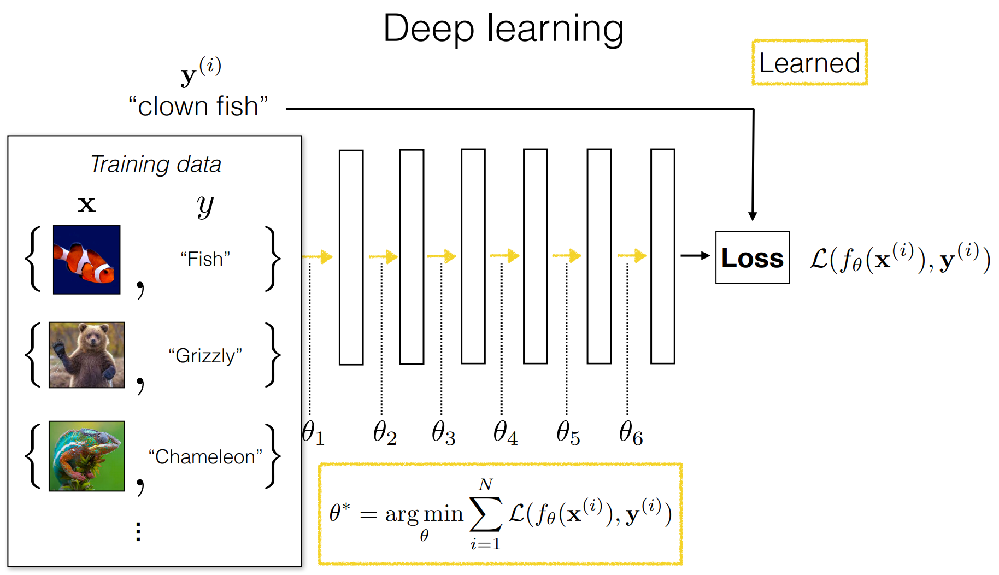

## Gradient Descent
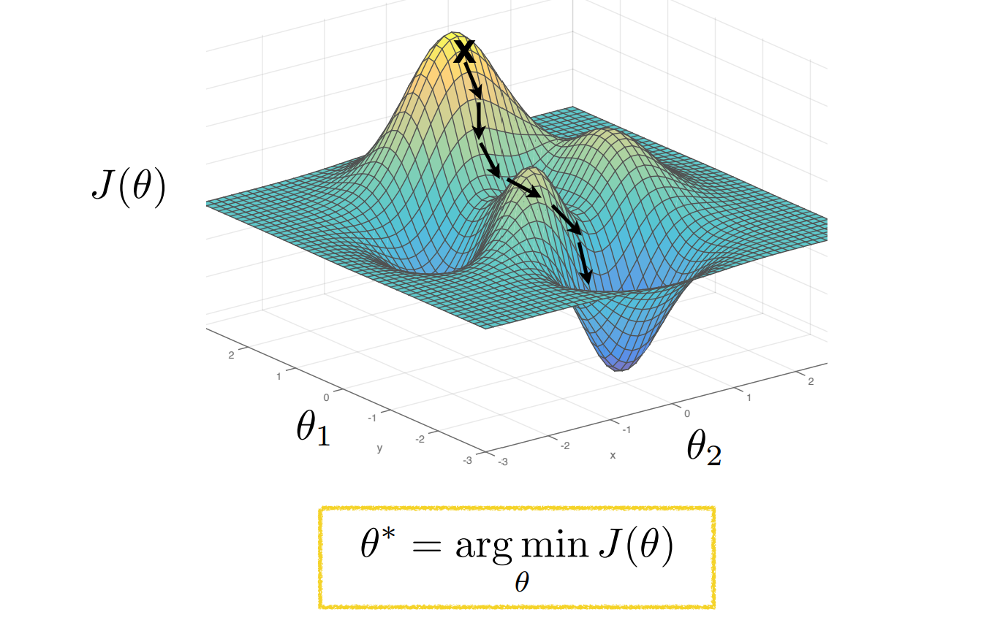

## Why do deep nets generalize?
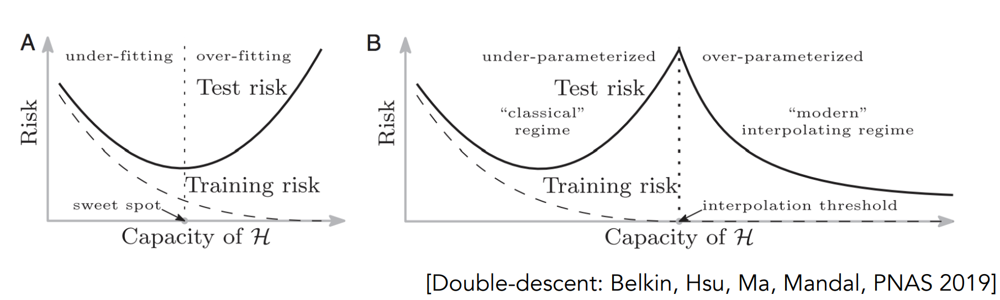
- Mạng sâu có rất rất nhiều tham số hoạt động như một bảng tra cứu, chúng regurgitating dữ liệu huấn luyện
- Thay vào đó, chúng học các luật khái quát hóa
- Bất chất lý thuyết học máy cổ điển

## Softmax

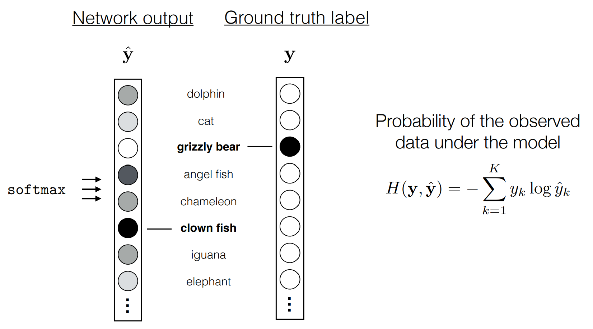

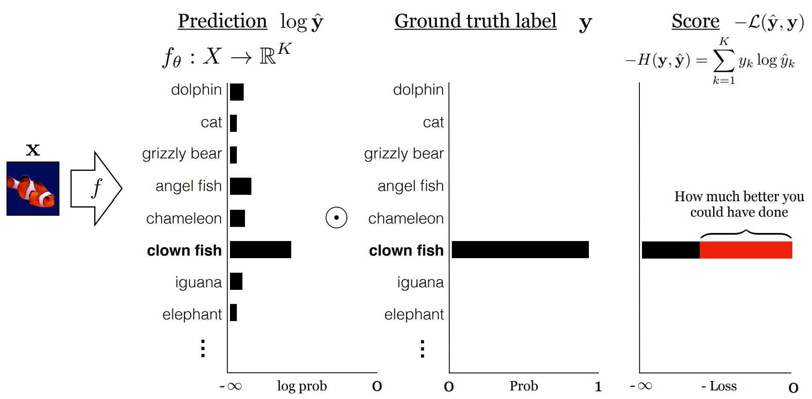

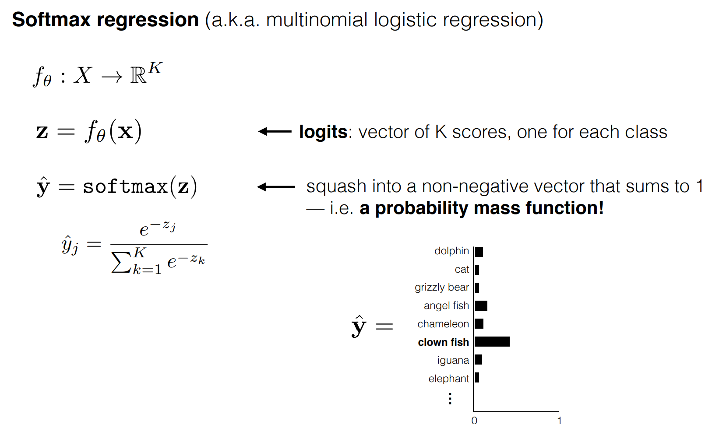

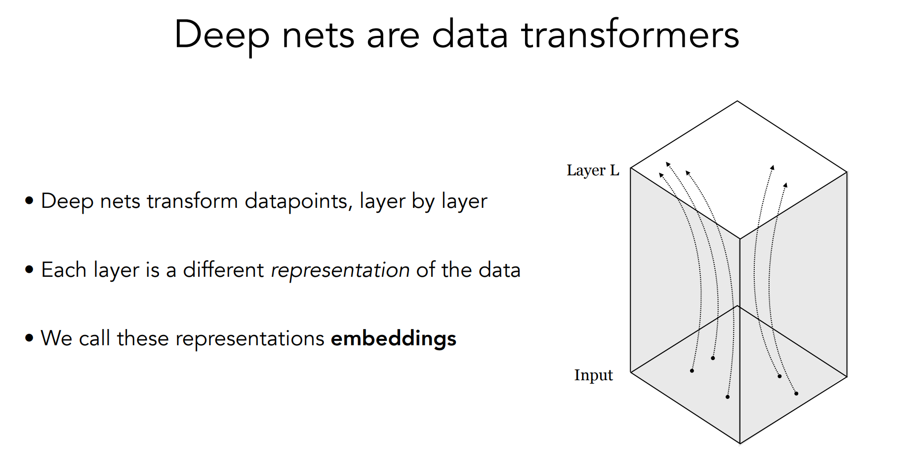

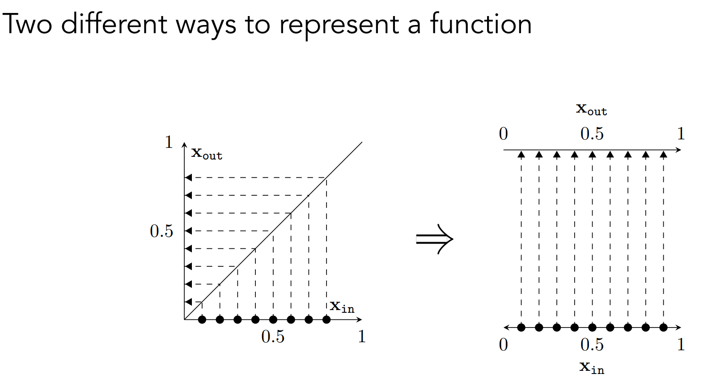

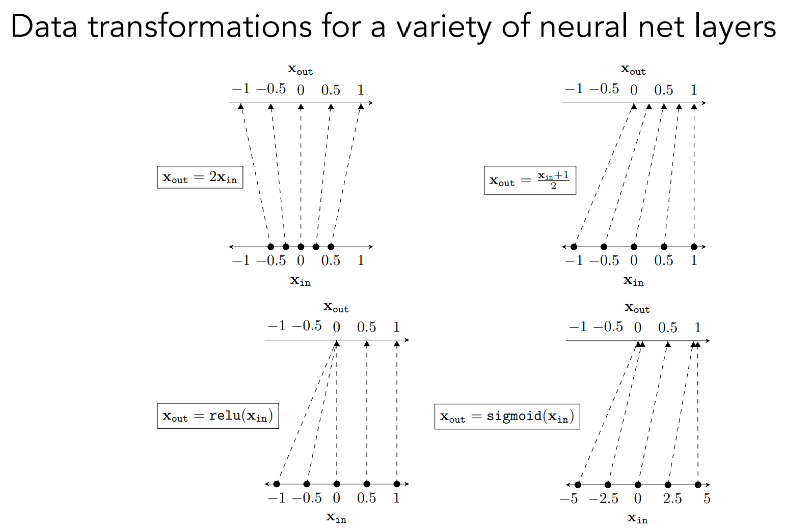

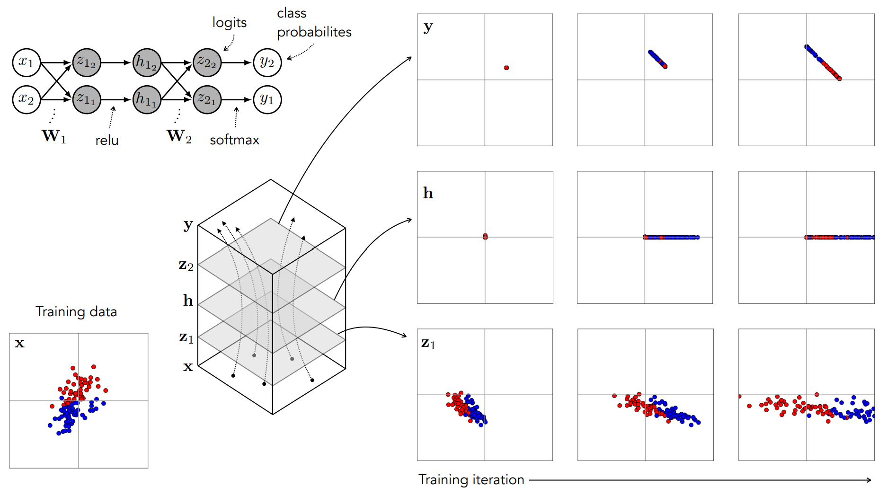

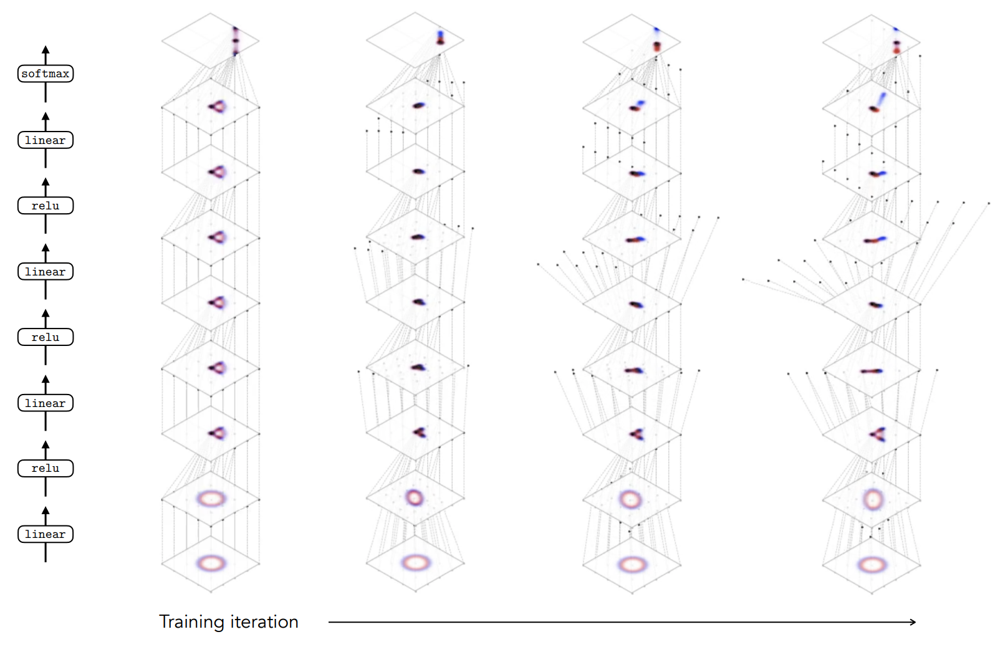

## What is deep learning?
- __Mạng nơ-ron__: một lớp kiên trúc học máy sử dụng xếp chồng của các biến đổi tuyến tính (thay đổi số chiều) xen kẽ với pointwise nonlinearities (biến đổi 1-1)
- __Lập trình đạo hàm được__: một xu hướng lập trình mà phần tham số hóa của chương trình được tối ưu hóa bởi gradient-based