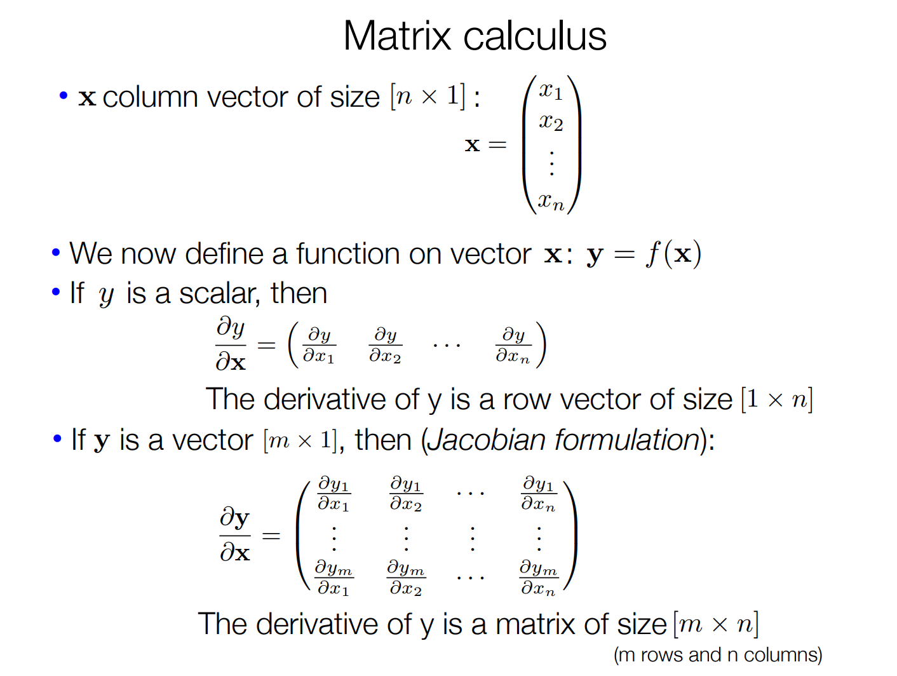
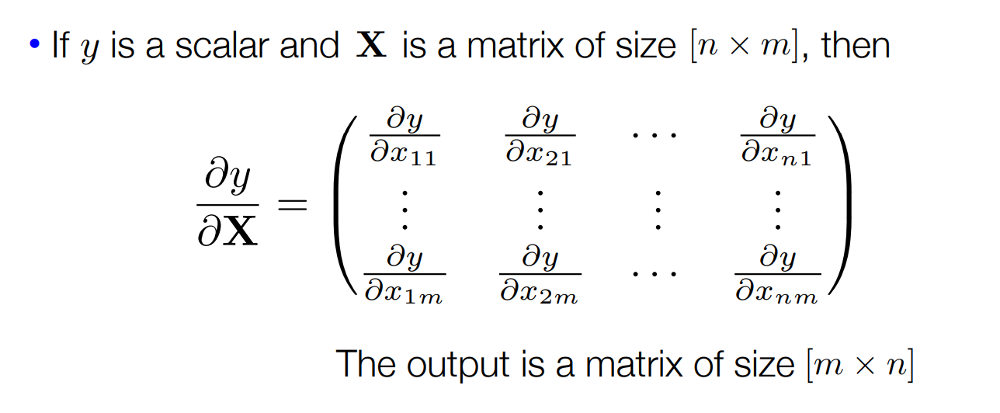
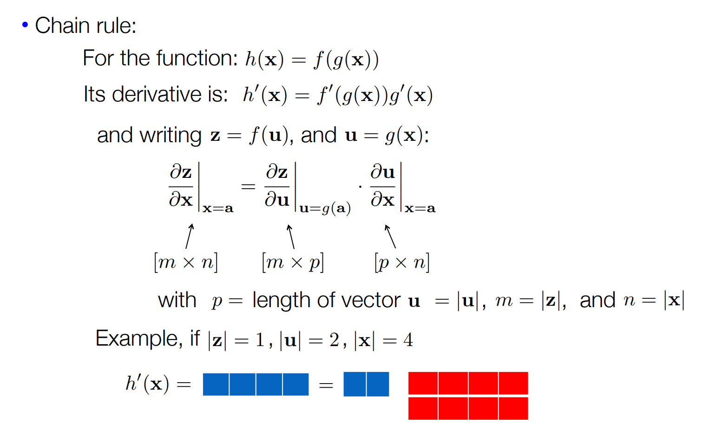
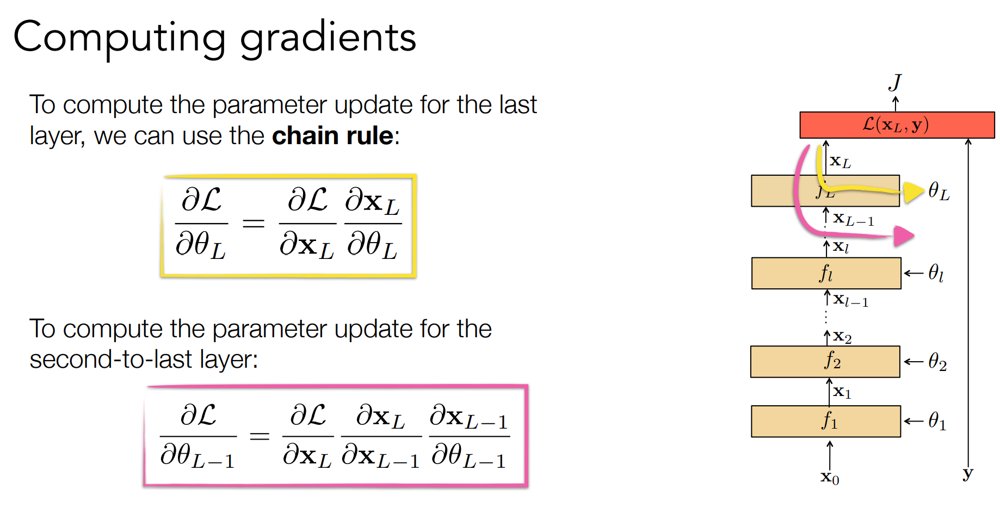
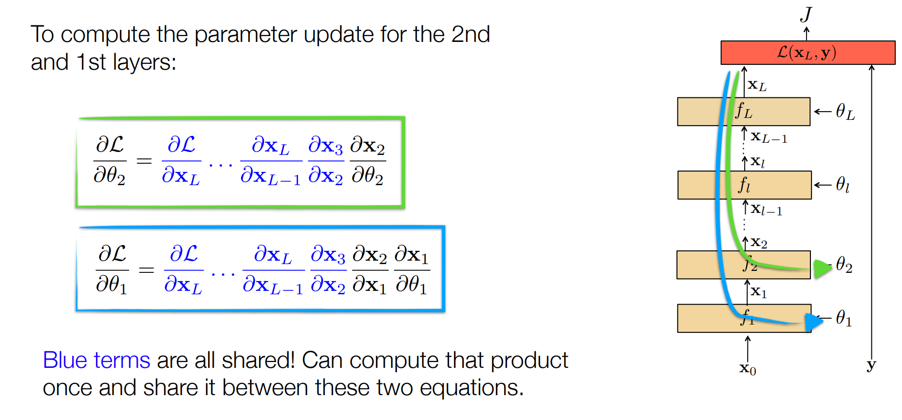
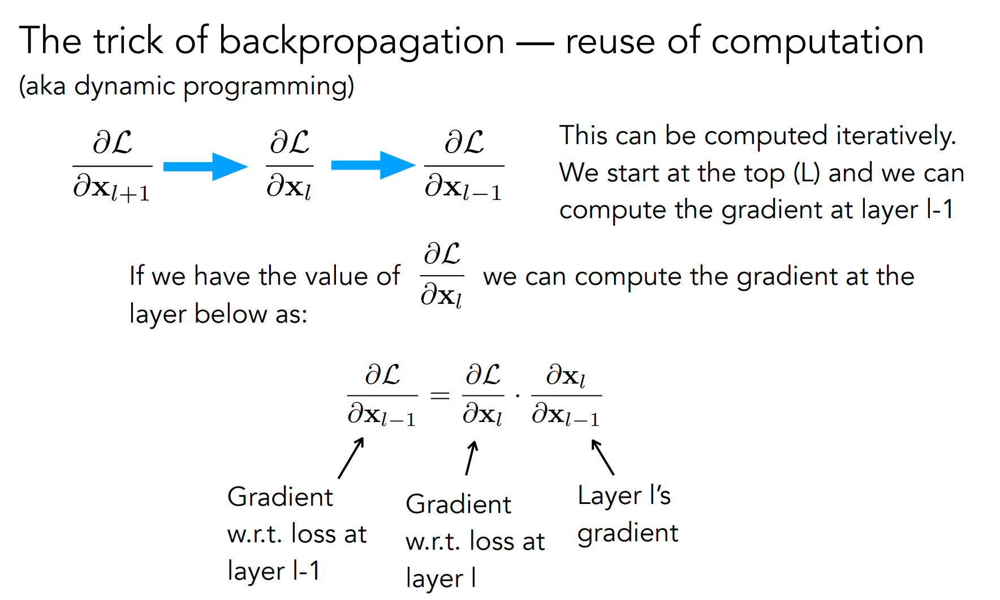
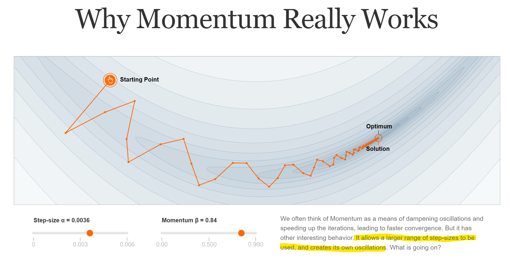
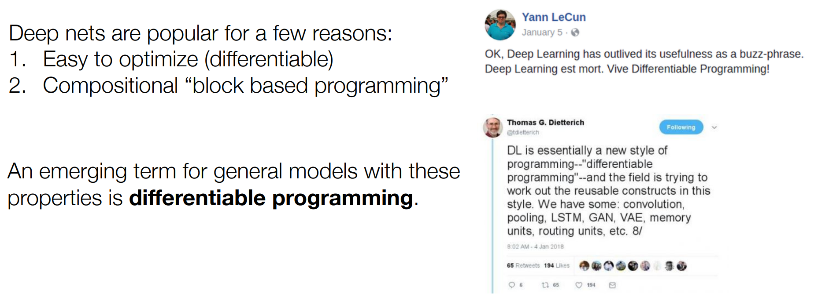

# Backprob
https://phillipi.github.io/6.s898/materials/slides/2_backprop.pdf

Wikipedia: The three types of derivatives that have not been considered are those involving vectors-by-matrices, matrices-by-vectors,
and matrices-by-matrices. These are not as widely considered and a notation is not widely agreed upon.

## Computing gradients

https://distill.pub/2017/momentum

## Differentiable programming

## Software 2.0
https://karpathy.medium.com/software-2-0-a64152b37c35

> To make the analogy explicit, in Software 1.0, human-engineered source code (e.g. some .cpp files) is compiled into a binary that does useful work. In Software 2.0 most often the source code comprises 1) the dataset that defines the desirable behavior and 2) the neural net architecture that gives the rough skeleton of the code, but with many details (the weights) to be filled in. The process of training the neural network compiles the dataset into the binary — the final neural network. In most practical applications today, the neural net architectures and the training systems are increasingly standardized into a commodity, so most of the active “software development” takes the form of curating, growing, massaging and cleaning labeled datasets. This is fundamentally altering the programming paradigm by which we iterate on our software, as the teams split in two: the 2.0 programmers (data labelers) edit and grow the datasets, while a few 1.0 programmers maintain and iterate on the surrounding training code infrastructure, analytics, visualizations and labeling interfaces.

> It turns out that a large portion of real-world problems have the property that it is significantly easier to collect the data (or more generally, identify a desirable behavior) than to explicitly write the program. Because of this and many other benefits of Software 2.0 programs that I will go into below, we are witnessing a massive transition across the industry where of a lot of 1.0 code is being ported into 2.0 code. Software (1.0) is eating the world, and now AI (Software 2.0) is eating software.

Trong phần mềm 1.0 mã nguồn do con người viết được biên dịch thành mã nhị phân và chạy trên máy tính để xử lý công việc. Trong phần mềm 2.0 "mã nguồn" bao gồm 1) tập dữ liệu định nghĩa hành vi mong muốn 2) kiến trúc mạng nơ-ron định hướng bộ khung "mã nguồn" với rất nhiều "chỗ trống" cần được điền vào (trọng số / tham số). Quá trình đào tạo mạng nơ-ron "biên dịch" tập dữ liệu thành mã nhị phân - mạng nơ-ron thành phẩm. Trong hầu hết các ứng dụng thực tế hiện nay, kiến trúc mạng nơ-ron và hệ thống huấn luyện sẽ trở thành hàng hóa, và hầu hết các hoạt động "phát triển phần mềm" được hình thành ở các bước giám tuyển, phát triển, "xoa bóp" và làm sạch các tập dữ liệu được gán nhãn. Điều này sẽ làm thay đổi mô hình lập trình trong đó chúng ta phát triển phần mềm với 2 bộ phận khác nhau: lập trình viên 2.0 (người gán nhãn dữ liệu) biên tập và phát triển các tập dữ liệu, và một số ít các lập trình viên 1.0 duy trì và phát triển các cơ sở hạ tầng của: mã nguồn huấn luyện, phân tích và hình dung hóa và các giao diện để gán nhãn.

Hóa ra là một phần lớn các bài toán thực tế đều có đặc tính là việc thu thập dữ liệu (hay nói chung hơn là xác định một hành vi mong muốn) dễ dàng hơn nhiều so với việc viết chương trình một cách rõ ràng. Vì thế, chúng ta đang chứng kiến một sự chuyển đổi lớn trong toàn ngành nơi rất nhiều mã 1.0 được chuyển thành mã 2.0. Phần mềm (1.0) đang ăn mòn thế giới và giờ đây AI (Phần mềm 2.0) đang ăn mòn phần mềm.

## Hạn chế của phần mềm 2.0
Mạng nơ-ron hoạt động tốt nhưng rất khó để lý giải tại sao chúng lại tốt (xác định độ tin cậy). Trong rất nhiều lĩnh vực ứng dụng (y tế, tài chính), chúng ta sẽ phải lựa chọn giữa một mô hình có độ chính xác 90% mà chúng ta hiểu rõ, và một mô hình có độ chính xác 99% mà chúng ta không hiểu rõ.

Phần mềm 2.0 có thể xảy ra những lỗi hết sức ngớ ngẩn, và tệ hơn là chúng "âm thầm thất bại" kiểu như là bị ảnh hưởng bởi sự thiên lệch trong dữ liệu huấn luyện, những lỗi như thế rất khó để phân tích và nghiên cứu chính xác khi kích cỡ của mạng nơ ron ngày càng trở lên khổng lồ (thời điểm 2017, tác giả đưa ra ví dụ vài triệu tham số, tới nay 2022, mô hình có vài chục / vài trăm tỉ tham số đã trở thành phổ biến và có xu hướng tiếp tục tăng).