# Hacker’s guide to DL
https://phillipi.github.io/6.s898/materials/slides/8_hackers_guide.pdf

- “Become friends with every pixel”
- “Become friends with every character”
- ...

## Hãy nhìn vào dữ liệu

Quan sát phân bố của đầu vào và đầu ra.
- Quan sát một số lựa chọn ngẫu nhiên đầu vào - đầu ra để có cảm giác chung
- Histogram các chiều của dữ liệu đầu vào để nhìn ra khoảng và biến thiên
- Histogram targets (đầu ra) để nhìn khoảng và sự mất cân bằng
- Lựa chọn, sắp xếp và quan sát theo loại target hoặc whatever else

Quan sát dữ liệu nội tại và dữ liệu ngoại lai (inliers vs outliers) và hàng xóm:
- Hình dung hóa sự phân bố và dữ liệu, đặc biệt là ngoại lai, để xác định những vấn đề với dữ liệu
- Nhìn vào hàng xóm
- Ví dụ:
  - những ảnh xám hiếm hoi trong 1 tập ảnh màu, 
  - ảnh rất lớn đáng nhẽ cần rescaled, 
  - những nhãn dữ liệu bị đổ vỡ do cast to uint8

Tiền xử lý: dữ liệu được loaded thường không phải lúc nào cũng là dữ liệu như là nó được lưu trữ!
- quan sát dữ liệu được cho vào mô hình bởi output = model(data)
- chuẩn hóa (standardize): `x_k <- x_k - E[x_k] / sqrt(Var[x_k]) for all k`
  - thu các chiều dữ liệu lại vào cùng một khoảng chuẩn
  - điều này như là một điều cho trước (prior) để không chiều nào của dữ liệu được coi trọng hơn
  - quan trọng khi mỗi đo lường có sự khác biệt lớn về scales or units
- thống kê: min/max, mean/variance để phát hiện những lỗi nhưng load dữ liệu trong khoảng [0, 255] trong khi mô hình mong đợi dữ liệu đầu vào trong khoảng [0, 1]
- shape: bạn đã chắc chắn về số lượng chiều và kích cỡ của mỗi chiều chưa?
  - kiểm tra tính đúng đắn của dữ liệu tại mỗi chiều bằng dữ liệu tự tạo (cho dễ kiểm tra). Ví dụ 64x64x64x64 tensor có thể bị permuted mà không bị phát hiện ra một cách obviously
- kiểu của dữ liệu: kiểm tra xem có bị casting, nhất là xuống độ chính xác thấp hơn không?
  - what’s -1 for a byte? how does standardization change integer data?

- rất nhiều mã nguồn của bạn sẽ chỉ để reshaping tensors
  - rất dễ bị nhầm lẫn khi làm điều đó 
  - What does reshape(X, (X.shape(0) * X.shape(1)) do?
  - Is it column order or row order?
  - công cụ như einops sẽ giúp bạn tránh bớt những lỗi đó: rearrange(ims, 'b h w c -> h (b w) c')

Terms:
> Outliers/anomalies (dữ liệu ngoại lai/dữ liệu bất thường)
> Nhiều ứng dụng yêu cầu phải có khả năng quyết định xem một quan sát mới thuộc cùng một phân phối với các quan sát hiện có (nó là một inlier) hay nên được coi là ngoại lai (outlier).

## Gia tăng dữ liệu / ngẫu nhiên miền (Data augmentation / domain randomization)

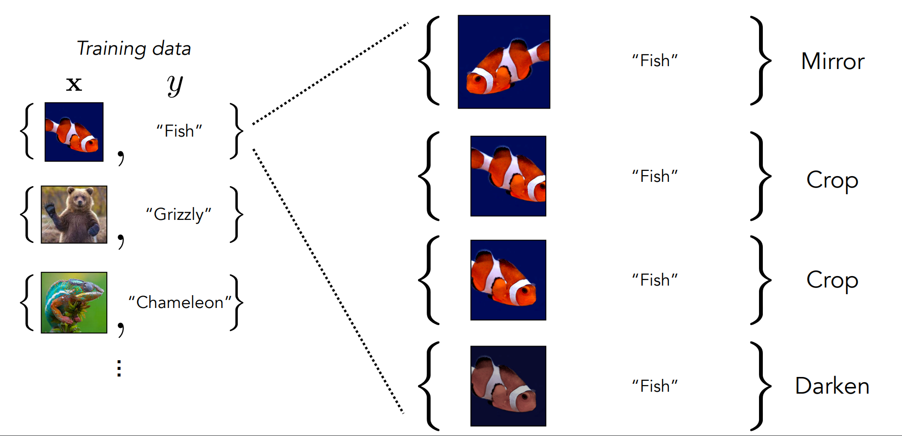

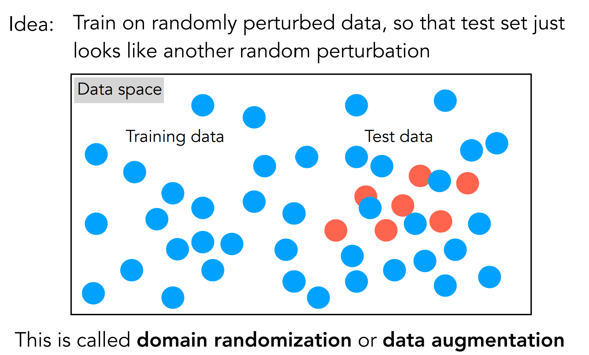

Ý tưởng đằng sau data augmentation là hãy huấn luyện trên dữ liệu bị làm nhiễu ngẫu nhiên, để dữ liệu kiểm thử cũng trông giống như là nhiễu loạn ngẫu nhiên. Điều này được gọi là domain randomization or data augmentation.

## Ngẫu nhiên miền
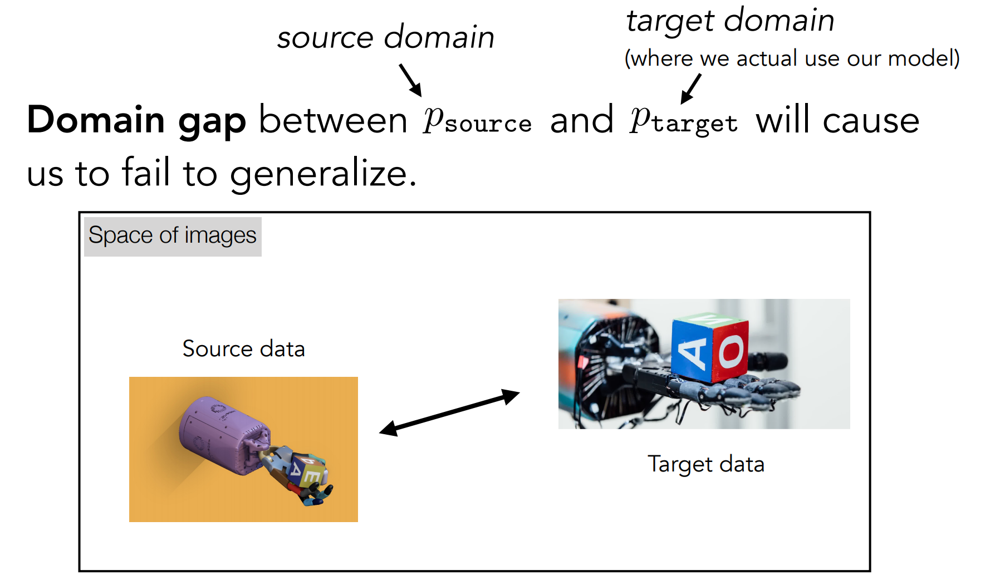
Khoảng cách giữa miền dữ liệu p_source và p_target sẽ làm cho việc tổng quát hóa thất bại. p_source là miền dữ liệu chúng ta dùng để huấn luyện mô hình. p_target là miền dữ liệu chúng ta đem mô hình ra sử dụng. Luôn có sự khác biệt giữa 2 miền này và theo thời gian, dữ liệu mới / hoàn cảnh sử dụng mới càng làm gia tăng sự khác biệt này.

- Độ chính xác trên tập huấn luyện cao chúng tỏ bài toán đang quá dễ
- Hãy cho thêm dữ liệu để làm bài toán khó hơn

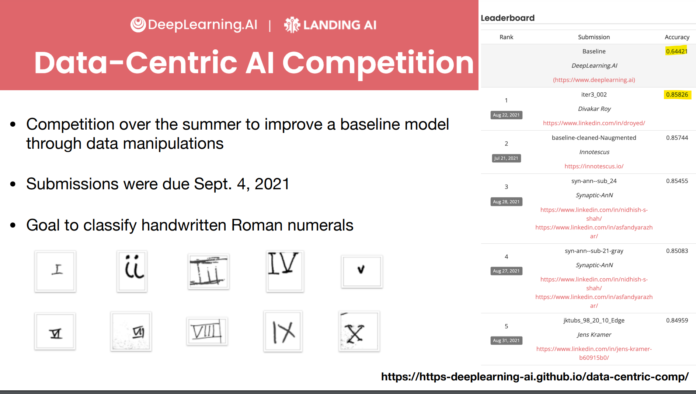

## Mô hình

### Keep it as simple as possible!

__do your first experiment with the simplest possible model w/ and w/o your idea__

Why keep it simple?
• easy to build, debug, share
• tractable to understand, make robust, build theories around
• simple models also work better (Occam’s razor, Solomonoff Induction)
• if you focus on simplicity you will have an unfair advantage

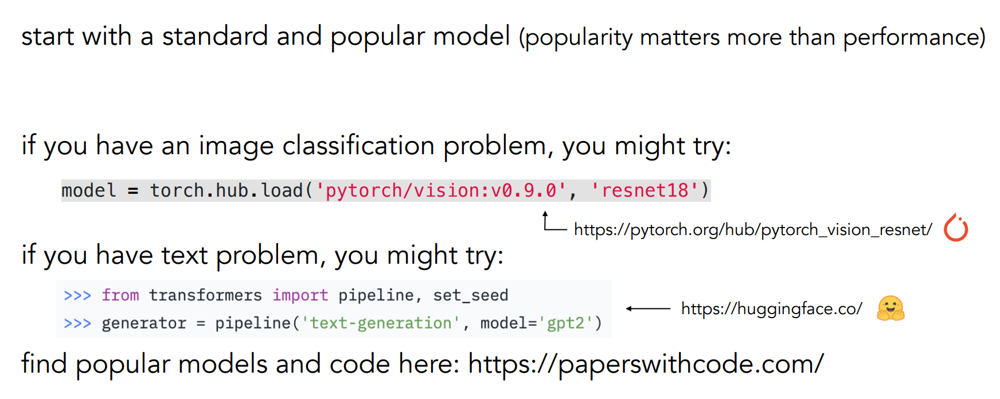

- stand on the shoulders of giants
- use pretrained models (but be aware of their flaws and limitations)

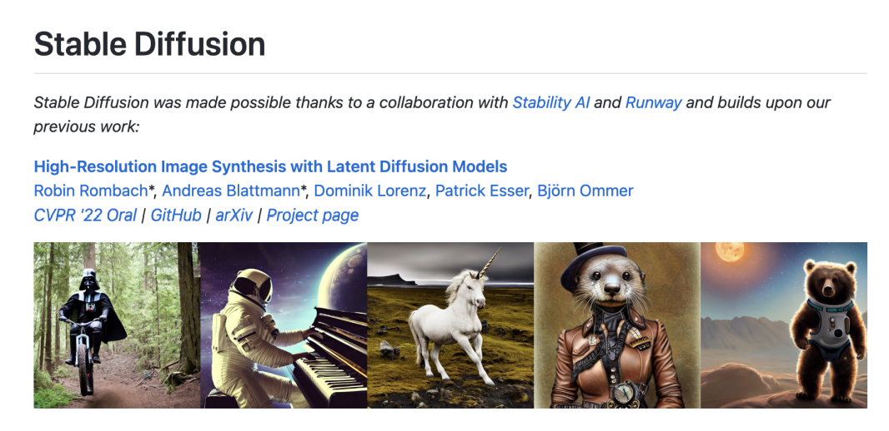

__double-check the model actually is what you thought you defined__
```py
# walk the model for inspection
for name_, module_ in model.named_modules():
if name_ == 'name' or isinstance(module_, nn.Conv2d):
[…]
```

### Image colorization

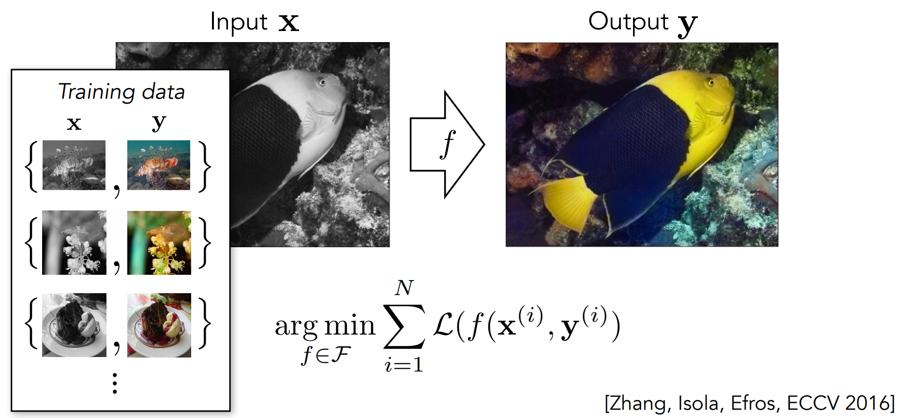

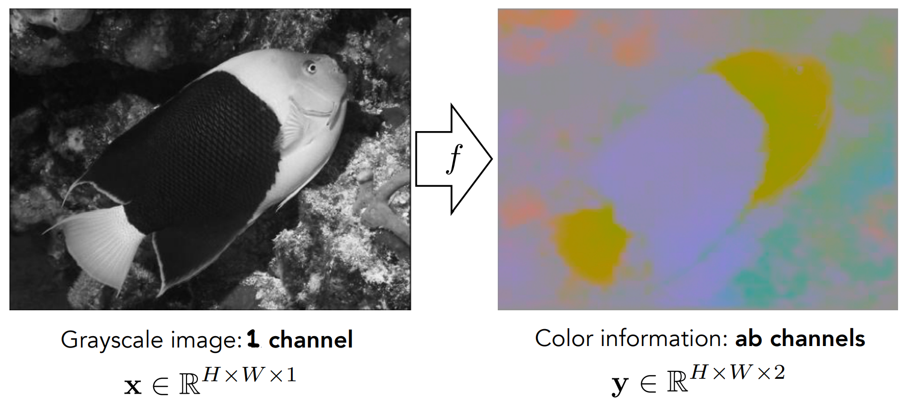


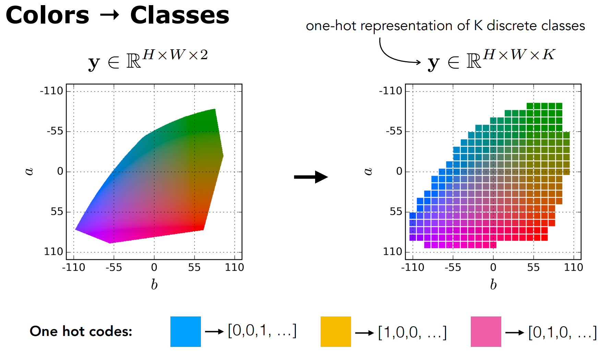

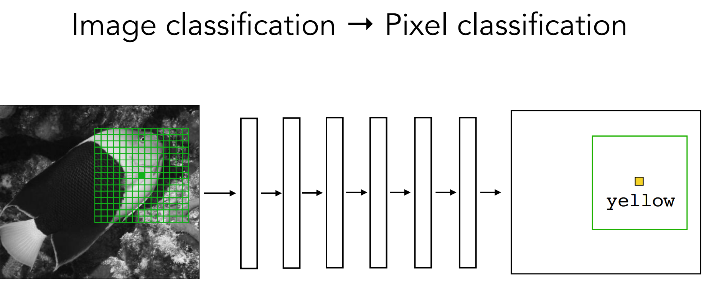

## Formulate your problem as softmax regression (a.k.a. classification)
- cross-entropy loss, 1-hot labels
- Why?
  1. No restriction on shape of predictive distribution [up to quantization] 
    (this is not the case for least-squares regression, which assumes Gaussian predictions)
  2. Discrete classes are easy to label
  3. All labels are equidistant under 1-hot representation

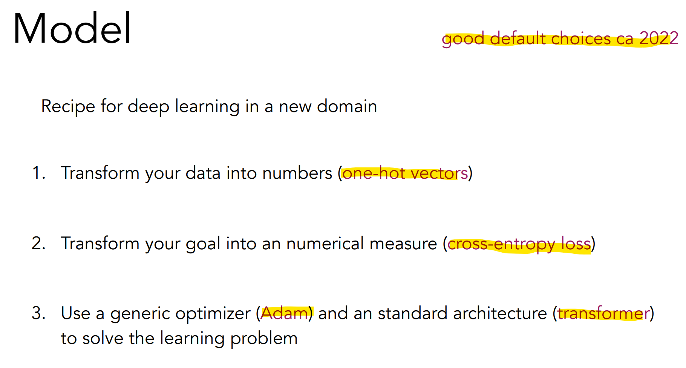

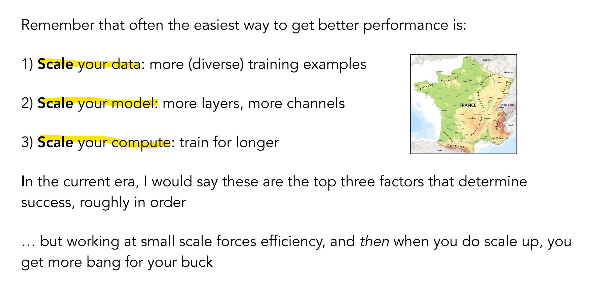

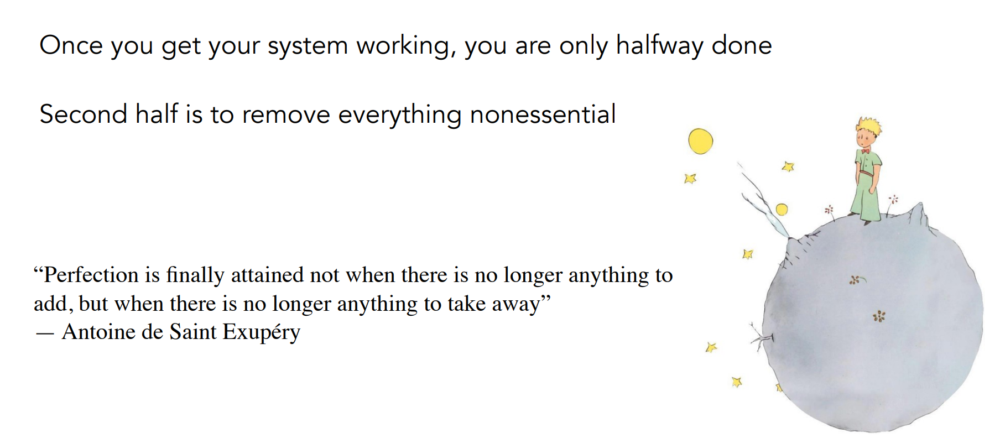

## Optimization

figure out optimization on __one/few/many datapoints__, in that order
- overfit to a data point
- then fit a batch
- and finally try fitting the dataset (or a miniature version of it)
__first make sure you can fit train set, then consider generalization to test set__

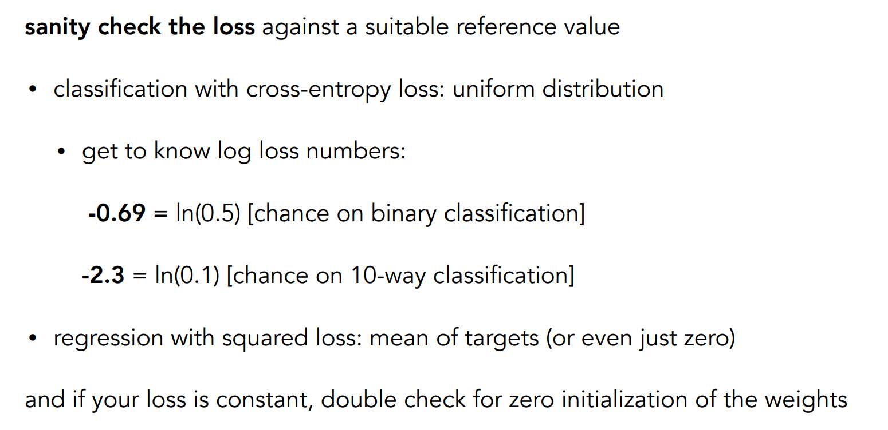

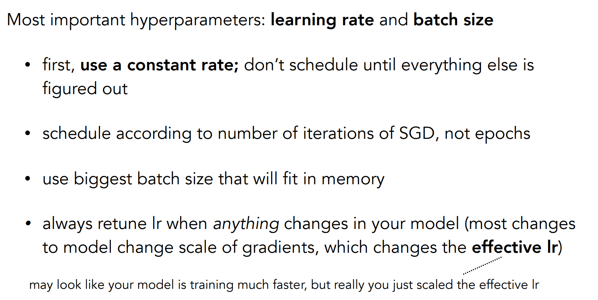

... and more ...

# A Recipe for Training Neural Networks
http://karpathy.github.io/2019/04/25/recipe

# DIY Deep Learning
http://6.869.csail.mit.edu/fa19/lectures/DIY_Deep_Learning_MIT_6.869.pdf