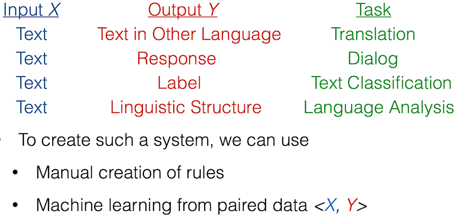

## Intro 1 | [video](https://www.youtube.com/watch?v=rVht4eK3EZw) | [slides](https://phontron.com/class/anlp2022/assets/slides/anlp-01-intro.pdf) | [notebook](https://colab.research.google.com/github/neubig/anlp-code/blob/main/01-rulebasedclassifier/rulebasedclassifier.ipynb)

* What is natural language processing?
* What are the features of natural language?
* What do we want to do with NLP?
* What makes it hard?

### What is natural language processing?

* Tech to handle human language (usually text) using computers.
* Aid human - human communication.
* Aid human - computer communication.
* Analyze / understand language.

We now use NLP serveral times a day without knowing it! (google search for example)

### A General Frame Work for NLP Systems
> Formally create a *function* to map an input X (language) to an output Y.

### Rule Based NLP

Quá trình 3 bước để ra quyết định:
* Extract features
* Calculate score for one or more possibities
* Decision function, to choose one of serveral possiblity.

### Machine Learning Based NLP
Learn both feature extractor and scoring function

### Class goal

Tìm hiểu chi tiết về cách xây dựng hệ thống NLP từ góc nhìn nghiên cứu

* Tìm hiểu các chủ đề cơ bản và nâng cao trong học máy và
các phương pháp tiếp cận mạng thần kinh đối với NLP

* Học kiến thức ngôn ngữ cơ bản hữu ích trong NLP, và học
phương pháp phân tích cấu trúc ngôn ngữ

* Xem một số nghiên cứu điển hình về các ứng dụng NLP và tìm hiểu cách
xác định các vấn đề đặc trưng cho mỗi nghiên cứu.

* Tìm hiểu cách gỡ lỗi hệ thống NLP bị trục trặc, và cải tiến

### Roadmap

1/ ML and NN fundamentals

2/ Sequence models (recurrent, sequence labeling, conditioned generation, attention)

3/ Representation and pre-training

4/ NLP applications

5/ Natural language analysis

6/ Advanced learning techniques (long seq, struct learning, latent variable model, adversarial methods)

### Assigments

1/ Build-your-own BERT

2/ NLP task from scratch

3/ SOTA survey and re-implement

4/ Final project: either improve SOTA or applies NLP models to a unique task.