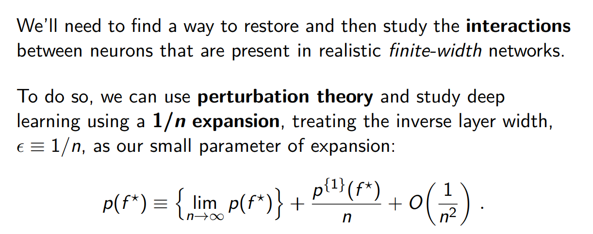

# Effective Theory of DL (beyond the infinite-width limit)
https://www.youtube.com/watch?v=PRyEApLxcSQ&t=5430s

> Mô phỏng mà một người cảm nhận được nói chung là tổng của nhiều tỷ quy trình cơ bản đồng thời, 
do đó quy luật san bằng số lớn che lấp hoàn toàn bản chất thực của các quá trình đơn lẻ.

AI là một hệ thống phức tạp có rất nhiều các thành phần. Và thành công đằng sau là deep learning, mà DL sử dụng mạng nơ-ron nhân tạo. Ý tưởng đằng sau mạng nơ ron cho học sâu là với rất nhiều nơ-ron tổ chức lại thành một chuỗi các tầng tính toán, có thể học được các biểu diễn (representation) hữu ích từ dữ liệu.

Chúng ta sẽ cố gắng hiểu các biểu diễn học được trong quá trình đó có tính chất như thế nào. Chúng ta sẽ cố gắng hiểu một cách thực tế nhất DL model, thực tế các mạng nơ ron, 

 
Taylor expansion, mô tả 3 vấn đề chúng ta gặp phải:
1. Taylor series chứa một lượng không giới hạn các terms và về nguyên tắc chúng ta phải tính tất cả các terms đó.
2. Vì các tham số được khởi tạo ngẫu nhiên từ p(theta), vì thế mỗi khi khởi tạo ta có một hàm f(x; theta) khác nhau. Nghĩa là các term của Taylor expansion f, df/d_theta, d^2f/d_theta^2 ... thực sự là một hàm ngẫu nhiên của đầu vào x. Và this join distribution nói chung sẽ có các phụ thuộc thống kê phức tạp.
3. Vấn đề thứ 1 về tính xấp xỉ, vấn đề thứ 2 về thống kê. Vấn đề thứ 3 về động lực học, vì vậy điều cuối cùng chúng ta cần hiểu là làm thế nào để tính toán giá trị học của các tham số theta^* và nói chung đó là kết quả của một quá trình đào tạo phức tạp và nó không phải là duy nhất và phụ thuộc vào mọi thứ theo nghĩa đen. Nó có thể phụ thuộc vào khởi tạo ban đầu của tham số. Nó phụ thuộc vào hàm lúc khởi tạo, và vô số các thuật ngữ đạo hàm, nó cũng phụ thuộc vào lựa chọn thuật toán học, và tất nhiên nó phụ thuộc vào dữ liệu học, phụ thuộc vào nhiệm vụ đang được đào tạo ...

- Tại sao nó như thế?
- Bản chất của nó là gì?
- Giải thích nó ra bằng lời
- Tìm hiểu, điều tra, so sánh, đối chiếu để tìm ra bản chất
- Tìm hiểu, điều tra phải đúng hướng. Tức là phải có một định hướng ĐÚNG ĐẮN trước!
- Luôn luôn hỏi có đúng nó là như thế không? Và đừng vội trả lời.

- - -

Giải quyết 3 vấn đề trên (tính xấp xỉ, tính phụ thuộc vào việc khởi tạo, và sự phụ thuộc của kết quả huấn luyện vào tất cả mọi thứ), cho một hàm tổng quát được tham số hóa là không thể. Nhưng cái chúng ta quan tâm ở đây là các hàm của mạng sâu. Như vậy chúng ta sẽ phải sử dụng các cấu trúc cụ thể của hàm mạng nơ-ron.

Hai khía cạnh cơ bản của  một kiến trúc mạng nơ-ron là chiều rộng n, và độ sâu L.

## A principle of sparsity https://youtu.be/PRyEApLxcSQ?t=6461
Nhìn chung trong nhiều hệ thống thống kê phức tạp thường có sự đơn giản hóa trong giới hạn của số lượng lớn các thành phần, điều này quen thuộc nếu bạn quen thuộc với số liệu thống kê theo ý tưởng của định lý giới hạn trung tâm. Trong rất nhiều hệ thống, một câu hỏi tự nhiên được đặt ra là trong giới hạn của số lượng lớn các thành phần, liệu có thể tìm thấy và đưa ra các đơn giản hóa hay không? Vì vậy hai cách sàng lọc cốt lõi mà chúng ta đang xem xét về cấu trúc mạng nơ-ron rất đơn giản này là có hai cách để chúng ta làm cho mạng tăng kích thước, chúng ta có thể tăng theo chiều rộng bằng cách giữ cố định độ sâu, hoặc chúng ta có thể tăng độ sâu trong khi giữ nguyên chiều rộng.

Đây là một giới hạn cần được cân nhắc cẩn thận khi nghiên cứu, nhưng cũng may mắn là có một giới hạn tốt và ta sẽ cố gắng đưa ra vài trực giác tại sao nó lại đơn giản và thú vị. Điều đơn giản là lấy giới hạn mà chúng ta cho phép số lượng nơ-ron trong các tầng ẩn tiến đến vô cùng và đây là giới hạn để nghiên cứu mạng nơ-ron lý tưởng.

Trong thực tế, nên bắt đầu từ một thứ đơn giản và sau đó từ từ thêm vào độ phức tạp, vì vậy đây là một nơi đủ đơn giản để bắt đầu.

1. Các đạo hàm bậc cao sẽ biến mất một cách dễ dàng nên ta chỉ cần xem xét 2 terms: f, và df/d_theta
2. Các phân phối của những hàm ngẫu nhiên này là độc lập, và chỉ cần quan tâm p(f), p(df/d_theta) và phân phối cận biên ở dạng đơn giản.
3. Tính động của huấn luyện trở nên tuyến tính và độc lập với cụ thể của các thuật toán, điều này hiến theta^star ở dạng đóng và phân tích được.

Q: có nghĩa là khi khởi tạo nó là một phân phối gaussian với mean = 0, và sau khi huấn luyện mean đó dịch chuyển?
A: đúng vậy. ý tôi là nó phụ thuộc vào cách bạn chọn phân phối khởi tạo của mình và hiển thị chúng. Có thể đủ đơn giản để nói rằng, network output khi khởi tạo là một phân phối gaussian và sau đó là phân phối được đào đạo đầy đủ sẽ là một bản phân phối gausian khác.

Việc có quá nhiều sự đơn giản hóa dẫn tới việc mô hình mạng rộng hoạt động không tốt trong thực tế.

Lý do: diễn giải của Von Neuman (ở ảnh đầu tiên) thực sử là vấn đề của hạn chế trung tâm: đầu vào của một không giới hạn số lượng các tín hiệu cho mỗi nơ ron, sẽ khiến cho luật số lượng lớn che khuất mối tương quan giữa các nơ-ron có thể được khuếch đại trong quá trình đào tạo cho mạng thực tế và dẫn đến việc không học được đại diện.

## Problem 3: training dynamics https://youtu.be/PRyEApLxcSQ?t=7945

