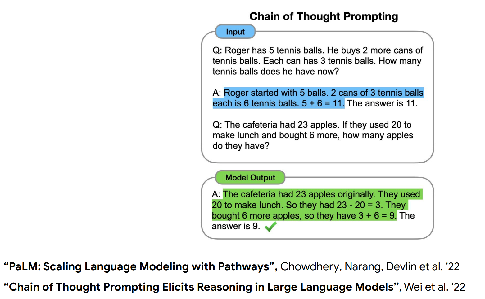
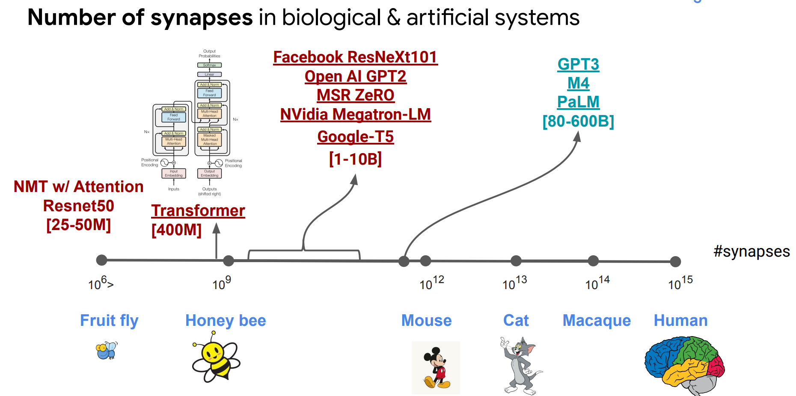
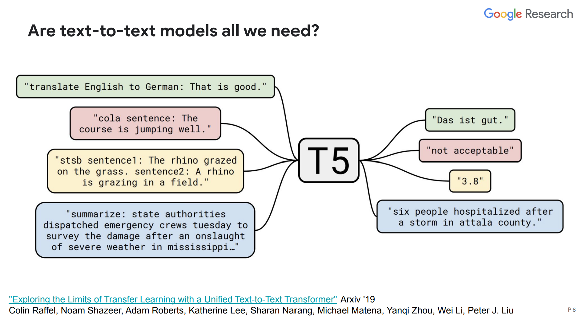

# "Natural" Natural Language Processing
http://lxmls.it.pt/2022/slides/slav.pdf

https://www.youtube.com/watch?v=nDitZnO66us

NLP cổ điển phân ra nhiều bước trung gian để biểu diễn ngôn ngữ (từ, ghép, câu, đoạn ...) và giải quyết từng bài toán nhỏ. Nhưng với những đột phá trong mô hình ngôn ngữ lớn như hiện nay (hình dưới). Câu hỏi đặt ra là liệu có cần các bước trung gian đó không? Hay ta chỉ cần sử dụng 1 hình thức biển diễn đó chính là ngôn ngữ tự nhiên?

Note: cách suy luận của LLM không giống như chúng ta suy luận, chúng không biết các luật toán học. Và một khi chúng sai thì sẽ rất ngớ ngẩn (kiểu 2 + 3 = 7). Chúng ta cũng chưa biết rõ tại sao chúng sai. Còn khi chúng đúng thì kết quả sẽ rất ấn tượng.

## Is scale all we need?

Câu trả lời là KHÔNG! Improvement không linear với scale. Có khi tăng scale mô hình ko tiến bộ nhiều, tiếp tục tăng lại có đột phát (lúc được, lúc không). Và chúng ta vẫn không biết tại sao.

## Are text-to-text model all we need?

Câu hỏi cho năm ngoái. Là are scale all we need? và năm nay sẽ là liệu mô hình tex-to-text là tất cả những gì ta cần? 

Liệu một mô hình cực lớn, nơi chúng ta cho text vào, định nghĩa các nhiệm vụ dưới dạng text, và đưa ra các hướng dẫn, hoặc hỏi mô hình để làm những việc nhất định, thì liệu một mô hình có thể hoàn tất được tất cả các nhiệm vụ không?

That paradism is not new, but nhưng nó có vẻ đi trước thời đại một chút vì nó đã không hoạt động tốt vào năm 2019 nhưng hiện nay nó đã bắt đầu tốt hơn rất nhiều.

https://youtu.be/nDitZnO66us?t=1429

c

