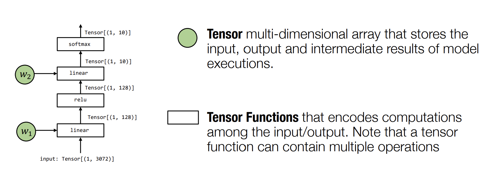
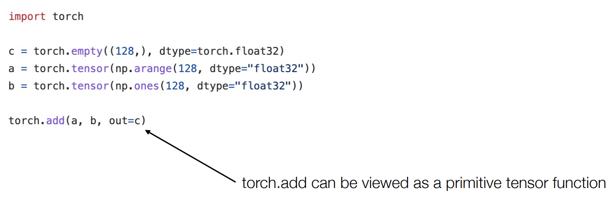
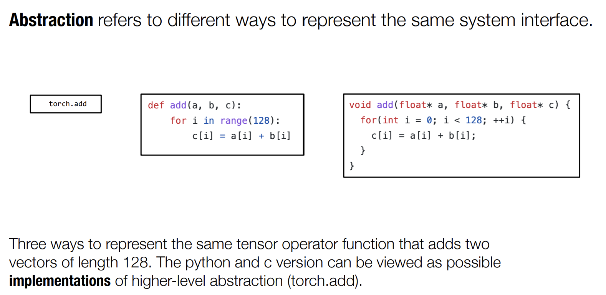
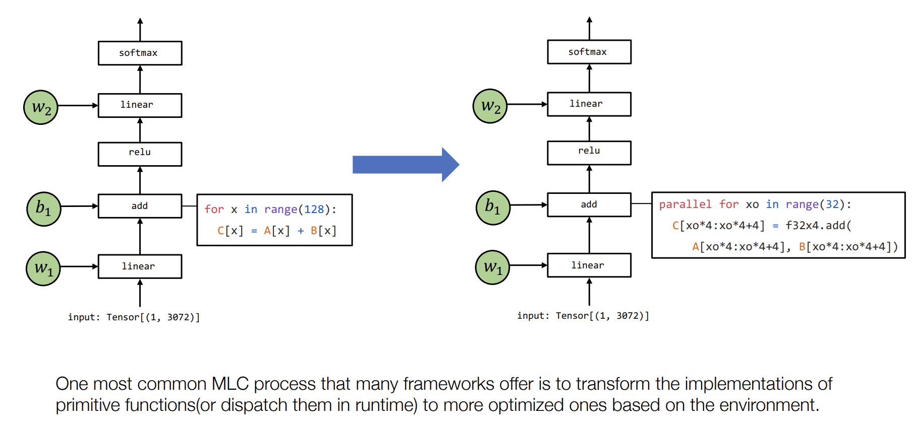
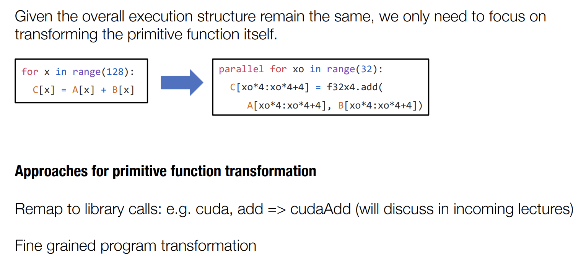

## Tensor Program Abstraction
https://youtu.be/H0UrECDLHMc

Các thành tố cơ bản của MLC (biên dịch học máy) bao gồm:
- __Tensor__: hay còn gọi là mảng đa chiều dùng để lưu trữ các giá trị đầu vào đầu ra và giá trị trung gian trong quá trình thực thi mô hình.
- __Các hàm trên tensors__: dùng để mã hóa các tính toán giữa đầu vào và đầu ra. Lưu ý rằng một hàm tensor có thể có nhiều các phép tính.

Và 2 thành tố này thực sự là những thành tố chính mà bạn dùng trong MLC. Phần lớn thời gian trong MLC chúng ta sẽ nói về làm cách nào có để lấy một tập hợp các hàm (tensors) và biến đổi chúng để nhận được hàm cho kết quả tương tự nhưng tối ưu hơn (tối ưu về tính toán, bộ nhớ, điện năng ... và tài nguyên nói chung), giảm thiểu sự phụ thuộc và đạt được các mục tiêu khác trong MLC.

Trong số các tập hàm tensor đó, chúng ta sẽ xem xét kỹ hơn về primitive steps. Trong ML, hoặc DL, thường liên quan tới vài bước, ví dụ trong NN 2 lớp ở hình trên, chúng ta có lớp tuyến tính đầu tiên, tiếp theo là cộng thêm sai lệch, và tiếp theo là một hàm kích hoạt phi tuyến tính, rồi một lớp tuyến tính nữa, và cuối cùng là softmax (đó là các bước thực thi của 1 NN 2 lớp).

Vậy làm thế nào chúng ta có thể triển khai từng bước cụ thể kể trên? Ví dụ như triển khai add function? Và phần tử cụ thể này được gọi là primitive tensor function (hàm tensor nguyên thủy), hoặc hàm nguyên thủy hoặc trong một số trường hợp nhất định người ta gọi chúng là toán tử tensor, và thông thường đây là các hàm tensors tương ứng với một "đơn vị tính toán" nếu chúng ta xem xét nó từ góc nhìn này từ đầu đến cuối.

Vậy câu hỏi ở đây là, bạn biết đấy, một lần nữa quay trở lại các yếu tố chính của quá trình biên dịch máy học, và ý tưởng trừu tượng hóa và triển khai, câu hỏi cho chúng ta ngày hôm nay là __có những cách khả thi nào để chúng ta biểu diễn một hàm tensor nguyên thủy?__ và __đâu là những cách khả thi chúng ta có thể sử dụng để tối ưu hóa một hàm tensor nguyên thủy?__. 

torch.add có thể được coi là một hàm tensor nguyên thủy.

Sự trừu tượng ám chỉ có thể sử dụng nhiều cách để triển khai cùng một giao diện hệ thống. 3 cách thể hiện của cùng một hàm tensor để cộng 2 vectors có độ dài 128. Phiên bản python và c có thể được coi là thực thi của trừu tượng bậc cao hơn (torch.add).

## MLC via primitive function transformation https://youtu.be/H0UrECDLHMc?t=427

Một cách phổ biến mà MLC thường làm biến đổi thực thi của một hàm nguyên thủy (dispatch them in runtime) đó là tối ưu hóa nó cho từng môi trường cụ thể.

## Primitive function transformation https://youtu.be/H0UrECDLHMc?t=633

