https://yao-lab.github.io/course/msbd5013/2022/slides/Lecture01_introduction.pdf

## Course overview
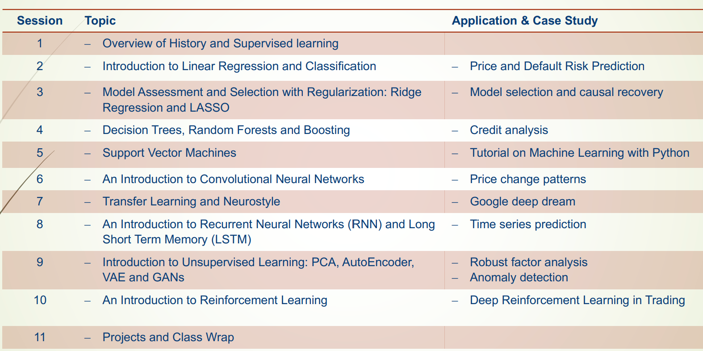

## History of AI

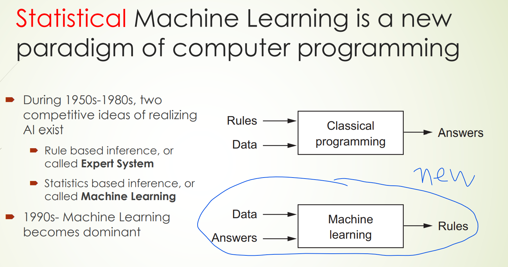

- 1795: First machine learning method: Least Squares
- 1912: Fisher's Maximum Likelihood Principle. The least squares method is maximum likelihood estimate when the noise is Gaussian.
- 1957: First Neural Network: Perceptron. `l(w) = -sum_{i in M_w}y_i<w, x_i>, M_w = {i: y_i<x_i,w> < 0, y_i in {-1,1}` The Perceptron algorithm is a Stochastic Gradient Descent method.
- 1986: MLP and Back-Propagration Algorithms. BP as stochastic gradient descent algorithms.
- 1989: Convolutional Neural Network: shift variances and locality
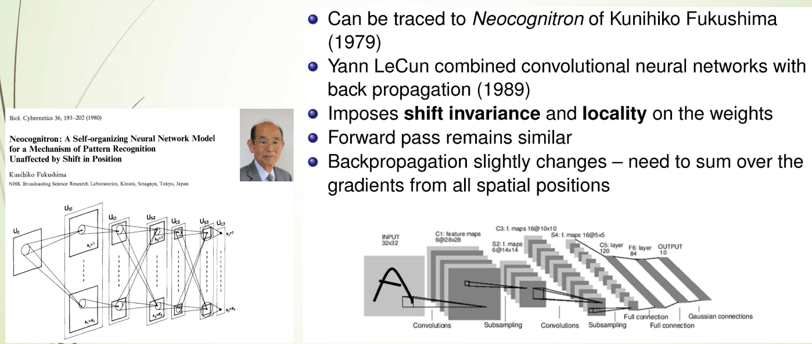

## Time series
- Linear Dynamical Systems (1940s-): Kalman Filter - A linearly transformed Gaussian is a Gaussian. So the distribution over the hidden state given the data so far is Gaussian.
- Hidden Markov Models (1970s-): HMMs have efficient algorithms (Baum-Welch or EM Algorithm) for inference and learning
- RNN (1986-): RNNs are very powerful, because they combine two properties: Distributed hidden state that allows them to store a lot of information about the past efficiently + Non-linear dynamics that allows them to update their hidden state in complicated ways.
- Long-Short-Term-Memory (1997-):

- - 

- 2000-2010: The Era of SVM, Boosting, … as nights of Neural Networks
- Decision Trees and Boosting
- 2012: Return of NN as Deep Learning
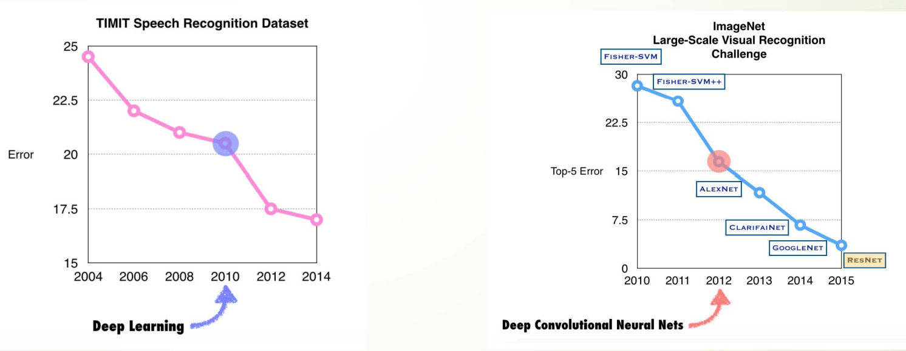

## DL is not perfect
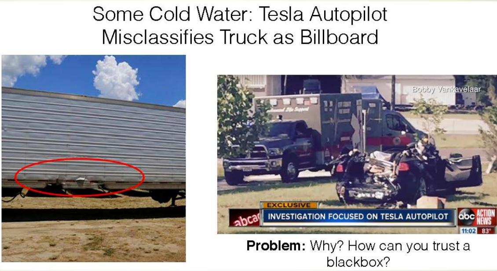
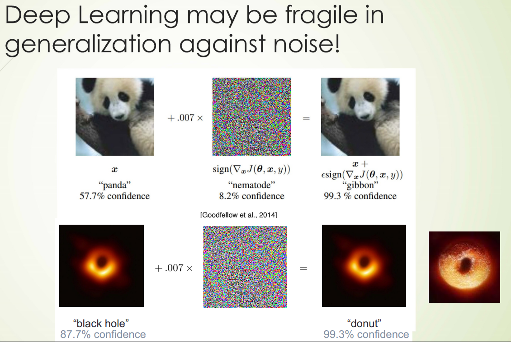

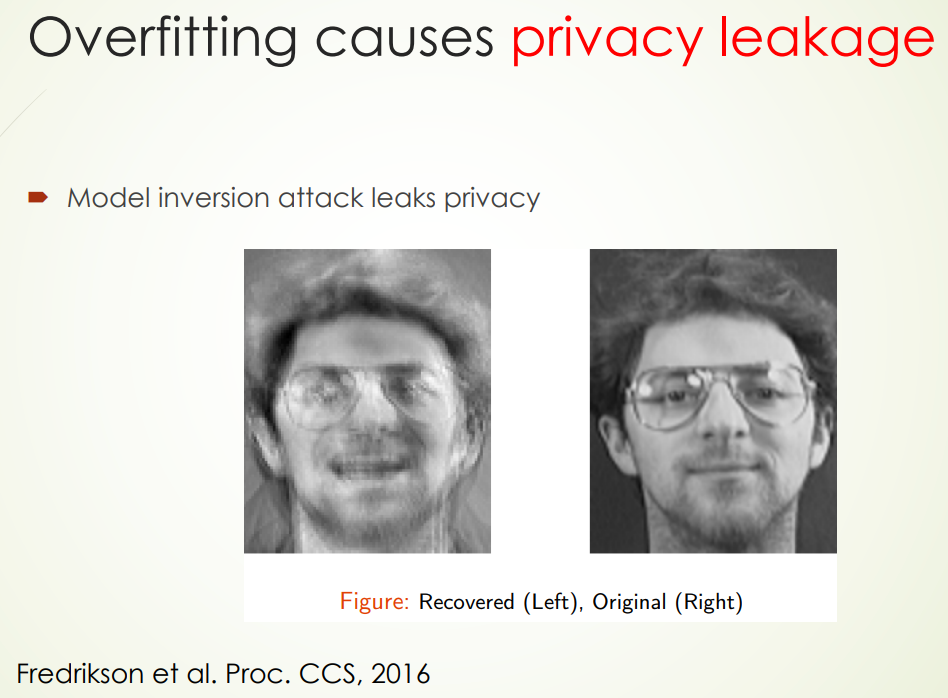

- - -

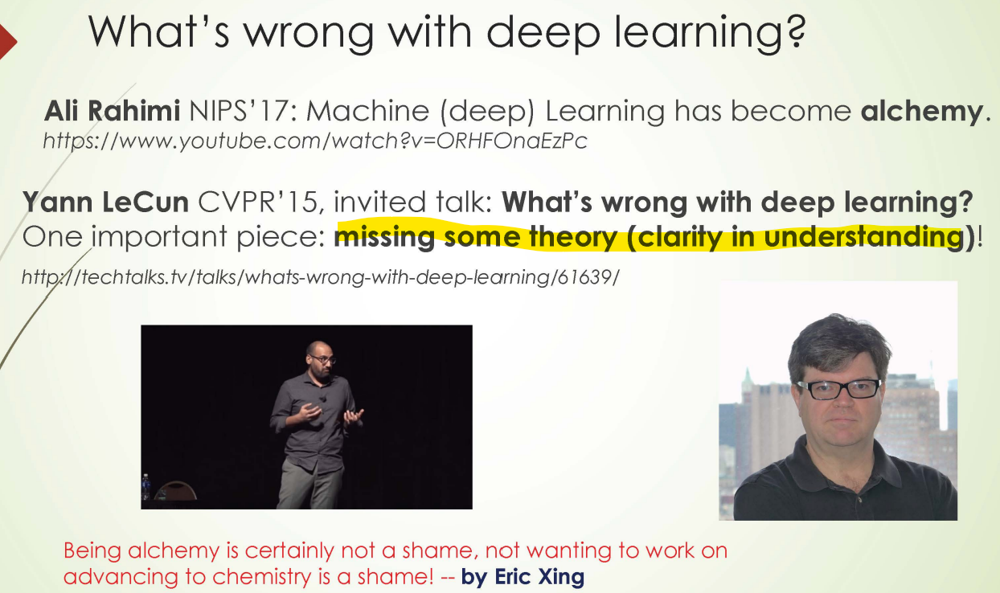

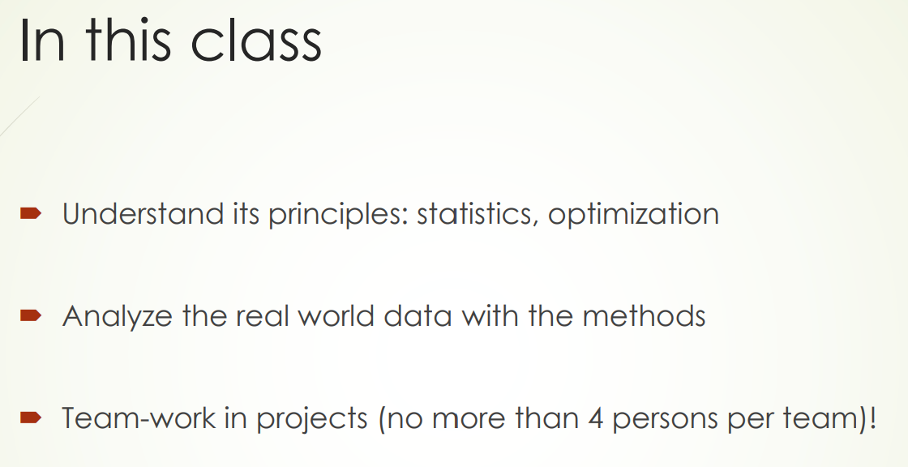

# Overview of Supervised Learning
https://yao-lab.github.io/course/msbd5013/2022/slides/Lecture01_supervised.pdf

## Probability vs. Statistical Machine Learning

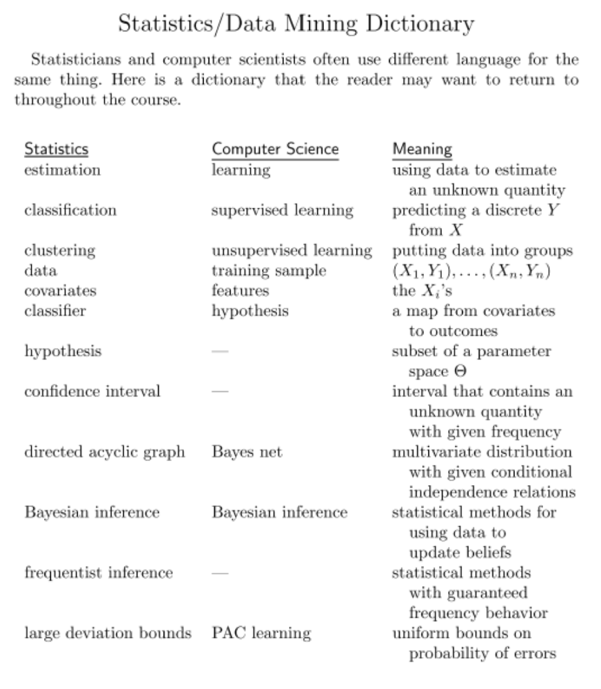
_Figure_: Larry Wasserman’s classification of statistical learning vs. machine learning in Computer Science

## No free lunch in statistics
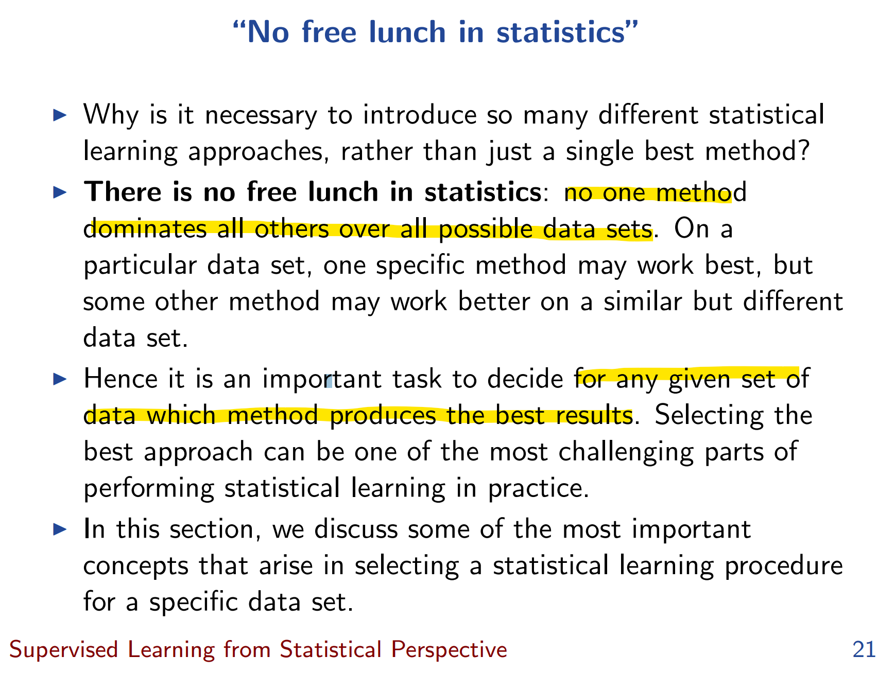

## The Bias-Variance Trade-Off of Prediction Error
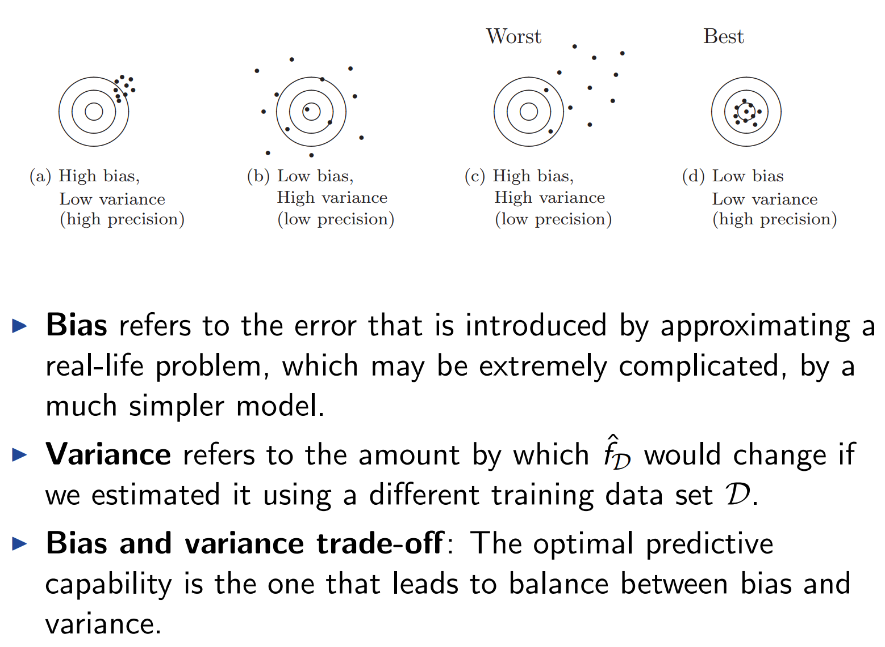

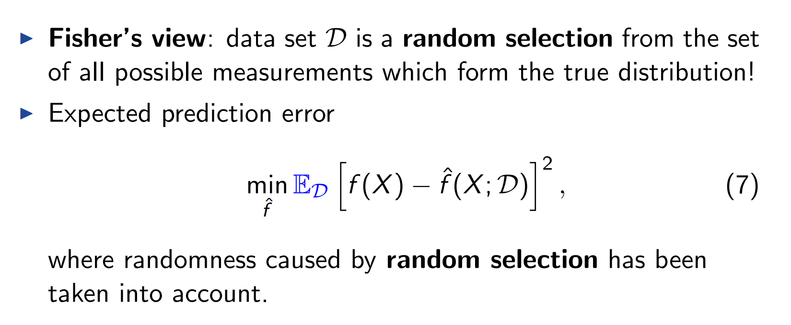

## Bias-variance tradeoff

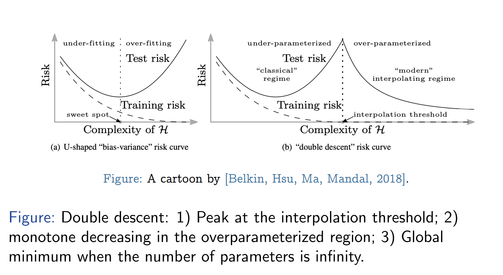

