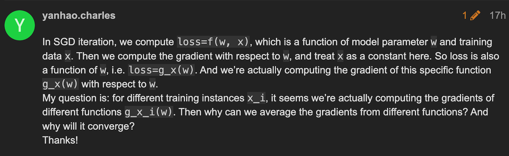

Q: https://forum.dlsyscourse.org/t/help-me-to-understand-why-sgd-works/2024

A: https://www.youtube.com/watch?v=k3AiUhwHQ28

it’s not guaranteed to converge in general, but each update with a single example (or a batch) tends to approach the global minimum (the average - or expected - gradient across many examples/batches is the same as the global gradient). Since the full gradient is expensive to compute for large data, this can actually be more time-efficient than doing full steps

