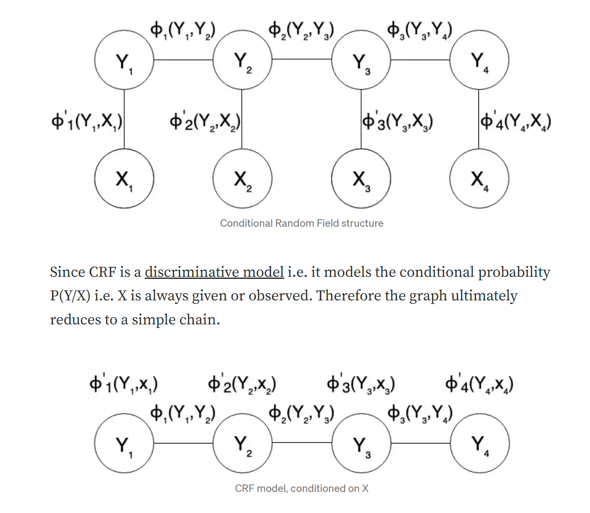

Conditional Random Fields as Recurrent Neural Networks
https://arxiv.org/pdf/1502.03240.pdf

Training Conditional Random Fields with Natural Gradient Descent
https://arxiv.org/pdf/1508.02373.pdf

Learning Large-Scale Conditional Random Fields (PhD Thesis)
http://reports-archive.adm.cs.cmu.edu/anon/ml2013/CMU-ML-13-100.pdf

## Conditional Random Fields Explained
https://towardsdatascience.com/conditional-random-fields-explained-e5b8256da776

Conditional Random Fields is a class of discriminative models best suited to prediction tasks where __contextual information or state of the neighbors affect the current prediction__. CRFs find their applications in named entity recognition, part of speech tagging, gene prediction, noise reduction and object detection problems, to name a few.

