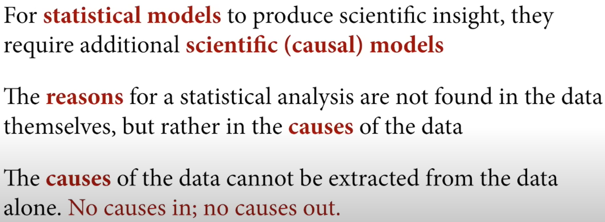

https://youtu.be/FdnMWdICdRs&t=265

## Science before Statistics

Với các mô hình thống kê để có thể tạo ra các insight mang tính khoa học, chúng cần thêm science (causal) models.

Thống kê hay đúng hơn là hoạt động thực sự khó là làm cho số liệu thống kê phục vụ các mục tiêu khoa học, thường thiếu những mô hình khoa học, nhưng chúng ta sẽ không làm điều đó ở đây. Và chúng ta sẽ không làm điều đó bởi vì để các mô hình thống kê, là các thiết bị để xử lý dữ liệu nhằm tạo ra các ước tính để chúng ta tạo ra các thông tin khoa học với cái nhìn thấu suốt, chúng yêu cầu một số kết nối logic vững chắc với các mô hình khoa học và vì vậy chúng ta sẽ vẽ các mô hình khoa học đôi khi được gọi là mô hình quan hệ nhân quả. Và trong một mô hình nhân quả, các mô hình khoa học thay đổi một biến sẽ chỉ thay đổi một vài biến khác, và đó là những gì chúng ta gọi là nguyên nhân. Sự thật là đối với bất kỳ mẫu nào, phân tích thống kê có thể tìm thấy bất kỳ nguyên nhân nào mà nó muốn trong sự vắng mặt của mô hình nhân quả, đó là điều mọi người đôi khi gọi là lý do mà phân tích thống kê không phải tìm thấy trong bản thân dữ liệu, chúng ta không thể lướt qua các con số và đưa ra lý thuyết hoặc ít nhất chúng ta thực sự không nên làm như thế. Phải đưa ra các nguyên nhân để thiết kế mô hình thống kê phù hợp để nó cung cấp các ước tính mà chúng ta đang theo đuổi.

	