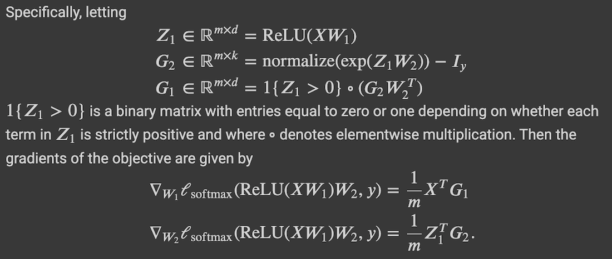
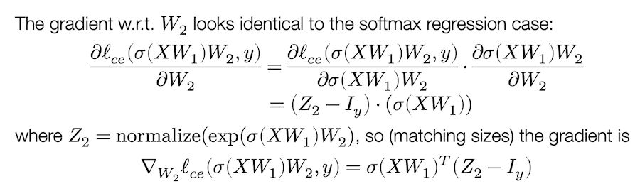
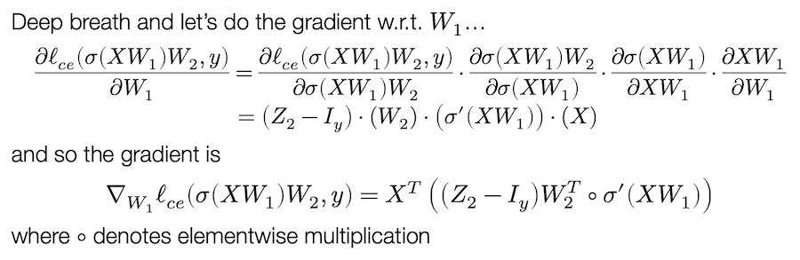
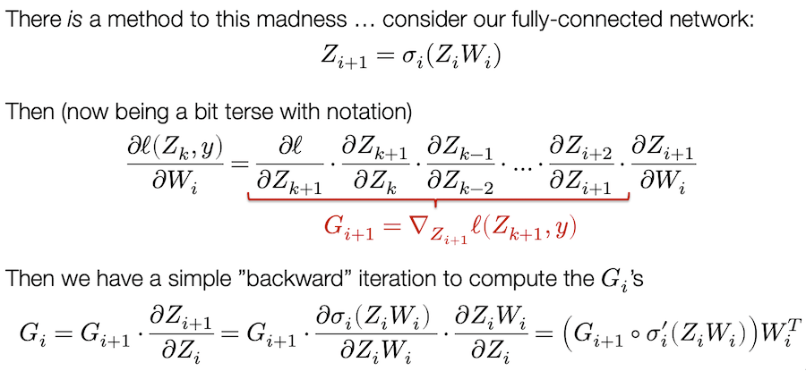
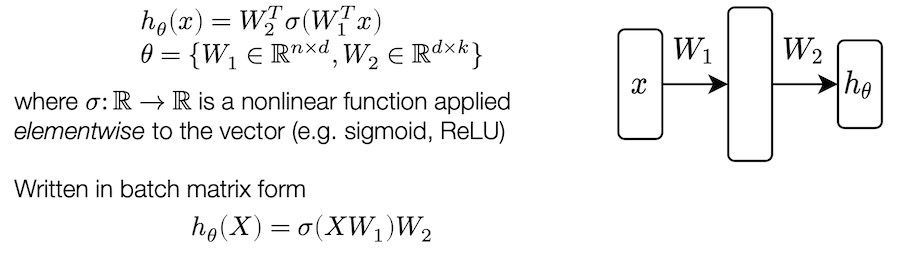
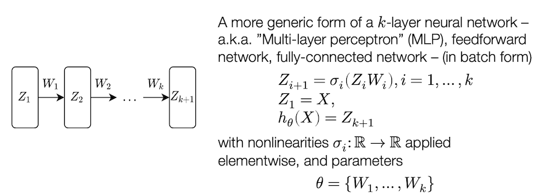

## Công thức để làm hw0 Q5

## [LAN TRUYỀN NGƯỢC](https://www.youtube.com/watch?v=JLg1HkzDsKI)

Nhớ rằng mạng nơ-ron chỉ là 1 trong 3 thành phần của học máy (hàm giả thiết), phần còn lại là hàm mất mát (có thể là cross entropy như bài 02) và một quy trình để tối ưu hóa (có thể là SGD như bài 02).

Hay nói cách khác chúng ta muốn giải quyết bài toán tối thiểu hóa trung bình cộng của hàm mất mát của cross entropy loss của hàm giả thuyết áp dụng cho $m$ vectors của tập huấn luyện và nhãn thực sự của chúng. Chúng ta vẫn sẽ sử dụng SGD và khác biệt ở đây chỉ là thay vì hàm giả thuyết là tuyến tính như ở softmax thì giờ giờ đây chúng là mạng nơ-ron. Có thể là mạng nơ-ron 2 lớp hoặc nhiều lớp (sâu).

Như vậy chúng ta chỉ cần tìm cách tính gradient của hàm mất mát với (từng thành phần của) bộ tham số mô hình theta là hoàn thành được quy trình tối ưu hóa (tìm bộ tham số theta tối thiểu hóa hàm mất mát).

### Quay lại mô hình mạng nơ-ron 2 lớp

theta ở đây là $W_1$ và $W_2$. Ta cần tính đạo hàm:

### Trường hợp tổng quát

- - -

# ["Manual" Neural Networks](https://www.youtube.com/watch?v=OyrqSYJs7NQ)

Mạng nơ-ron (viết tắt là `nn`) ám chỉ một loại lớp giả thuyết, bao gồm nhiều hàm tham số hóa khả vi (còn gọi là “lớp”) được kết hợp với nhau theo bất kỳ cách nào để tạo thành đầu ra.

_Hàm số khả vi: là một hàm có đạo hàm ở tất cả các điểm thuộc miền xác định của nó_

Mạng nơ-ron sâu (deep network) nghĩa là có rất nhiều hàm được kết hợp với nhau (nhiều “lớp”).

## Mạng nơ-ron 2 lớp

Dạng đơn giản nhất của nn:

$h_{\theta}(\x) = W_2^T\sigma(W_1^Tx)$
$\theta = {W_1 \in R^{n \times d}, W_2 \in R^{d \times k}}$

Với $\sigma: R \to R$ là một hàm phi tuyến tính được áp dụng cho từng phần tử của vector (ví dụ `sigmoid`, `ReLU`).

Viết dưới dạng mẻ ma trận: $h_\theta(X)=\sigma(XW_1)W_2$

## Mạng nơ-ron sâu kết nối đầy đủ

