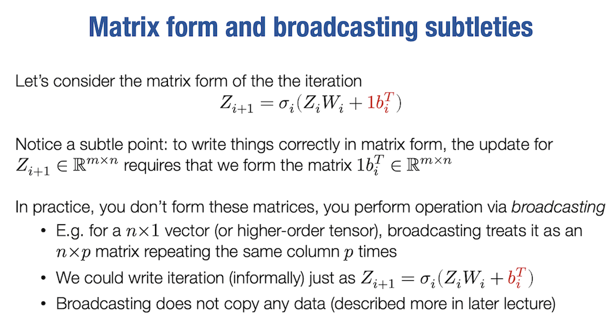

# 06: Fully connected networks, optimization

https://www.youtube.com/watch?v=CukpVt-1PA4

`broadcasting` dùng để phát tán tham số bias $b_i$ vào ma trận $Z_iW_i$

Với mạng nơ-ron $L-tầng$ kết nối đầy đủ (a.k.a MLP) ta có:
- $Z_{i+1} = sigma_i(Z_iW_i + b_i^T), i = 1,...,L$
- $h_theta(X) equiv Z_{L+1}$
- $Z_1 equiv x$
- tham số $theta = {W_{1:L},b_{1:L}}$ với $sigma_i(x)$ là hàm kích hoạt phi tuyến tính$ (ReLU chẳng hạn)

## Key questions for fully connected networks

- Làm thế nào để chọn chiều rộng và chiều sâu của mạng?

- Làm thế nào để thực sự tối ưu hóa hàm mục tiêu? 
  (`SGD` không phải là thuật toán thường được sử dụng nhất trong thực tế)

- Làm thế nào để khởi tạo các trọng số của mạng?

- Làm cách nào để đảm bảo mạng có thể tiếp tục được đào tạo dễ dàng qua nhiều lần lặp tối ưu hóa?

Không có câu trả lời chắc chắn cho những câu hỏi này và đối với học sâu, chúng phụ thuộc vào từng bài toán cụ thể, nhưng cũng có một số nguyên tắc cơ bản chúng ta sẽ đề cập dần.

