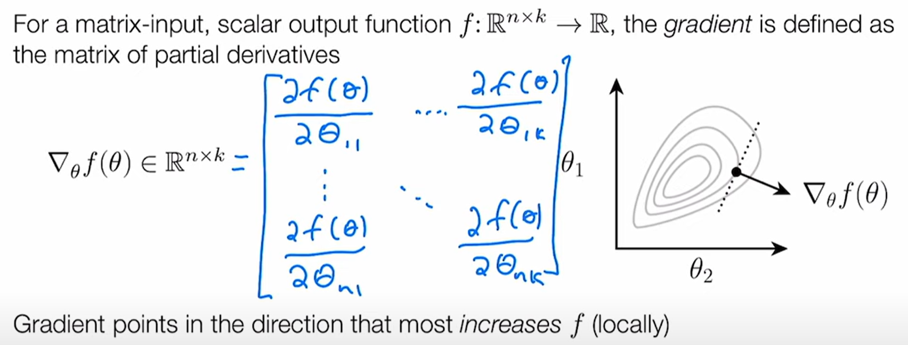
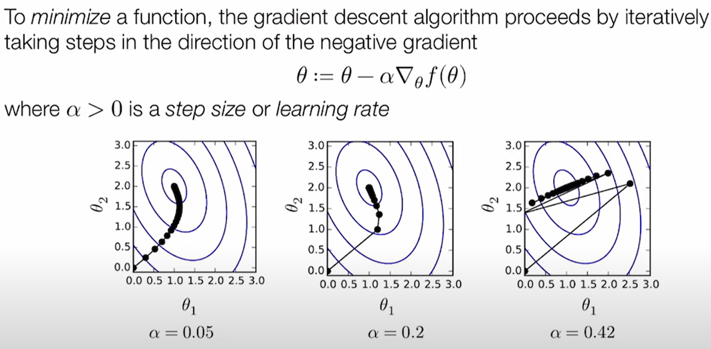
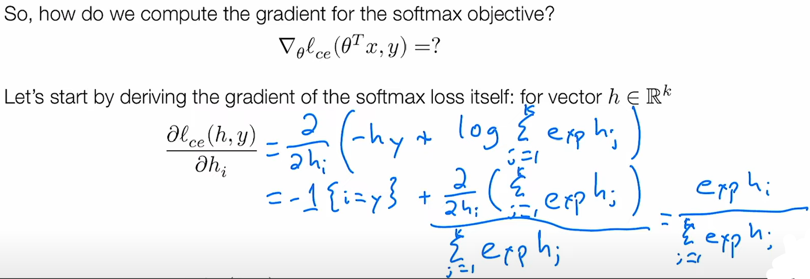
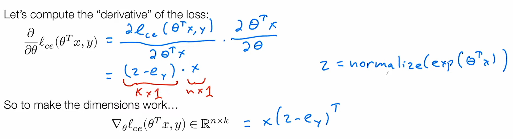

https://www.youtube.com/watch?v=MlivXhZFbNA

## [Loss function](https://youtu.be/MlivXhZFbNA?t=1571)

### Lỗi phân loại

Hàm mất mát đơn giản nhất được dùng trong bài toán phân loại là lỗi phân loại (bộ phân loại làm việc đúng hay sai)

`loss_err(h(x), y) = { 0 if argmax_i{h_i(x)} = y, 1 otherwise }`

Chúng ta thường dùng hàm mất mát này để đánh giá _chất lượng_ của bộ phân loại (độ chính xác)

Tuy nhiên lỗi phân loại là một hàm mất mát tồi khi dùng để tối ưu hóa (tìm ra tham số tốt nhất) vì nó ko khả vi / đạo hàm được
(một hàm số khả vi của một biến số thực là một hàm có  đạo hàm tại tất cả các điểm thuộc miền xác định của n).

https://vi.wikipedia.org/wiki/Hàm_số_khả_vi

### softmax / cross-entropy loss
Hàm trung bình mũ https://vn.got-it.ai/blog/softmax-function-la-gi-tong-quan-ve-softmax-function

`z_i = p(label=i) = exp(h_i(x)) / sum_j=1..k{exp(h_j(x))} <=> Z = normalize(exp(h(x)))`

Hàm Softmax được mượn từ cơ học vật lý và cơ học thống kê. Ở hai môn học này, hàm Softmax được biết đến với tên gọi phân phối Boltzmann và phân phối Gibbs. Nó được trình bày bởi nhà vật lý học và triết học người Úc Ludwig Boltzmann năm 1868.  

Từ định nghĩa về hàm softmax, chúng ta có thể đoán được tính chất của nó. Dưới đây là một vài tính chất của hàm softmax:
- Xác suất sẽ luôn nằm trong khoảng (0:1].
- Tổng tất cả các xác suất bằng 1.

__Giải thích bằng chữ__

Chúng ta muốn chuyển đổi giữa hàm giả thiết đầu ra h(x) - là một ký hiệu mơ hồ của niềm tin - thành một hàm số trông giống như phân bố xác xuất.
Ta định nghĩa xác xuất của một nhãn i là hàm p(label=i), hàm xác xuất này phải là một số dương (>0) và tổng các xác xuất phải là 1, trong khi đó hàm giả thiết h(x) lại có thể là số âm, (note: h(x) mang giá trị một vector là hàm giả thiết của toàn bộ tập nhãn và h_i(x) mang giá trị scalar là hàm giả thiết của nhãn i).

Vậy làm thế nào để chuyển đổi hàm giả thiết thành một hàm luôn lớn hơn 0 và có tổng các phần tử (nhãn) bằng 1?
Ta dùng hàm số mũ exp() để biến nó thành số dương, sau đó chúng ta chuẩn hóa chúng bằng việc chia cho tổng hàm mũ của các giả thiết.
Kết quả cuối cùng ta được một hàm số tuân theo luật xác xuất: 1/ chúng là số dương 2/ tổng các phần tử trong tập bằng 1.

Một cách viết khác là `Z = normalize(exp(h(x))) = softmax(h(x))` Z là chuẩn hóa của hàm mũ của hàm giả thiết.
`exp(h(x))` là việc lấy giá trị mũ của từng phần tử trong vector `h(x)`

- - -

Ta định nghĩa hàm mất mát `loss_ce(h(x),y) = -log{p(label=y)}` (loss_ce: cross-entropy loss)
Như vậy cross-entropy loss được định nghĩa bằng âm của log xác xuất của một lớp là đúng.
Hàm này còn được gọi là softmax loss. Hàm này đã trở thành tiêu chuẩn và được sử dụng rộng rãi nhất trong machine learning.

Triển khai:
`loss_ce(h(x),y) = -log{p(label=y)} = -h_y(x) + log{sum_j=1..k{exp(h_j(x))}}` với k là tổng số nhãn và y thuộc 1..k

h(x) đôi khi được gọi là logits.

> the vector of raw (non-normalized) predictions that a classification model generates, which is ordinarily then passed to a normalization function. If the model is solving a multi-class classification problem, logits typically become an input to the softmax function. The softmax function then generates a vector of (normalized) probabilities with one value for each possible class.
source https://stackoverflow.com/questions/41455101/what-is-the-meaning-of-the-word-logits-in-tensorflow

> logits được dùng để gọi một vector thô (chưa chuẩn hóa) giá trị dự đoán của mà một mô hình phân loại sinh ra, vector thô đó thường sẽ được cho vào một hàm chuẩn hóa. Nếu là bài toán phân loại thông thường, thì logits thường trở thành đầu vào của hàm softmax. Hàm softmax sau đó sẽ sinh ra một vector của các xác suất (đã được chuẩn hóa) tương ứng với từng nhãn (class / label) trong tập nhãn cần phân loại.

- - -

Trong thực tế bạn sẽ không muốn trực tiếp tính giá trị hàm softmax mà là softmax loss `-p(label=y) = -h_y(x) + log(sum_j=1..k{exp(h_j(x))})` với đầu vào là một lớp giả thiết tuyến tính (linear hypothesis class) hay còn gọi là logits.

## Softmax regression optimization problem (bài toán tối ưu hồi quy softmax)
https://youtu.be/MlivXhZFbNA?t=2155

`minimize_theta{1/m * sum_i=1..m{loss(h_theta(x^i), y^i)}}`

__giải thích__: với tập tham số theta, hàm giả thiết h_theta(x^i), tập nhãn đối chiếu y^i, ta cần tìm kiếm trong mọi giá trị có thể của tham số theta để tìm ra một giá trị làm tối thiểu hóa hàm mất mát loss(h_theta(x^i), y^i) (có thể hiểu hàm mất mát ở đây là cross-entropy loss hay còn gọi là softmax loss).

 Hàm trên là tổng quát hóa của mọi thuật toán học máy. Mọi thuật toán học máy bằng một cách này hay cách khác đều cố gắng tìm một tập các tham số làm tối thiểu hóa tổng của mất mát trung bình giữa hàm dự đoán và tập nhãn đối chiếu trên một tập huấn luyện.

 Hàm `minimize_theta{1/m * sum_i=1..m{loss(h_theta(x^i), y^i)}}` bao gồm mọi khía cạch của một thuật toán học máy. Nó bao gồm:
 - hàm giả thiết `h_theta(x^i)`
 - hàm mất mát `l(h_theta(x^i), y^i)`
 - và bài toán tối ưu `minimize_theta`

!!! Bài toán này thực sự là cốt lõi của bài toán học máy !!! Và mọi thuật toán học máy, bằng cách này hay cách khác đều xử lý vấn đề như thế cả. Hay ít nhất là mọi thuật toán học có giám sát.

Sử dụng cross-entropy loss ta triển khai công thức như sau:
`minimize_theta{1/m * sum_i=1..m{ l_ce(theta^T x^i, y^i) }}` và việc giải bài toán này được gọi là softmax regression.

## Gradient descent https://youtu.be/MlivXhZFbNA?t=2360

Chúng ta giải bài toán tối ưu trên bằng một kỹ thuật gọi là gradient descent

Ta có thể coi `1/m * sum_i=1..m{ l_ce(theta^T x^i, y^i) } = f(theta)` là một hàm của theta, và ta muốn tìm giá trị theta có f(theta) là nhỏ nhất.

Ta có thể định nghĩa gradient là một định lượng trỏ tới hướng làm gia tăng giá trị f(địa_phương) nhiều nhất.
Với bài toán mà đầu vào là một ma trận, và đầu ra là một giá trị (scalar) `f: R^{n x k} -> R`, thì gradient là một ma trận của các đạo hàm từng phần (hay đạo hàm riêng) của f(theta), và vì vậy `gradient_theta{f(theta)} belongs_to R^{n x k}` (gradient_theta của f(theta) cũng là ma trận n x k)

Vì theta là một ma trận n x k nên ta ký hiệu theta_ij là giá trị riêng tại hàng i, cột j của ma trận đó.

Ta có:
```
gradient_theta{f(theta)} = [ 
	delta{f(theta)}/delta{theta_11} ... delta{f(theta)}/delta{theta_1k} 
    .							  .
    .						  	     .
    .									.
    delta{f(theta)}/delta{theta_n1} ... delta{f(theta)}/delta{theta_nk}
]
```


_Từ định nghĩa trên ta có thể tìm ra cách để tối ưu hóa hàm mục tiêu_

Để tối thiểu hóa một hàm, thuật toán gradient descent lặp lại việc di chuyển từng bước theo chiều ngược lại của gradient.
`theta := theta - alpha * gradient_theta{f(theta)}` với alpha > 0 được gọi là độ rộng của bước hay tốc độ học (learning rate).


Lưu ý: tốc độ học ảnh hưởng nhiều tới tiến trình học (ảnh trên) !!! Vậy nên việc chọn tốc độ học là quan trọng !!!

## Stochasitc gradient descent

!!! CHIA ĐỂ TRỊ !!! thay vì tính gradient cho toàn bộ tập huấn luyện, ta tính gradient cho một tập nhỏ gọi là mini-batch và update theta dựa trên mini-batch.

Điều này giúp tiết kiệm bộ nhớ và tăng tốc độ cập nhật theta. Và biến thể này được gọi là SGD hay stochastic gradient descent.

Stochastic có nghĩa là khi lấy mẫu ngẫu nhiên mini-batch từ tập huấn luyện thì tập con này có thể được kỳ vọng đại diện cho tập huấn luyện, và gradient của mini-batch đó có thể đại diện cho gradient của toàn bộ tập huấn luyện !!!

## The gradient of softmax objective https://youtu.be/MlivXhZFbNA?t=3377
Tính gradient của hàm mục tiêu softmax, một autodiff framework sẽ giúp chúng ta làm điều đó gần như tự động (sử dụng công thức tính đạo hàm riêng và chain-rule ... ). Nhưng ở đây chúng ta sẽ tính toán bằng tay trước. Có thể hiểu autodiff hay autograd là một cách lập trình được để tính toán gradient của hàm mục tiêu từ các gradient của các công thức thành phần (sử dụng công thức tính đạo hàm riêng và chain rule ...)

Note: Trước khi có autodiff việc tính gradient của hàm mục tiêu phải làm bằng tay (và rất mất thời gian) vậy nên có thể nói autodiff chính là bước ngoặt của trào lưu deep learning, vì nó khiến việc triển khai bất kỳ hàm mục tiêu đạo hàm được (hay models) trở nên dễ dàng hơn rất nhiều.

Làm thế nào để tính gradient của hàm mục tiêu softmax?
`gradient_theta{l_ce(transose(theta)*x, y)} = ?` (transpose(theta) là theta^T chuyển vị của theta để nhân hợp lệ với vector đầu vào x)

Hãy bắt đầu bằng cách tính đạo hàm của hàm mất mát softmax với vector h thuộc R^k (theta^T@x là phép nhân ma trận theta n x k với vector x có n thành phần va trở thành vector h có k thành phần tương ứng với k nhãn cần dự đoán).

Vì h là vector có k thành phần nên ta sẽ tính đạo hàm riêng của từng giá trị h_i.

`delta{l_ce(h,y)} / delta{h_i} = delta{-h_y + log(sum_j=1..k{exp(h_j)})} / delta{h_i}`
với y là nhãn đối chiếu của tập huấn luyện với đầu vào logits h (h được tính từ vector đầu vào x), i và j là một trong k nhãn đầu ra.

`= -delta{h_y}/delta{h_i} + delta{log(sum_j=1..k{exp(h_j)})} / delta{h_i}`

với `-delta{h_y}/delta{h_i}`  là một vector độ dài k với phần tử thứ i bằng -1 với y == i và bằng 0 với y != i.


với `delta{log(sum_j=1..k{exp(h_j)})} / delta{h_i}` ta áp dụng chain-rule đạo hàm của log(x) = 1 / x =>
`= (delta{sum_j=1..k{exp(h_j)}} / delta{h_i}) / sum_j=1..k{exp(h_j)}`
`= sum_j=1..k{delta{exp(h_j)} / delta{h_i}} / sum_j=1..k{exp(h_j)}`

Vì ta đang tính đạo hàm riêng của h_i nên `delta{exp(h_j)} / delta{h_i}` sẽ bằng 0 với mọi j ngoại trừ j == i nên:
`= (delta{exp(h_i)} / delta{h_i}) / sum_j=1..k{exp(h_j)` vì đạo hàm của exp(x) = exp(x) nên cuối cùng:

`delta{l_ce(h,y)} / delta{h_i} = -1[y==i] exp(h_i) / sum_j=1..k{exp(h_j)`



`exp(h_i) / sum_j=1..k{exp(h_j)` chính là hàm softmax nên có thể viết:

`delta{l_ce(h,y)} / delta{h_i} = Z - e_y` với `Z = normalize(exp(h))` và `e_y` được gọi là unit basis 

- - -

Quay trở lại bài toán gốc: Làm thế nào để tính gradient của hàm mục tiêu softmax?
`gradient_theta{l_ce(transose(theta)*x, y)} = ?`
Ta có thể áp dụng chain-rule vào giải tích đa biến ... và mọi thứ sẽ trở nên phức tạp.

Cách thứ 2 là tính theo kiểu hacky: giả sử mọi thứ đều là scalar (vô hướng), sử dụng chain rule thông thường, và sau đó rearrange, transpose, ma trận / vector sao cho kích cỡ chúng khớp với nhau và nhớ phải kiểm tra kết quả với numerical gradient (học ở bài sau).


Mẹo ở đây là làm thế nào để biến kết quả đầu ra có kích cỡ khớp với kích cỡ của theta là (n, k)?
Ta dùng phép nhân ma trận vector x có n phần tử với chuyển vị của vector (z - e_y) có k phần tử và thu được một vector có chiều là (n, k) :D
