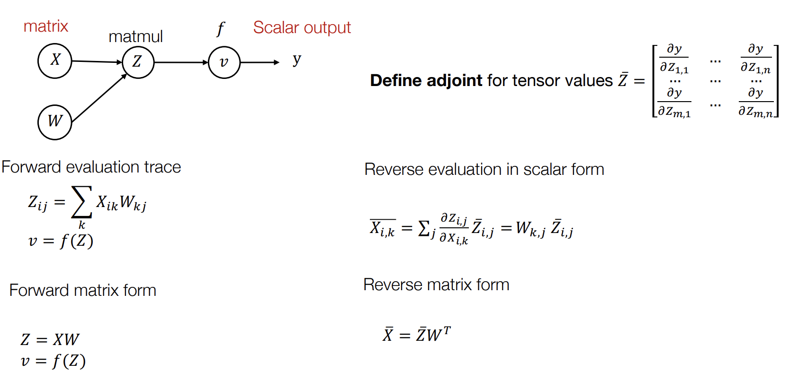

https://youtu.be/56WUlMEeAuA

- Tại sao lại cần autodiff?
- Các phương pháp tính diff khác nhau
- Tìm hiểu vi phân tự động chế độ đảo ngược (reverse mode autodiff) đang được sử dụng trong các DL frameworks hiện đại

Ôn lại kiến thức:

Mọi thuật toán học máy đều bao gồm 3 thành phần: 

- Một hàm giả thiết biến đổi input vector gồm n thành phần thành một vector đầu ra gồm k thành phần tương đương với k nhãn thể hiện niềm tin (belief) hoặc xác xuất để x thuộc về từng nhãn một trong tập k nhãn. theta: tập tham số, h: hàm giả thiết.

- Một hàm mất mát để đo sự khác biệt giữa kết quả dự đoán (hàm giả thiết) với dữ liệu thực tế của tập huấn luyện. y: nhãn của x.

- Và cuối cùng là một phương thức để tối ưu hóa hàm mục tiêu (tối thiểu hóa hàm mất mát). B: training batch size, alpha: learning rate

## Numerical Differentiation
https://youtu.be/56WUlMEeAuA?t=314

Để bắt đầu, hãy suy nghĩ về cách dễ nhất để tính toán gradient. Hãy bắt đầu từ công thức định nghĩa gradient.
`delta{f(theta)} / delta{theta_i} lim{epsilon->0} f(theta + epsilon.e_i) - f(theta) / epsilon`

Hàm f ở đây là hàm mất mát, và chúng ta quan tâm tới đạo hàm riêng cho một tham số trong bộ tham số theta (độ dốc của f với một trục tham số duy nhất), thì chúng ta có thể tính tón toàn bộ gradient (độ dốc). Vậy hãy ghi nhớ định nghĩa của gradient từng phần.

Những gì chúng ta sẽ làm là cố gắng thực hiện một bước nhỏ, ở hướng cao nhất trong không gian tham số. Ở đây e_i là một vector một chiều, là one-hot vector chỉ có 1 giá trị vô hướng bằng 1 còn các giá trị khác là 0. Chúng ta cố gắng thực hiện một bước nhỏ dọc theo chiều đó, và sau đó chúng ta sẽ tính sự khác biệt (hiệu) giữa f(theta + epsilon e_i) trừ đi f(theta) và sau đó ta sẽ chia nó cho kích thước bước epsilon. Như vậy đạo hàm riêng bằng cách giới hạn (lim) của biểu thức trên khi epsilon tiến tới 0.

Với định nghĩa này chúng ta có thể tính toán gradient ra con số, vì vậy chúng ta có thể chọn theta_i, e_i và epsilon, tính (ra con số) f(theta + epsilon e_i) và trừ nó cho f(theta), và sau đó chia cho epsilon. Và nếu bạn chọn một epsilon đủ nhỏ, nó sẽ cung chấp cho bạn con số gần đúng với gradient cần tính. Vì vậy đây còn được gọi là phương pháp vi phân số (numerical different).

Trong thực tế chúng ta sẽ không dùng công thức này, vì có một công thức khác chính xác hơn. Lý do là như ta đã biết về định nghĩa về đạo hàm: `f(theta + delta) = f(theta) + f'(theta)delta + 1/2f''(theta)delta^2 + o(delta^3)`.

Nếu chúng ta thay thế delta = epsilon.e_i và dừng lại ở bậc 2 thì:
`f(theta + epsilon.e_i) = f(theta) + f'(theta)*epsilon.e_i` và
`f(theta + epsilon.e_i) - f(theta) = f'(theta)*epsilon.e_i`
`f(theta + epsilon.e_i) - f(theta) / epsilon = f'(theta)*e_i`
... ???

Dùng biểu thức bậc 2 sẽ chịu lỗi o(epsilon^2) thì lỗi sẽ nhỏ hơn so với sử dụng biểu thức bậc 1 gốc có lỗi là o(epsilon).

Đây là công thức bạn có thể dùng để tính vi phân, nhưng không phải công thức phổ biến được dùng, lý do là, trong nhiều trường hợp nó sẽ chịu ảnh bởi lỗi số, vì trong trường hợp này chúng ta cần epsilon đủ nhỏ để tính gradient. Lý do thứ 2 là với mỗi trục i ở đây, chúng ta cần chạy phép tính f(theta + epsilon_i) cho mỗi trục i, vì vậy bạn có n tham số, và thực tế chúng ta phải chạy 2 x n phép ước tính giá trị của f, điều này thực sự tốn kém. Vì thế đây không phải là công thức được dùng trong thực tế vì nó chịu ảnh hưởng của lỗi số và không hiệu suất tính toán thấp.

Tuy nhiên đây vẫn là công thức được sử dụng rộng rãi trong thực tế cho mục đích khác. Lý do chúng ta muốn sử dụng công thức này là, bởi vì nó thực sự rất đơn giản để tính toán, vì vậy rất dễ để thực hiện nó đúng, với các thuật toán autodiff khác bạn có thể hiểu rất rõ thuật toán nhưng vẫn mắc lỗi khi triển khai, nên chúng ta muốn có một cách đơn giản nào đó để kiểm tra xem liệu chúng ta có triển khai đúng autodiff không? Vì thế vi phân số thường được dùng để kiểm tra các cách tính gradient khác.

Trong thực tế nếu chúng ta tính toán với từng epsilon_i một của toàn bộ theta là sẽ rất tốn kém. Vì thế chúng ta sẽ sử dụng một công thức tổng quát hơn để tính gradient là thay vì cố chọn e_i, chúng ta sẽ chọn một delta vector, và vector này bạn có thể chọn ngẫu nhiên từ quả bóng đơn vị (unit ball is the closed set of points of distance less than or equal to 1 from a fixed central point).

Vì vậy để kiểm tra tính đúng đắn của autodiff tool, đầu tiên ta tính gradient{theta}f(theta) bằng autodiff, rồi chọn delta và tính toán biểu thức bên phải bằng vi phân số và kiểm tra xem 2 kết quả có gần nhau không. Và đôi khi điều đó là đủ để bao phủ tất cả các hướng dốc không. Và nó là cách dùng rất tốt để kiểm tra xem việc triển khai vi phân tự động có đúng hay không.

!!! Bạn sẽ muốn học thuộc công thức này vì nó sẽ được sử dụng trong bài tập về nhà. !!!

Bạn sẽ muốn dùng công thức này để kiểm tra xem cách tính vi phân tự động của mình có đúng không và nó cũng chính là công thức được hầu hết các DL frameworks khác sử dụng.

## Symbolic differentiation
https://youtu.be/56WUlMEeAuA?t=850

Trước khi AD (vi phân tự động) trở nên phổ biến (khoảng năm 2015?), đây là cách tôi vẫn dùng. Và phải làm bằng tay. Làm thế nào để tính nó bằng tay? Chúng ta sẽ viết ra công thức của hàm f này, và chúng ta sẽ cố gắng rút ra một cách tượng trưng (symbolically) hàm gradient trông như thế nào. Và để làm được điều đó chúng ta phải áp dụng một số quy tắc trích xuất gradient, bao gồm quy tắc gradient của phép cộng, phép nhân, và chain-rule khi bạn muốn tính đạo hàm của 2 hàm lồng nhau.

Giả sử với f(theta) = theta_1 * theta_2 ... * theta_n, ta muốn tính gradient theo theta_2 thì gradient sẽ là theta_1 * theta_3 ... * theta_n. Có một vài vấn đề với công thức này: để tính toán từng phần của gradient f(theta) với theta_k, ta cần thực hiện n - 2 phép nhân cho n - 1 toán tử, và phải thực hiện nó cho từng tham số khác. Như vậy cần n*(n-2) phép nhân tất cả. (điều này có thể được thực hiện không ngoan hơn bằng việc tính tích của tất cả các theta_i trước rồi chia cho từng theta_k sau, cần n - 1 phép nhân và n phép chia). Điều này sẽ khiến độ phức tạp tính toán là một hàm bậc 2 với số lượng tham số đầu vào.

Tuy nhiên bạn muốn làm điều đó một cách thông minh hơn, bạn sẽ phát hiện ra rằng để tính toán, gradient từng phần với tất cả theta, ta chỉ cần thực hiện n lần phép nhân ở mỗi bước. Lý do tại sao đạo hàm thủ công này lại tốn nhiều phép tính trùng lặp như vậy, là bởi vì có một số tính toán có thể được sử dụng lại trong số các đạo hàm riêng đó mà không được sử dụng lại bằng cách viết ra dưới dạng ký hiệu. 

Vì vậy, tôi muốn mọi người ghi nhớ điều đó, và bạn muốn giữ câu hỏi đó trong đầu. Chúng ta cũng sẽ nói về các phương pháp vi phân tự động và bạn muốn đặt câu hỏi về mối quan hệ giữa vi phân thủ công (ký hiệu / tượng trưng) và forward / backward vi phân tự động là gì?

Thực sự có một mối liên hệ ở đây, và trong một số trường hợp nhất định, bạn có thể rút ra phương pháp vi phân tự động bằng cách xem chúng như một sự phân biệt ký hiệu công với một số hình thức đơn giản hóa khác.

Hãy ghi nhớ điều đó và chuyển sang phương pháp vi phân tự động đầu tiên.

## Đồ thị tính toán
https://youtu.be/56WUlMEeAuA?t=1121

Đồ thị tính toán là trung tâm của mọi DL frameworks, và nó là một công cụ quan trọng để chúng ta tìm ra vi phân tự động. Đồ thị tính toán là một đồ thị tuần hoàn có hướng, được dùng để biểu diễn phép tính đang được thực hiện cho một hàm nhất định.

Định nghĩa: đồ thị tính toán là biểu diễn các phép tính được thực hiện cho một hàm số nhất định. Trong đó:
- Mỗi node của đồ thị biểu diễu một giá trị trung gian của một phép toán. 
- Cạnh của đồ thị biểu thị quan hệ đầu vào đầu ra của hàm. 

Với một phép toán cụ thể có nhiều cách khác nhau để biểu thị dưới dạng đồ thị tính toán bởi vì có nhiều cách khác nhau để giải quyết cùng một vấn đề.

Mỗi một node tính toán sẽ có các cạnh biểu thị địa chỉ đầu vào của và địa chỉ đầu ra của nó trên đồ thì (đầu ra của phép tính này là đầu vào của phép tính khác). 

## Forward mode AD
https://youtu.be/56WUlMEeAuA?t=1370

Chúng ta sẽ làm quen với phương pháp vi phân tự động đầu tiên được gọi là forward AD.

Giả sử ta cần tính vi phân v_i' = delta{ v_i } / delta{ x_1 }
- v_1 = x_1 = 2 nên 	v_1' = 1
- v_2 = x_2 = 5 nên 	v_2' = 0
- v_3 = ln v_1 nên 		v_3' = v_1' / v_1 = 1/2 = 0.5
- v_4 = v1 x v2 nên 	v_4' = v_1'v_2 + v_2'v1 = 1x5 + 0x2 = 5
- v_5 = sin v_2 nên 	v_5' = v_2' x cos(v_2) = 0 x cos 5 = 0
- v_6 = v_3 + v_4 nên 	v_6' = v_3' + v_4' = 0.5 + 5 = 5.5
- v_7 = v_6 - v_5 nên 	v_7' = v_6' - v_5' = 5.5 - 0 = 5.5
- y = v_7 nên 			y' = v_7' = 5.5
=> delta{y} / delta{x_1} = 5.5

Note: đó là đạo hàm riêng theo x_1. Với x_2 ta cần tính một lần nữa như sau:
- v_1 = x_1 = 2 nên 	v_1' = 0
- v_2 = x_2 = 5 nên 	v_2' = 1
- v_3 = ln v_1 nên 		v_3' = v_1' / v_1 = 0/2 = 0
- v_4 = v1 x v2 nên 	v_4' = v_1'v_2 + v_2'v1 = 0x5 + 1x2 = 2
- v_5 = sin v_2 nên 	v_5' = v_2' x cos(v_2) = 1 x cos 5 = 0.284
- v_6 = v_3 + v_4 nên 	v_6' = v_3' + v_4' = 0 + 2 = 2
- v_7 = v_6 - v_5 nên 	v_7' = v_6' - v_5' = 2 - 0.284 = 1.716
- y = v_7 nên 			y' = v_7' = 1.716
=> delta{y} / delta{x_2} = 1.716

Như vậy với một hàm f: R^n -> R^k, ánh xạ input n chiều sang output k chiều, thì forward AD thực sự tốt nếu n nhỏ và k lớn, vì nó cho phép chúng ta tính toán các giá trị gradients đối với một trong các đầu vào trong một lượt (one pass). Vì vậy nếu đầu vào n nhỏ nhưng tôi có nhiefu đầu ra trong hàm của mình, thì tôi có thể chạy một lượt, để có thể nhận được tất cả các gradient của đầu ra đối với từng đầu vào cụ thể đó.

Tuy nhiên, chúng ta có n tham số đầu vào để có gradient riêng của từng đầu vào đó, thì chúng ta sẽ cần chạy n lượt forward AD (như ở ví vụ trên với 2 đầu vào x_1, x_2 ta cần chạy 2 lượt forward AD). Và trong DL chúng ta chủ yếu quan tâm đến một số đầu ra là 1 giá trị vô hướng (k = 1)

Nhớ rằng hàm mất mát của chúng ta là một đại lượng vô hướng, và rất nhiều bộ tham số đầu vào. Vì thế chúng ta cần một phương pháp khác để giải quyết bài toán này.

## Reverse mode AD (vi phân chế độ đảo ngược)
https://youtu.be/56WUlMEeAuA?t=1785

Ta định nghĩa v_i^bar = delta{y}/delta{v_i}, với y là kết quả cuối cùng của đồ thị tính toán (giá trị vô hướng của hàm mất mát). Và v_i là giá trị của các node trong đồ thị tính toán.
- v_7^bar = delta{y}/delta{v_7} = delta{v_7}/delta{v_7} = 1
- v_6^bar = v_7^bar delta{v_7}/delta{v_6} = v_7^bar * 1 = 1
- v_5^bar = v_7^bar delta{v_7}/delta{v_5} = v_7^bar * -1 = -1
- v_4^bar = v_6^bar delta{v_6^bar}/delta{v_4} = 1 * 1 = 1
- v_3^bar = v_6^bar delta{v_6^bar}/delta{v_3} = 1 * 1 = 1
- v_2^bar = v_5^bar delta{v_5^bar}/delta{v_2} + v_4^bar delta{v_4^bar}/delta{v_2} = -1 * cos(v_2) + 1 * v1 = 1.716 
- v_1^bar = v_4^bar delta{v_4^bar}/delta{v_1} + v_3^bar delta{v_3^bar}/delta{v_1} = 1 * v2 + 1 / v1 = 5 + 1/2 = 5.5

Hãy so sánh cách tính forward AD ở trên ta nhận được 2 kết quả giống hệt nhau:
- delta{y} / delta{x_1} = 5.5
- delta{y} / delta{x_2} = 1.716

Sự khác biệt ở đây là cách tính reverse mode AD hiệu quả hơn nhiều (gấp n lần) !!!

v_i^bar ở đây được gọi là adjoin (liền kề / liên kết), nghĩa là ta tính các giá trị trung gian trước trong đồ thị tính toán trước, rồi lần ngược lại giá trị đầu vào x_i.

## Đạo hàm cho trường hợp đạo hàm của một node có nhiều đường dẫn tới y

Trường hợp một giá trị đầu vào được sử dụng cho nhiều giá trị đầu ra, vậy làm thế nào để tính đạo hàm của giá trị (node) đó?

Đơn giản là tính đạo hàm riêng cho từng đường dẫn rồi cộng chúng lại với nhau (xem công thức tính đạo hàm riêng ở hình trên).

Với minh họa ở hình vẽ trên, ta có thể coi y là một hàm của 2 biến v_2, v3: y = f(v_2, v_3).

Và vì v_1 có liên quan tới cả v_2 và v_3 nên ta sẽ xét từng trường hợp một:
- coi v_3 là hằng số, v_2 là biến số, tính đạo hàm riêng của v_1 có liên quan tới v_2
- coi v_2 là hằng số, v_3 là biến số, tính đạo hàm riêng của v_1 có liên quan tới v_3
rồi cộng tổng lại.

Đây là công thức tính đạo hàm riêng mà bạn cần ghi nhớ !!!

Và cuối cùng ta có thuật toán để tính reverse order AD:

Xem minh họa các bước chạy của thuật toán ở đây https://youtu.be/56WUlMEeAuA?t=2658

Một điều tuyệt vời là khi thực hiện reverse order AD, ta tạo ra một đồ thị tính toán theo chiều ngược (màu đỏ / hình trên), song song với đồ thị tính toán theo chiều xuôi (màu đen), và đồ thị màu đỏ này sử dụng lại các node của đồ thị màu đen khiến cho việc biểu diễn việc tính toán trở nên rõ ràng hơn và sử dụng lại kết quả tính toán tốt hơn.

Note: do sử dụng lại kết quả tính toán ở đồ thị tính toán xuôi nên ta phải giữ nguyên gần như toàn bộ đồ thì xuôi trong bộ nhớ, đó là cái giá về bộ nhớ phải trả cho độ hiệu quả tính toán. Vậy nên với trường hợp mô hình lớn hoặc bộ nhớ nhỏ, ta có thể dùng cách tính toán lại một số nodes trong đồ thị xuông khi đồ thị ngược dùng tới, để giảm bộ nhớ phải lưu trữ. Cân nhắc phụ thuộc vào tài nguyên ta có trong tay: bộ nhớ đắt đỏ hơn hay tính toán đắt đỏ hơn? Bạn sẽ gặp phải bài toán đó khi triển khai dự án cụ thể.

Việc triển khai Reverse order AD dưới dạng đồ thì tính toán cũng giúp chúng ta xử lý linh động hơn, ví dụ giả sử bạn muốn tính gradient của gradient thì sao? Vì mọi thứ là đồ thị tính toán. Ta có thể áp dụng thuật toán tương tự để làm điều đó !!! Bằng cách đó bạn tiếp tục mở rộng đồ thị tính toán để tính toán ra các kết quả bạn mong muốn. Điều này thực sự tuyệt vời.

Cách mở rộng đồ thị tính toán này có thể được sử dụng lại cho các loại giá trị đầu vào khác nhau, mà không phải chạy lại từ đầu các tính toán vi phân từ đầu. Đây chỉ là một lợi thế nhỏ thú vị trong những lợi thế mà thuật toán AD chế độ đảo ngược bằng cách mở rộng đồ thị tính toán mang lại. 

Và đây cũng là thuật toán mà hầu hết các DL frameworks hiện nay dùng.

## Reverse AD vs Backprob
https://youtu.be/56WUlMEeAuA?t=3110

Backprob: run backward operations on the same forward (sử dụng trong 1st-gen DL frameworks như caffe, cuda-convnet)

Tại sao DL framework hiện đại lại tận dụng reverse AD bằng cách mở rộng đồ thị tính toán. Có một số lý do, và cả về tính toán gradient, cũng như mức độ dễ dàng để tối ưu hóa tính toán (đồ thì tính toán giúp dễ caching kết quả trung gian hơn??).

Trước hết chúng ta biết rằng trong một số trường hợp nhất định, bạn có thể muốn thực hiện một số hàm mất mát nhất định liên quan tới gradient. Ví dụ một trong những hàm mất mát điển hình là giảm thiểu v_1^bar bình phương (v_1^bar là đạo hàm của hàm mất mát cho node v_1). Trong trường hợp này những gì ta đang gắng làm là chúng ta muốn xác định một hàm mất mát, lấy một gradient với một đầu vào cụ thể, và chúng ta muốn có thể lấy gradient với một hàm của gradient đó. Vì vậy, trường hợp này đây là một hàm của gradient (tức là phải tính gradient of gradient). Trường hợp này thực sự rất khó làm với backprob, bởi vì lan truyền ngược chỉ xác định cho bạn biết cách tôi sẽ thực hiện gradient đối với đầu vào và vì vậy nó sẽ chỉ biết cách thực hiện việc gradient (từ đen sang đỏ) một lần. Còn về gradient của gradient thì sao?

Trong reverse AD, bằng cách mở rộng đồ thị tính toán, nếu bạn nhìn kỹ vào phần đồ thị màu đỏ, bạn sẽ thấy rằng chúng ta đang lấy một đồ thị tính toán, và kết quả tính toán là một đồ thì tính toán khác. Và vì vậy những gì ta có thể làm ở đây là, chúng ta chỉ cần đính kèm một node khác gọi là square(v_1^bar) và đây vẫn là một đồ thị tính toán nên sau đó chúng ta có thể áp dụng thuật toán tương tự để tính gradient của gradient. Và cứ tiếp  tục như vậy cho tới khi bạn thỏa mãn. theo một nghĩa nào đó bạn sẽ nhận được gradient of gradient miễn phí trong reverse AD bằng cách mở rộng đồ thị tính toán. Và điều này thực sự thú vị của thuật toán đồ thị tính toán và reverse AD.

Lý do thứ 2 tại sao chúng ta lại sử dụng reverse AD, bạn sẽ thấy rằng đầu ra của đồ thị gradient vẫn là một đồ thị tính toán. Vì vậy để đánh giá đồ thị tính toán này, tất cả những gì chúng ta cần quan tâm là, tôi chỉ cần chạy tiếp biểu đồ này. Kết quả là có nhiều cơ hội hơn để thực hiện và tối ưu hóa những tính toán này. Ví dụ với đồ thị ở hình trên, ta có thể gộp 2 nodes v_3^bar và v_2->3^bar vào làm một, vì chúng là các hàm nhận dạng (identity function), sẽ làm cho gradient không đối xứng, không còn có 1 sự tương ứng 1-1 từ tính toán thuận với tính toán gradient, nhưng tính toán gradient có thể trở nên hiệu quả hơn. Vì vậy nó cũng mang lại nhiều cơ hội hơn cho các DL frameworks (để tối ưu hóa ...).

## Reverse mode of AD on Tensors https://youtu.be/56WUlMEeAuA?t=3490

- Đầu tiên cần định nghĩa adjoin cho tensor values Z^bar = ... (hình trên).
- Sau đó sử dụng quy tắc vi phân tự động vô hướng, để rút ra các vi phân tự động, cho các phepts tính ma trận và phép tính tensor này ...

Nhờ vậy reverse AD trên tensors có thể được khái quát hóa, và bạn có thể thấy việc triển khai vẫn hiệu quả như vậy.

## Reverse mode AD on data structures https://youtu.be/56WUlMEeAuA?t=3614

Đôi khi các giá trị trung gian không phải là tensor, và đôi khi chúng ta muốn đặt tensors này trong một cấu trúc dữ liệu hoặc một dạng khác. Ví dụ, chúng ta có thể có một từ điển `d = {"cat": a_0, "dog": a_1}; b = d["cat"]; v = f(b)` với a_1, a_2 là tensors (nó cũng có thể là bất kỳ giá trị nào không phải tensor miễn là vi phân / đạo hàm được).

Để tính gradient cho cấu trúc dữ liệu, ta giữ nguyên cấu trúc dữ liệu đó và với giá trị thì đổi thành adjoin value `d^bar = {"cat": delta{y}/delta{a_0}, "dog": delta{y}/delta{a_1},}` ...

Điểm mấu chốt ở đây là, đối với các loại cấu trúc dữ liệu khác nhau, chúng ta có thể xác định các tính toán liên kết, miễn là chúng ta có thể định nghĩa cho giá trị liên kết và quy tắc lan truyền ngược adjoin. Reverse order AD sẽ hoạt động bình thường cho cấu trúc dữ liệu.

Đây là một trường hợp tổng quát hơn của lập trình khả vi (differentiable programming) mà chúng ta sẽ không thảo luận ở đây. Nếu bạn quan tâm tới khái niệm này, bạn có thể tự tìm hiểu :) Trong phạm vi khóa học, chúng ta chỉ cần hỗ trợ cấu trúc dữ liệu dạng tuple (dùng trong RNN).