# FC networks, optimization, initialization https://youtu.be/CukpVt-1PA4

Fully connected, or multilayer perception (or MLP), 

- `Z_i+1` activation, hoặc lớp mạng thứ i trong L-layer fc network.
- `Z_i+1 = sigma_i(W_i^T Z_i + b_i` với i = 1..L, b_i là bias,
- `h_theta(x) == Z_L+1` tầng cuối của NN hay activation cuối
- `Z_1 == x` vector hoặc batch of vectors (matrix) đầu vào của NN (khi training ta xử lý theo batch)
- Bộ tham số `theta = {W_1:L, b_1:L}`,
- `sigma_i()` là bộ kích hoạt phi tuyến tính, và ở lớp cuối cùng thì sigma_L(x) = x (identity mapping)

Với `Z_i thuộc R^m x n_i`, và vì W_i dùng để chuyển hóa Z_i thành Z_i+1, nên `W_i thuộc R^n_i x n_i+1`, và `b_i thuộc R^n_i+1`.

Với AD framework (bài trước), chúng ta chỉ cần xây dựng NN để thực hiện được forward, và AD sẽ tự động tính backward gradients cho chúng ta. Đó là sức mạnh của AD.

## Matrix form and broadcasting subtleties

Như đã nói ở trên  `Z_i thuộc R^m x n_i`, `W_i thuộc R^n_i x n_i+1`, và `b_i thuộc R^n_i+1`.

Vậy nên để thực hiện được phép cộng `Z_i+1 = sigma_i(Z_i W_i + 1b_i^T)`, một điểm nhỏ cần lưu ý là để update Z_i+1 ta cần thể hiện 1b_i^T dưới dạng ma trận (có số cột và hàng tương đương với số cột và hàng của Z_i+1).

Trong thực tế, bạn không tạo ra ma trận mới mà bạn thực hiện một thao tác gọi là __broadcasting__ tức là bạn coi ma trận m x p như là sự lặp lại của vector có p thành phần. Broadcasting sẽ không tạo thêm bất kỳ data nào.

## Key questions fo FC networks https://youtu.be/CukpVt-1PA4?t=811
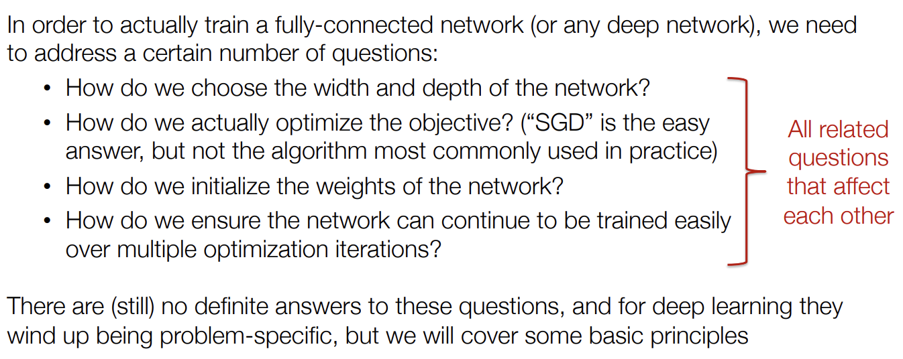

## Optimization
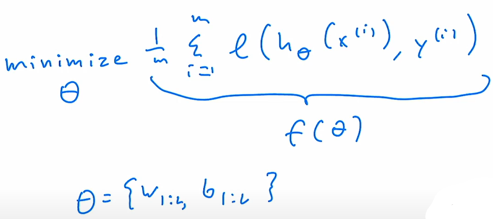

__Gradient descent__
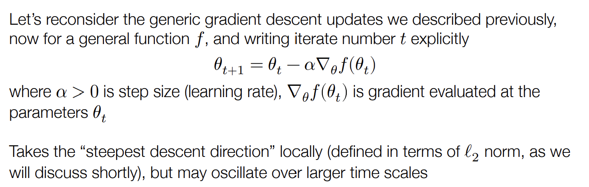

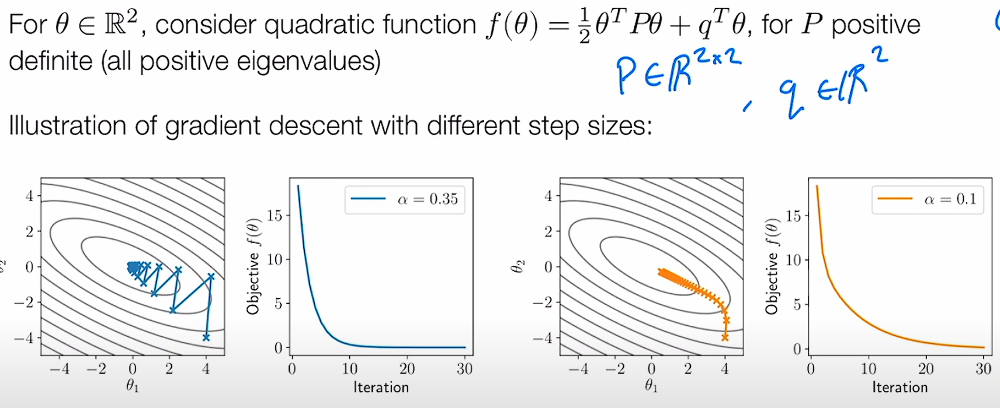
Với theta in R^2, xem xét hàm bậc 2 (quadratic) $f(theta) = 1/2 theta^T P theta + q^T theta$ với P > 0 in R^2x2 matrix, q in R^2.
Như vậy hàm mục tiêu của chúng ta làm một hàm lõm trong không gian 3 chiều, thể hiện dưới dạng các đường đồng mức như ở hình vẽ trên với đáy là nơi có giá trị thấp nhất mà thuật toán gradient descent cần hội tụ về.

Hình bên trái minh họa mức độ hội tụ của hàm mục tiêu f(theta) (loss function) sau từng bước tối ưu với learning rate alpha = 0.35. Như bạn thấy với alpha đủ lớn, tốc độ hội tụ nhanh nhưng khiến các bước nhảy dao động mạnh chung quanh đường dốc tối ưu.

Với alpha = 0.1, nhỏ hơn, thì hàm mục tiêu hội tụ chậm hơn, nhưng không nhảy qua nhảy lại nhiều. Đây là loại đánh đổi chúng ta phải chấp nhận. Chúng ta cần phải quyết định giữa việc chúng ta có muốn hội tụ nhanh chóng không? Chúng ta có muốn cố gắng không để các tham số của mình thay đổi quá nhiều không? Làm thế nào chúng ta có thể đánh đổi các khía cạnh khác nhau của tối ưu hóa?

Hãy tưởng tượng với hàm n chiều, làm thế nào chúng ta có thể chọn step size phù hợp, để các bước nhảy vẫn đủ nhanh mà không lắc lư quá nhiều? Có lẽ chúng ta sẽ phải thử nhiều lần khác nhau để xem chúng hội tụ nhanh như thế nào, xem điều gì đã gây ra sự khác biệt ... Rồi có nên điều chỉnh step size trong quá trình training không? (càng gần điểm tối ưu toàn cục, chúng ta càng muốn có ít sự biến động trong bước nhảy)

Vì thế chúng ta sẽ đề cập tới một số phương pháp để tối ưu hóa hàm mục tiêu này, có thể có tốc độ hội tụ khác nhau hoặc hành vi hội tụ khác nhau. Trước mắt chúng ta hãy tập trung vào hàm bậc 2 đơn giản kể trên. Nó là một hàm lồi đơn giản.

## Newton's method

Tốc độ hội tụ tối ưu nhưng chỉ cho hàm lồi. Vì cần đạo hàm bậc 2 nên không tính toán hiệu quả kể cả khi dùng AD. Và với hàm tối ưu không phải hàm lồi ta không chắc chắn có muốn dùng newton method hay không.

## Momentum https://youtu.be/CukpVt-1PA4?t=2261

Động lượng là một cách để giảm dần tốc độ hội tụ mà chỉ sử dụng hàm bậc một của gradient và có cùng độ phức tạo với gradient.

Ý tưởng cập nhật động lượng, là ngoài việc cập nhật các tham số theta_t+1, chúng ta mang theo một đại lượng nữa gọi là động lượng, u_t+1.

Động lượng sẽ giúp chúng ta cập nhật bộ tham số tốt hơn thay vì chỉ bản thân gradient.

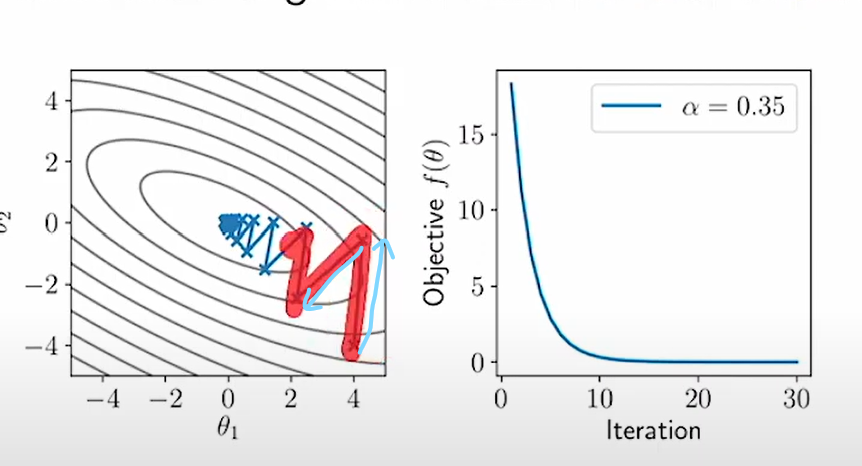

Ý tưởng về động lượng là khi chúng ta giảm dần gradient (độ dốc) và dịch chuyển với kích thước bước chạy lớn, chúng ta sẽ dao động mạnh chung quanh đường tối ưu, ta nhảy qua nhảy lại giữa đường tối ưu với step size giảm dần. Về mặt trực quan, bạn có nghĩ là nên lấy trung bình giữa 2 hướng này (2 đường mũi tên màu xanh) để tìm ra một bản cập nhật tốt hơn?

Đó chính là những gì động lượng làm. Vì vậy động lượng tạo thành vector u, theo nghĩa nào đó là một loại trung bình của gradients. Có rất nhiều kiểu biểu thức để tính động lượng. Nhưng tôi sẽ chọn cách viết dưới đây bởi nó nhấn mạnh thực tế chúng ta đang cố gắng tính trung bình giữa các tham số và nó cũng giữ động lượng theo tỷ lệ tương tự như gradient $u_t+1 = beta u_t + (1 - beta) gradient $ với $0 < beta < 1$ là một đại lượng để scale down. Và sẽ update tham số $theta_t+1 = theta_t - alpha u_t+1$ với alpha là learning rate. Nó còn đưuọc gọi là động lượng Polyak ...

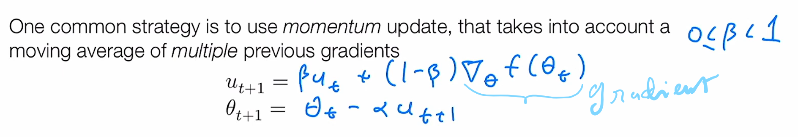

Bạn thấy đấy, động lượng u_t+1 là một hàm trung bình của các giá trị gradients trong các bước trước. Ta sẽ duỗi công thức trính động lượng theo thời gian như sau: $u_t+1 = (1-beta)gradient_t + beta(1-beta)gradient_t-1 + beta^2(1-beta)gradient_t-2 + ...$

Nó thực sự đang tính trung bình các gradients theo thời gian với độ ảnh hưởng giảm dần theo khoảng các thời gian beta^k với k là khoảng cách bước cập nhật.

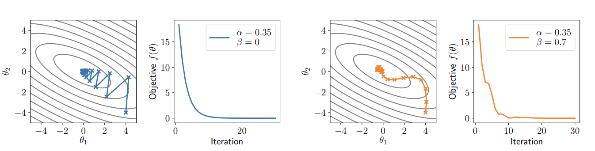

Với beta = 0 chúng ta có các bước cập nhật bị xáo động nhiều như cũ. Cùng learning rate nhưng beta = 0.7, thì ta có một đường cập nhật (màu vàng) đã mịn hơn (không dao động quá nhiều nữa), cảm giác giống như một quả bóng nặng lúc đầu vừa di chuyển theo quán tính của một gradient khởi đầu lớn cộng thêm ảnh hưởng của trọng lực kéo về phía hõm nhất của hàm lồi.

Để hội tụ nhanh hơn nữa chúng ta có thể sử dụng unbiasing momentum terms.
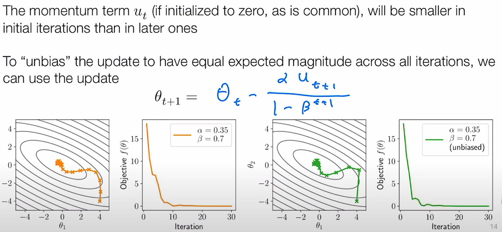

## Nesterov Momentum
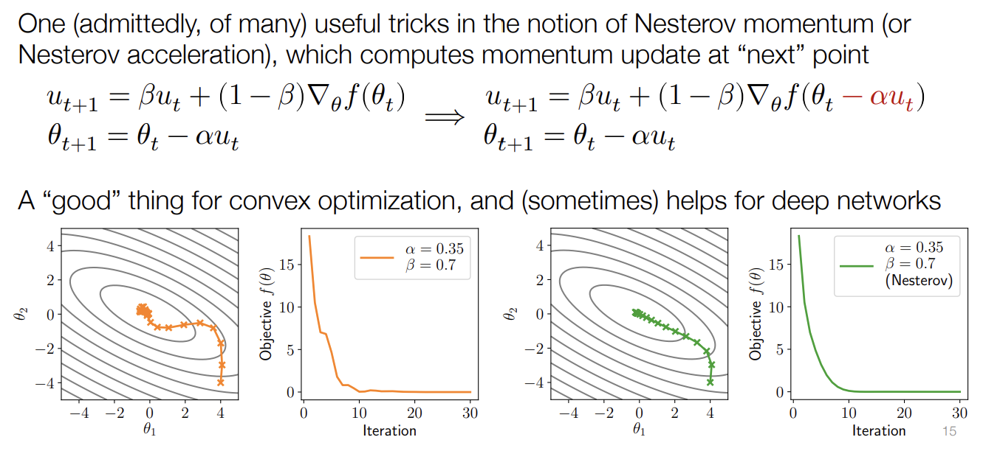


## Adam https://youtu.be/CukpVt-1PA4?t=3166

Trong lịch sử DL rất nhiều pp tối ưu đã xuất hiện rồi biến nhất vì đã trở nên không hợp thời. Adam tồn tại qua thời gian, như một trong những phương pháp mà mọi người đều công nhận. Hiện tại Adam và pure SGD với động lượng, có lẽ là hai công cụ tối ưu hóa mà bạn thực sự cần để hiểu về thực hành DL. Vì thế Adam thực sự là một thuật toán thành công.

Adam tính để scale of parmas (tỷ lệ các tham số) mà bạn quan tâm có thể khác nhau. Cả tỷ lệ tham số và tỷ lệ của gradient có thể thay đổi trong quá trình tối ưu hóa. Minh họa: ở đường màu xanh lá cây ở hình trên, bạn sẽ thấy tốc độ thay đổi của theta_1 và theta_2 là khác nhau trong quá trình cập nhật bộ tham số.

Nhận thấy: tỉ trọng gradient thay đổi (lớn) theo các chiều / bộ tham số khác nhau, đặc biệt là có sự thay đổi lớn giữa các layer của deep network, giữa các layer khác nhau ... Vì thế adaptive gradient (độ dốc thích nghi) cố gắng ước lượng tỉ trọng này qua mỗi lần cập nhật tham số, và sau đó re-scale the gradient update according. Adam là một adaptive gradient method phổ biến nhất trong DL, nó kết hợp cả động lượng (momentum) và adaptive scale estimation.
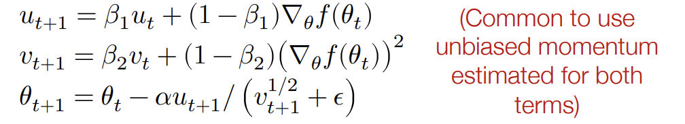

Khác biệt ở đây thay vì sử dụng một động lượng, ta sẽ sử dụng 2 động lượng, một thuật ngữ động lượng để ghi lại gradient, một thuật ngữ động lượng khác để ghi lại square of gradient như là độ lớn của gradient, v_t tính toán trung bình chạy (running avg) of square of gradient.

__Adam khi code thực tế__
```py
# weight_decay = 0 thì grad = w.grad
grad = w.grad.cached_data + w.cached_data * self.weight_decay

self.u[w] = self.beta1*self.u[w] + (1-self.beta1)*grad
self.v[w] = self.beta2*self.v[w] + (1-self.beta2)*(grad**2)

u_hat = self.u[w] / (1 - (self.beta1 ** self.iter))
v_hat = self.v[w] / (1 - (self.beta2 ** self.iter))

update = u_hat / ((v_hat ** 0.5) + self.eps)
w.cached_data -= self.lr * update
```

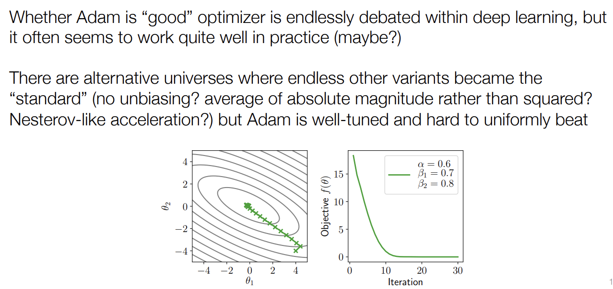

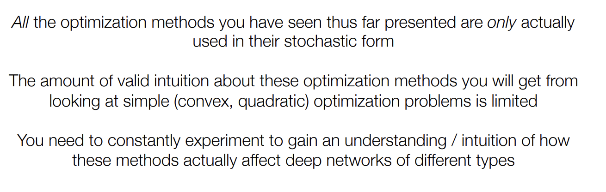
