## Khởi tạo tham số https://youtu.be/CukpVt-1PA4?t=4194
Ôn lại bài trước, ta có công thức cập nhật trọng số bằng SGD
`W_i := W_i - alpha gradient_{W_i} l(h_theta(X),y)`

Vấn đề ở đây là với i = 1, ta khởi tạo trọng số của W_i, b_i như thế nào? set toàn bộ = 0?

Ôn lại công thức backprob mà không dùng bias:
- `Z_i+1 = sigma_i(W_i Z_i)`
- `G_i = (G_i+1 sigma_i'(Z_i W_i)) W_iT^`

Nếu W_i = 0 thì G_j = 0 for j <= i => gradient_{W_i} l(h_theta(X),y) = 0 => tham số không được cập nhật.
Vậy nên khởi tạo W_i = 0 là một lựa chọn vô cùng tồi.

## Key idea #1: cách khởi tạo tham số thực sự ảnh hưởng tới quá trình huấn luyện

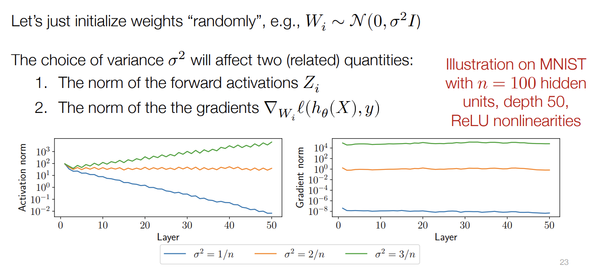

Khởi tạo tham số ngẫu nhiên, normal distribution with mean = 0 và phương sai (covariant sigma^2) khác nhau (nếu không có cách nào khác hay hơn thì hãy cứ khởi tạo ngẫu nhiên). Khi viết `W_i = N(0, sigma^2 I)` có nghĩa là mỗi thành phần (scalar) của trọng số được lấy mẫu theo một phân bố Gaussian độc lập, với phương sai sigma^2.

Điểm quan trọng ở đây là, sự lựa chọn phương sai không phải là thứ bạn bạn có thể tùy ý lựa chọn và tất cả chúng đều hoạt động tốt. Việc lựa chọn phương sai có ý nghĩa rất lớn đối với hiệu suất và kết quả cập nhật trọng số, độ lớn của gradients tất cả những thứ khác trong NN.

Xem minh họa ở hình trên, với tập dữ liệu MNIST và mạng NN có 50 layers, và hàm kích hoạt ReLU. Chuẩn hóa của các kích hoạt (norm of Z_i term) khi chúng lan tỏa qua các layers của mạng. Và như bạn thấy với 3 giá trị khác nhau của phương sai sigma^2 lần lượt là 1/n, 2/n, và 3/n. Chúng ta thấy mỗi lựa chọn phương sai sẽ dẫn đến hiệu suất rất khác nhau hay là các loại hành vi rất khác nhau.
- Với phương sai sigma^2 = 2/n, các chuẩn kích hoạt gần như bằng nhau, gradient norm gần như bằng 1,
- Với phương sai sigma^2 = 3/n, các chuẩn kích hoạt tăng lên, và gradient cũng lớn hơn
- Với phương sai sigma^2 = 1/n, các chuẩn kích hoạt giảm xuống, và gradient cũng nhỏ đi

Lưu ý rằng với việc tối ưu hóa hàm lồi truyền thống việc khởi tạo tham số thường không có ảnh hưởng lớn như ở đây:
- 0 không hoạt động
- ngẫn nhiên chỉ hoạt động khi bạn chọn phương sai phù hợp

## Key idea #2: weights don't move "that much"

Với quá trình tối ưu hóa, bạn sẽ hình dung trong đầu các tham số của mạng sẽ hội tụ về một vùng điểm nhất định cho dù được khởi tạo như thế nào. Điều này là không đúng, trọng số có di chuyển nhưng chỉ ở rất gần điểm khởi tạo thay vì điểm tối ưu cuối.

__Kết luận cuối cùng__: khởi tạo thực sự quan trọng !!! 

Quay trở lại minh họa này, tôi muốn giải thích rằng tại sao 2/n lại là phương sai phù hợp, và làm thế nào điều này có thể motivate việc chúng ta nên khởi tạo trọng số ntn?

Ý tưởng là khi chúng ta nghĩ về các trọng số được khởi tạo ngẫu nhiên, thì hóa ra chúng ta thực sự có thể nghĩ về loại sản phẩm hoặc nghĩ về các số hạng trung gian trong một mảng theo cách lỏng lẻo, bởi vì điều này không chính xác tuyệt đối - chúng ta có thể coi chúng đại khái như một loại biến ngẫu nhiên có trung bình và phương sai nào đó. Và với bất kỳ phân phối xác suất nào, khi tính trung bình cộng tất cả chúng lại với nhau, thì trung bình đó được coi là một biến ngẫu nhiên mới, bạn biết đấy, sẽ tiệm cần Gaussian, nếu bạn có scaling phù hợp, ... 

Một cách không chính thức, hãy coi tất cả các khía cạnh trung gian trong mạng là giống như các biến ngẫu nhiên thông thường, và chúng ta muốn xem điều gì xảy ra ở đây. Vì vậy hãy nghĩ về đầu vào của mạng là x ~ N(0,1), và trọng số W ~ N(0,1/n), khi đó kỳ vọng về tích của x và W, bởi chúng là các biến ngẫu nhiên độc lập, nên `E[x_i W_i] = E[X_i]E[W_i] = 0` và vì chúng độc lập nên phương sai của tích của chúng là `Var[x_i W_i] = Var[X_i] Var[W_i] = 1 * 1/n = 1/n`. Tương tự như thế `E[W^T x] = 0` và `Var[W^T x] = 1` (W^T x -> N(0,1) bởi thuyết giới hạn trung tâm - central limit theorem). Với `W^T x = sum_i=1..n(x_i W_i)`.

Vì thế một cách không chính thức, nếu chúng ta sử dụng linear activation và với Z_i ~ N(0, I), W_i ~ N(0, 1/n I) thì `Z_i+1 = W_i^T Z_i ~ N(0, I)`. 

Nếu chúng ta sử dụng hàm kích hoạt ReLU thì một nửa của các thành phần của Z_i sẽ bị set to 0, vì thế __để duy trì sự ổn định của activation từ layer này sang layer khác__, chúng ta cần gấp đôi phương sai của W_i để có thể đạt được phương sai cuối cùng giống trường hợp kích hoạt tuyến tính (linear activation), và vì thế `W_i ~ N(0, 2/n I)` (Kaiming normal initialization). Và nó là một trong những cách khởi tạo mạng tiêu chuẩn.

# Chuẩn hóa và bình thường hóa https://youtu.be/ky7qiKyZmnE

- Chuẩn hóa
- Bình thường hóa
- Sự tương quan giữa tối ưu hóa, khởi tạo, bình thường hóa, và chuẩn hóa.

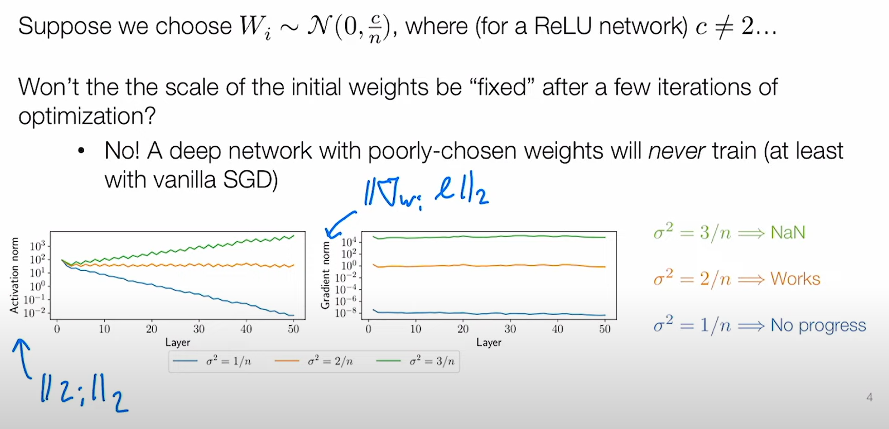

Ôn lại bài trước, chúng ta biết rằng việc khởi tạo trọng số cho một mạng sâu là rất quan trọng. Với khởi tạo là Gaussian random, nhớ là chúng ta thường khởi tạo các trọng số một cách ngẫu nhiên có thể là biến ngẫu nhiên đồng nhất (uniform) hoặc biến ngẫu nhiên Gaussian, ở đây, phương sai của biến ngẫu nhiên Gaussian này có ảnh hưởng rất lớn. Ở hình trên, phương sai sigma^2 = c / n, với c là đại lượng scale. Scale này không được tự động điều chỉnh qua các lần tối ưu mà trực tiếp ảnh hưởng tới nó, nhất là ở các layers sau. Như bạn thấy ở hình minh họa trên, với c = 3, activation norm đi tăng lên rất nhanh ở các layer sau dẫn tới các giá trị của trọng số trở thành NaN (quá tải). Còn với c = 1 thì các activation norm giảm đi rất nhanh ở các layer sau dẫn tới tình trạng không học được gì (trọng số không thay đổi).

Việc khởi tạo trọng số khác nhau sẽ dẫn tới các hành vi cập nhật trọng số khác nhau. Hình minh họa ở trên là việc huấn luyện MNIST bằng một mạng sâu 50 lớp, được biểu diễn ở trục hoành của đồ thị, trục tung của đồ thị biểu diễn activation norm của layer đó, tức là `||Z_i||_2` (chuẩn bậc 2) của layer thứ i.

Với độ dốc (gradient), `||gradient{W_i} k||_2`, chúng gần như tĩnh, công thức tính gradient, phải sử dụng cả backward pass và forward pass để tính gradients với từng bộ trọng số W_i, and term cancel, such that these things actually remain constant throughout the whole network (ko hiểu). Việc gradient norm gần như tĩnh giải thích việc để duy trì đường màu vàng ổn định ở hình trên bên trái (activation norm), mà `Z_i+1 = sigma_i(Z_i W_i)` và W_i được cập nhật dựa vào gradient (đường màu vàng bên phải), nên để activation norm ổn định thì gradient norm phải loanh quanh ở ngưỡng giá trị rất nhỏ (xấp xỉ 1 = 10^0). Còn với gradient norm quá lớn hoặc quá nhỏ sẽ làm hỏng quá trình tối ưu (bị tràn số NaN), hoặc gradient quá nhỏ => chẳng học được gì. Và ảnh hưởng của việc khởi tạo tham số, là không đổi đối với toàn bộ (layers của) mạng.

Như vậy việc khởi tạo trọng số là quan trọng đối với việc tối ưu hóa tham số, bởi vì nếu khởi tạo không đúng mạng của chúng ta sẽ không bao giờ được huấn luyện, kể cả chúng ta có lặp đi lặp lại bao nhiêu bước huấn luyện đi chăng nữa chúng sẽ không bao giờ được huấn luyện hoặc tràn số (có thể nói huấn luyện mạng sâu là khó!). Và tôi muốn nhấn mạnh rằng vấn đề này thực sự sâu hơn nhiều so với ví dụ đơn giản ở trên (một là tràn số, hai là không được huấn luyện). Bởi vì trên thực tế, hóa ra là nếu ta khởi tạo mọi thứ ở quy mô hẹp hơn, thì chúng ta cũng nhận được những hiệu ứng tương tự như ở trên.

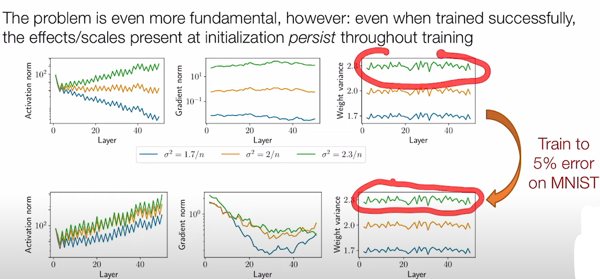

Trong trường hợp trên, chúng ta hiển thị thêm 3 ví dụ với cách khởi tạo khác nhau với phương sai 1.7 / n, nhỏ hơn 2 một chút, 2 / n như trước, và 2.3 / n, và những mạng này thực sự được huấn luyện, chúng ta sẽ huấn luyện chúng tới một mức độ nhất định, ở đây là 5% error on MNIST.

Hành vi tôi muốn nhấn mạnh ở đây là, hay hiệu ứng bạn có khi khởi tạo, chúng tồn tại trong toàn bộ mạng. Những gì bạn thấy ở đây là có rất nhiều, hiệu ứng thú vị ở đây. Bạn sẽ thấy các activation norm thực sự thay đổi so với minh họa trước đó. Vì vậy bạn có các kích hoạt ở các layers sau thực sự lớn hơn trước (một chút). Và đường activation norm màu blue vẫn thấp hơn một chút so với các kích hoạt khác. Những thứ đó theo một nghĩa nào đó trở nên khá giống nhau. Gradient cũng thay đổi theo các layers, và một vài hiệu ứng do khởi tạo khác nhau chúng cũng tương tự (như activation norm?).

Điểm tôi thực sự muốn nhấn mạnh ở đây là một điểm thú vị, và tôi thấy điều này, rất đáng ngạc nhiên. Nó không ảnh hưởng tới độ chính xác của mạnh, nhưng điểm mà tôi muốn nhấn mạnh ở đây là nếu bạn nhìn vào các tập trọng số sau khi được huấn luyện, bạn không thể phân biệt giữa 2 con số này (không có sự khác biệt giữa weight variance trong quá trình huấn luyện). Tôi thực sự đã phải kiểm tra nhiều lần để đảm bảo không có nhầm lẫn ở đây, bởi vì tôi luôn thấy điều này rất đáng ngạc nhiên:

!!! Khi bạn huấn luyện một mạng sâu, hóa ra trọng số của bạn thay đổi rất ít so với giá trị khởi tạo ban đầu của chúng. Ý tôi là trọng số rõ ràng có thay đổi, những giá trị này là khác nhau. Tôi chỉ đang vẽ lại phương sai của chúng qua các layers khác nhau, và 2 đường này (khoang màu đỏ ở hình trên) là gần như không phân biệt được (rất giống nhau). Vấn đề không phải là trọng số không thay đổi, trọng số chắc chắn có thay đổi. Nhưng theo một nghĩa nào đó chúng thay đổi ở một mức độ tương đối nhỏ, so với khởi tạo ban đầu, ít nhất là với mạng sâu này được đào tạo với SGD.

Điều này không phải lúc nào cũng xảy ra, có một số trường hợp có khả năng bạn nhận được nhiều hơn, và nếu bạn nhìn vào một số kích thước nhất định, và đây chỉ là biểu đồ norm của chúng, nên hướng của các trọng số vẫn có thể thay đổi, trong khi vẫn giữ một norm không đổi. Nhưng đây thực sự là một hiệu ứng rất thú vị của mạng sâu, và nó thách thức cách hiểu thông thường của chúng ta về tối ưu hóa, và cách các trọng số được cập nhật trong quá trình tối ưu. Và những thứ đó phải được lưu ý khi bạn nghĩ về các mạng sâu. 

!!! Vậy ta phải làm gì? Điểm chính tôi muốn nhấn mạnh ở đây là khởi tạo thực sự quan trọng. Và nó quan trọng bởi nó ảnh hưởng tới relative norm của activation và gradients qua thời gian !!!

- - -

Norm https://machinelearningcoban.com/math/#-norms-chuan

- Điều kiện 1 dễ dàng hiểu vì khoảng cách không thể là số âm.
- Điều kiện 2 giải thích việc nếu có 3 điểm y, v, và z thẳng hàng, và `v - y = (v - z) alpha` thì khoảng cách giữa v và y sẽ gấp |alpha| lần khoảng cách giữa v và z.
- Điều kiện 3 chính là bất đẳng thức tâm giác. Với 3 điểm trong không gian y, v, và z. Nếu ta coi x_1 = v - y, x_2 = z - v 

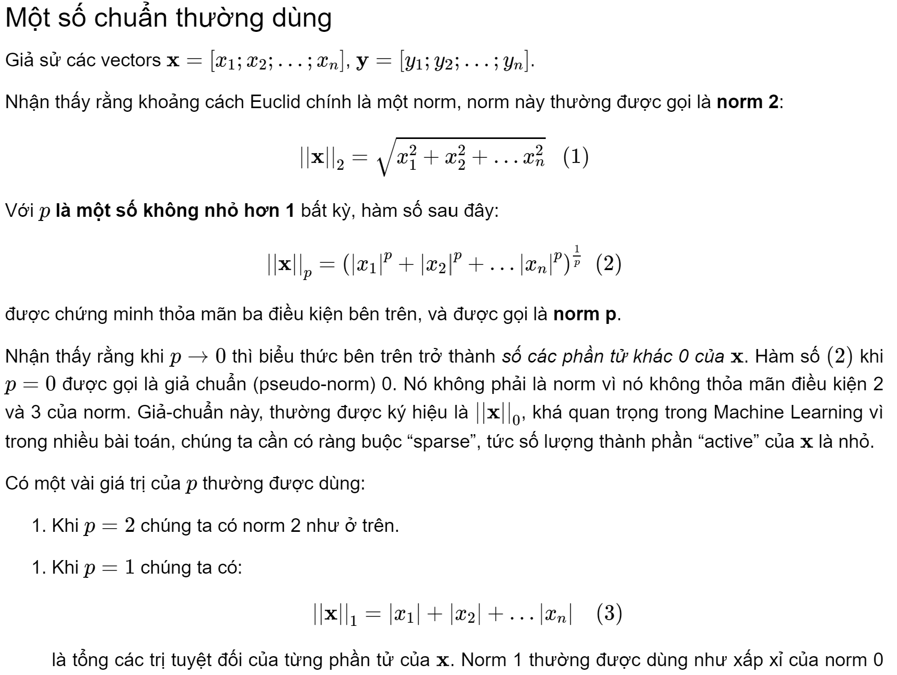

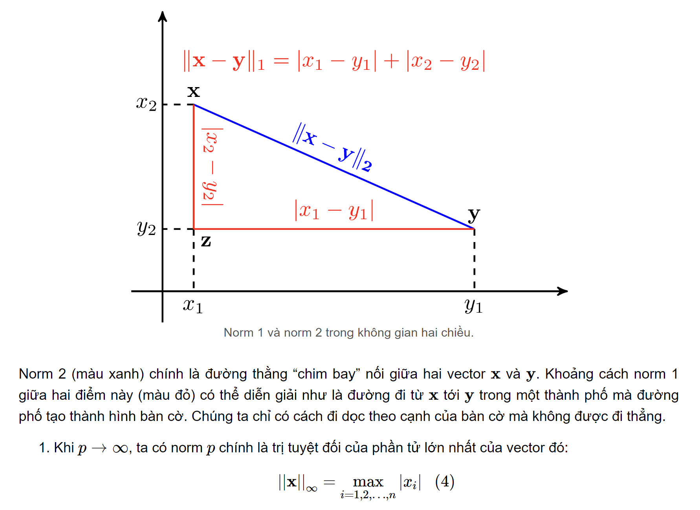

## Chuẩn hóa https://youtu.be/ky7qiKyZmnE?t=742

Một ý tưởng rõ ràng là việc khởi tạo thực sự quan trọng, 1 trong những lý do nó quan trọng là khi bạn khởi tạo khác đi, các norm của activation có thể không còn giống nhau trong quá trình đào tạo. Điều cao hơn cần ghi nhớ ở đây là, khi mà bạn đã có nhiều trải nghiệm qua bài học trước, __một layer trong một mạng sâu có thể thực sự làm bất cứ điều gì__. Ta có thể có 1 layer thực hiện hàm tuyến tính, một phép nhân ma trận với activations. Chúng ta có thể có một layer tính toán một hàm kích hoạt phi tuyến tính.  

Và bởi vì ta có thể làm bất cứ điều gì với một layer miễn là hàm ở layer đó có thể đạo hàm được để có được tích hợp vào mạng. Vậy nên ý tưởng chính ở đây là các vấn đề trọng số và activations biến đổi trong quá trình huấn luyện mạng, nên ta có thể thêm vào một layer để sửa lại norm của activations. Không có gì có thể ngăn cản chúng ta làm điều đó. Nếu chúng ta tin rằng, norm of the layers, kind of changing over time due to bad intialization là một vấn đề, hãy thêm một layer nữa để sửa chữa nó. Và đó là ý tưởng chính của normaliztion layers.

## Layer normalization

Ý tưởng đầu tiên: hãy chuẩn hóa (mean zero và variance one) activations tại mỗi layer, điều này được gọi là chuẩn hóa lớp:
gọi `z_i+1^hat = sigma_i(W_i^T Z_i + b_i)` là tentative trước khi chuẩn hóa, ý tưởng đơn giản nhất là chúng ta lấy activations này và đảm bảo nó có một mean và variance chuẩn, tức là activations sẽ có mean 0 và variance 1, vì thế thay vì lo lắng về việc khởi tạo, thì hãy đảm bảo rằng các layer của chúng ta có mean = 0 và variance = 1. Và để làm được điều đó chúng ta sẽ thiết lập layer tiếp theo bằng `Z_i+1 = (Z_i+1^hat - E[Z_i+1^hat]) / sqrt(Var[Z_i+1^hat])`, với:
- `E[Z_i+1^hat] = 1/n sum_{j=1..n}(Z_i+1^hat)_j` j ở đây chỉ đơn giản ám chỉ thành phần thứ j của vector Z ... Vì vậy đây sẽ chỉ là giá trị kỳ vọng theo kinh nghiệm.
- `Var[Z_i+1^hat] = 1/n sum_{j=1..n}((Z_i+1^hat)_j - E[Z_i+1^hat])^2`

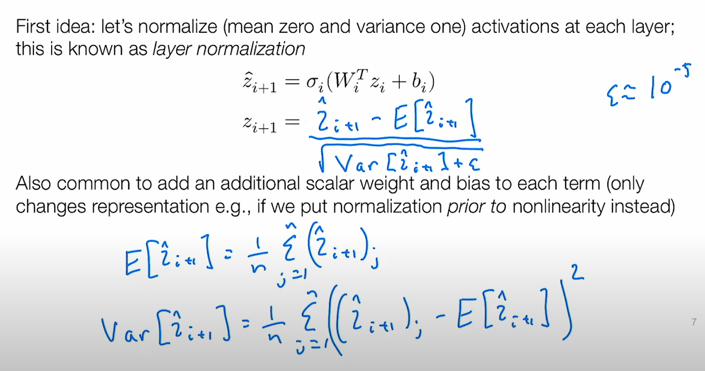

Vì có khả năng các giá trị của vector Z là 0, nên ta cộng thêm một định lượng epsilon đủ nhỏ để tránh divided by zero (epsilon = 10^-5 for example). Chúng ta đơn giản thêm vào 1 layer mới mà khiến cho giá trị của activation vector trở về phân bố chuẩn. Và nó thực sự xử lý được vấn đề norms biến đổi qua các layers của mạng sâu.

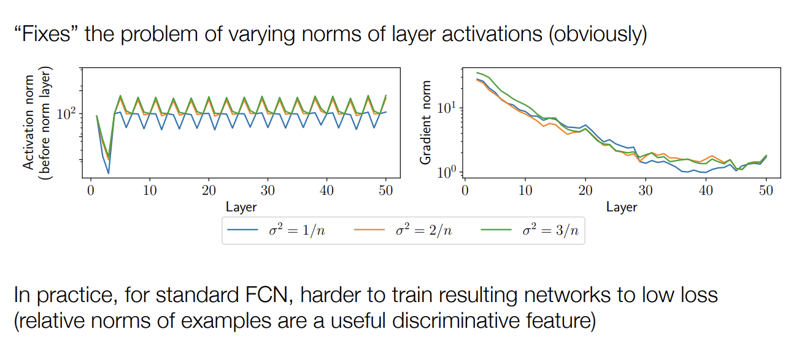

Như bạn thấy ở minh họa trên, với khởi tạo ban đầu là 1/n, 2/n, 3/n như ở bài trước, nhưng khi áp dụng layer norm thì các biến đổi về activation norm và gradient norm hoàn toàn biến mấy, cả 3 đường đồ thì đều có sự tương đồng chứ không khác biệt hoàn toàn như ở minh họa của bài trước. Tức là chúng ta có được trọng số (sau khi update) gần như là giống nhau ở mọi layer của mạng. Các vấn đề về bùng nổ gradients hay gradients tụt về 0 đều biến mất. Các đường gradient norm cũng gần giống nhau mặc dù việc khởi tạo là khác nhau. Như vậy chúng ta đã chữa được vấn đề gradient bị phụ thuộc rất nhiều vào việc khởi tạo. Có một điểm hơi lạ là các đường gradient norm khác nhau nhiều hơn so với các biểu đồ ở bài trước, khi mà các đường gradient norm này gần như giống nhau.

Đó là minh họa về layer norm, nhưng cũng có một vài vấn đề. Trước khi đi vao một vài vấn đề tiềm năng, tôi sẽ nói rằng layer norm được sử dụng rất rộng rãi. Ví dụng như trong kiến trúc Transformer, theo một nghĩa nào đó là kiến trúc thống trị DL ngày nay. Transformers sử dụng layer norm rất rộng rãi như là một kỹ thuật chuẩn hóa. Và cách tiếp cận đơn giản như vậy thực sự phổ biến trong DL hiện đại. Và nó thực sự giúp ngăn ngừa việc bùng nổ giá trị của activation, và theo một nghĩa nào đó nó là cách sửa chữa đơn giản. Bạn sẽ không phải lo nghĩ nhiều về việc khởi tạo trọng số nếu bạn làm theo cách đó.

Tôi cũng phải nhấn mạnh rằng với stardard fully connected networks, thường khó huấn luyện tới một ngưỡng mất mát thấp khi bạn cho thêm layer norm. Khó có thể nói đâu là lý do chính xác, nhưng có một vài lý do cho điều đó. Một trong những lý do ở đây là sẽ lấy mỗi ví dụ đơn lẻ và cưỡng bức its norm of the activation, và bao gồm cả layer cuối cùng về các giá trị có mean = 0, và độ lệch chuẩn là 1. Và nó có thể, in fact, relative norms of different examples, kiểu như một ảnh của số 0 vs 1 ảnh của số 1, có thể the relative norms và their variants là một đặc trưng tốt để phân loại chúng chẳng hạn. Rất có khả năng rằng kích cỡ tương đối có thể bao gồm một vài thông tin chúng ta muốn giữ lại và bảo tồn. Đó có thể là một trong những lý do tại sao những FCN lại khó để huấn luyện. Có thể có nhiều lý do khác nữa khiến cho nó khó huấn luyện, nhưng những gì tìm thấy trong thực tế, ít nhất là cho Fully-connected MLP, là nó thường khó khăn để huẩn luyện hơn khi bạn cho thêm layer norm vào so với khi không có layer norm.

Vì thế, chúng ta, có thể chưa có được tất cả những hình dung cần thiết ở đây. 

## Batch normalization https://youtu.be/ky7qiKyZmnE?t=1388

Và vì thế, chúng ta sẽ xem xét một kiểu chuẩn hóa mới thoạt nhìn trông có vẻ kì dị nhưng sẽ hữu ích trong nhiều trường hợp. Tôi phải nhấn mạnh rằng ý tưởng này nghe có vẻ kì dị, nhưng hy vọng rằng nó sẽ sort of make some amount of sense.

Trước khi xem xét công thức cụ thể của batch norm, ta hãy xem xét một cách chuẩn hóa độc lập mà ta sẽ áp dụng cho mỗi layer, và mỗi dữ liệu đầu vào. Ta sẽ lấy một ví dụ đầu vào cụ thể, và xem xét activations của nó through the network, và chúng ta sẽ chuẩn hóa mỗi activation này.
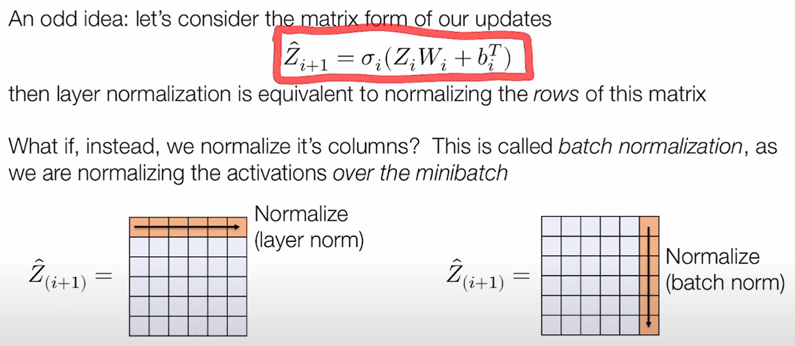
Hãy xem xét dạng ma trận của our updates (ý nói là activation). Z ở đây là ở dạng ma trận nghĩa là được tính cho X đầu vào là mini-batch (gồm nhiều vectors). Ma trận Z (viết hoa) chứa mỗi ví dụ (dữ liệu đầu vào) trên mỗi dòng của nó. Vậy khi xem xét Z ở dạng ma trận, thì layer norm tương ứng với với việc chuẩn hóa dữ liệu của một ví dụ đơn lẻ, tức là chuẩn hóa hàng. Bởi vì Z là một ma trận, nên sẽ có nhiều cách để tiêu chuẩn hóa các đặc trưng này (kind of get standardization across these features). Trên thực tế, nếu bạn thực sự nghĩ về các cách chuẩn hóa tiêu chuẩn của các đặc trưng (còn gọi là activation, vì mỗi lớp sau lớp input là 1 lần trích chọn đặc trưng), cho rất nhiều những thuật toán học máy tiêu chuẩn, thì một việc cũng phổ biến không kém là chuẩn hóa không chỉ theo hàng, mà việc chuẩn hóa theo cột cũng rất phổ biến. Vậy nên điều gì xảy ra nếu thay vì chuẩn hóa theo hàng, chúng ta chuẩn hóa ma trận Z theo cột?

Chúng ta thực sự nghĩ rằng điều này là kì cục khi chuẩn hóa theo cột, hãy nghĩ về một cột như một activation đơn lẻ, như là một feature đơn lẻ. Điều gì sẽ xảy ra khi chúng ta chuẩn hóa những giá trị này trên cả mini-batch? Kỹ thuật này được gọi là batch norm. Và nó cũng thực sự được dùng vô cùng phổ biến trong thực tế các mạng sâu và cũng đem lại rất nhiều lợi ích việc huấn luyện mạng. Sẽ có rất nhiều động lực để chúng ta thực hiện thao tác chuẩn hóa, nhưng có một động lực chính là chúng ta muốn đảm bảo activations của mạng không bùng nổ khi chuyển qua các tầng sâu hơn. Kiểu như là chúng ta duy trì một loại kiểm soát ở đây, và để làm được điều này chúng ta có thể dễ dàng chuẩn hóa theo hàng, hay chuẩn hóa theo cột.

Hãy nhớ ràng việc chuẩn hóa theo hàng khiến FCN khó huấn luyện. Nhưng việc chuẩn hóa theo cột, giữ nguyên được thực tế là các hàng khác nhau hay các ví dụ khác nhau, có thể có các norms khác nhau và các giá trị cũng như kích cỡ khác nhau cho activations của chúng. Và khi đi càng sâu xuống các tầng sau, chúng có thể là một tính năng hữu ích để phân biệt ví dụ của lớp này với ví dụ của lớp khác. Và bằng batch norm, chúng ta bảo tồn được điều đó, trong khi vẫn giữ được các tầng ổn định (normalization of your layers).

Như tôi nó, có một sự tương tự rõ ràng với những gì chúng ta làm khi chuẩn bị dữ liệu cho các thuật toán học máy cổ điển. Thường thường, chúng ta sẽ chuẩn hóa những đặc trưng này - chuẩn hóa cột của data matrix, và chúng ta sẽ làm điều đó triệt để hơn khi chúng ta thực hiện nó ở mỗi tầng của mạng (coi activation của tầng là data matrix cho tầng tiếp theo). Và kĩ thuật này được gọi là batch norm.

Tôi muốn giới thiệu thêm một khía cạnh phổ biến của batch norm để sửa chữa một vấn đề (odd problem) của batch norm. Một điều kì dị có thể xảy ra kh i chúng ta batch norm, chuẩn hóa theo cột, chúng ta đang tạo ra sự phụ thuộc giữa tổng dự đoán của mạng với mini-batch. Với layer-norm bạn chỉ áp dụng hàm chuẩn hóa với từng ví dụ trong batch nên điều đó không xảy ra. Sự kì dị của batch norm là nó chuẩn hóa activations theo batch sẽ tạo ra sự phụ thuộc. Nó tạo ra sự phụ thuộc (qua lại) giữa các ví dụ trong batch. Nói theo cách khác, dự đoán của ví dụ này, ví dụ như dự đoán ví dụ số 1 (hàng 1), sẽ phụ thuộc vào sự dự đoán của ví dụ số 2 (hàng 2), và nó rất là không bình thường phải không? Bạn không muốn có một mạng mà đầu ra của mạng lại phụ thuộc vào các ví dụ khác ngoài ví dụ bạn đang phân loại đúng không? (một sự phụ thuộc vào 1 tập dữ liệu có thể không liên quan). Có thể cũng không lạ lắm đâu, có thể bạn muốn điều đó, nhưng nói một cách ngay thơ thì đó là một hiệu ứng bất thường. Vậy nên một việc phổ biến trong batch-norm là khi bạn áp dụng batch-norm ở test time, bạn huấn luyện việc chuẩn hóa theo batches. Nhưng khi áp dụng batch norm at test time, bạn không sử dụng norm thực sử của batch. Bạn sẽ không sử dụng thống kê của batch để chuẩn hóa dữ liệu bạn đang kiểm tra. Mà bạn dùng trung bình cộng của mean và variance mà bạn đã thấy trong toàn bộ dữ liệu huấn luyện, để thực hiện phép toán. Và bạn tính empirical running averages của những mean và variance terms. Và dùng nó vào việc tính Z_i+1 như trong công thức ở hình dưới:

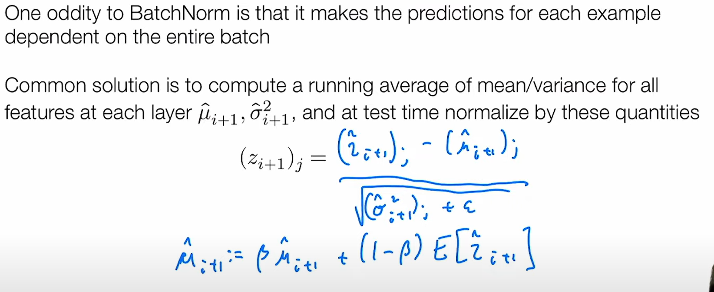

Công thức này rất giống với công thức batch norm bình thường, nhưng thay vì sử dụng mean và variant theo từng batch, thì ta thay thế chúng bằng moving averages (of means and variances của tất cả các batches).

## Regularization (bình thường hóa) https://youtu.be/ky7qiKyZmnE?t=2026

Regularization và normalization theo một khía cạnh nào đó là giống nhau và chúng giống như những tính năng ta cho thêm vào mạng để nó hoạt động tốt hơn hoặc nó tối ưu hóa tốt hơn. Và có những weird interactions that make a lot of sense to talk about these things together. Động lực cho việc regularization là thực tế là những mạng sâu thường thấy là chúng bị over-parameterized (tham số hóa quá mức) và vì thế over-fit với tập dữ liệu huấn luyện.

Bình thường hóa là quá trình "giới hạn độ phức tạo của các lớp hàm" để đảm bảo rằng mạng của chúng ta không tổng quát hóa tốt hơn với dữ liệu mới. Bình thường hóa thường xuất hiện dưới 2 dạng trong DL:
- Implicit: tức là các thuật toán (kiểu như SGD) hay kiến trúc mạng đã tự giới hạn các hàm. Kiểu như chúng ta không tối ưu hóa trên toàn bộ khả năng của mạng mà tối ưu hóa trên tập con được có thể chạm được bởi thuật toán SGD với một bộ tham số được khởi tạo trước.
- Explicit: những thay đổi trực tiếp trong mạng và quá trình huấn luyện để làm bình thường hóa mạng.

Hãy nhớ lại ví dụ trước khi cho trước một bộ tham số được khởi tạo, và chạy SGD, các trọng số của chúng ta có thay đổi nhưng không nhiều, điều đó rõ ràng là chúng ta đã không tìm kiếm tất cả các khả năng kết hợp của bộ trọng số. Chúng ta thực sự chỉ cân nhắc a very limited class of kind of deviations from our initial values, và đó chính là implicit regularization => Điều đó giải thích tại sao DL thường bị tham số hóa quá mức và mạng thưa + cắt tỉa là một bước vô cùng phù hợp. Còn 1 giải thích khác về tác dụng của tham số hóa quá mức thường dễ huấn luyện hơn là ở chỗ việc tham số hóa qua mức tạo ra nhiều "con đường" (ở không gian cao chiều hơn) để thuật toán tối ưu dễ dàng vượt qua các "vật cản" để tới được gần hơn điểm tối ưu toàn cục (chưa từng đọc chứng minh hay giải thích kỹ hơn về lý luận này). Và rất nhiều điều chúng ta làm khi thiết kế kiến trúc mạng, hay thiết kế các thuật toán tối ưu hóa, là về implicitly regularizing the complexity của những hàm này để chúng có thể tổng quát hóa tốt hơn.

Giờ chúng ta sẽ tập trung vào explicit regularization, tức là những thay đổi trực tiếp trong kiến trúc mạng hoặc huấn luyện để explicitly thực hiện việc bình thường hóa mạng để kiểm soát độ phức tạp của lớp hàm mạng.

## l_2 regularization a.k.a weight decay https://youtu.be/ky7qiKyZmnE?t=2428
(bình thường hóa l2 hay còn gọi là phân rã trọng số trong DL)

Với bài toán học máy cổ điển, độ lớn tham số của một mô hình thường là trung gian cho độ phức tạp, vì thế chúng ta có thể vừa tối thiểu mất mát trong khi vừa giữ cho các tham số có độ lớn nhỏ. Explicite regularization form phổ biến nhất mà bạn thấy áp dụng cho trọng số của mạng, là L2 regularization, hay trong DL nó thường được gọi là weight decay. Vậy để định nghĩa bình thường hóa L2, chúng ta sẽ xem xét các bài toán tối ưu trong ML cổ điển.

Ý tưởng đằng sau L2 reg là, nói một cách cổ điển, một cách quan trọng để giải quyết vấn vấn đề độ phức tạp của lớp giả thiết là thông qua kích cỡ của các tham số, có thể chỉ cần xem xét kích cỡ norm của các tham số như là một đại diện (say just the norm, of these paramaters). Tôi sẽ không đi sâu vào chi tiết vì trực giác này đã bị phá vỡ một chút khi nói đến các mạng sâu. Nhưng một cách nghĩ về vấn dề này là, hãy tưởng tượng rằng tất cả các trọng số của bạn đều bằng 0, như thế về cơ bản sẽ không còn sai lệch vì mọi dự đoán của bạn đều bằng 0, ở tất cả mọi nơi. Nếu trọng số nhỏ, các hàm của bạn hoạt động rất trơn tru. Chúng không thay đổi nhiều vì bạn không áp dụng các yếu tố rất lớn cho đầu vào của mình. Vì vậy, hàm của bạn sẽ thay đổi rất chậm đối với các đầu vào khác nhau, đó là tác dụng của trọng số nhỏ. Và do đó, trọng số càng nhỏ, theo một nghĩa nào đó rất thực tế, hàm của bạn càng mượt mà. Chính thức hơn một chút, kích thước của trọng số, áp đặt các hạn mức đối với độ mịn hoặc hằng số Lipschitz của hàm mà bạn đang thực sự sử dụng để biểu diễn dữ liệu của mình (hàm ở đây ám chỉ toàn bộ mạng). Và điều này có nghĩa là vì các hàm mượt mà hơn, theo một nghĩa nào đó là ít phức tạp hơn. Chúng không thể thay đổi nhanh vì chúng ít biến đổi hơn. Một cách để kiểm soát độ phức tạp của hàm là đảm bảo bản thân giá trị của các trọng số là nhỏ. Vì vậy chúng ta muốn làm cho các tham số nhỏ. Và đó là một cách để tiếp tục kiểm soát độ phức tạp của lớp hàm của chúng ta. Và ta làm điều đó bằng cách thêm vào hàm mất mát của chúng ta, bằng cách bổ sung bài toán tối ưu hóa của chúng để thêm cái được gọi là số hạng chuẩn hóa. Dạng của thuật ngữ này trong trường hợp chính quy hóa là L2, là chúng ta sẽ thêm một thuật ngữ lambda/2 lần tổng từ i bằng một đến L là tổng số layers trong mạng, norm của trọng số của layer đó. Và đây thực sự là một ma trận. Vì vậy, về mặt kỹ thuật tôi nên sử dụng cái được gọi là bình phương chuẩn Frobenius - là tổng bình phương các phần tử của ma trận này.

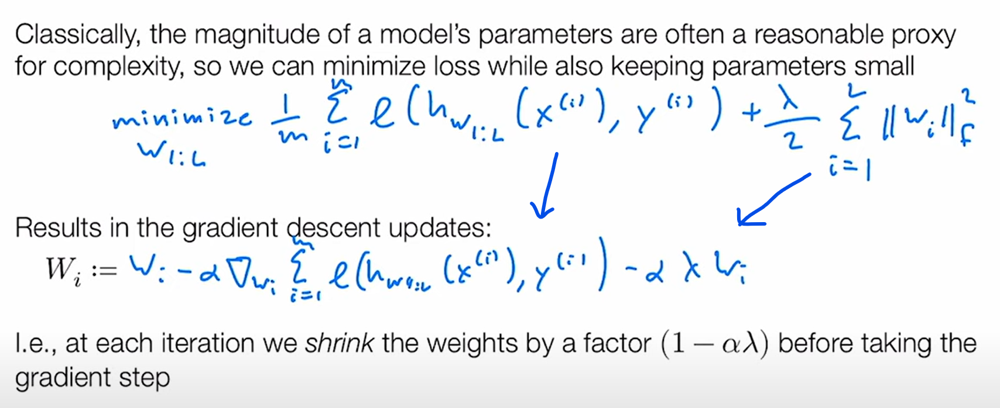

Như vậy ý tưởng của L2 là ngoài việc điều chỉnh bộ tham số theta để tối thiểu hóa hàm mất mát, ta cũng đồng thời có thể giới hạn độ lớn của các tham số. Làm được điều này bằng cách kết hợp độ lớn các tham số vào hàm mất mát như hình trên. Và công thức đạo hàm trở và cập nhật tham số trở nên đơn giản như công thức dưới ở hình trên.

L2 reg là dạng bình thường hóa phổ biến nhất trong mạng sâu, nhưng nó cũng có vấn đề của nó. Nó không rõ ràng how much it really make sense. Bởi vì trong thực tế, nó không rõ ràng how much the norm of the weights thực sự ảnh hưởng tới độ phức tạp của resulting underlying function. Trong ví dụ minh họa phần trên tôi sử dụng trường hợp mọi trọng số đều bằng 0 và hàm cũng không quá phức tạp. But in terms of the variances you get when it comes to real networks, it's much less clear.

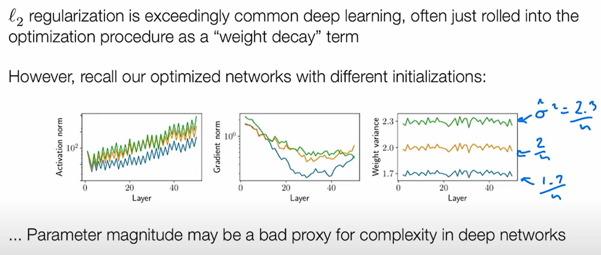

Quay trở lại minh họa ở trước với việc khởi tạo phương sai 2.3/n, 2/n, và 1.7/n. Như vậy các bộ trọng số thực sự có sự khác biệt, nhưng các mạng này đều có loss giống nhau, and the same actually generalization loss on MNIST. Như vậy có thực sự quan trọng when shink weights? It's sort of unclear, right? And personally, weight decay is very common, when people run gradient descent, you will often see some amount of weight decay. People have just tuned it over time, and found that a small value of 1e-4 is maybe a good, works slightly better than no weight decay at all.

__Nhưng tôi thường bỏ qua nó khi train DL__. I often don't bother with weight decay, because parameter magnitude, sort of the absolute magnitude of the paramaters, especially when you include normalization layers and kind of stuff like that, it's often a very bad proxy for complexity in deep network !!! Và vì thế L2 rất phổ biến và bạn nên biết về nó, và nó cũng được sử dụng rộng rãi, tôi thường thấy mình không dùng nó trong mạng sâu.

## Dropout https://youtu.be/ky7qiKyZmnE?t=3339

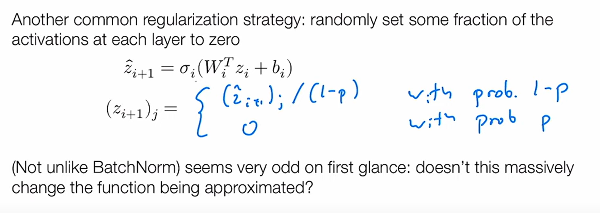

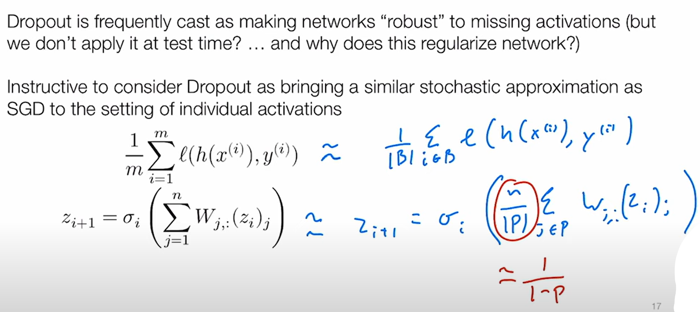

Cách tốt nhất để nghĩ về dropout là thực sự nghĩ về nó như là một phép tính gần đúng ngẫu nhiên (as a stochastic approximation). Và cũng giống như chúng ta đã làm cho SGD để ước tính gradient descent (SGD = Stochastic Gradient Descent), dropout có thể được nghĩ nghĩ như là một thứ tương tự khi áp dụng trên activations of a network.
...

## Interaction of optimization, initialization, normalization, regularization

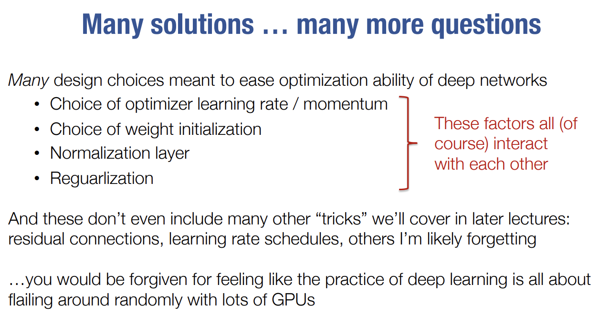

## Kết luận

__BatchNorm + Dropout là 2 kỹ thuật hiệu quả trong huấn luyện__. Weight decay mặc dù được dùng phổ biến nhưng có thể bỏ qua.

BatchNorm có rất nhiều bài báo / quan điểm về cách nó làm cho việc huấn luyện trở nên tốt hơn. Thậm chí áp dụng BatchNorm trong testing còn giúp tăng độ chính xác trong một số trường hợp.

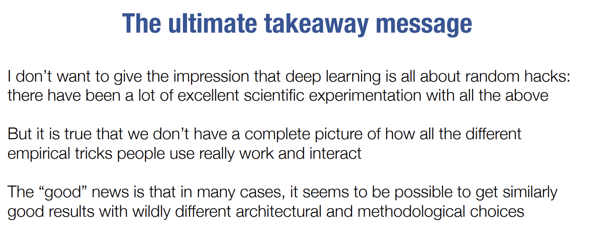

- - -

# Tìm hiểu thêm

## Group Normalization (GN) https://youtu.be/l_3zj6HeWUE | https://arxiv.org/pdf/1803.08494.pdf

Khá nhiều DL sử dụng BatchNorm (BN), BN là điều hợp lý và nó hoạt động rất tốt. Ý tưởng đằng sau BN là gì?

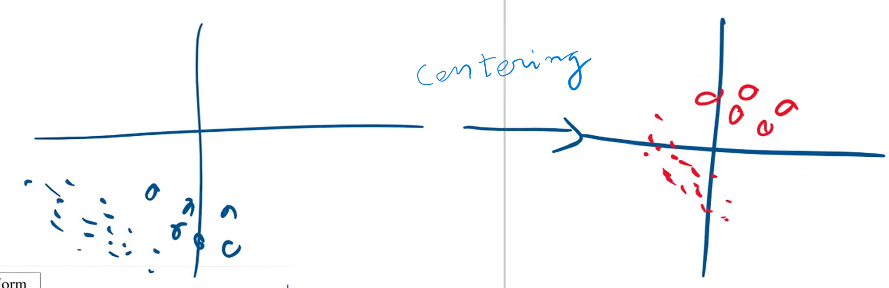
Giả sử bài toán ML của bạn là cần phân biết tập các đường gạch ngắn vs tập vòng tròn như hình trên. Sẽ có nhiều lợp ích nếu bạn chuyển phân phối đó trước khi làm bất cứ điều gì. Bạn sẽ muốn chuyển nó về gôc tọa độ (căn giữa), sao cho điểm gốc tọa độ (0, 0) nằm ở giữa phân phối.

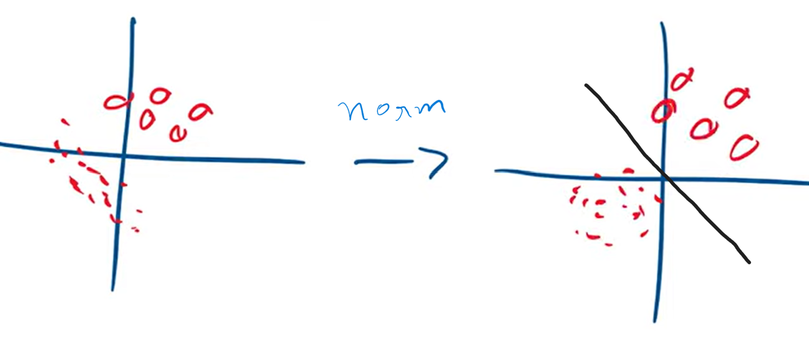
 Và đôi khi bạn cũng muốn chuẩn hóa nó, nghĩa là bạn muốn thay đổi tỉ lệ của trục tọa độ sao cho mọi thứ ít hay nhiều giống như một phân bố Gaussian.

 Như vậy bạn vừa thực hiện 2 bước:
 - Centering
 - Normalization

Bạn biết đấy, hầu hết các phương pháp học máy đều hoạt động tốt hơn nếu bạn làm 2 điều trên, và đó là với các phương pháp học máy cổ điển với số lượng dữ liệu điều chỉnh tốt hơn. Với ví dụ trên giả sử bạn muốn xây dựng 1 bộ phân lớp thì bạn chỉ cần 1 tham số bởi vì bạn chỉ cần kẻ 1 đường thẳng đi qua gốc tọa độ (đường màu đen ở hình trên).

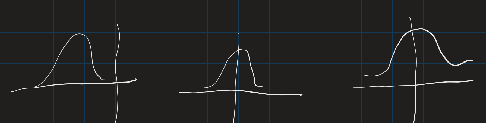

Khi biểu diễn phân bố dữ liệu ở không gian 1 chiều thì bước 1 bạn đưa phân bố về trục tọa độ, va sau đó bạn chia nó cho độ lệch tiêu chuẩn. Dường như là dữ liệu của bạn càng gần phân bố chuẩn bao nhiều thì các phương pháp học máy lại càng hoạt động tốt hơn bấy nhiêu. Đặc biệt nếu bạn nhìn vào cách các tín hiệu được truyền giữa các tầng trong một mạng sâu. Ý tưởng ở đây là nếu nó tốt cho học máy nói chung, thì có thể nó cũng tốt nếu mỗi đầu vào của từng lớp trong mạng sâu đều được chuẩn hóa.

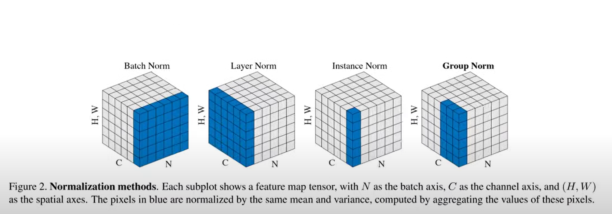

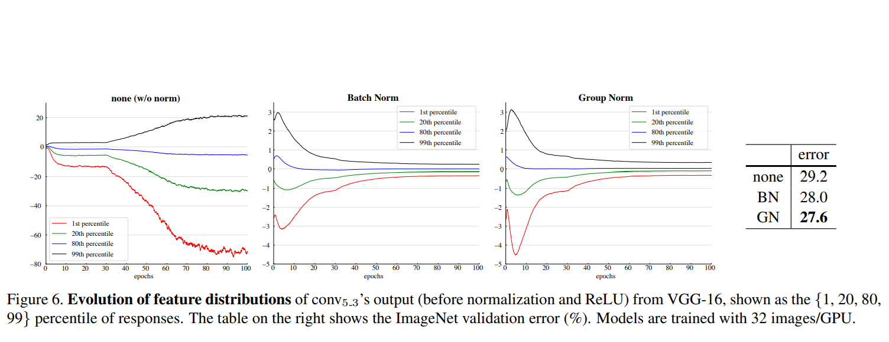

Hình trên là feature distribution của một layer trong mạng sâu, thay đổi qua từng epochs. Như bạn thấy, khi không được chuẩn hóa, chúng sẽ biến thiên rất nhanh (tăng hoặc giảm đột biến), khi áp dụng chuẩn hóa thì chúng hội tụ về một chỗ.

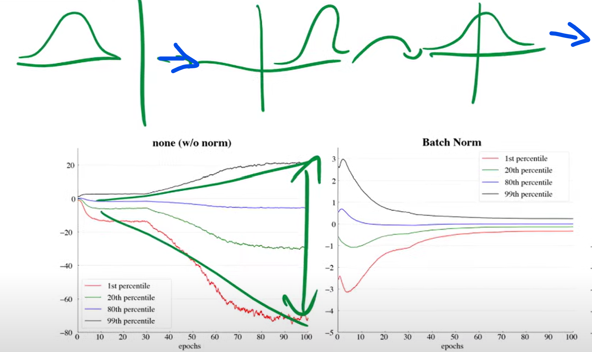
Sẽ tốt hơn nếu bạn chuẩn hóa dữ liệu đầu vào trước khi cho vào một layer, đầu ra bạn được một feature distibution khác, và bạn lại chuẩn hóa nó trước khi đưa vào layer tiếp theo.

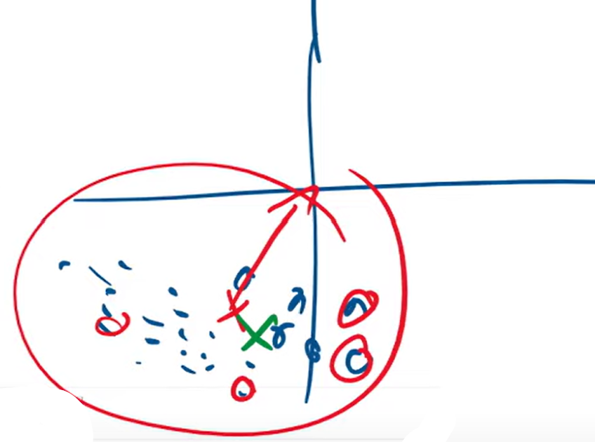
Vấn đề ở đây là để chuẩn hóa tốt bạn cần phải làm nó cho cả tập dữ liệu, nếu bạn chỉ có mini-batch (giả sử là 4 điểm khoang đỏ trong hình trên) là một tập con của tập dữ liệu, tôi không thể xác định giá trị trung bình cho cả tập, nhưng điều có thể làm là đoán giá trị trung bình từ 4 điểm đó (điểm x màu xanh lá) và nó cũng gần sát với điểm x màu đỏ là center của cả tập dữ liệu. Như vậy lô dữ liệu của bạn càng lớn và bạn lấy mẫu dữ liệu ngẫu nhiên thì, ước tính trung bình của bạn càng chính xác. Chúng ta đang train với batch ngày càng lớn hơn nên đây không phải là vấn đề.

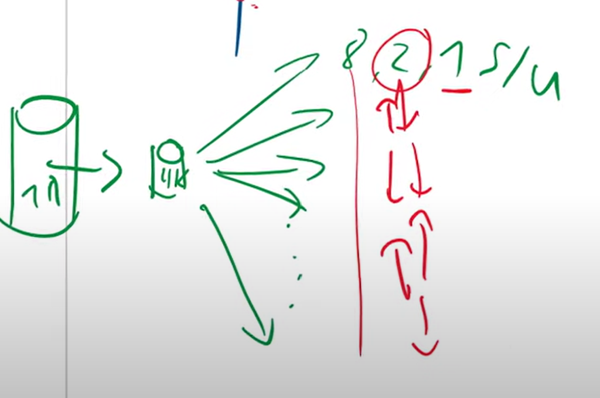
Vấn đề thực sự xảy ra khi distributed training, từ 1 kho dữ liệu lớn, ta lấy ra khoảng 4k samples, và phân bố số samples này cho các tác vụ training nhỏ hơn, chẳng hạn 8 samples cho mỗi tác vụ chẳng hạn. Khi huấn luyện mô hình ngôn ngữ dạng chuỗi, số phân bổ samples này có thể giảm xuống thấp nữa, 2 samples cho mỗi tác vụ training chẳng hạn. Thì đây thực sự là một vấn đề vì bạn không thể chuẩn hóa hàng loạt. Bạn có 2 lựa chọn:
bạn chấp nhận chuẩn hóa trên số mẫu nhỏ, hoặc sau mỗi bước tính toán bạn phải thực hiện đồng bộ hóa giữa các đơn vị tính toán để chuẩn hóa trên tập mẫu lớn hơn (đường minh họa màu đỏ hình trên). Thông thường bước đồng bộ hóa sẽ không được thực hiện vì nó sẽ làm chậm toàn bộ quá trình huấn luyện.

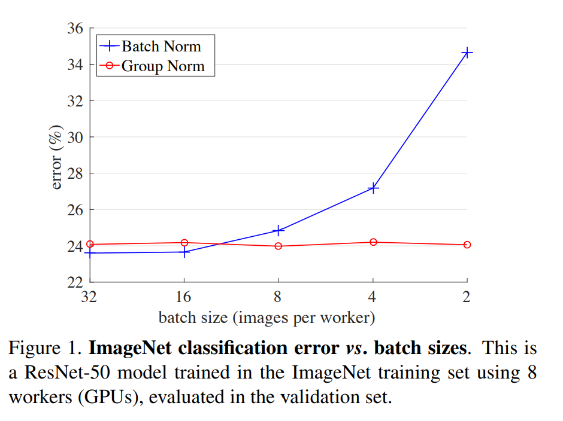
Hình trên minh họa tính không ổn định của BatchNorm khi số lượng mẫu huấn luyện giảm đi. Và GN sinh ra để giải quyết vấn đề đó vì nó chuẩn hóa within the sample nên không phụ thuộc vào số lượng mẫu. GN thường không hoạt động tốt bằng BN (khi có đủ mẫu), nhưng tác giả bài báo claim rằng nó hoạt động tương đương với BN.

Quay trở lại hình minh họa các phương pháp chuẩn hóa. BN thực hiện chuẩn qua trên tập mẫu con (tại layer đang xét), LN thực hiện chuẩn hóa trên activation (của từng layer), Instance Norm không tốt, LN có cái dở là giả sử các mean và variant thực sự là một feature tốt để phân biệt mẫu thuộc lớp này với mẫu thuộc lớp khác thì việc LN sẽ làm mất đi feature đó. 

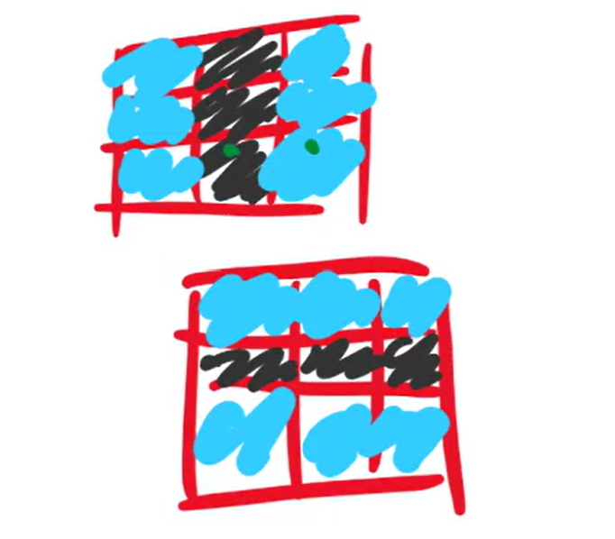

GN giống LN nhưng thực hiện trên con của activation có cùng một kiểu phân bố. Nó hoạt động dựa trên giả thiết là có thể có một số features mà về bản chất chúng đã có cùng scale và phương sai. Ví dụ nếu bạn có một bộ lọc khi thực hiện conv, và bộ lọc đó giả sử là 1 horizontal edge filter, chúng sẽ có giá trị thấp ở ô màu đen và giá trị cao ở ô màu xanh. Vì cạnh sẽ có mẫu hình cao thấp cao hoặc thấp cao thấp nên khi chạy qua bộ lọc này nó sẽ có giá trị dương rất cao hoặc âm rất thấp, chúng ta có thể mong đợi rằng trong một mạng sâu sẽ có các bộ lọc có cùng scale và phương sai, vì thế chúng ta có thể chuẩn hóa chúng với nhau như trong LN. Và vì thế càng nhiều lần GN, thì better statistics we can gather. Đó là lí do tại sao Instant Norm không hoạt động vì nó chỉ norm ở trong 1 thứ rất nhỏ, mức độ thống kê rất nhỏ. Nhưng khi chúng ta đã có những thống kê tốt thì chúng ta nên chuẩn hóa features khác nhau theo các cách khác nhau. 

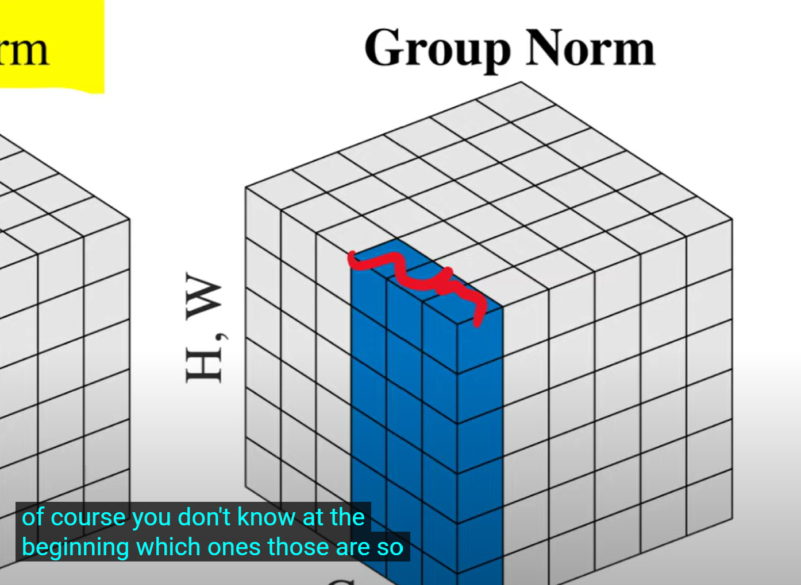

Tuy nhiên bạn không biết những features đó nằm ở đâu, nhưng bạn hy vọng rằng khi thực hiện GN trước khi đưa vào huấn luyện, bạn cho rằng các features đó có thể là bất cứ thứ gì đứng cạnh nhau, và bạn hy vọng rằng trong quá trình huấn luyện các nhóm đó sẽ học được các features có kích thước bằng nhau (quá nhiều hopes, no proofs). Vậy bạn kiểu như đang bắt buộc kiến trúc mạng phải làm điều đó. Đó là idea behind GN.

!! Nó xây dựng các group of channels, và sau đó sẽ chuẩn hóa trong các nhóm đó trong toàn bộ H,W __chỉ với một mẫu dữ liệu__ !!
Vì thế bạn có được lợi thế của LayerNorm là chỉ làm nó trong 1 mẫu dữ liệu mà vẫn có được lợi thế của BatchNorm là chuẩn hóa chỉ trên một feature (điều mà InstantNorm muốn làm). So you get the best of both worlds.

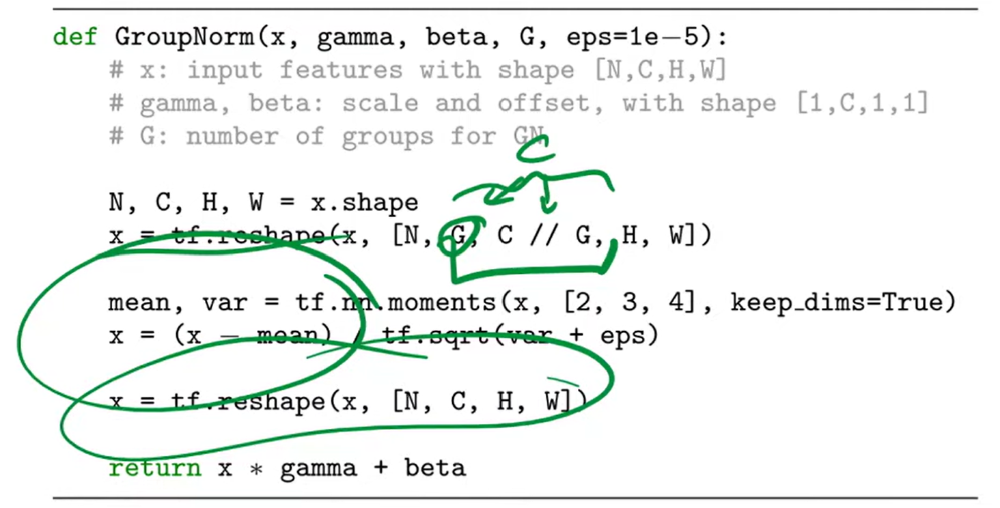

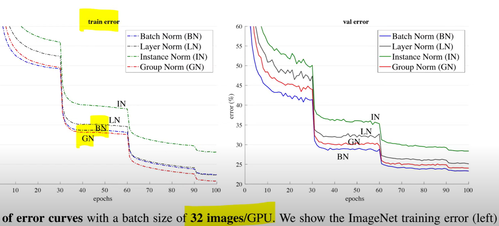
Thử nghiệm trong bài báo cho thấy rằng độ ổn định của GN rất gần BN, nhất là trong training.

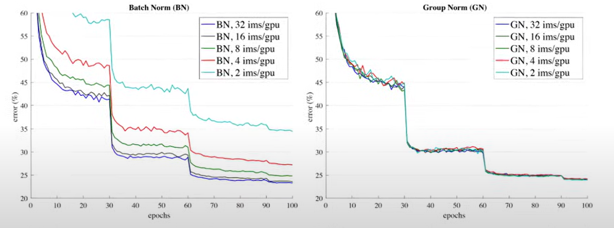
Tuy nhiên khi thích thước mẫu giảm đi, thì GN tỏ ra ổn định hơn nhiều so với BN.

## Comments

__Note__: normalizing isn't making the data more Gaussian, it's just transforming it to have mean of 0 and SD of 1. Gaussian data is often normalized and represented in this way too, but the normalization doesn't make your data any more Gaussian. Normalization does not change the inherent distributional shape of the data, just the mean and SD. For example, if your data was right-tailed in one dimension, it would remain right-tailed (and non-gaussian looking), it would just have a mean and SD of 0 and 1, respectively.

- yeah it's really called standardization which comes from the equation to convert a normal distribution to a standard normal distribution