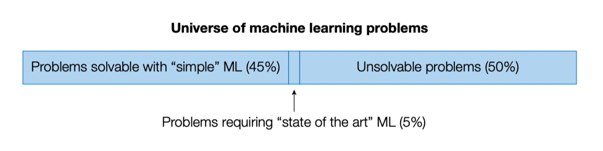

# Practical Data Science

DS is the application of `computational` and `statistical` techniques
to address or gain insight into some problem in `real world`

Some posible definitions
DS = statistic +
	data processing +
	machine learning +
	scientific inquiry +
	visualization +
	business analytics +
	big data + ...

DS is not machine learning (ML heavily focus on fancy algorithms 
	but sometimes the best way to solve a problem is just by visualizing the data)

DS is not lachine learning competitions

DS is not statistics (despite it is re-branded as 'statistics and data science')

