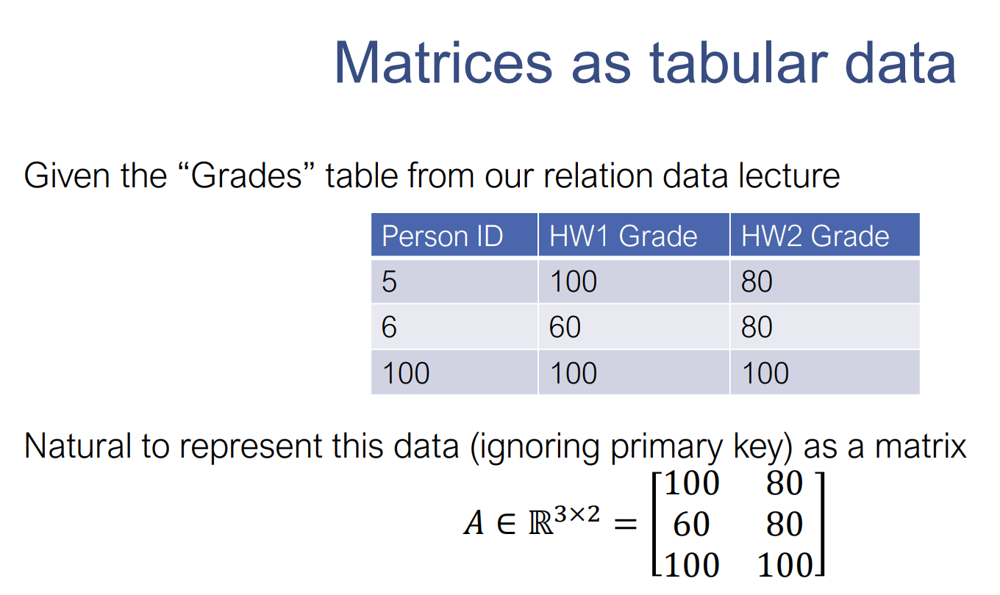
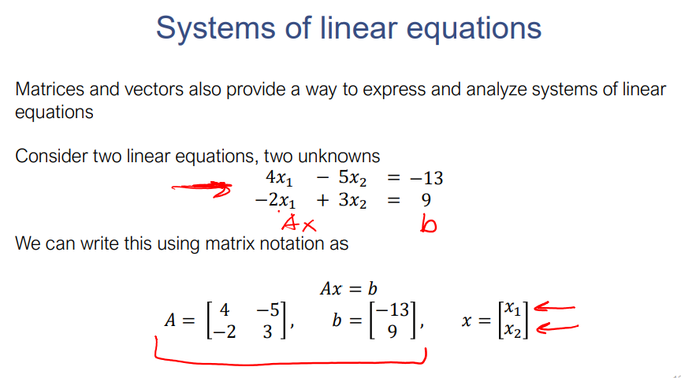

https://scs.hosted.panopto.com/Panopto/Pages/Viewer.aspx?id=81a6c82d-1ef4-4a55-ab21-aacc00f77c5c

## Vector and Matrix
- Nghĩ về vector như mà 1 ma trận với 1 cột và n hàng. Điều này cho phép định nghĩa phép toán nào là hợp lệ giữa vector và matrix. Nếu muốn dùng dạng hàng của vector thì dùng chuyển vị X^T.

- Matrix là một mảng 2 chiều. A_ij là phần tử ở hàng thứ i và cột thứ j. A_i: là vector hàng thứ i, A_:j là vector cột thứ j.
	- 1. Matrix là một cách biểu diễn hiển nhiên và hiệu quả của dữ liệu bảng (đặc biệt là các con số)
	- 2. Matrix là nền tảng của đại số tuyến tính. 
	- Hiểu được 2 điều trên là thiết yếu với khoa học dữ liệu và các thuật toán phân tích

Cho matrix A ở hình trên, ta nên lưu trữ nó trong máy tính ntn? Có 2 dạng: lưu theo thứ tự hàng hoặc lưu theo thứ tự cột.
- row major ordering: 100, 80, 60, 80, 100, 100 (mặc định trong C 2D arrays và Numpy)
- col major ordering: 100, 60, 100, 80, 80, 100 mặc định trong FORTRAN)

Zico nói thấy col major make more sense. Zico đã từng dùng FORTRAN.

## Tensor: là mảng n chiều với n > 2

Tensor được dùng nhiều trong DL, nhưng trong khóa DS này ta chủ yếu dùng matrix và vector.

## Đại số tuyến tính

Các phương trình đại số tuyến tính có thể được biển diễn đơn giản với vector và matrix `A x = b`
Với A là matrix hệ số, b là vector kết quả, và x là vector biến số.

Nó cũng dễ dàng hơn để tạo ra các công thức toán học tổng quan hơn khi sử dụng matrix and vector thay vì các biểu thức với từng biến số vô hướng đơn lẻ (scalar).

- Matrix đơn vị: I, `I A = A = A I`
- Matrix nghịch đảo với A in R^{n x n} A là square matrix, `A A^-1 = I = A^-1 A` => `A x = b <=> x = A^-1 b`. Matrix nghịch đảo không phải luôn tồn tại với mọi ma trận (chỉ khi có nghiệm thì mới tồn tại). Ma trận nghịch đảo giúp giải các phương trình tuyến tính nhanh chóng.

- X, Y là 2 vector thuộc R^n `X^T Y = Y^T X` 