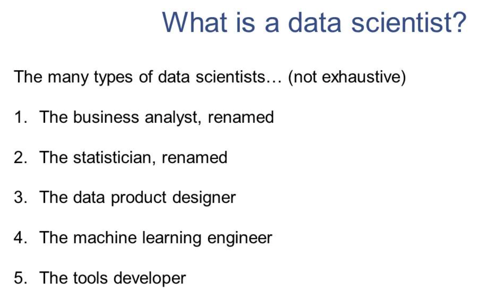

https://scs.hosted.panopto.com/Panopto/Pages/Viewer.aspx?id=793d2bb4-2bd6-498c-a8fa-ab1a00385990

Không phải Biz nào cũng cần DS, ML để hoạt động hiệu quả. Nhưng khi áp dụng DS, ML thì sẽ có những lợi ích thêm nhất định.

## Some important distinctions
- Working to develop the “core” business product vs. working tangentially to “identify value” in company data
- Developing data science tools vs. doing the actual data analysis
- “Classical” statistics vs. machine learning approaches

## The data science interview
There is no “standard” yet for the types of questions you’ll be asked (just as there is no standard as to what a data science position means). The general types of questions:
1. Software engineering questions (https://leetcode.com/)
2. Questions about data collection/processing (SQL, APIs, etc)
3. Questions about machine learning (usually about “general” ideas like
training/testing, debugging, etc., but also about specific algorithms)
4. Questions about statistics (hypothesis testing, statistical significance)
5. The “take-home” data analysis project

