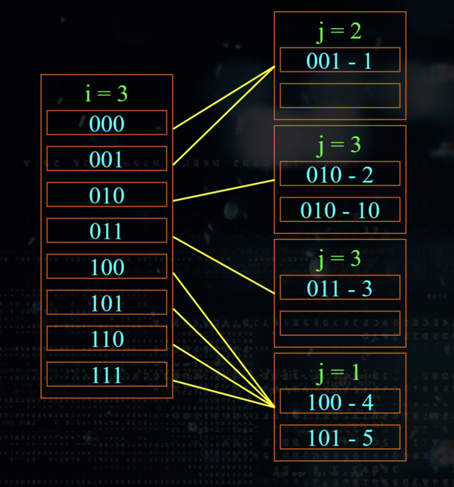
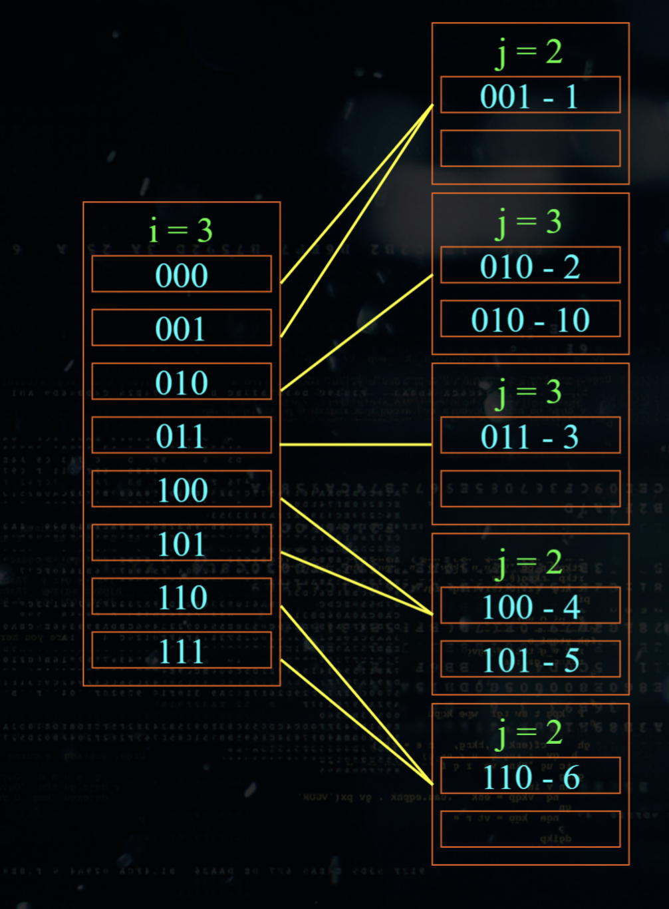
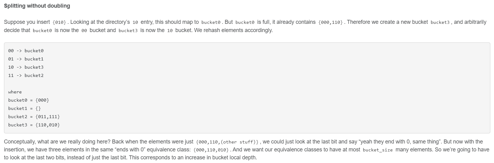
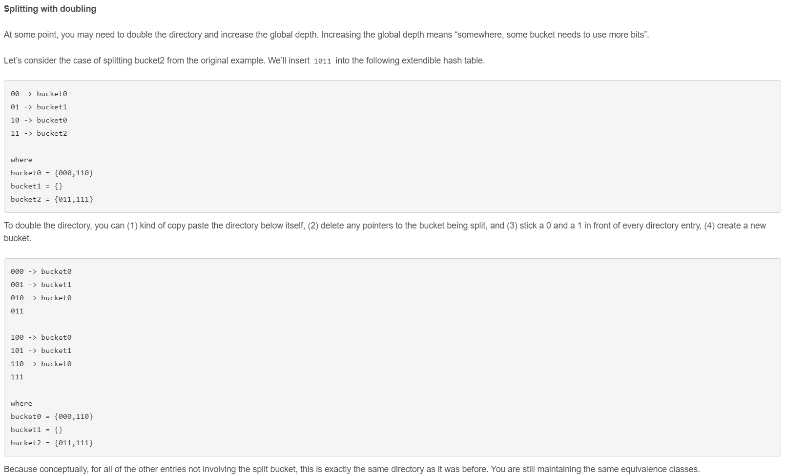
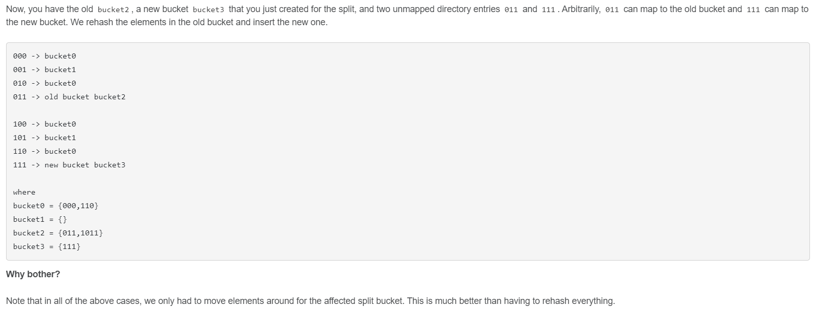

## [Task #3 - Buffer Pool Manager Instance](https://15445.courses.cs.cmu.edu/fall2022/project1/#buffer-pool-instance)


## [Task #2 - LRU-K Replacement Policy](https://15445.courses.cs.cmu.edu/fall2022/project1/#lru-k-replacer)

`lru_k_replacer.*` (`LRU`: least recent use)

https://blog.csdn.net/Altair_alpha/article/details/127745308#LRUK__57

The LRU-K replacement strategy can be summed up in one sentence, which is to always kick out the elements that have not reached K visits first, otherwise, the elements that have reached K visits will be kicked out according to LRU

__Backward K-distance__:
```
b_t(p, K) = x,        if r_(t-x) has the value p and there have been 
                      exactly K-1 other values i with t - x < i <= t, where r_i = p

b_t(p, K) = infinity, if p does not appear at least K times in r_1, r_2 ..., r_t
```
=> Với các phần tử ko được visited ít nhất K làn thì khoảng cách là infinity, sẽ được loại bỏ trước.
=> Nếu ko, loại bỏ phần tử có access record time sớm nhất (FIFO)

__Thực thi__:

- Maintain access history queue (record elements that have not reached K visits) and
a cache queue (recording elements that have reached K visits).

- When an element is accessed K times, move it from history queue to cache queue.

- When replacing. Kick out from history queue first, then cache queue.

__Note__:

- The cache queue is based on LRU so when an element is accessed, it must moved to the head of the queue.

- History queue use FIFO, so no need to move 

- We need to record the `number of visits` and the `position in the queue` of each element.

- Each element has an `evictable` tag , and if it is false, it cannot be kicked out anyway. 
Therefore, design a structure `FrameEntry` to record this information.


https://techoverflow.net/2021/09/06/how-to-get-time-since-epoch-in-milliseconds-in-c
```c
#include <chrono>
uint64_t timeSinceEpochMilliseconds = std::chrono::duration_cast<std::chrono::milliseconds>(
    std::chrono::system_clock::now().time_since_epoch()
).count();
```

- - -

More [Multi-step LRU: SIMD-based Cache Replacement
for Lower Overhead and Higher Precision (2021)](https://arxiv.org/ftp/arxiv/papers/2112/2112.09981.pdf)


## [Task #1 - Extendible Hash Table](https://15445.courses.cs.cmu.edu/fall2022/project1/#extendible-hash-table)

* Related lecture video https://youtu.be/9yUlSabzVwQ?t=3856

* Demo trực quan dùng MSB như trong lecture https://devimam.github.io/exhash

* Đọc mô tả cụ thể của thuật toán [tại đây](https://www.geeksforgeeks.org/extendible-hashing-dynamic-approach-to-dbms). Mô tả này sát với thuật toán cần implement. Các ví dụ chưa đủ phức tạp. Cần kết hợp với demo ở trên để hiểu chi tiết cách implement thuật toán.


* `Directories`: These containers store pointers to buckets. Each directory is given a unique id which may change each time when expansion takes place. The hash function returns this directory id which is used to navigate to the appropriate bucket. Number of Directories = 2^Global Depth.

* `Buckets`: They store the hashed keys. Directories point to buckets. A bucket may contain more than one pointers to it if its local depth is less than the global depth.

* `Global Depth`: It is associated with the Directories. They denote the number of bits which are used by the hash function to categorize the keys. Global Depth = Number of bits in directory id.

* `Local Depth`: It is the same as that of Global Depth except for the fact that Local Depth is associated with the buckets and not the directories. Local depth in accordance with the global depth is used to decide the action that to be performed in case an overflow occurs. Local Depth is always less than or equal to the Global Depth.

* `Bucket Splitting`: When the number of elements in a bucket exceeds a particular size, then the bucket is split into two parts.

* `Directory Expansion`: Directory Expansion Takes place when a bucket overflows. Directory Expansion is performed when the local depth of the overflowing bucket is equal to the global depth.

- - -

Một điểm ko được giải thích kỹ là directory expansion nên làm như thế nào? Xem ví dụ này:

!! Cần đối chiếu phần bit của local depth ngược trở lại với phần bit trong directory !!






- - -

Tham khảo thêm ...
https://discord.com/channels/724929902075445281/1014055928619872276


```c
int mask = (1 << global_depth_) - 1; // left shift global_depth_
return std::hash<K>()(key) & mask; // IndexOf(key)
```
=> băm key vào index < 2^global_depth_
`global_depth_ = 0` => `mask =  0b` => `IndexOf(key) = 0`
`global_depth_ = 1` => `mask =  1b` => `IndexOf(key) = 0, 1`
`global_depth_ = 2` => `mask = 11b` => `IndexOf(key) = 0, 1, 2, 3`




