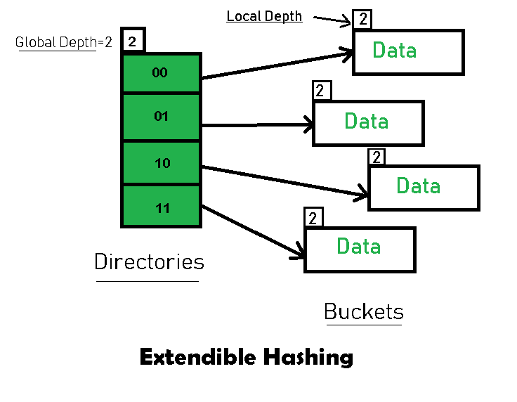
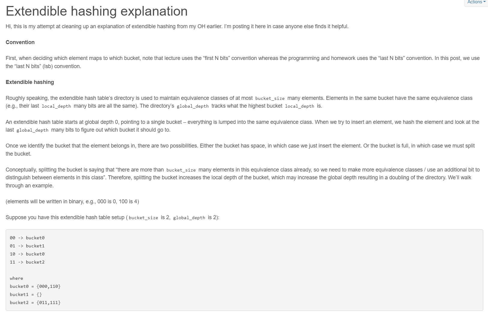

# https://15445.courses.cs.cmu.edu/fall2022/project1/

https://youtu.be/9yUlSabzVwQ?t=3856

https://devimam.github.io/exhash


- - -


https://www.geeksforgeeks.org/extendible-hashing-dynamic-approach-to-dbms



* `Directories`: These containers store pointers to buckets. Each directory is given a unique id which may change each time when expansion takes place. The hash function returns this directory id which is used to navigate to the appropriate bucket. Number of Directories = 2^Global Depth.

* `Buckets`: They store the hashed keys. Directories point to buckets. A bucket may contain more than one pointers to it if its local depth is less than the global depth.

* `Global Depth`: It is associated with the Directories. They denote the number of bits which are used by the hash function to categorize the keys. Global Depth = Number of bits in directory id.

* `Local Depth`: It is the same as that of Global Depth except for the fact that Local Depth is associated with the buckets and not the directories. Local depth in accordance with the global depth is used to decide the action that to be performed in case an overflow occurs. Local Depth is always less than or equal to the Global Depth.

* `Bucket Splitting`: When the number of elements in a bucket exceeds a particular size, then the bucket is split into two parts.

* `Directory Expansion`: Directory Expansion Takes place when a bucket overflows. Directory Expansion is performed when the local depth of the overflowing bucket is equal to the global depth.

- - -

Một điểm ko được giải thích kỹ là directory expansion nên làm như thế nào? Xem ví dụ này:

!! Cần đối chiếu phần bit của local depth ngược trở lại với phần bit trong directory !!


- - -


https://15445.courses.cs.cmu.edu/fall2022/project1/

`extendible_hash_table`

# https://discord.com/channels/724929902075445281/1014055928619872276


```c
int mask = (1 << global_depth_) - 1; // left shift global_depth_
return std::hash<K>()(key) & mask; // IndexOf(key)
```
=> băm key vào index < 2^global_depth_
`global_depth_ = 0` => `mask =  0b` => `IndexOf(key) = 0`
`global_depth_ = 1` => `mask =  1b` => `IndexOf(key) = 0, 1`
`global_depth_ = 2` => `mask = 11b` => `IndexOf(key) = 0, 1, 2, 3`


