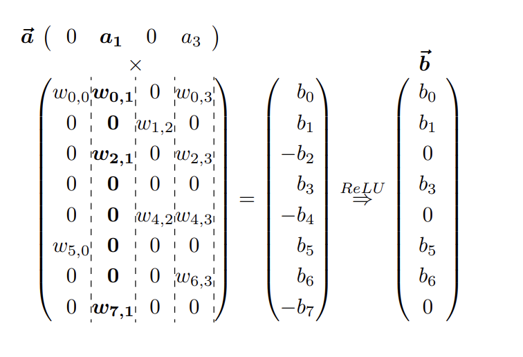
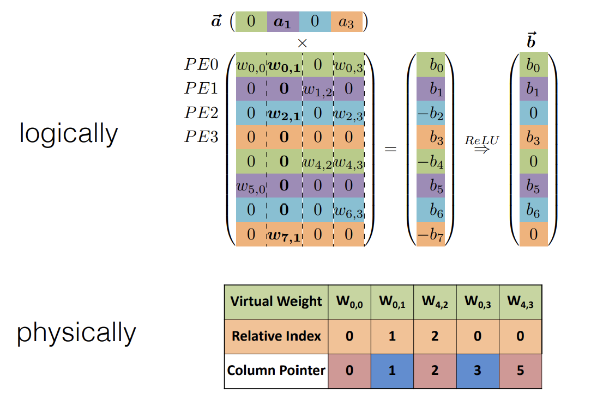

## System Support for Sparsity https://youtu.be/1njtOcYNAmg?t=2171 | 
https://hanlab.mit.edu/files/course/slides/MIT-TinyML-Lec04-Pruning-II.pdf

Conventional paradigm là huấn luyện, sau đó triển khai. Vấn đề ở đây là model bị super over parameterized dẫn tới thừa làm tốn tài nguyên và chậm.
Hướng thứ 2 là loại bỏ redundancies, remove over parameterization.

__EIE: Efficient Inference Engine__: Bộ tăng tốc đầu tiên cho mô hình thưa + nén.
- 0 * A = 0: sparse weight (static)
- W * 0 = 0: sparse activation, decide at runtime (dynamic)
- 2.09; 1.92 => 2: với NN, không cần độ chính xác cao, nên có thể dùng xấp xỉ hóa (quantization)

## Parallelization on Sparsity

Xem xét phép nhân vector thưa với 1 ma trận thưa.
- Vector thưa cho giá trị a1, a3 > 0
- Ma trận thưa có các giá trị w0,0; w0,1; w0.3; w2,1 ... > 0
- Kết quả phép nhân là một vector, và sau khi apply ReLU ta được kết quả cuối cùng là 1 vector thưa b

Tiếp theo ta map dữ liệu vào PE (processing elements), ở ví dụ trên ta sử dụng 4 PE.
- PE0 phụ trách hàng 1 và hàng 5 (màu xanh lá cây)
- PE1 phụ trách hàng 2 và hàng 6 (màu tím)
- PE2 phụ trách hàng 3 và hàng 7 (màu xanh nước biển)
- PE3 phụ trách hàng 4 và hàng 8 (màu cam)

PE0 chỉ quan tâm tới dữ liệu tại các hàng mà nó quản lý đó là: w0,0 w0,1 w0,3 w4,2 w4,3
- relative index: the gap between 0 and none-zero.
- column pointer: starting point and ending point of column. Với 4 cột chúng ta có 5 con số để chỉ ra ko chỉ điểm bắt đầu mà cả điểm kết thúc của cột???

This is an adapted version os CNC (compress the sparse column format)

...

## M:N Sparsity: https://youtu.be/1njtOcYNAmg?t=3440 (slide 129)

2021: sparsity, prunning, model compression has landed in immediate GPU
- sparsity now natively supported using an adapted version which is M:N Sparsity
- Accelerating Sparse Deep Neural Networks https://arxiv.org/pdf/2104.08378.pdf
