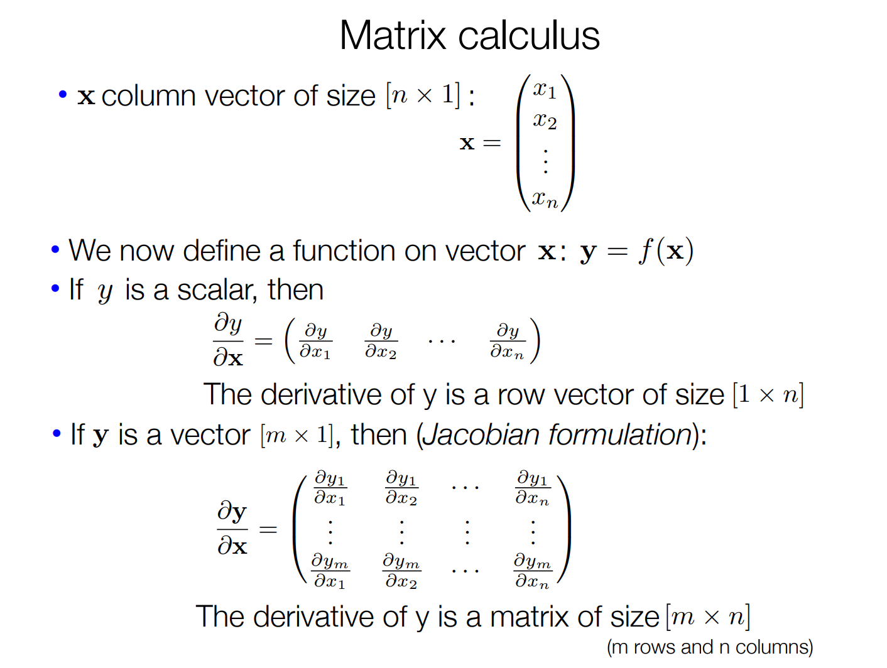
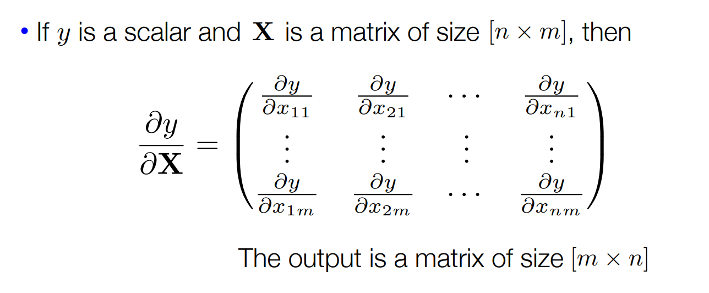
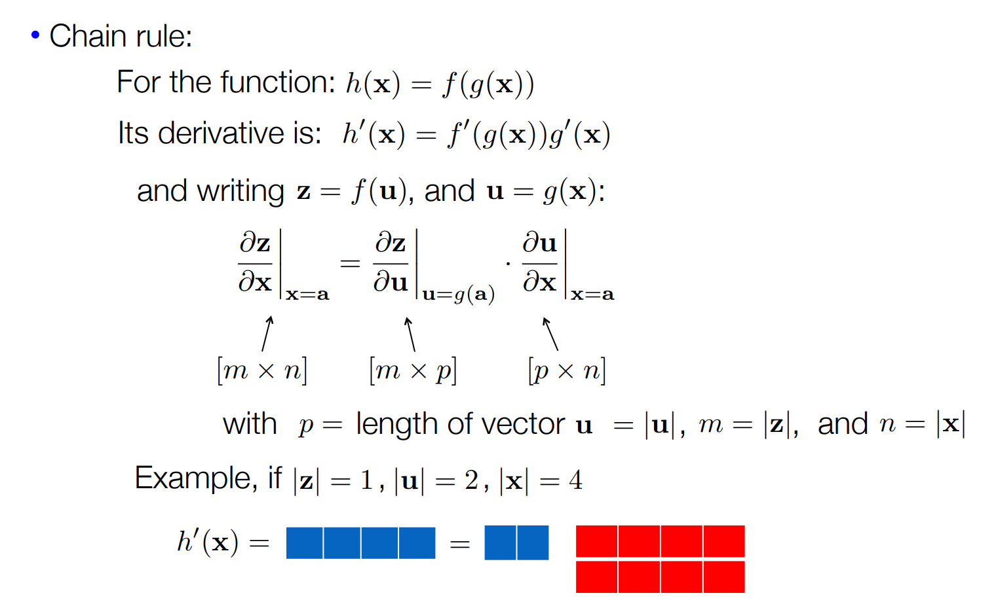
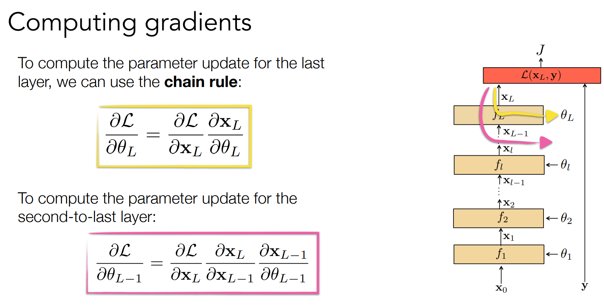
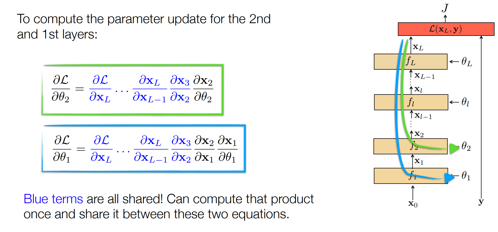
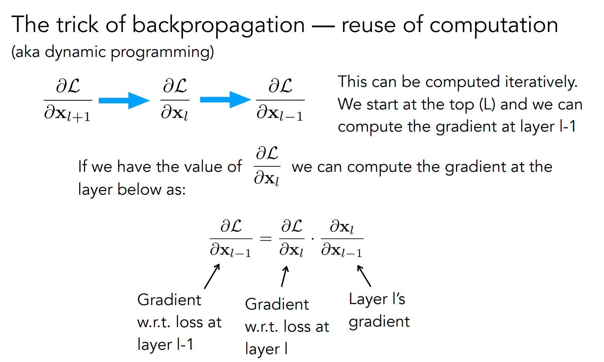
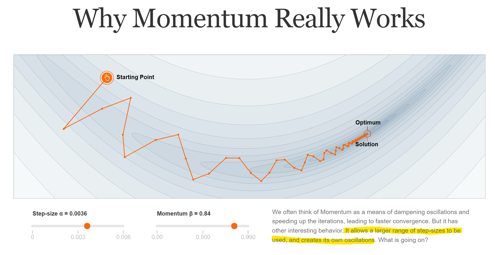
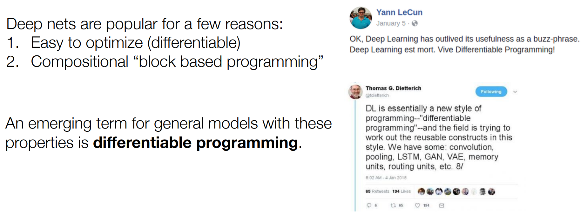

# Backprob
https://phillipi.github.io/6.s898/materials/slides/2_backprop.pdf

Wikipedia: The three types of derivatives that have not been considered are those involving vectors-by-matrices, matrices-by-vectors,
and matrices-by-matrices. These are not as widely considered and a notation is not widely agreed upon.

## Computing gradients

https://distill.pub/2017/momentum

## Differentiable programming

## Software 2.0
https://karpathy.medium.com/software-2-0-a64152b37c35

> To make the analogy explicit, in Software 1.0, human-engineered source code (e.g. some .cpp files) is compiled into a binary that does useful work. In Software 2.0 most often the source code comprises 1) the dataset that defines the desirable behavior and 2) the neural net architecture that gives the rough skeleton of the code, but with many details (the weights) to be filled in. The process of training the neural network compiles the dataset into the binary — the final neural network. In most practical applications today, the neural net architectures and the training systems are increasingly standardized into a commodity, so most of the active “software development” takes the form of curating, growing, massaging and cleaning labeled datasets. This is fundamentally altering the programming paradigm by which we iterate on our software, as the teams split in two: the 2.0 programmers (data labelers) edit and grow the datasets, while a few 1.0 programmers maintain and iterate on the surrounding training code infrastructure, analytics, visualizations and labeling interfaces.

