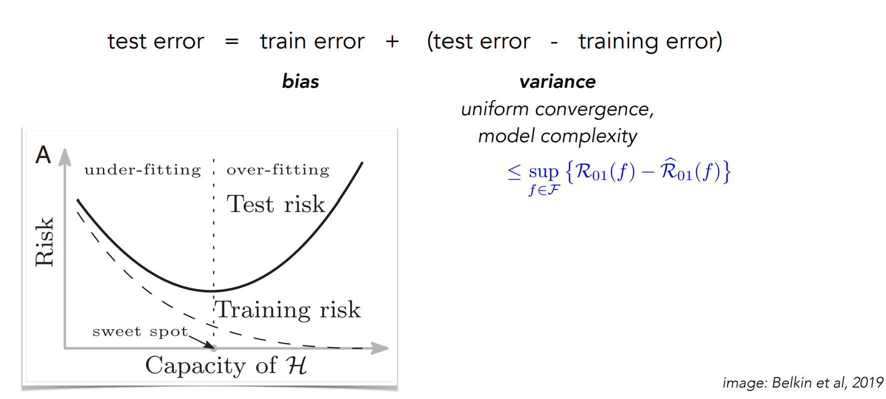
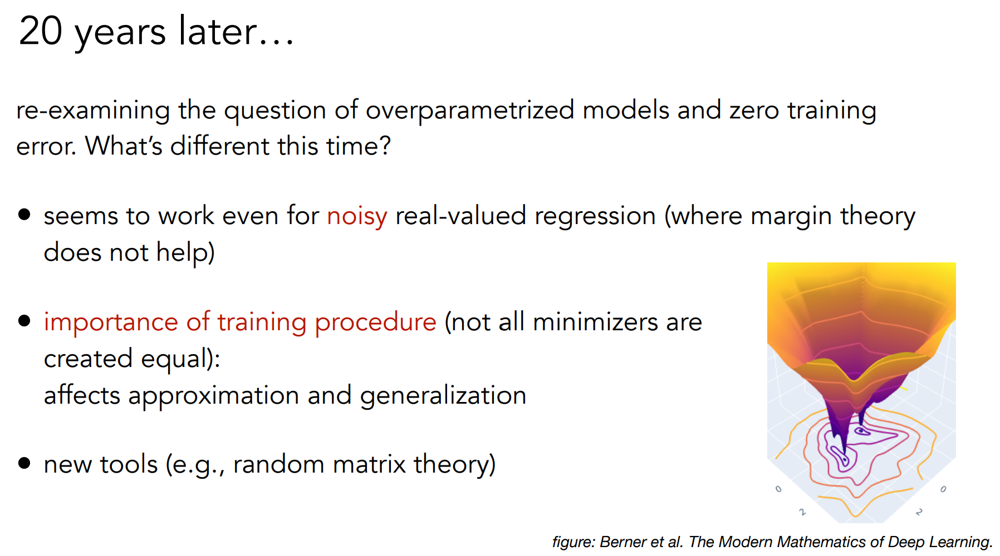
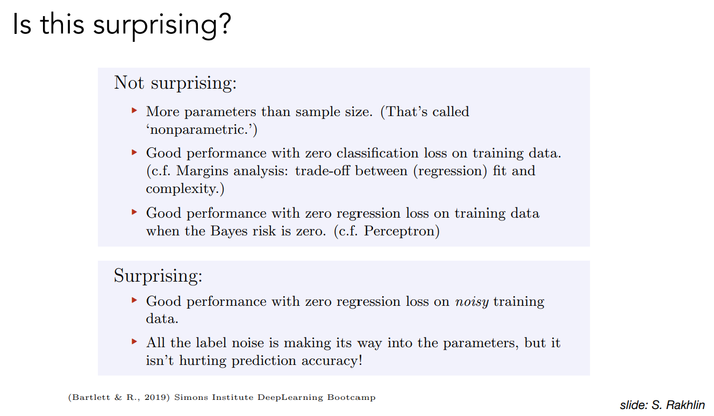
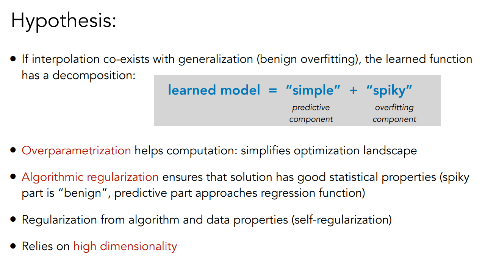

# Generalization theory (IID)
(tại sao nn lại khái quát hóa được?)

https://phillipi.github.io/6.s898/materials/slides/4_generalization1.pdf

- Generalization - the classical picture
- Memorization and benign overfitting
- Simplified setting: linear models and double descent
- Nonlinear models
- Generalized double descent

- Khái quát hóa - bức tranh cổ điển
- Ghi nhớ và điểm tốt của overfitting
- Đơn giản hóa: mô hình tuyến tính và double descent
- Mô hình không tuyến tính
- Generalized double descent

## The classical view (since 60s)

https://www.youtube.com/watch?v=Kih-VPHL3gA

__Giả thiết__ nếu nội suy cùng tồn tại với khái quát hóa (benign overfitting), hàm học được sẽ bao gồm 
`learned model = "simple" + "spiky"`

...