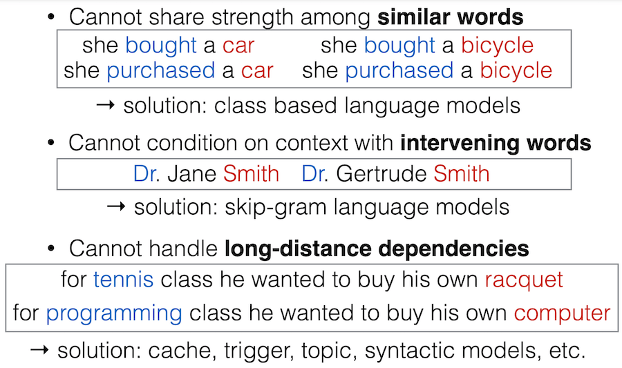
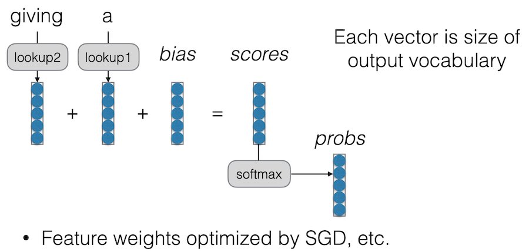
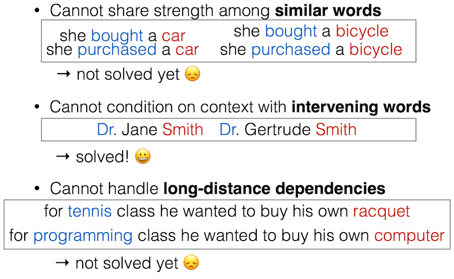
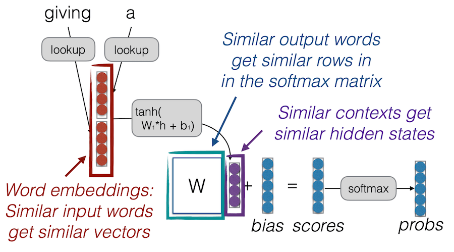
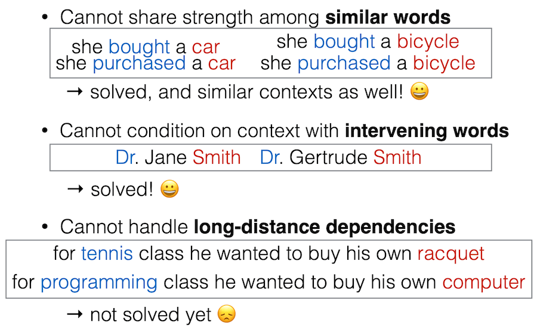

## Intro 3: LM and NN basic | [video](https://www.youtube.com/watch?v=pifqfW2ApI4) | [slides](https://phontron.com/class/anlp2022/assets/slides/anlp-03-lm.pdf) | [code](https://github.com/neubig/anlp-code/blob/main/03-lm/nn-lm.py)

* Language Modeling Problem Definition
* Count-based Language Models
* Measuring Language Model Performance: Accuracy, Likelihood, and Perplexity
* Log-linear Language Models
* Neural Network Basics
* Feed-forward Neural Network Language Models

Highly Recommended Reading: Goldberg Book Chapter 8-9

- - -

Đã có người làm assignment 1 (build Bert from scratch). Năm nay có giới hạn thời gian chạy assignemnt vì năm ngoái có người impl matrix-mul in for-loop, và chương trình chạy mãi ko dừng :) Liên hệ tới lớp `dlsys`, 1 trong điều đầu tiên họ dạy là dùng mẻ ma trận (matrix batch) thay vì thao tác trên từng vector. Nếu chưa có nhiều kinh nghiệm về NLP thì nên chờ tới Attention lecture thì hãy làm assignment 1.

- - -

n-gram (count based)LM đòi hỏi ít tính toán nhưng naive, nên giờ ko được dùng nhiều nữa. *Hiện giờ chúng ta chủ yếu dùng NNLM*, nhưng có hiểu biết về n-gram và lý do tại sao chúng làm việc chưa tốt sẽ cho chúng ta lý do tại sao NNLM là một công cụ tốt cho NLP.

!! Những giải pháp cho các vđ trên là adhoc, khó impl và triển khai !!

Neural language models (next) achieve better performance, but
* n-gram models are extremely fast to estimate/apply
* n-gram models can be better at modeling lowfrequency phenomena
* Toolkit: https://github.com/kpu/kenlm

### An Alternative: Featurized Log-Linear Models (Rosenfeld 1996)

* Calculate features of the `context`
* Based on the features, calculate `probabilities`
* Optimize feature weights using `gradient descent`, etc.

### Feed-forward neural network language model

## Neural network

A computational graph model:
* node ko có cạnh trỏ tới is tensor, matrix, vector, scalar value
* cạnh thể hiện 1 tham số của hàm và sự phụ thuộc về dữ liệu
* node có cạnh trỏ tới là hàm. vd $f(u)=u^T$ (thông thường có 1, 2 cạnh)

Các việc cần làm để train nn:
* Xây dựng dựng computational graph
* forward propagation (tính toán giá trị node dựa trên input từ đầu tới cuối)
* backward propagation (tính đạo hàm từ cuối tới đầu)
