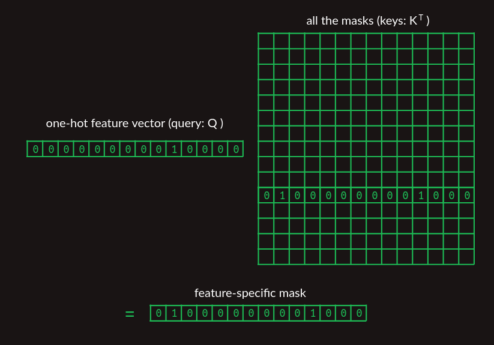
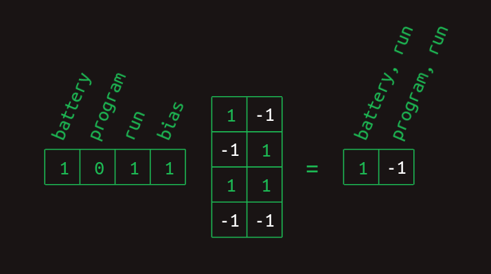

https://e2eml.school/transformers.html

[Attention is all you need](https://www.youtube.com/watch?v=rBCqOTEfxvg)

https://blog.nelhage.com/post/transformers-for-software-engineers

https://towardsdatascience.com/7-things-you-didnt-know-about-the-transformer-a70d93ced6b2 |
https://docs.google.com/document/d/11Ca1R55pA9bSOj1ef9EDy3toW8ujGYzEQGCMpUNZ91s/edit

## Second order sequence model with skips

Mô hình trình tự bậc hai hoạt động tốt khi chúng ta chỉ phải nhìn lại hai từ để quyết định từ nào xuất hiện tiếp theo. Còn khi chúng ta phải nhìn lại xa hơn thì sao?

Hãy tưởng tượng chúng ta đang xây dựng một mô hình ngôn ngữ khác. Mô hình này chỉ đại diện cho hai câu, mỗi câu đều có khả năng xảy ra như nhau.

> "Check the program log and find out whether it ran please."
> "Check the battery log and find out whether it ran down please."

Trong ví dụ trên, để xác định từ nào sẽ xuất hiện sau `ran`, chúng ta sẽ phải nhìn lại 9 từ trong quá khứ. Nếu chúng ta muốn cải thiện mô hình ngôn ngữ bậc hai của mình, chúng ta có thể xem xét các mô hình bậc ba trở lên. Tuy nhiên, với một lượng từ vựng đáng kể, điều này cần sự kết hợp giữa sự sáng tạo và tính vũ phu để thực hiện. Một triển khai ngây thơ của mô hình bậc tám sẽ có $N^8$ hàng, một con số vô lý đối với bất kỳ ngôn ngữ hợp lý nào.

Thay vào đó, chúng ta có thể làm điều gì đó ranh mãnh và tạo mô hình bậc hai, nhưng hãy xem xét sự kết hợp của từ gần đây nhất với từng từ đã có trước đó. Nó vẫn là trình tự bậc hai, bởi vì chúng ta chỉ xem xét hai từ cùng một lúc, nhưng nó cho phép chúng ta tiếp cận xa hơn và nắm bắt các phụ thuộc trong phạm vi dài. Sự khác biệt giữa *mô hình bậc hai với số lần bỏ qua* và mô hình bậc mười mười đầy đủ là chúng ta loại bỏ hầu hết thông tin về trình tự từ và sự kết hợp của các từ phía trước. Những gì còn lại vẫn còn khá mạnh mẽ.

Chúng ta vẫn có thể thể hiện mối liên hệ giữa **từng cặp từ đứng trước** và những từ tiếp theo. Ở đây chúng ta chỉ hiển thị các mũi tên được liên kết với các trọng số khác 0. Trọng số lớn hơn được hiển thị với các đường đậm hơn.

*Từng đặc trưng bỏ phiếu bầu cho lựa chọn cuối cùng*

Mỗi hàng đại diện cho một trong nhiều **đặc trưng** có thể mô tả trình tự tại một điểm cụ thể. Sự kết hợp của từ gần đây nhất với mỗi từ trước đó tạo nên một tập hợp các hàng có thể áp dụng. Do sự thay đổi ý nghĩa này, mỗi giá trị trong ma trận không còn đại diện cho một xác suất, mà là một phiếu bầu. Các phiếu bầu sẽ được tổng hợp và so sánh để xác định các dự đoán từ tiếp theo.

Điều tiếp theo trở nên rõ ràng là hầu hết các đặc trưng đều không quan trọng. Hầu hết các từ đều xuất hiện trong cả hai câu, và vì vậy việc chúng được nhìn thấy không giúp ích gì cho việc dự đoán điều gì sẽ xảy ra tiếp theo. Tất cả chúng đều có giá trị là 0.5. Hai ngoại lệ duy nhất là battery và program. Chúng có một số trọng số 1 và 0 được kết hợp với. Đặc trưng `battery, ran` cho biết rằng `ran` là từ gần đây nhất và `battery` đó xuất hiện ở đâu đó trước đó trong câu. Đặc trưng này có trọng số 1 được liên kết với `down` và trọng số bằng 0 được liên kết với `please`. Cấu trúc này cho thấy rằng sự hiện diện của hai từ này trước đó trong câu có ý nghĩa quyết định trong việc dự đoán từ nào xuất hiện tiếp theo.

> "Check the `program` log and find out whether it ran please."
> "Check the `battery` log and find out whether it ran down please."

*Ma trận chuyển đổi của trình tự bậc hai có bỏ qua*

Để chuyển đổi tập hợp các đặc trưng cặp-từ này thành một ước tính từ tiếp theo, cần phải tính tổng các giá trị của tất cả các hàng có liên quan. Với chuỗi đầu vào `Check the program log and find out whether it ran` tổng theo cột = 0 với mọi từ đầu vào ngoại trừ 4 cho `down` và 5 cho `please`. Tương tự với chuỗi `Check the battery log and find out whether it ran`, ngoại trừ 5 cho `down` và 4 cho `please`.

Bằng việc chọn từ tiếp thoe với số tổng trọng số lớn nhất, mô hình này giúp chúng ta có câu trả lời đúng, mặc dù có tám từ phụ thuộc sâu.

## Masking

Cân nhắc kỹ hơn ta thấy sự khác biệt giữa 4 và 5 là rất nhỏ, điều đó chứng tỏ mô hình không thực sự tự tin vào quyết định của mình. Với mô hình ngôn ngữ lớn hơn ta có thể dễ dàng hình dung ra sự khác biệt nhỏ như vậy sẽ bị che lẫn bởi nhiễu thống kê.

Chúng ta có thể cải thiện dự đoán bằng cách loại bỏ các trọng số của các đặc trưng không mang thông tin ngoại trừ `battery, ran` và `program, ran`. Tại thời điểm này, thật hữu ích khi nhớ rằng chúng ta kéo các hàng có liên quan ra khỏi ma trận chuyển tiếp bằng cách nhân nó với một vec-tơ thể hiển các đặc trưng hiện đang được kích hoạt.

Để cải thiện kết quả, chúng ta cũng có thể ép trọng số của các đặc trưng không hữu ích về 0 bằng cách tạo một mặt nạ. Đó là một vec-tơ có giá trị là 1 ngoại trừ các vị trí bạn muốn ẩn hoặc che dấu thì được đặt thành 0. Trong trường hợp trên, chúng ta muốn che giấu mọi thứ ngoại trừ `battery, ran` và `program, ran`, hai đặc trưng duy nhất có ích.

*Các đặc trưng được kích hoạt sau khi sử dụng mặt nạ*

*Ma trận chuyển đổi sau khi sử dụng mặt nạ*

Sau khi che dấu các đặc trưng không hữu ích, các dự đoán từ tiếp theo trở nên mạnh mẽ hơn nhiều. Khi từ `battery` xuất hiện sớm hơn trong câu, "từ" sau `ran` được dự đoán là `down` với trọng số là 1 và `please` với trọng số là 0. Sự khác biệt về trọng số từ 25 phần trăm đã trở thành sự khác biệt 100%. Không có nghi ngờ gì về từ xuất hiện tiếp theo.

Quá trình che giấu các đặc trưng này chính là attention như trong tiêu đề của bài báo "Attention í all we need". Cho đến nay, những gì chúng ta đã mô tả chỉ là một ước tính gần đúng về cách sự chú ý được thực hiện trong bài báo. Nó nắm bắt các khái niệm quan trọng, nhưng các chi tiết là khác nhau.

## Rest Stop and an Off Ramp

Các phần tiếp theo trình bày nhiều hơn về khoảng cách giữa những giải thích trực quan này và cách mô hình transformer được thực hiện. Những điều này chủ yếu được thúc đẩy bởi ba cân nhắc thực tế.

1. Máy tính đặc biệt giỏi trong phép nhân ma trận. Có cả một ngành công nghiệp xung quanh việc xây dựng phần cứng máy tính cho phép nhân ma trận nhanh. Bất kỳ phép tính nào có thể được biểu thị dưới dạng phép nhân ma trận đều có thể được thực hiện một cách hiệu quả đáng kinh ngạc. Đó là một chuyến tàu cao tốc. Nếu bạn có thể để hành lý của mình vào đó, nó sẽ đưa bạn đến nơi bạn muốn thật nhanh chóng.

2. Mỗi bước cần phải đạo hàm được. Cho đến nay, chúng ta mới chỉ làm việc với các ví dụ đơn giản và đã có sự thuận lợi khi chọn bằng tay tất cả các xác suất chuyển đổi và giá trị mặt nạ — các thông số mô hình. Trong thực tế, chúng phải được học thông qua lan truyền ngược, điều này phụ thuộc vào mỗi bước tính toán có thể đạo hàm được. Điều này có nghĩa là đối với bất kỳ thay đổi nhỏ nào của một tham số, chúng ta có thể tính toán sự thay đổi tương ứng trong hàm mất mát của mô hình.

3. Gradient cần phải `mịn và được điều hòa tốt`. Sự kết hợp các đạo hàm của tất cả các tham số là gradient (độ dốc) mất mát. Trong thực tế, để việc lan truyền ngược hoạt động tốt đòi hỏi các độ dốc phải mịn, nghĩa là, độ dốc không thay đổi quá nhanh khi bạn thực hiện di chuyển nhỏ theo bất kỳ hướng nào. Chúng cũng hoạt động tốt hơn nhiều khi gradient được điều hòa tốt, nghĩa là nó không lớn hơn hoàn toàn theo hướng cụ thể. Nếu bạn hình dung một hàm mất mát như một địa hình, thì Grand Canyon sẽ là một hàm được điều hòa kém. Tùy thuộc vào việc bạn đang đi dọc theo phía dưới hay lên phía trên, bạn sẽ có những con dốc rất khác nhau để di chuyển. Ngược lại, những ngọn đồi nhấp nhô của trình bảo vệ màn hình Windows cổ điển sẽ có độ dốc được điều chỉnh tốt.

> Nếu khoa học về kiến trúc mạng nơ-ron là tạo ra các khối lắp ráp có thể đạo hàm, thì nghệ thuật của nó chính là xếp chồng các khối đó theo cách sao cho độ dốc (gradient) không thay đổi quá nhanh và gần như có cùng độ lớn theo mọi hướng.

## Cơ chế chú ý như phép nhân ma trận

Như đã thấy ở ví dụ trên, trọng số đặc trưng có thể được xây dựng dễ dàng bằng việc đếm việc xuất hiện cùng nhau của cặp-từ và từ-tiếp-theo trong tập huấn luyện. Mặt nạ chú ý (attention mask) không đơn giản như vậy. Cách mô hình transformer tính toán mặt nạ là quan trọng. Chúng ta sẽ cố gắng sử dụng phép nhân ma trận thay vì tra cứu bảng (hình dưới).

*Dùng ma trận để tra cứu vec-tơ mặt nạ*

Ma trận trên thể hiện một tập hợp các vec-tơ mặt nạ, chỉ hiển thị tham số của vec-tơ chúng ta sẽ lấy ra để tránh lẫn

Tới đây chúng ta bắt đầu đi dần vào bài báo bởi vì việc tra cứu mặt nạ ở trên có thể được thể hiện bằng phép nhân ma trận $QK^T$ như trong phương trình attention.

*Phương trình chú ý*

$Q$ (the query) thể hiện các đặc trưng được quan tâm và ma trận $K$ thể hiện một tập hợp mặt nạ. Vì $K$ lưu mặt nạ trong cột nên nó cần được chuyển vị trước khi nhân với $Q$. Chúng ta sẽ thêm các thay đổi quan trọng vào phương trình sau, hiện tại nó đã thể hiện được một bảng tra cứu có thể đạo hàm được dùng trong transformers.

## Second order sequence model as matrix multiplications

Một khi chúng ta đã có kết quả từ bước attention ở trên, một vec-tơ (one-hot) của từ gần đây nhất, và một tập hợp nhỏ các từ ở trước nó, ta cần thể hiện nó ở dạng đặc trưng (feature) của mỗi cặp-từ. Mặt nạ chú ý cho chúng ta vật liệu thô để làm điều đó nhưng nó không xây nên những đặc trưng cặp-từ. Để làm điều đó, chúng ta có thể sử dụng một tầng kết nối đầy đủ trong mạng nơ-ron.

Để minh họa các mạng nơ-ron tạo nên các cặp từ, chúng ta sẽ xây dựng bằng tay trước một mạng như thế. Để cho ví dụ nhỏ và rõ ràng, chúng ta sẽ chỉ tập trung vào 3 từ được chú ý, như ở ví dụ, trên là `battery`, `program`, `ran`.

*Lớp nơ-ron tạo ra đặc trưng*

Trong biểu đồ lớp nơ-ron ở trên, chúng ta có thể thấy các trọng số kết hợp với nhau để tạo nên sự có hay vắng mặt của từng từ một trong tập hợp các đặc trưng. Nó có thể được thể hiện ở dạng ma trận.

*Ma trận tạo ra các đặc trưng*

Và nó có thể được tính toán bằng phép nhân ma trận với một **vec-tơ thể hiện một tập hợp từ đã được nhìn thấy**.

*Đặc trưng bậc 2 của cặp `battery, run`*

Với đầu được nhìn thấy là cặp từ `battery, run`, phần tử tương ứng của từ `battery` và từ `ran` có giá trị là 1 và của `program` là 0. Phần tử bias luôn có giá trị là 1, là một đặc trưng của mạng nơ-ron. Thông qua phép nhân ma trận, phàn tử đại diện cho `battery, run` có giá trị là 1, và -1 cho phần tử đại diện cho `program, ran`. Cách tính tưong tự cho đầu vào là cặp `program, run` được nhìn thấy (hình dưới).

*Đặc trưng bậc 2 của cặp `program, run`*

- - -

The final step in calculating these word combo features is to apply a rectified linear unit (ReLU) nonlinearity. The effect of this is to substitute any negative value with a zero. This cleans up both of these results so they represent the presence (with a 1) or absence (with a 0) of each word combination feature.

Bước cuối cùng để tính toán các tính năng kết hợp từ này là áp dụng đơn vị tuyến tính được điều chỉnh (ReLU). Tác dụng của việc này là thay thế bất kỳ giá trị âm nào bằng số không. Thao tác này xóa cả hai kết quả (??) để chúng đại diện cho sự hiện diện (với 1) hoặc vắng mặt (với 0) của mỗi từ trong đặc trưng kết hợp.

Cuối cùng chúng ta đã có một phương pháp nhân ma trận để tạo các đặc trưng đa từ. Mặc dù ban đầu tôi đã tuyên bố rằng chúng bao gồm từ gần đây nhất và một từ trước đó, nhưng xem xét kỹ hơn phương pháp này cho thấy rằng nó cũng có thể xây dựng các đặc trưng khác. Khi ma trận tạo đối tượng được học thay cho mã hóa cứng, các cấu trúc khác có thể được học. Ngay cả trong ví dụ đơn giản ở trên, không có gì ngăn cản việc tạo ra một tổ hợp ba từ như `battery, program, ran`. Nếu sự kết hợp này xảy ra đủ phổ biến, nó có thể sẽ được thể hiện (trong ma trận tham số).

Chưa có cách thức nào để chỉ ra thứ tự các từ xuất hiện, nhưng chúng ta hoàn toàn có thể sử dụng đồng xuất hiện của chúng để đưa ra dự đoán. Thậm chí có thể sử dụng các tổ hợp từ bỏ qua các từ gần đây nhất. Những đặc trưng này và các loại đặc trưng khác có thể được tạo ra trong thực tế, cho thấy sự đơn giản hóa quá mức khi tôi tuyên bố rằng transformers là mô hình trình tự chọn-lọc-bậc-hai-có-bỏ-qua. Có nhiều sắc thái hơn thế, và bây giờ bạn có thể thấy chính xác sắc thái đó là gì. Đây sẽ không phải là lần cuối cùng chúng tôi thay đổi câu chuyện để kết hợp tinh tế hơn.

Ở dạng này, ma trận đặc trưng đa-từ đã sẵn sàng cho một phép nhân ma trận nữa, mô hình trình tự bậc hai có bỏ qua mà chúng tôi đã phát triển ở trên. Tất cả cùng nhau, trình tự của:

- nhân ma trận tạo tính năng,
- ReLU phi tuyến tính và
- phép nhân ma trận chuyển tiếp

là các bước xử lý chuyển tiếp (feedforward) được áp dụng sau khi áp dụng attention. Phương trình 2 từ bài báo cho thấy các bước này trong một công thức toán học ngắn gọn.

Sơ đồ kiến trúc trong Hình 1 của bài báo cho thấy những khối này được gộp lại với nhau thành khối Feed Forward.

## Sequence completion

So far we've only talked about next word prediction. There are a couple of pieces we need to add to get our decoder to generate a long sequence. The first is a `prompt`, some example text to give the transformer running start and context on which to build the rest of the sequence. It gets fed in to decoder, the column on the right in the image above, where it's labeled "Outputs (shifted right)". Choosing a prompt that gives interesting sequences is an art in itself, called prompt engineering. It's also a great example of humans modifying their behavior to support algorithms, rather than the other way around.

Once the decoder has a partial sequence to get started with, it takes a forward pass. The end result is a set of predicted probability distributions of words, one probability distribution for each position in the sequence. At each position, the distribution shows the predicted probabilities for each next word in the vocabulary. We don't care about predicted probabilities for each established word in the sequence. They're already established. What we really care about are the predicted probabilities for the next word after the end of the prompt. There are several ways to go about choosing what that word should be, but the most straightforward is called `greedy`, picking the word with the highest probability.

The new next word then gets added to the sequence, substituted in at the with the "Outputs" at the bottom of the decoder, and the process is repeated until you get tired of it.

The one piece we're not quite ready to describe in detail is yet another form of masking, ensuring that when the transformer makes predictions it only looks behind, not ahead. It's applied in the block labeled "Masked Multi-Head Attention". We'll revisit this later when we can be clearer about how it's done.

## Embeddings

As we’ve described them so far, transformers are too big. For a vocabulary size N of say 50,000, the transition matrix between all pairs of words and all potential next words would have 50,000 columns and 50,000 squared (2.5 billion) rows, totaling over 100 trillion elements. That is still a stretch, even for modern hardware.

It’s not just the size of the matrices that’s the problem. In order to build a stable transition language model, we would have to provide training data illustrating every potential sequence several times at least. That would far exceed the capacity of even the most ambitious training data sets.

Fortunately, there is a workaround for both of these problems, embeddings.

In a one-hot representation of a language, there is one vector element for each word. For a vocabulary of size N that vector is an N-dimensional space. Each word represents a point in that space, one unit away from the origin along one of the many axes. I haven't figured out a great way to draw a high dimensional space, but there's a crude representation of it below.

In an embedding, those word points are all taken and rearranged (projected, in linear algebra terminology) into a lower-dimensional space. The picture above shows what they might look like in a 2-dimensional space for example. Now, instead of needing N numbers to specify a word, we only need 2. These are the (x, y) coordinates of each point in the new space. Here's what a 2-dimensional embedding might look like for our toy example, together with the coordinates of a few of the words.

A good embedding groups words with similar meanings together. A model that works with an embedding learns patterns in the embedded space. That means that whatever it learns to do with one word automatically gets applied to all the words right next to it. This has the added benefit of reducing the amount of training data needed. Each example gives a little bit of learning that gets applied across a whole neighborhood of words.

In this illustration I tried to show that by putting important components in one area (battery, log, program), prepositions in another (down, out), and verbs near the center (check, find, ran). In an actual embedding the groupings may not be so clear or intuitive, but the underlying concept is the same. Distance is small between words that behave similarly.

An embedding reduces the number of parameters needed by a tremendous amount. However, the fewer the dimensions in the embedded space, the more information about the original words gets discarded. The richness of a language still requires quite a bit of space to lay out all the important concepts so that they don't step on each other's toes. By choosing the size of the embedded space, we get to trade off computational load for model accuracy.

Projection matrices can convert the original collection of one-hot vocabulary vectors into any configuration in a space of whatever dimensionality you want. The biggest trick is finding a useful projection, one that has similar words grouped together, and one that has enough dimensions to spread them out. There are some decent pre-computed embeddings for common langauges, like English. Also, like everything else in the transformer, it can be learned during training.

In the Figure 1 architecture diagram of the original paper, here's where the embedding happens.

## Positional encoding

Up to this point, we've assumed that the positions of words are ignored, at least for any words coming before the very most recent word. Now we get to fix that using positional embeddings.

There are several ways that position information could be introduced into our embedded represetation of words, but the way it was done in the original transformer was to add a circular wiggle.

The position of the word in the embedding space acts as the center of a circle. A perturbation is added to it, depending on where it falls in the order of the sequence of words. For each position, the word is moved the same distance but at a different angle, resulting in a circular pattern as you move through the sequence. Words that are close to each other in the sequence have similar perturbations, but words that are far apart are perturbed in different directions.

Since a circle is a two dimensional figure, representing a circular wiggle requires modifying two dimensions of the embedding space. If the embedding space consists of more than two dimensions (which it almost always does), the circular wiggle is repeated in all the other pairs of dimensions, but with different angular frequency, that is, it sweeps out a different number of rotations in each case. In some dimension pairs, the wiggle will sweep out many rotations of the circle. In other pairs, it will only sweep out a small fraction of a rotation. The combination of all these circular wiggles of different frequencies gives a good representation of the absolute position of a word within the sequence.

I'm still developing my intuition for why this works. It seems to add position information into the mix in a way that doesn't disrupt the learned relationships between words and attention. For a deeper dive into the math and implications, I recommend [Amirhossein Kazemnejad's positional encoding tutorial](https://kazemnejad.com/blog/transformer_architecture_positional_encoding).

In the canonical architecture diagram these blocks show the generation of the position code and its addition to the embedded words.

## De-embeddings

