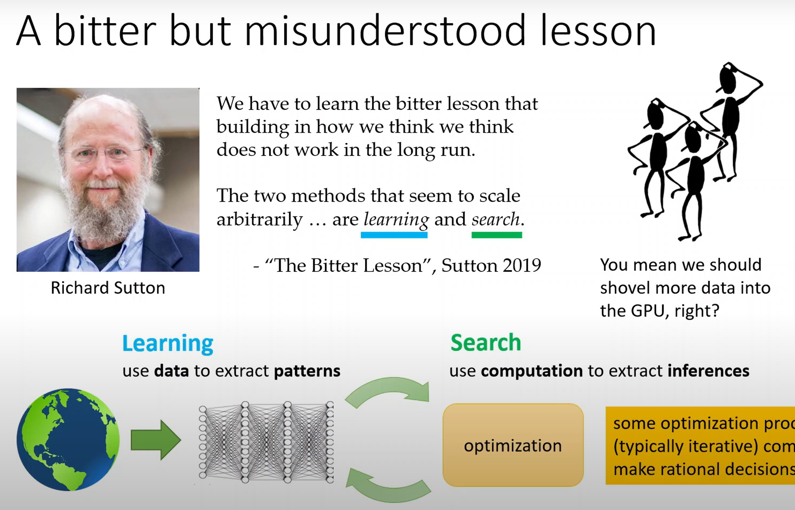
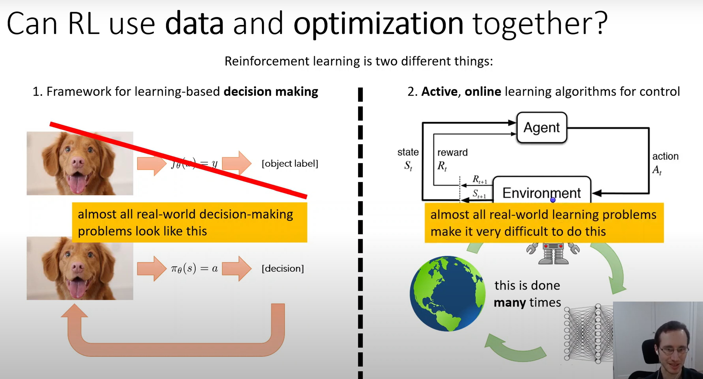
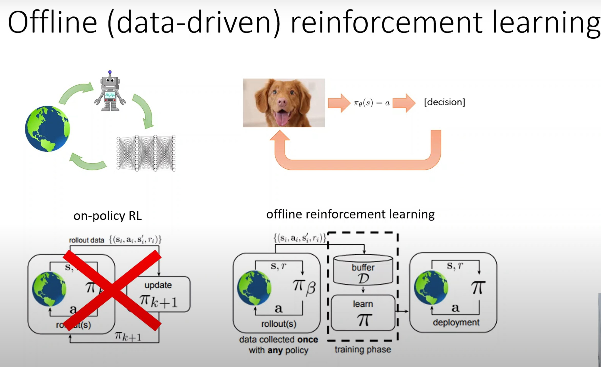
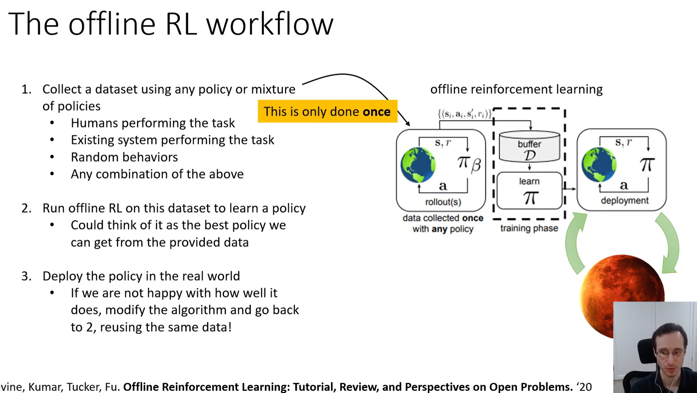
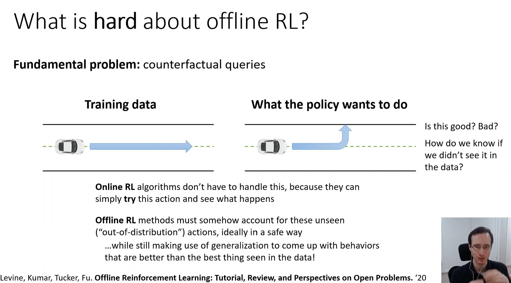
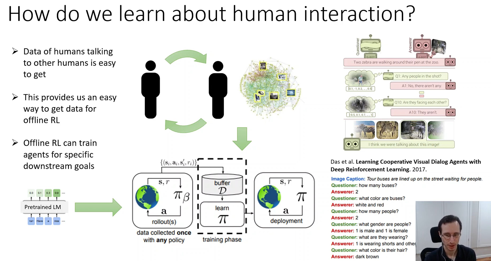
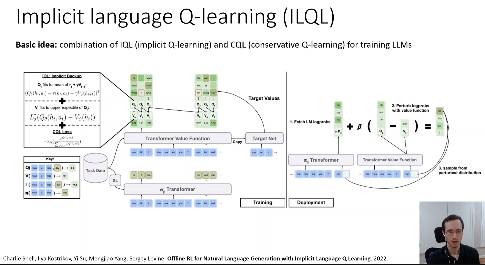
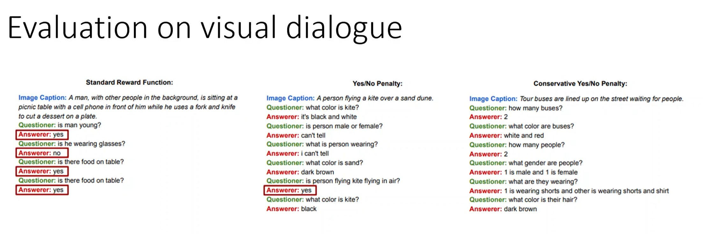
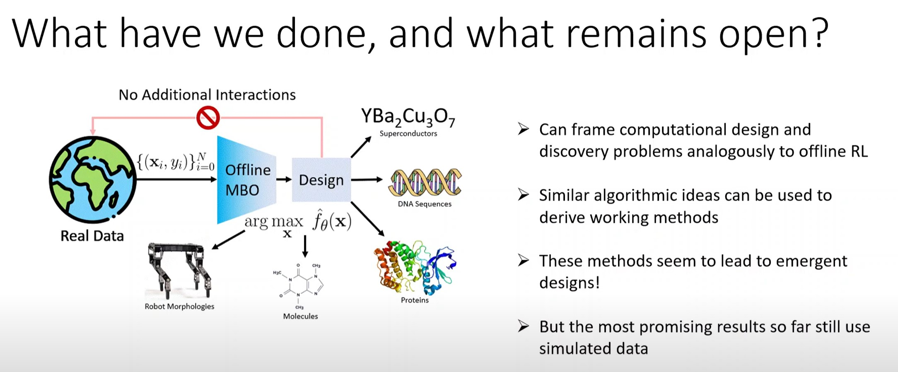
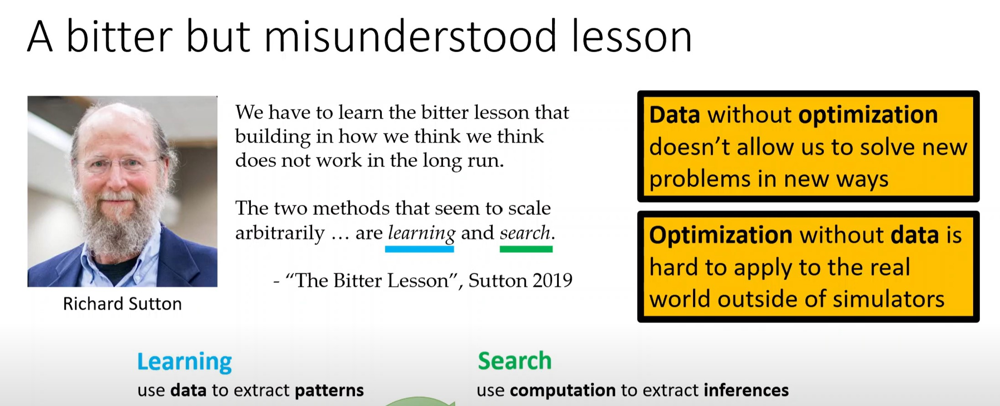

http://www.incompleteideas.net/IncIdeas/BitterLesson.html

# Liều thuốc đắng trong AI

> Bài học lớn nhất rút ra từ 70 năm là AI là, những phương pháp tổng quát tận dụng (leverage) sức mạnh tính toán cuối cùng lại là những phương pháp hiệu quả nhất và vượt xa các phương pháp khác.

Hầu hết các nghiên cứu về AI đều cho rằng lượng tính toán là cố định và cách duy nhất là sử dụng những kiến thức của con người để cải tiến hiệu năng, nhưng thời gian trôi qua số lượng tính toán nhiều hơn (với giá thành rẻ đi) đã trở nên sẵn sàng. Để tìm kiếm những cải tiến ngắn hạn, các nhà ngiên cứu thường tận dụng hiểu biết của con người của một lĩnh vực, nhưng cuối cùng chỉ có một thứ thực sự quan trọng trong dài hạn đó là tận dụng sức mạnh tính toán. Cả hai cách, tận dụng hiểu biết của con người và tận dụng sức mạnh tính toán không cần thiết phải xung đột với nhau, nhưng trong thực tế chúng có xu hướng xung đột. Ưu tiên một hướng này có nghĩa là bỏ bê hướng còn lại. Đó là những cam kết về mặt tâm lý đầu tư vào hướng này hoặc hướng kia. __Và hướng tận dụng kiến thức của con người thường làm cho phương pháp trở nên phức tạp và không tận dụng được sức mạnh tính toán__

Trong cờ vua, phương pháp đánh bại nhà vô địch thế giới Kasparov vào năm 1997 dựa trên tìm kiếm sâu (đồng thời) số lượng lớn. Vào thời điểm đó phần lớn các nhà nghiên cứu về chơi cờ bằng máy tính theo đuổi các phương pháp tận dụng hiểu biết của con người về những cấu trúc cờ vua nhất định. Trong khi đó một cách tiếp cận đơn giản dựa trên tìm kiếm với __phần cứng và phần mềm chuyên dụng__ đã chứng minh tính hiệu quả to lớn. Và những nhà nghiên cứu chơi cờ theo cách tận dụng hiểu biết của con người chưa chịu thua. Họ nói rằng, cách tìm kiếm thuần cơ bắp đã chiến thắng lần này, nhưng nó không phải là một chiến thuật tổng quát, và nó không phải cái cách mà con người chơi cờ. Các nhà nghiên cứu mong chờ các phương pháp mô phỏng con người hay dựa trên dữ liệu của con người sẽ chiến thắng và bị thất vọng khi sự thật không phải như vậy.

Điều tương tự đã lặp lại ở trò chơi cờ Go 20 năm sau (2017). Rất nhiều những nỗ lực ban đầu để tránh phải tìm kiếm giải pháp bằng cách tận dụng hiểu biết của con người trong trò chơi này, nhưng tất cả những nỗ lực này đều không phù hợp, hay thậm chí tệ hơn khi mà giải pháp tìm kiếm được áp dụng hiệu quả trên diện rộng. Một điều quan trọng nữa là việc sử dụng __tự chơi để học__ (learning by self-play), mặc dù phương pháp này chưa được áp dụng vào năm 1997. Học bằng cách tự chơi và học nói chung cũng giống như tìm kiếm ở chỗ nó cho phép tận dụng lượng tính toán lớn. __Tìm kiếm và máy học là hai nhánh quan trọng nhất__ của các kỹ thuật tận dụng sức mạnh tính toán khổng lồ trong nghiên cứu AI. Điều muốn nhấn mạnh ở đây là, tương tự như cờ vua, nghiên cứu về việc dùng máy tính để chơi cờ Go cũng bắt đầu bằng việc tận dụng hiểu biết của con người và rất lâu mới đạt được những thành tựu vượt trội bằng cách sử dụng tìm kiếm (1) và máy học (2).

(1) Tìm kiếm ở đây là nói về việc tìm kiếm một giải pháp tốt nhất trong một không gian giải pháp, ví dụ tìm kiếm đường đi ngắn nhất từ A đến B trong rất nhiều các cách đi từ A đến B.

(2) Tác giả dùng từ learning không phải machine learning. Tạm dịch là máy học để chỉ rõ đối tượng học ở đây là máy tính.

- - -

Trong nhận dạng tiếng nói cũng vậy, được tài trợ bởi DARPA (Cơ quan Chỉ đạo các Dự án Nghiên cứu Quốc phòng Tiên tiến Mỹ) vào những năm 1970. Họ cũng bắt đầu bằng những phương pháp tận dụng sử hiểu biết của con người về ngôn ngữ, ngữ âm, về cấu trúc thanh quản ... và một mặt khác là các phương pháp mới hơn dựa trên thống kê và cần nhiều tính toán hơn như mô hình Markov ẩn. Một lần nữa, các phương pháp dựa trên thống kê chiến thắng các phương pháp dựa trên hiểu biết của con người. Điều này dẫn tới những thay đổi to lớn trong lĩnh vực xử lý ngôn ngữ tự nhiên (NLP), chuyển biến dần qua từng thập kỷ, cho tới khi thống kê và tính toán trở nên thống trị. Việc áp dụng học sâu (deep learning) trong nhận dạng tiến nói là bước tiến tiếp theo của định hướng đó. Học sâu càng ngày càng ít dựa vào những hiểu biết của con người, và càng sử dụng nhiều tính toán hơn và học tập trên một tập dữ liệu ngày càng lớn hơn và cho kết quả ngày càng tốt hơn. Điều muốn nhấn mạnh ở đây là: cũng như lĩnh vực trò chơi, các nhà nghiên cứu luôn có gắng tạo ra các hệ thống vận hành theo cách trí óc con người vận hành (bắt chước, mô phỏng), họ cố gắng cho các tri thức của con người vào hệ thống, nhưng hóa ra điều đó lại phản tác dụng, tốn quá nhiều thời gian nghiên cứu, trong khi đó nhờ Moore law, một lượng tính toán lớn (với giá rẻ hơn) đã trở nên sẵn sàng và một phương thức tốt hơn đã được tìm thấy để sử dụng sức mạnh tính toán đó.

Trong thị giác máy tính điều tương tự cũng lặp lại ...

ĐÂY LÀ MỘT BÀI HỌC LỚN! Vậy mà chúng ta vẫn chưa học được nó một cách triệt để và vẫn tiếp tục lặp lại cùng một kiểu sai lầm. Chúng ta phải uống liều thuốc đắng là: xây dựng (hệ thống) theo cách chúng ta suy nghĩ sẽ không có tác dụng lâu dài. Liều thuốc đắng này dựa trên các dữ kiện lịch sử như sau:
1. các nhà nghiên cứu AI thường bắt đầu với những hiểu biết của con người
2. cách này mang lại những lợi thế ngắn hạn
3. nhưng về lâu dài nó nhanh chóng bị hạn chế và thậm chí ức chế tiến bộ
4. một cách tiếp cận ngược lại, tận dụng sức mạnh tính toán, là tìm kiếm và máy học đã mang lại những đột phá

Và thành công cuối cùng thường có vị đắng và không được chấp nhận bởi giới nghiên cứu vì nó không phải là cái họ yêu thích - cách tiếp cận lấy con người làm trung tâm.

Bài học quan trọng nhất là sức mạnh to lớn của các phương pháp tổng quan, các phương pháp tiếp tục mở rộng với sức mạnh tính toán tăng dần thậm chí cả khi một lượng tính toán vượt trội được cung cấp. Hai phương pháp dường như luôn có được khả năng mở rộng đó là __tìm kiếm và máy học__.

Bài học thứ hai là nội dung cụ thể của trí óc (con người) là vô cùng vô cùng phức tạp, chúng ta nên dừng việc cố gắng tìm ra những cách đơn giản để nghĩ về trí óc. Các cách tiếp cận đó cuối cùng đều có độ phức tạp vô tận, thay vào đó chúng ta chỉ nên xây dựng những siêu phương pháp có khả năng nắm giữ độ phức tạp tùy ý. Cốt lõi là các phương pháp đó có khả năng tìm các __xấp xỉ tốt__, nhưng việc tìm kiếm những xấp xỉ đó không phải là chúng ta! Chúng ta muốn những AI agents tìm kiếm như cách chúng ta làm, chứ không phải những gì ta đã khám phá ra. Xây dựng dựa trên những gì ta đã phám khá ra chỉ khiến nó trở nên khó khăn hơn để thấy quá trình tìm kiếm nên được hoàn thành như thế nào (3).

(3) có thể đoạn này ý nói để máy tính tự học lấy, tự khám phá lấy từ dữ liệu.

- - -

# The Bitterest of Lessons: The Role of Data and Optimization in Emergence
https://youtu.be/aDzQwewwvO0?t=823

Nếu chúng ta muốn xây dựng cỗ máy thông minh, chúng ta nên nghĩ về những phương pháp đơn giản và có khả năng mở rộng hơn là những phương pháp mã hóa những niềm tin có trước của chúng ta (ones that encode our prior beliefs) about how intelligent works. Và 2 phương pháp thực sự hoạt động là LEARNING & SEARCH.

- Learning là sử dụng data để trích xuất mẫu (use data to extract patterns). Là nhồi tri thức vào model và maxmium likelihood training là một quá trình nén.

- Search là sử dụng computation để triết xuất inferences. Search sử dụng những gì đã học được để tạo ra inference. Về cơ bản search cũng là optimization. Some kind of interative process that extracts inferences based on what you've learn to make rational decisions.

So learning allows us to understand the world and search leverages that understands for emergence. RL is search, planning model creative control these are search.

Data without optimization doesn't allow us to solve new problems in the new ways. It's allows us to build machines that behave in ways analogous to how humans would behave, the human that generated data.

https://youtu.be/aDzQwewwvO0?t=1115

online RL khó, vì vậy trong thực tế người ta dùng offline RL.

## Language and interation: emergence with people
https://youtu.be/aDzQwewwvO0?t=1925

## Kết luận

> Nếu ta có thể kết hợp dữ liệu và tối ưu hóa thì then we would see powerful emergent behaviors in real world settings.
