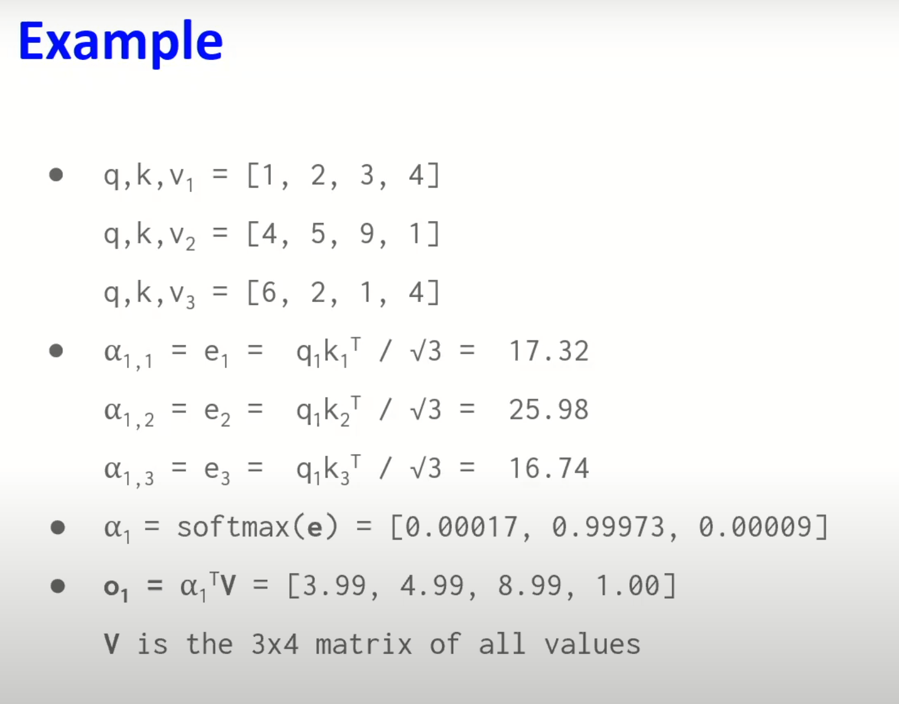

# Transformer implementation
- 10714 https://www.youtube.com/watch?v=OzFmKdAHJn0
- 11785 https://www.youtube.com/watch?v=X2nUH6fXfbc

- - -

# Transformer
10714 https://www.youtube.com/watch?v=IFKRf-BAqZo&t=1479s
- 2 cách tiếp cận để mô hình hóa chuỗi thời gian (time series)
- tự chú ý (self-attn) và Transformers
- transformers ứng dụng khác ngoài chuỗi thời gian

## 2 cách tiếp cận time series: lattent state approach


Ta có thể mô hình hóa bài toán mô hình hóa chuỗi thời gian bằng cách dự đoán `y_1:T = f_theta(x_1:T)` với y_t chỉ phụ thuộc vào x_1:t. 
f_theta có thể là bất cứ hàm nào miễn là nó giúp chúng ta dự đoán output từ input. Có nhiều cách để làm được điều đó, có thể không dùng tới biểu diễn latent state của RNNs.

__bản chất của RNN là "latten state" approach__ chúng lấy chuỗi đầu vào tới thời điểm x_t chẳng hạn rồi tổng kết / nhúng toàn bộ chuỗi đó vào một latent state h_t. Và trạng thái h_t đó summarize all information chúng ta quan sát được cho tới thời điểm t đó. RNN sẽ biểu diễn toàn bộ chuỗi thời gian (tới thời điểm t) bằng một latent (không quan sát được trực tiếp) state h.
- pros: RNN có thể capture infinite history, và có compact representation
- cons: compute path quá dài từ time bắt đầu cho tới current => vanishing / exploding gradients, hard to learn

__Điều này khiến latent state aproarch works in therory nhưng trong thực tế sẽ có vấn đề__

## 2 cách tiếp cận time series: direct prediction approach


- - -

# "Phillip Isola" on transformer
- video https://www.youtube.com/watch?v=Smav86u60FM
- notes https://phillipi.github.io/6.s898/materials/notes/09_transformers.pdf
- slide https://phillipi.github.io/6.s898/materials/slides/9_transformers.pdf

2 ý tưởng chính về transformers là __Tokens và Self-Attention__. Và thêm vài thứ khác :) 

Trong AI, nơ-ron là số thực, just scalar numbers, và tokens là vectors. Đó là sự khác biệt mà tôi concerned.
Như vậy __token__ chỉ là lingo cho __a vector of neurons__. Mà nơ-ron là scalar number =>
__token__ đơn giản là __vector__: kiểu dữ liệu 1D array of scalar numbers.

- Trong NLP thì token khởi đầu bằng one-hot vectors.
- Trong Vision token là patch, tức là ta duỗi điểm ảnh của một ô đơn vị ảnh từ 2D array ra 1D array

## Tokenizing input data

Bạn có thể biến mọi data của mình thành tokens.


Mục tiêu của việc tokenization là biến data thành dữ liệu dạng chuỗi - a sequence of vectors. Transformer thực sự treat tokens như là một set, nhưng mọi người thường nói về nó như là một chuỗi (đó là lý do transformer cần thêm positional embedding để đánh dấu thứ tự của token trong chuỗi).


Trong mạng nơ-ron nhân tạo tiêu chuẩn thường có 2 tầng chính là tầng linear combination hay tầng linear, và tầng thứ 2 là pointwise (đầu vào là từng điểm 1 trên input tensor) nonlinearity, có thể là giá trị của hàm sigmoid.


Tương tự như vậy khi deal with tokens, ta có khái niệm token-wise nonlinearity, 
`t_out = [F_theta(t_1.z),..., F_theta(t_N.z)]` với F thường là MLP.
Khái niệm này tương đương với 1 CNN với 1x1 kernels, chạy trên chuỗi tokens đầu vào.

=> Transformer and CNN, it's all the same idea of rehashed.

```
Q: z ở đây là gì?
A: z is the token code vector, meaning the vector of neurons inside that token. 
`token.z` ở đây hàm ý z là thuộc tính con của token, ám chỉ this code token that lives inside it.

Q: analogy to convolution here là gì?
A: conv apply the same operator tới một phần tử của chuỗi. Và minh họa ở trên làm điều tương tự. So it's like slide a (non-linear) filter across the sequence, vì thế có thể nghĩ nó như là 1x1 kernels
```


Ở hình minh họa trên hàm token-wise nonlinear F_theta là biến đổi từng token vector input thành token vector output. Nó giống như cửa sổ trượt của CNN. 

## Token nets


Hóa ra GNN cũng có cùng cấu trúc với Transformer.
__token nets, graph nets, transformers are all the same thing__ 

Bạn có thể coi transformer là một dạng đặc biệt của graph nets, nếu bạn thích nhìn theo cách đó hơn.

## Ý tưởng thứ 2: attention

Như vậy ý tưởng đầu tiên là build things out of token - vector-valued units, thay vì nơ-ron - scalar-valued units. Ý tưởng thứ 2 làm nên tên tuổi cho transformer là attention, có hẳn 1 layer gọi là attention trong transformers.


- - -

# Attention and Transformer
- 11785 https://youtu.be/amqFoES3c1w?t=663

## Q, K, V in Attention

Database Analogy
- Q(uery) is query you typed in to get the data
- K(eys) point to where information is
- V(alues) are information itself

=>

- `Query` is what **pays attention**: what looking for where I get information from?
- `Values` are what are **paid attention to**
- `Keys` helps queries figure out **how much attention to pay** to each value

- `Attention Weights` how much attention to pay


The red guy is the current token, it wonders how do i adapt to my context? And all the bule guys are there to help. They said "hey, this is me, here is my information!"


The red guy goal is to get a contextualized representation. And the guy think: "may be I can do a weighted sum? May be I can use all of this information and do a weighted some to get my contextualized representation."


Use enery function $e_ij =  q_i^T k_j$, then softmax to normalize 


`Query` is the guy are wondering "How do I contextualize my own represention?".
`Keys` are all other guys. They said here is my information, try to use it to contextualize your represention!


What we use to multiple with attenion weights are called `Values`. The weighted sum to get contextualized representation.


`h` is a vector representation of token, it can be one-hot or anything ...
W_Q, W_K, W_V are just matrix to do linear projection to other dimentions.


We take one query, one key and calculate energy score or one attention score. And do 
the same for other keys. And get scores for each of (key) tokens. We pass everything to the softmax. And we have `attention weights`.

> `attention weight` $alpha_m,n$ is how important token n to token m's contextual meaning?


Now we take all of the `values` (h @ W_v), multiple them with each of attention weights that we found, take a weighted some to get the output o (contextualized representation).

## Scaled-dot attention
https://youtu.be/amqFoES3c1w?t=1054


Scaled mean divide by dimensionality of the keys. This is done before we do softmax. 
Why we do it? => To keep values numberically stable (not too extreme ...)


dot product are enery function, the function we use to score each of the key using a query.


3 is dimensionality of the key.

## Self-attention


## Attention is all we need

