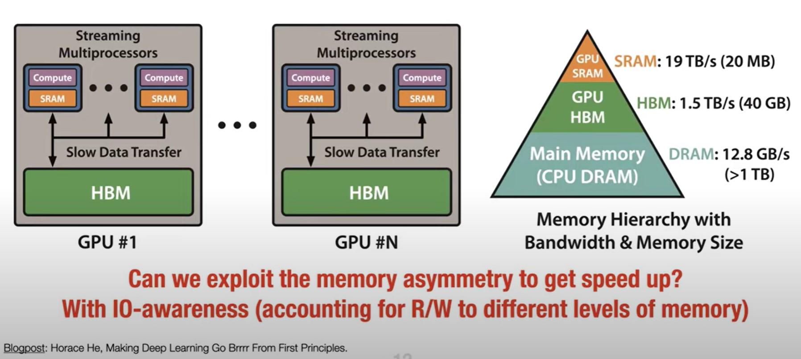
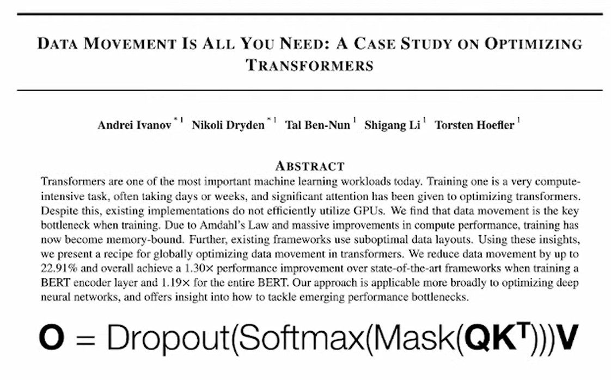
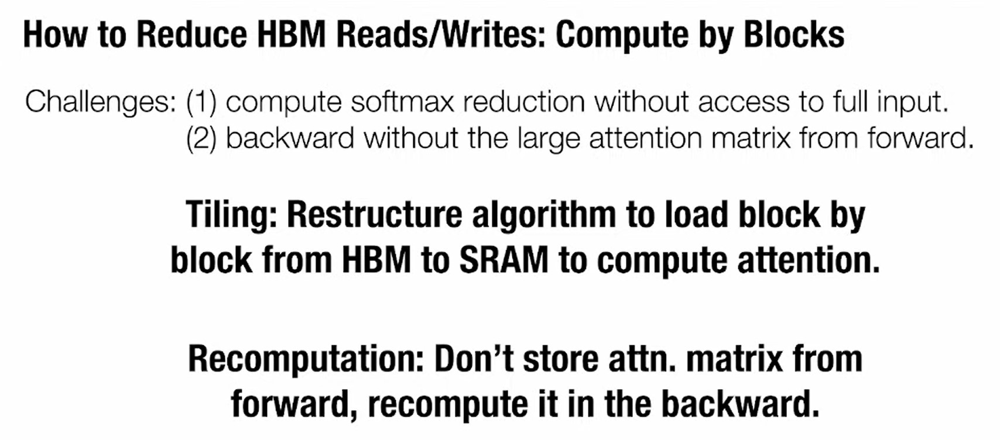
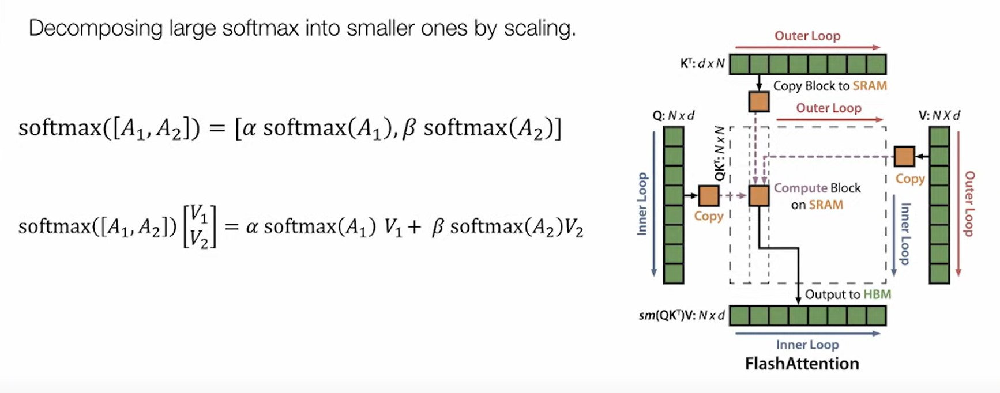
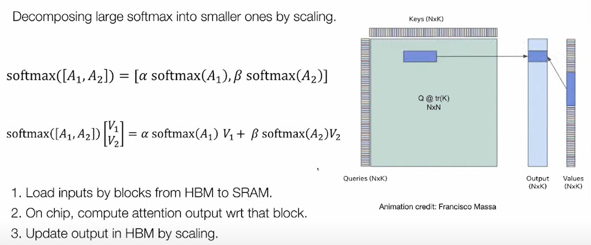
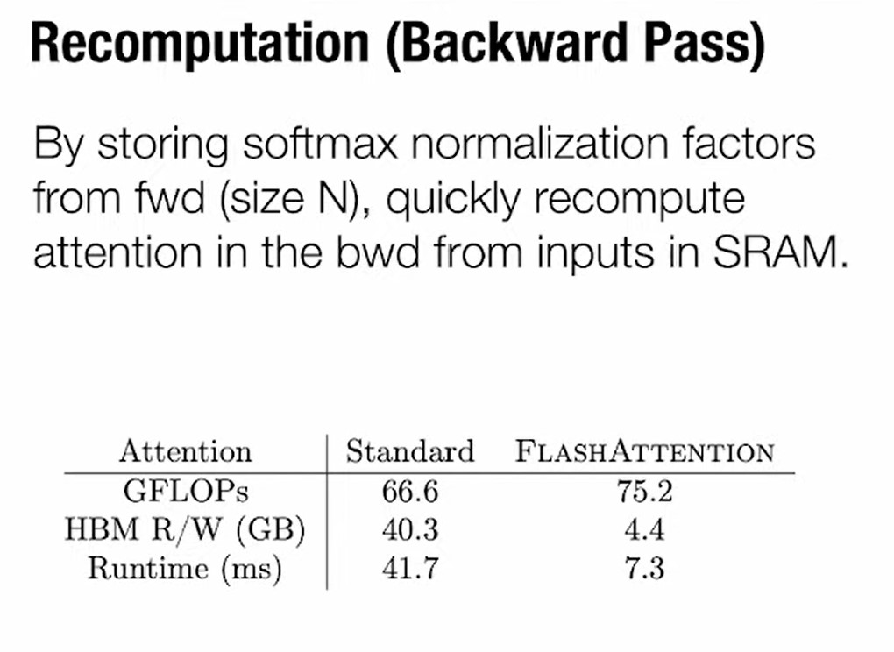

https://www.youtube.com/watch?v=FThvfkXWqtE&t=858s

FlashAttention and block-sparse FlashAttention enable longer context in Transformers, yielding higher quality models (0.7 better perplexity on GPT-2 and 6.4 points of lift on long-document classification) and entirely new capabilities: the first Transformers to achieve better-than-chance performance on the Path-X challenge (seq. length 16K, 61.4% accuracy) and Path-256 (seq. length 64K, 63.1% accuracy).

> George Rey: I can answer the energy efficiency questiontransfering data over large distance (like, a few centimeters) is the most energy expensive part. each data-transfer wire is a capacitor, which you need to charge and discharge, using a power source, and the energy is not recoverable. The capacitance of this capacitor is physics bound

Dealing with n x n matrix, so can write to the same location. In practice people write to new mem since they need the old one for gradient. But you can write to same (input) mem, it will save mem and increase speed(?) nope: since you still need the same number of read / write.

Why dropout and softmax take so much time?

- - -

https://youtu.be/gMOAud7hZg4?t=1641

Làm thế nào để:
- Tính softmax mà không phải truy cập toàn bộ input?
- Tính backward không dùng đến large attention matrix của forward?

Kỹ thuật:
- __Tiling__ cấu trúc lại thuật toán để tải dữ liệu theo từng block từ HBM và SRAM
- __Recomputation__ không lưu attn matrix từ forward, tính toán toán lại nó khi backward
  (ở đây IO cost / energy > computation cost / energy)

## Tiling

Để tính softmax (sm) của A1 và A2, ta tính sm(A1) và sm(A2) và up to some scaling factor alpha, beta. You can scale local results to get right global result (alpha and beta are scaling factors for denominator).

Basically we computing block by block !! With the right scaling you get the right answer.

## Recomputing

