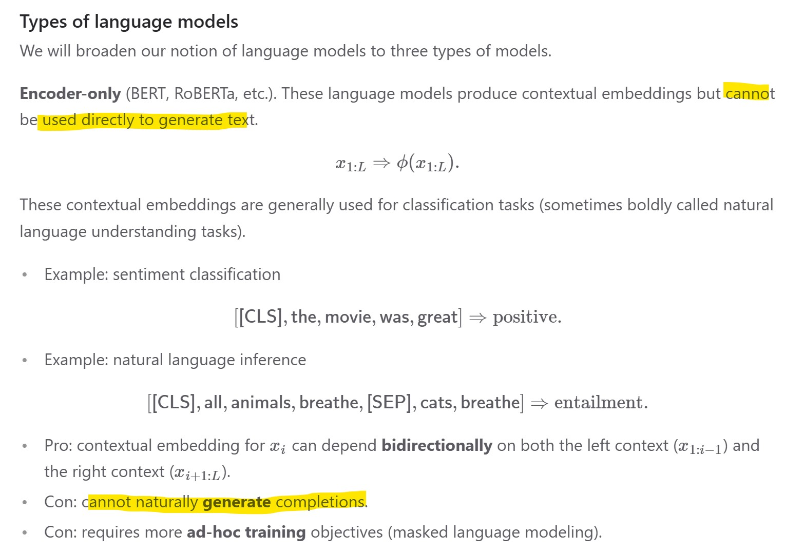
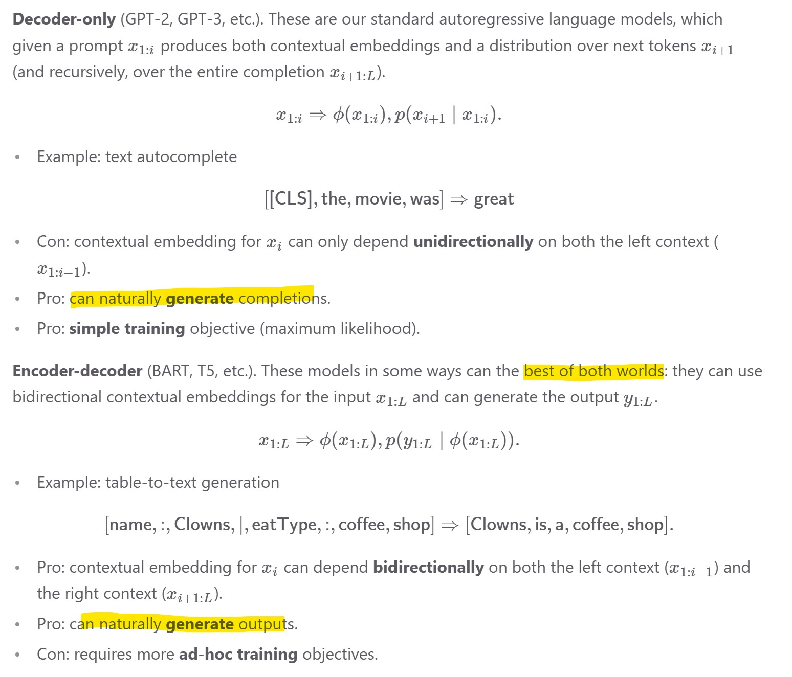
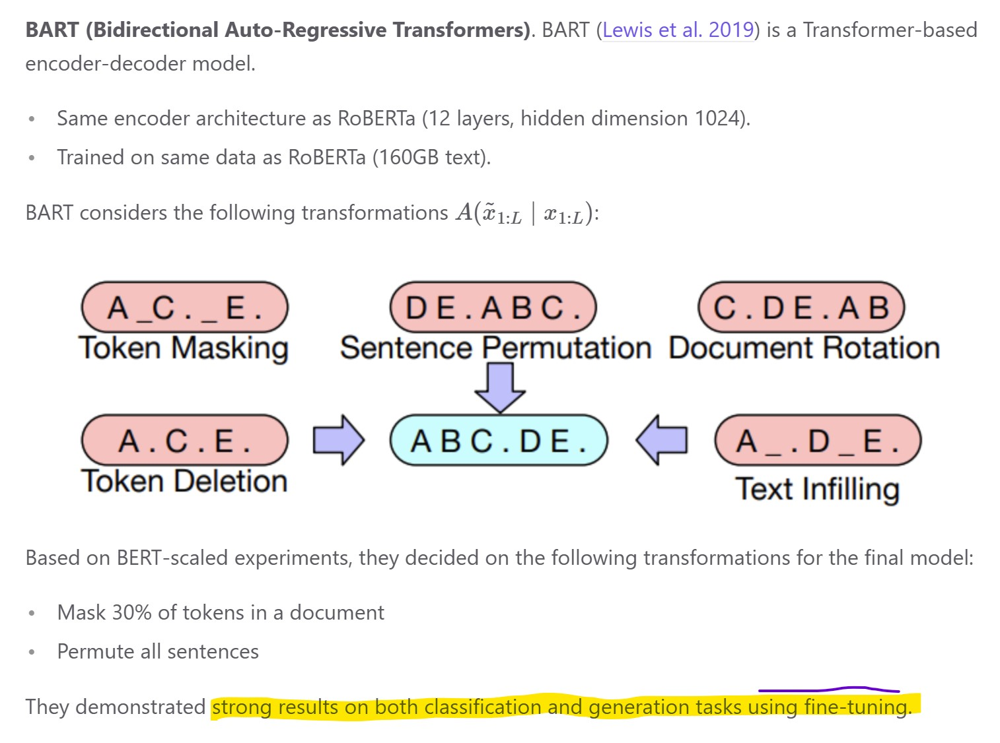
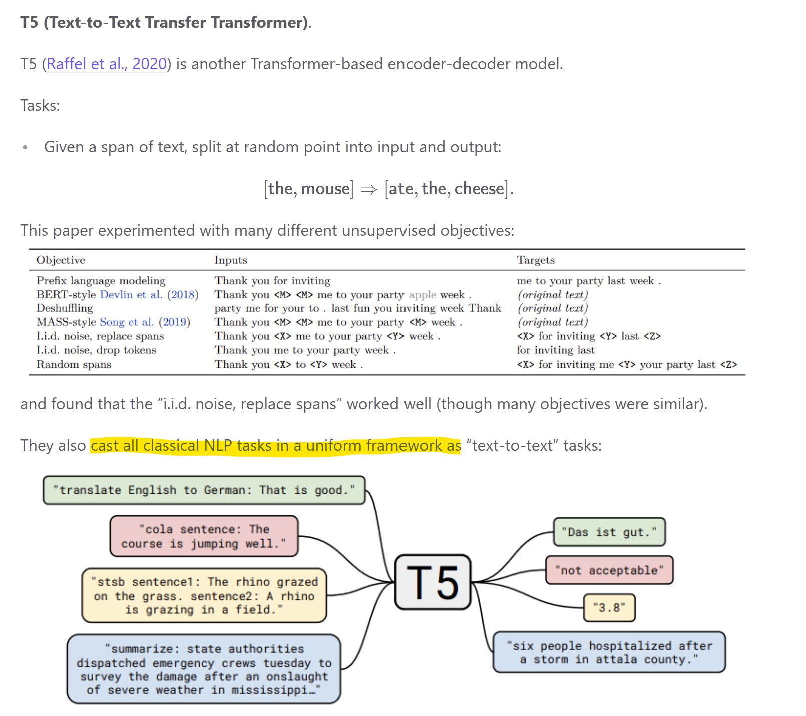

https://stanford-cs324.github.io/winter2022/lectures/modeling

Bert ko nên dùng để sinh vì nó không phải thiết kế để làm việc đó, nếu cưỡng ép dữ liệu nó sinh ra thường sẽ không tự nhiên. Bert sinh ra embedding rất tốt vì nó capture ngữ cảnh 2 chiều nên nó thường được dùng để làm các tác vụ như classification.

https://stanford-cs324.github.io/winter2022/lectures/training

Bart rất mạnh, có thể dùng để "convert" một câu hỏi mới về dạng câu hỏi đã có

