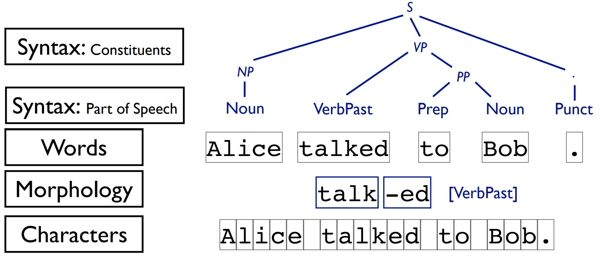
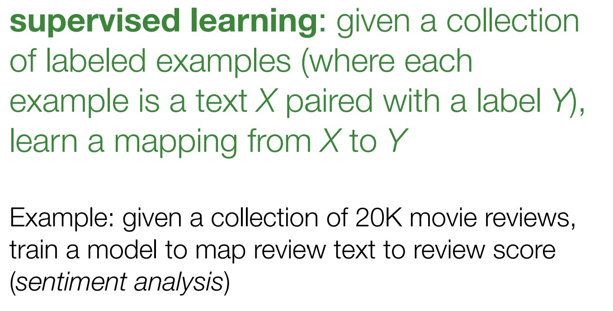
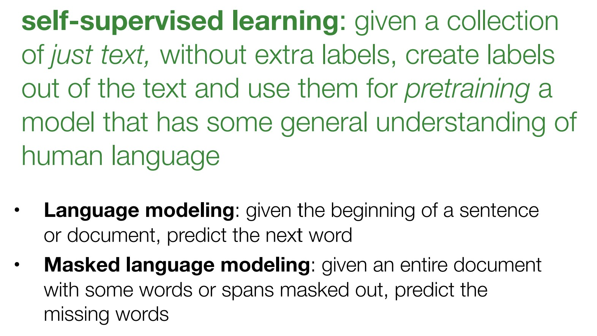
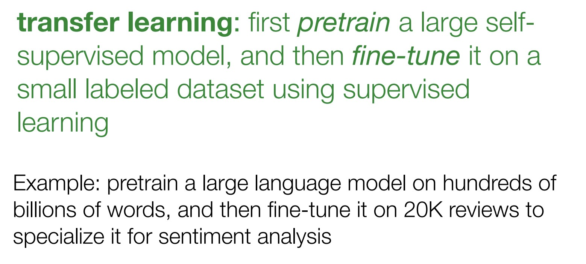
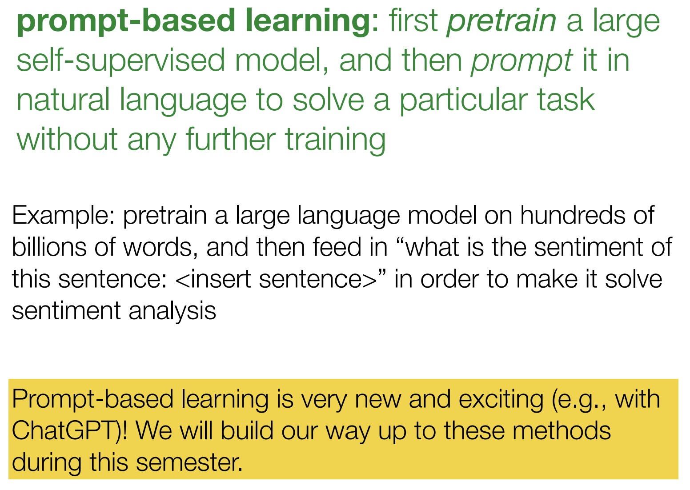
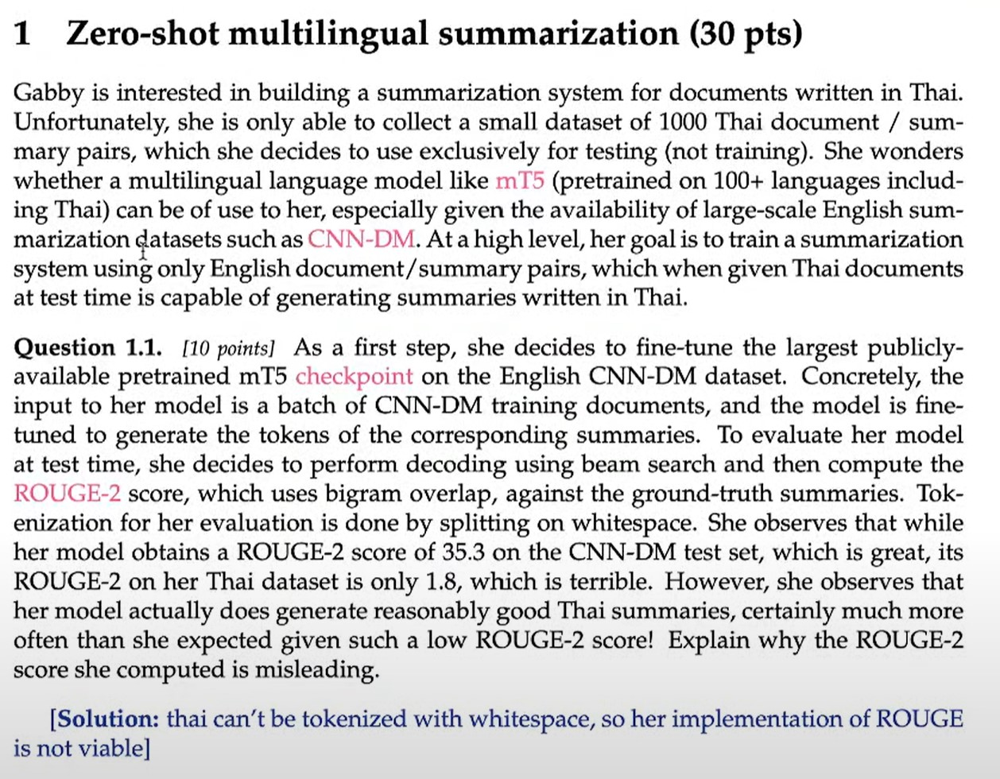

https://people.cs.umass.edu/~miyyer/cs685/slides/00-intro.pdf

https://www.youtube.com/watch?v=EJ8H3Ak_afA

## Levels of linguistic structure
Ngông ngữ con người khác với ngôn ngữ máy tính

## NLP là gì?
NL = natural language, P = processing

P can be:
- supervised learning: map text to __x__
- self-supervised leanring: learn __x__ from text
- generate: text from  __x__

- - -

Internet có rất nhiều review, hỏi đáp, ... và vì thế khi mô hình được huấn luyện trên tập dữ liệu lớn, nó có thể làm nhiều tác vụ một lúc.

- - -

Tuy nhiên trong những tháng gần đây prompt-based learning đã nổi lên (cùng với chatgpt). Nó là một đối thủ mạnh của transfer-learning. Cùng với prompt-based learning còn có các kỹ thuật finetune khác như, instruction tuning, RLHF ...

Điều này đến từ sức mạnh của LLM, vì trên Internet có rất nhiều instructions followed by example outputs, và còn nhiều thứ nữa trên Internet mà chúng ta còn chưa hình dung hết được. Chúng giúp mô hình follow your instructions.

Tôi phải nói rõ rằng huấn luyện mô hình ngôn ngữ là một task rất cụ thể: dự đoán từ tiếp theo của 1 chuỗi đầu vào. Các tác vụ khác nổi lên khi tác vụ huấn luyện mô hình ngôn ngữ được mở rộng cho một lượng dữ liệu lớn, và vì vậy mô hình có đủ sức mạnh để xử lý các tác vụ khác.

Nghe có vẻ bối rối nhưng nó sẽ (1 trong những) chủ đề chính của khóa học này. Và prompt-based learning không phải là supervised learning nhé. Mô hình chỉ được pretrain, có lẽ từ learning ở đây gây hiểu nhầm. Và mô hình chỉ tuân theo các chỉ dẫn từ text người dùng nhập vào.

## Rough list of topics
- Background: language models and neural networks
- Models: RNNs > Transformers, ELMo > BERT > GPT3, also many others
- Tasks: text generation (e.g., translation, summarization), classification, retrieval, etc.
- Data: annotation, evaluation, artifacts
- Ethics: bias amplification, privacy issues
- Methods: transfer learning, prompt-based learning (nửa sau của khóa học)

## Project Proposal
https://www.overleaf.com/project/5f4faba219314100019e5282
- Either build natural language processing systems, or apply them for some task.
- Use or develop a dataset. Report empirical results or analyses with it.
- Different possible areas of focus
  - Implementation & development of algorithms
  - Defining a new task or applying a linguistic formalism
  - Exploring a dataset or task

## DEMO :D
https://youtu.be/EJ8H3Ak_afA?t=3592

## Dùng ChatGPT làm bài tập
https://youtu.be/EJ8H3Ak_afA?t=4218

Gabby muốn xây dựng một hệ thống tóm tắt văn bản bằng tiếng Thái. Cô ấy chỉ thu thập được 1000 cặp văn bản / tóm tắt. Nên cô ấy quyết định dùng nó để test. Cô ấy thắc mắc liệu những mô hình ngôn ngữ lớn như mT5 có thể sử dụng cho tóm tắt tiếng Thái không?

