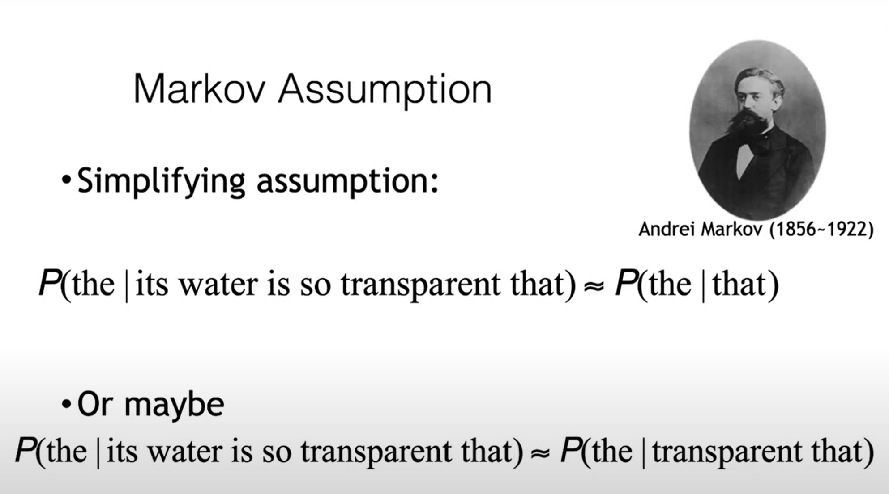

https://people.cs.umass.edu/~miyyer/cs685/slides/01-lm.pdf

https://www.youtube.com/watch?v=q6KvtdJzXlQ

LLM rất mạnh, có thể dùng prompting để làm các tasks khác nhau!

Chain Rule quan trọng, nhất là khi áp dụng n-gram. Còn với NNLM thì dùng luôn prefix (w_1 w_2 ... w_i-1)

## N-gram

## Perplexity

> Mô hình ngôn ngữ tốt nhất là mô hình dự đoán tốt nhất các dữ liệu chưa có trong tập huấn luyện! (unseen data)

Trong thực tế chúng ta dùng log scale để tránh tràn số.
- p(w) biết được từ softmax đầu ra,
- tính __negative avg của log p(w) là ra được perplexity (pp)__
- pp càng thấp nghĩa là model càng tốt

