# Pretrain, Prompt, Predict: A New Paradigm for NLP

## Trend of Prompt-based Research
http://pretrain.nlpedia.ai

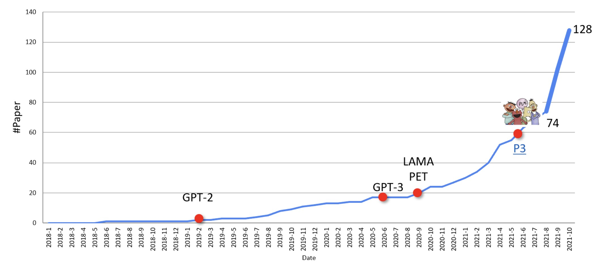

- - -

https://people.cs.umass.edu/~miyyer/cs685_f22/slides/prompt_learning.pdf

# What does all this scaling buy us?
https://youtu.be/8HwHGGb1zpQ?t=348

Xem [transformers/lec02-gpt3.md](../transformers/lec02-gpt3.md)

## DEMO :D
https://youtu.be/8HwHGGb1zpQ?t=999

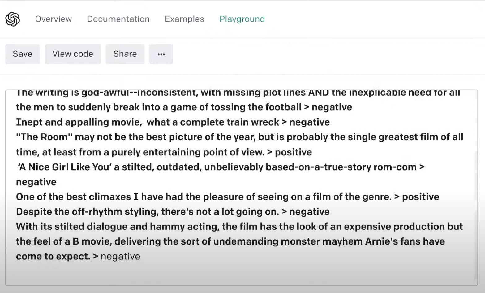

## Độ tốt
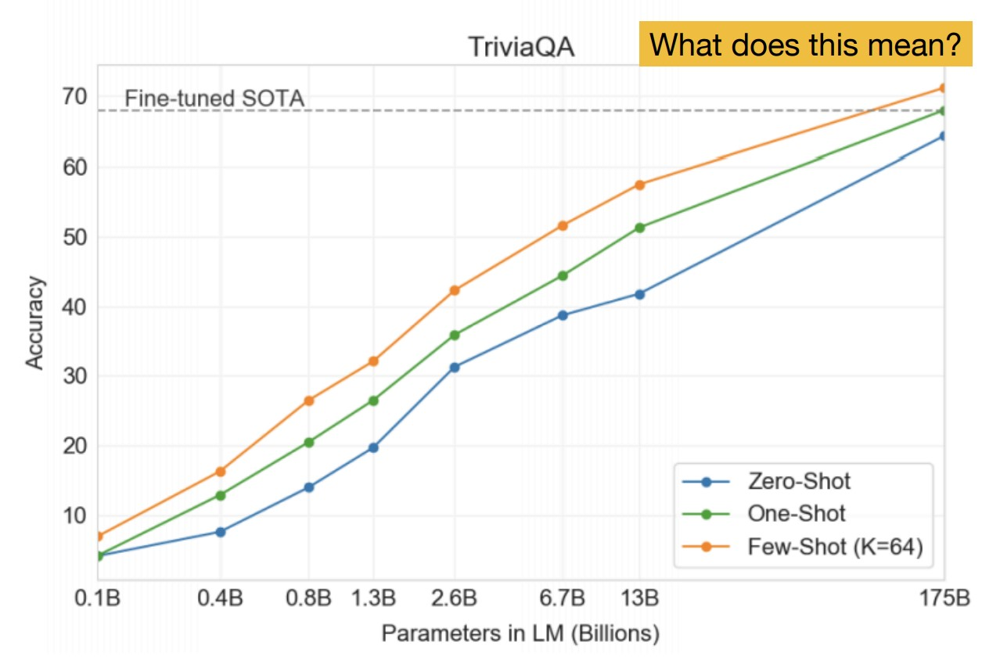

__Với những task nhất định, LLM còn tốt hơn fine-tuned SOTA.__ Điều này có nghĩa là mô hình càng lớn, càng có nhiều dữ liệu huấn luyện, nó càng học được nhiều kết quả (được định sẵn), và có câu trả lời đúng hơn cả. Điều này không có xu hướng dừng lại! Nhưng nếu ta thay những tên người, tên địa danh trong câu hỏi bằng những cái tên không có thật thì LLM không thể nào trả lời đúng được.

## Thách thức
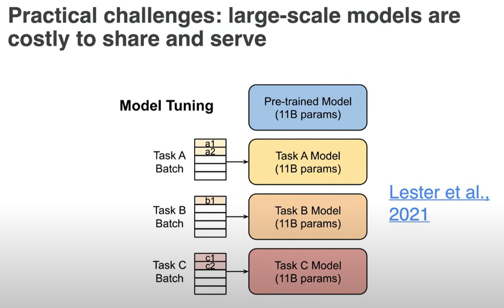

=> dùng prompts để giải quyết! :D

## Prompt-tuning
https://youtu.be/8HwHGGb1zpQ?t=2532

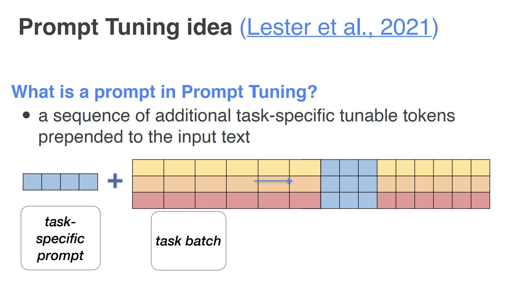

Phần đầu của LM là embeddings, in prompt-tuning we learn a new sequence of embeddings, sau đó cho vào trước input của language model.

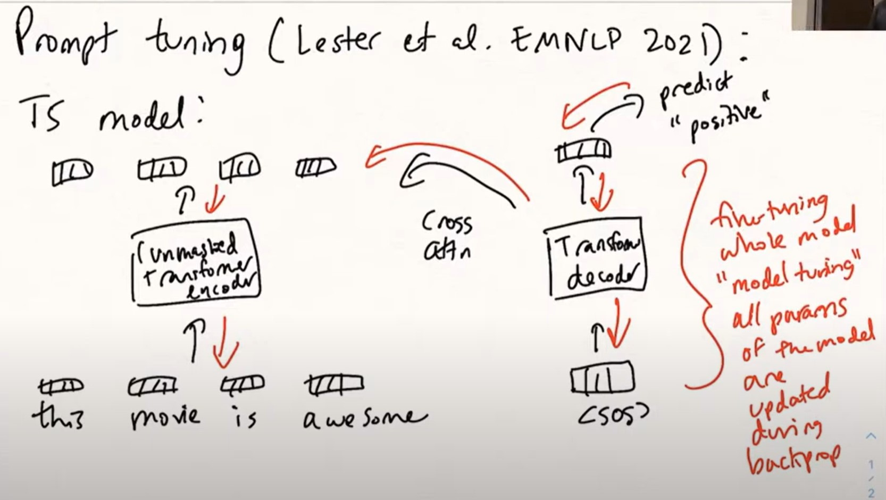

T5 (encoder-decoder) model, đường màu đen là forward, đường màu đỏ là backward (update params). Đây là cách fine-tune thông thường. Vấn đề là, mỗi fine-tuned model tạo ra 1 bộ tham số mới hoàn toàn nên mỗi lần chạy là 1 lần load model mới. Với n tasks là n models mới. 

Note: `<SOS>` = `Start-Of-Sequence` token.

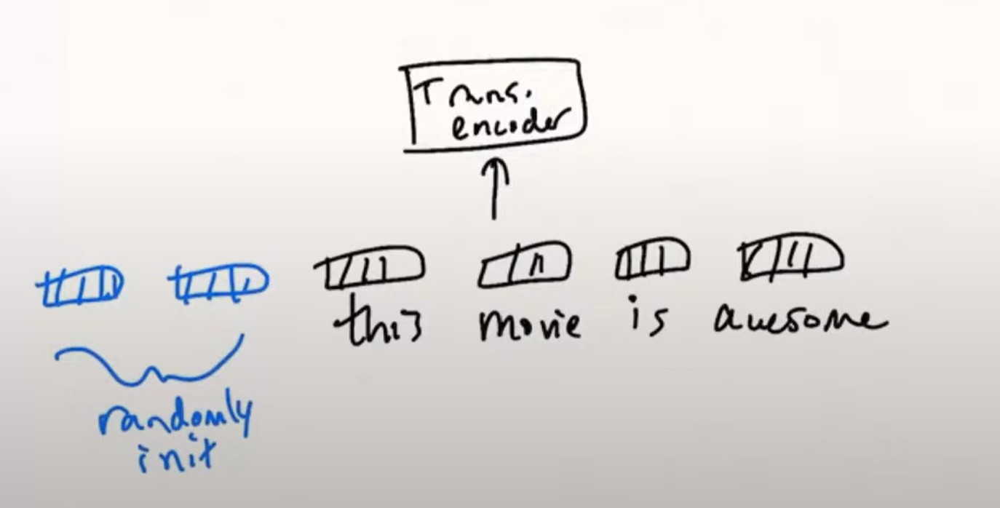

Với prompt-tuning, vẫn chuỗi vectors đầu vào như trên, ta cho thêm vào một đoạn prefix vectors (mới hoàn toàn không có trong từ điển), và được khởi tạo ngẫu nhiên.

Ví dụ thường ta cho thêm "sentiment analysis" trước "this movie is awesome" như là một cách prompt engineering
- hoặc "give me the sentiment of the sentence, " + "...",
- hoặc "what is the sentiment of the sentence? " + "...", 

Mục đích ở đây là __loại bỏ việc cho thêm các keywords vào prompt thủ công, và yêu cầu model làm điều đó__. Model làm điều đó bằng cách bỏ vào trước input vectors một prefix vectors được khởi tạo ngẫu nhiên rồi, cho toàn bộ chuỗi input mới đó vào model.

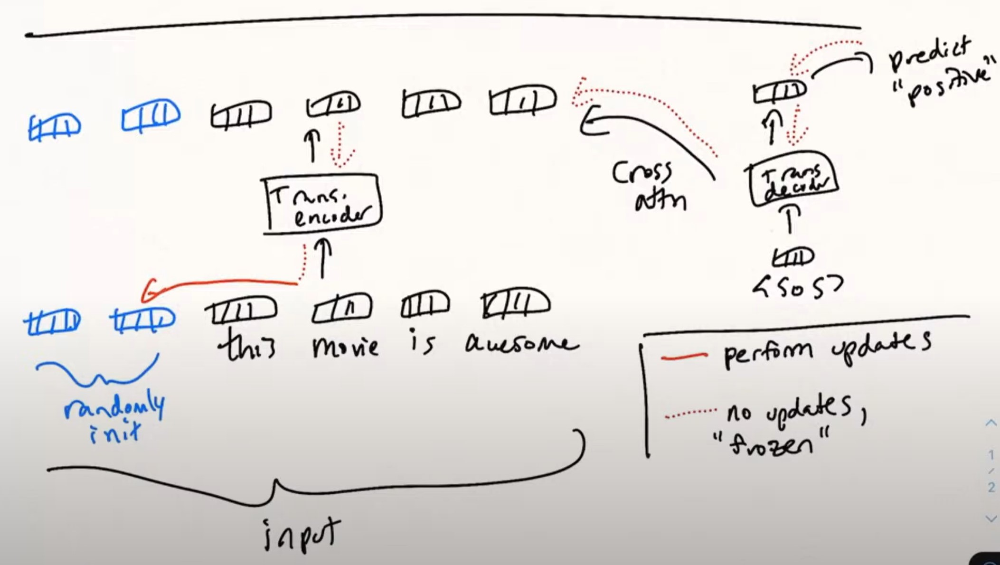

Khi chúng ta tính loss với softmax ở classifier cuối, thì đường dot-line màu đỏ nghĩa là chúng ta sẽ không thực hiện params update với các tham số của mô hình mà chỉ update 2 embeding mới được thêm vào ở đầu chuỗi input (đường solid-line màu đỏ). Điều này có nghĩa là 99.9% của mô hình (mới) sẽ được giữ nguyên. Và điều này có nghĩa là mô hình đang tự học optimal continous representation of that instruction. Thay vì discrete tokens được cho thêm vào thủ công như ví dụ ở trên. Và vì lý do đó cách làm này __nói chung là tốt hơn nhiều discrete prompts that you design yourself__.

Với cách làm này, ta chỉ cần swap out 2 embedding vectors của một tác vụ này bằng embedding vectors của một tác vụ khác mà không cần phải thay đổi tham số của toàn bộ mô hình lớn (dùng lại được nguyên pre-train mô hình).

__Câu hỏi hay__: qua quá trình huấn luyện ta có được giá trị tốt nhất của 2 prepend embedding vectors này, ta có thể dùng nearest neighbor search để tìm xem các vectors này gần nhất với keywords nào không? => paper đã thử nhưng không tìm ra mối liên hệ rõ ràng nào (continuous có sự khác biệt so với discrete). Đôi khi chúng tương đương với các nhãn của bộ phân lớp như là positive hay negative. Xem paper để biết thêm chi tiết ...

=> Bạn có thể khởi tạo tốt hơn bằng cách gán prepend embedding vectors = giá trị của class labels average thay cho random init. Hoặc khởi tạo chúng với discrete prompt (thiết kế thủ công) và để model fine-tune chúng.

Điều này có nghĩa là những prepend vectors đó nằm bên ngoài word embeddings. Và tuy nearest neighbors có liên quan tới task đang thực thi nhưng khó có thể dịch ngược từ prepend vectors sang discrete prompt.

Note: Cách này tuy linh hoạt và không phải thay đổi tham số của mô hình lớn nhưng kết quả của nó không tốt bằng fine-tune toàn bộ mô hình (đương nhiên là thế).

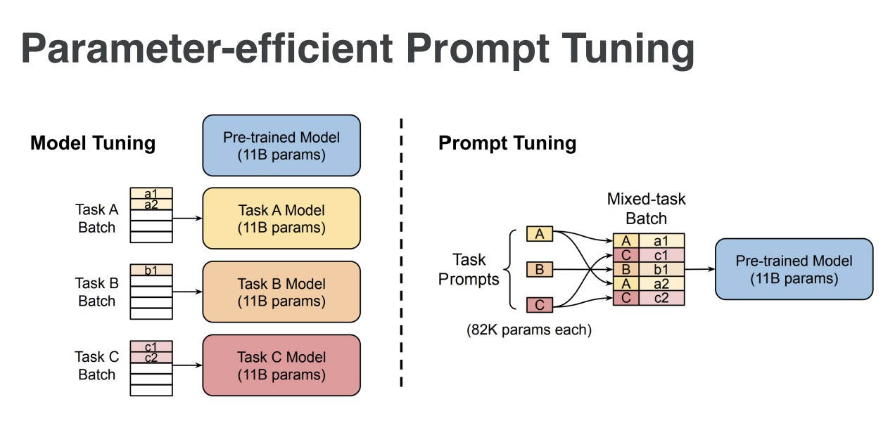

__Ưu điểm của promp-tuning là trong cùng một batch, ta có thể chạy song song nhiều tasks.__

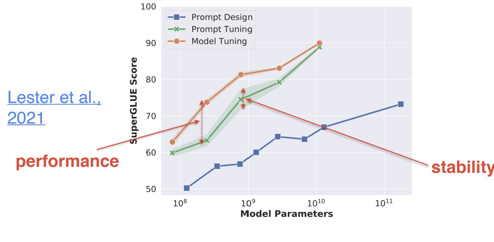

Có thể thấy là với mô hình càng lớn thì độ hiệu quả của prompt-tuning càng cao, thậm chí gần sát với model-tuning. Có điều vẫn còn nhều thứ phải cải thiện như độ ổn định ... => Điều này khẳng định lại một điều là:
> Khi mô hình càng lớn thì càng có khả năng cải thiện những tác vụ nó có thể làm được, thậm chí sinh ra những khả năng mới ...

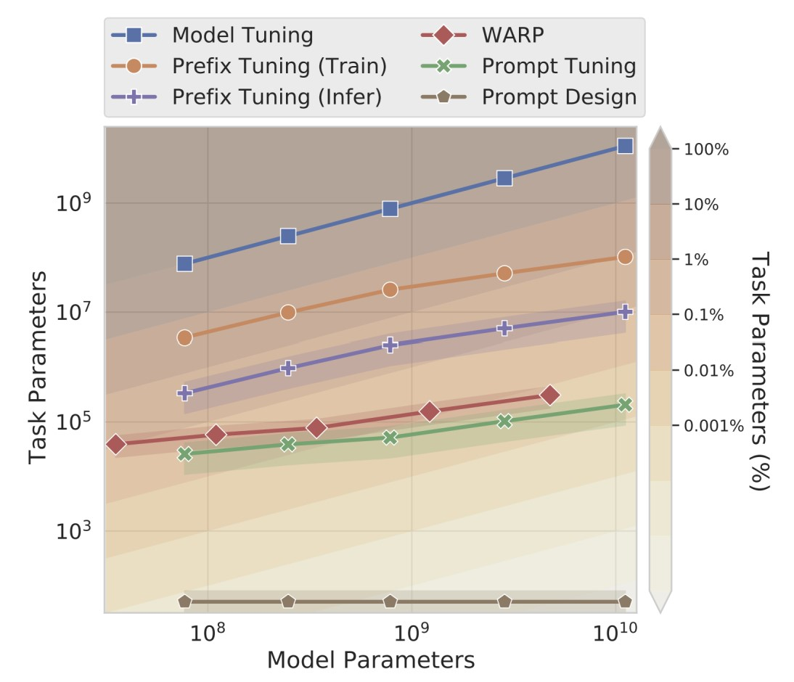

prompt-tuning (đường xanh lá cây) có số added params nhỏ nhất (chỉ 0.001%). 

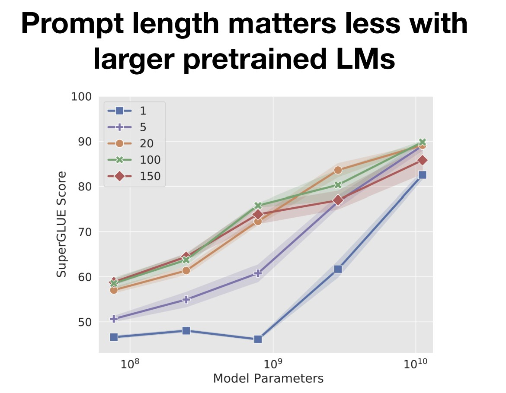

Mô hình càng lớn thì số lượng prepend vectors cần cho vào trước càng ít => một lần nữa chứng minh sức mạnh của large language model. Nó gợi ý điều gì?

> Kết luận: với mô hình nhỏ ta nên fine-tune cả mô hình để có kết quả tốt nhất, còn với mô hình lớn ta nên prompt-tuning để số lượng tham số cần thay đổi là ít nhất mà vẫn đạt được kết quả gần như fine-tune cả mô hình lớn !!!

## Prompt pretraining: the SPoT approach
https://youtu.be/8HwHGGb1zpQ?t=3982

__SPoT__: Better Frozen Model Adaptation through `Soft Prompt Transfer`.

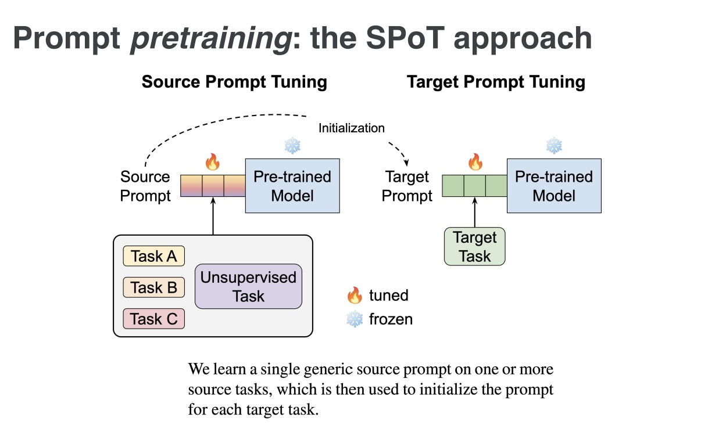

> Cuối cùng: prompt-tuning rất tốt vì chỉ có những lab / công ty lớn mới có khả năng pre-train và fine-tune LLM. Với prompt-tuning ta có thể thực hiện những thay đổi nhỏ nhất mà vẫn đạt SOTA results. => one (pre-train) model to kill them all!

- - -

https://www.youtube.com/watch?v=5ef83Wljm-M

https://phontron.com/class/anlp2022/assets/slides/anlp-09-prompting.pdf

Survey https://arxiv.org/pdf/2107.13586.pdf

# Prompting + Sequence-to-sequence Pre-training
- Prompting Methods
- Sequence-to-sequence Pre-training
- Prompt Engineering
- Answer Engineering
- Multi-prompt Learning
- Prompt-aware Training Methods

## Objective engineering
Paradigm: Pre-train, Fine-tune (2017-now)
- Use pre-train LMs as initialization
- Less work on architecture design, but __engineer objective functions__

## Prompt engineering
Paradigm: Pre-train, Prompt, Predict (2019-now)
- NLP tasks are modeled __entirely relying on LMs__
- The tasks of shallow and deep feature extraction, and prediction of the data are __all given to the LM__
- Engineering of prompts is required

## Prompting là gì?
Khuyến khích một mô hình được đào tạo trước để đưa ra những dự đoán cụ thể bằng cách
cung cấp một 'dấu nhắc' chỉ định nhiệm vụ sẽ được thực hiện.

## Prompting workflow
- Prompt Addition
- Answer Prediction
- Answer-Label Mapping

Từ prompt đầu vào x, ta dùng template để biến đổi nó thành prompting (query context).
Sau đó mô hình đưa ra dự đoán, và ta "mapping" dự đoán đó ra kết quả cuối cùng (label).

## Types of prompts
- __Prompt__: I love this movie. Overall it was a [z] movie
- __Filled Prompt__: I love this movie. Overall it was a boring movie
- __Answered Prompt__: I love this movie. Overall it was a fantastic movie
- __Prefix Prompt__: I love this movie. Overall this movie is [z]
- __Cloze Prompt__: I love this movie. Overall it was a [z] movie

# Design Considerations for Prompting
- Pre-trained Model Choice
- Prompt Engineering
- Answer Engineering
- Expanding the Paradigm
- Prompt-based Training Strategies (very interesting)

Có rất nhiều lựa chọn với prompt-based !!

# Pre-trained Language Models

- __Autogressive LM__: left-to-right, suitable to highly larger-scale LMs, use prefix prompts
- __Masked LM__: bidirectional, Suitable for NLU tasks, use cloze prompt
- __Prefix LM__: a combination of masked and left-to-right, 
- __Encoder-decoder__: translate, summarize, info extract, q&a

### MASS, Bart, mBart, UniLM, T5 (Deberta?)
https://youtu.be/5ef83Wljm-M?t=1243

### Application of Prefix LM/Encoder-Decoders in Prompting
- Conditional Text Generation
  - Translation
  - Text Summarization (T5)

- Generation-like Tasks
  - Information Extraction
  - Question Answering

- - -

# Prompt Engineering

## Traditional Formulation V.S Prompt Formulation

Tự động tìm kiếm một tổ hợp các keywords tốt nhất từ inputs. 
Cách này tốt hơn các cách domain-based ở trên.

- Tại sao ta không trực tiếp tối ưu hóa tham số thay vì chỉ đổi keywords?
- Prompt-tuning chỉ tối ưu hóa tầng embedding!
- Prefix-tuning thay vì chỉ tối ưu hóa tầng embedding, nó tuning a prefix that you append to every layer of the model.

## DEMO :D
https://demo.allennlp.org/masked-lm

# Answer Engineering

Why do we need answer engineering?

We have reformulate the task! 
=> We also should re-define the “ground truth labels”

Think about answer space, then think about label space. Có thể dùng many-to-many mapping và gán cho trọng số (giống softmax).

## Why do we need answer engineering?
- We have reformulate the task! => We also should re-define the “ground truth labels”
- Definition:
	- aims to search for an answer space and a map to the original output Y that results in an effective predictive model

## Answer Shape
- Token: Answers can be one or more __tokens in the pre-trained language model vocabulary__

- Chunk: Answers can be chunks of words __made up of more than one tokens__
  - Usually used with cloze prompt

- Sentence: Answers can be a sentence of arbitrary length
  - Usually used with prefix prompt

# Expanding the Paradigm

Bạn không cần tìm 1 prompts tốt mà bạn có thể sinh ra nhiều prompts và hy vọng chúng giúp tìm ra một kết quả tốt.

Lý giải tại sao works? Có nhiều patterns như thế trên Internet!

Why it works? Có sẵn patterns đó trên Internet! :D
Có sẵn đâu đó trong dataset, câu "let's think step by step" và sau đó là câu trả lời đúng.

# Prompt-based Training Strategies
- Data Perspective: _How many training samples are used?_
  - Zero-shot: without any explicit training of the LM for the downstream task
  - Few-shot: few training samples (e.g., 1-100) of downstream tasks
  - Full-data: lots of training samples (e.g., 10K) of downstream tasks

- Parameter Perspective: _Whether/How are parameters updated?_

https://youtu.be/5ef83Wljm-M?t=4206