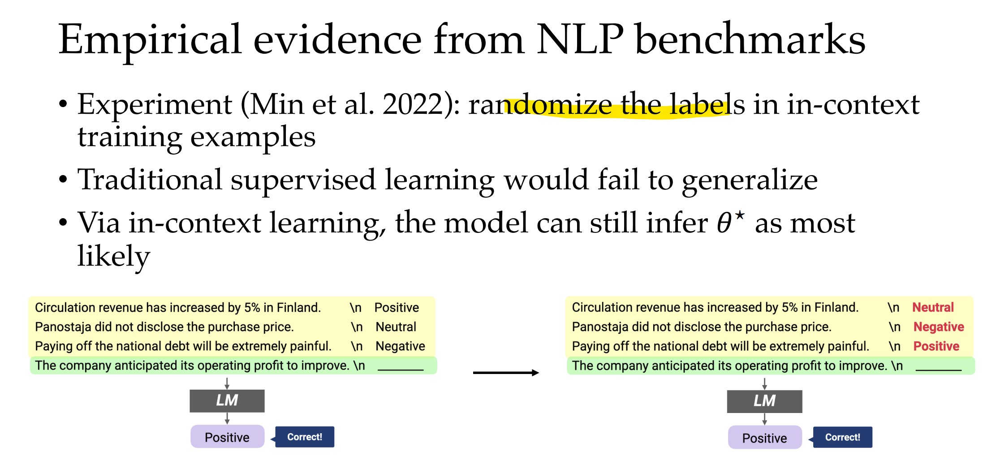

https://phontron.com/class/anlp2022/assets/slides/anlp-10-raghunathan.pdf

https://youtu.be/t2J37IqSTww

# How to use pre-trained models?

## How to fine-tune pretrained models?: Linear probing vs fine-tuning

## ID vs OOD
- `ID`: In-Distribution
- `OOD`: Out-of-Distribution

Distribution là phân bố của tập dữ liệu huấn luyện.

# Can we skip fine-tuning entirely? (in-context learning)

https://youtu.be/t2J37IqSTww?t=4364

