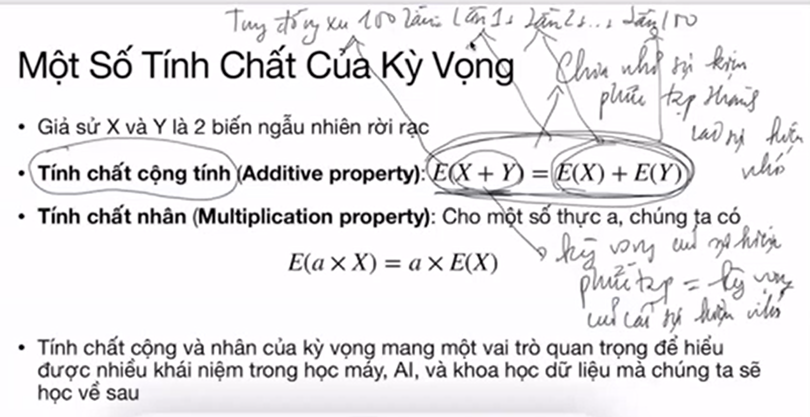
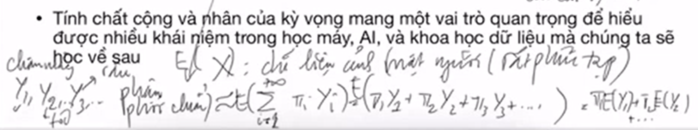
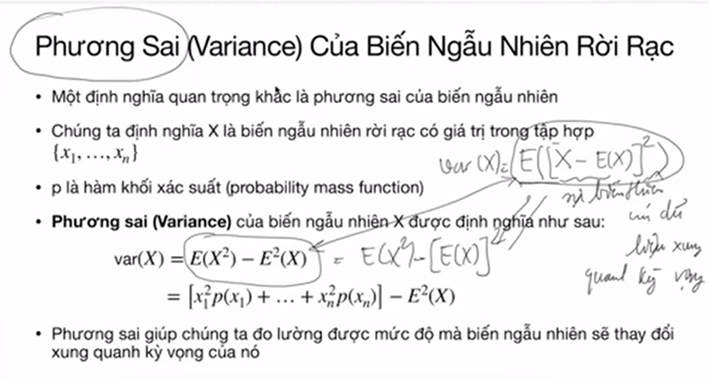
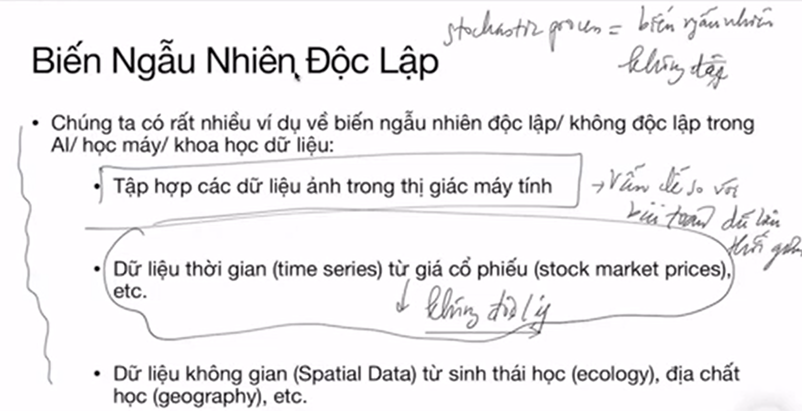

# Bài 3
https://drive.google.com/drive/folders/17s9KBf1GhgP4xoIDsNmTeEEuhiQnJkDG

## Biến ngẫu nhiên rời rạc (discrete random var), kỳ vọng và phương sai

Buổi hôm sau sẽ đi vào mô hình trong học máy và học dữ liệu. Những khái niệm ta học hôm này về kỳ vọng va phương sai rất là quan trọng, nên mình dành một buổi riêng ra để dạy về 2 khái niệm này thôi. Thông qua kỳ vọng và phương sai chúng ta sẽ hiểu hơn về bản chất của dữ liệu, và từ 2 thông tin này chúng ta có thể dự đoán được nhiều thông tin quan trọng về dữ liệu.

Trước tiên mình sẽ đi lại một xíu về thế nào là biến ngẫu nhiên và tại sao ta lại quan tâm tới biến ngẫu nhiên. Một trong những nền tảng quan trọng của học máy là xác suất. Tức là __chúng ta gắn liền dữ liệu với một số khái niệm về xác suất__. Dữ liệu của chúng ra rất là phức tạp, tuy nhiên chúng ta sẽ tìm một cách nào đó để biểu diễn dữ liệu mặc dù dữ liệu của chúng ta không có tính chất về logic, hay là về thứ tự đi, nhưng chúng ta vẫn muốn có một cách nào đó để biểu diễn dữ liệu. Một cách là biểu diễu dữ liệu dưới dạng toán học dưới các khái niệm và nền tảng chắc chắn. Đồng thời chúng ta cũng có nhiều tính chất thứ tự trong toán học luôn. Và dưới biểu diễn toán học ta có thể hiểu về dữ liệu. 

Với các kết quả của một sự kiện, ta có thể biểu diễn dưới dạng số thứ tự để có thể áp dụng được các thao tác (toán học  như cộng trừ) trên các kết quả đó dễ dàng hơn. __Đó là động lực để chúng ta cố gắng biểu diễu dữ liệu dưới dạng toán học__.

!! Một trong những thứ quan trọng nhất của ML là chúng tìm được biểu diễn dữ liệu dưới dạng toán học !! Trên thực tế biểu diễn dưới dạng toán học không phải là tối ưu nhất đâu, bởi vì qua máy học chúng ta đã mất đi nhiều tính chất quan trọng của dữ liệu rồi. Chẳng hạn chúng ta có 1 câu từ đi, và khi chúng ta biểu diễn câu từ đó bằng số học thì dĩ nhiên nó không còn mang nhiều khái niệm về ngôn ngữ nữa. Thành ra là khi học ngôn ngữ mà ta dùng công cụ AI thì chúng ta sẽ bị rất nhiều hạn chế là vậy.

Thành ra câu hỏi ở đây là: __liệu có cách nào biểu diễn dữ liệu tốt hơn được không?__. Đây là câu hỏi rất là khó, vì ta biết biểu diễn toán học có lịch sử lâu đời rồi, tuy nhiên trong lĩnh vực ngôn ngữ chẳng hạn, thì biểu diễn toán học nó lại mất đi cái tính chất khái niệm ngôn ngữ. Hiện nay chúng ta có những công cụ bên học sâu, họ hy vọng rằng các công cụ học sâu sẽ giúp chúng ta capture / biểu diễn được các tính chất phức tạp trong ngôn ngữ. Tuy nhiên cái đó vẫn rất là khó. Thành ra hiện tại chưa có nhiều đột phá trong việc làm sao học ngôn ngữ bằng máy tính.

## Hàm khối xác xuất

Ví dụ về dữ liệu ảnh mặt người, có người mũi cao, mũi thấp, tóc dài ngắn, mắt to nhỏ khác nhau, thì ở đây ta có thể hiểu X là một cái map biểu diễn từng điểm ảnh trong ảnh đầu vào, thành một cái giá trị thực trong không gian cao chiều, thành ra chúng ta hiểu được cái hàm khối xác xuất của cái điểm ảnh, chúng ta sẽ hiểu được cái tính ngẫu nhiên, hay tính biểu diễn của cái ảnh mặt người đó. Vì thế tại sao chúng ta quan tâm __học hàm khối xác suất__. Hàm khối xác xuất giúp chúng ta hiểu được cách biểu diễn dữ liệu, hiểu được tính ngẫu nhiên của dữ liệu, từ đó chúng ta có thể sản sinh ra được dữ liệu mới.

Hầu hết các nhiệm vụ trong AI đều phải thông qua hàm khối xác xuất này vì nó giúp ta hiểu hơn về dữ liệu. Nó có thể là một cấu trúc rất phức tạo nhưng eventually nó sẽ là cái gì đó liên quan tới hàm khối xác suất này. Vậy nên chúng ta phải hiểu khái niệm này rõ ràng thì mới đi xa được trong việc chúng ta xây dựng mô hình.

Hàm biến ngẫu nhiên có 2 khái niệm thôi: Kỳ vọng + phương sai.
- Kỳ vọng là cách tính trung bình của dữ liệu thôi
- Phương sai giống như chúng ta tính mức độ biến thiên của dữ liệu xung quanh cái kỳ vọng.

=> __Kỳ vọng + phương sai giúp chúng ta hiểu những tính chất cơ bản của hàm khối xác suất__

!!! Tuy nhiên tính kỳ vọng và phương sai rất là khó, hầu hết ta không tính được !!! Chúng ta chỉ tính được xấp xỉ thôi. Thành ra là nếu ta tính càng tốt kỳ vọng và phương sai thì chúng ta càng có một hệ thống AI rất là tốt.

Nói về mặt toán học nó sẽ sâu xa hơn. Hiện tại ta nói một cách dễ hiểu là kỳ vọng và phương sai sẽ giúp chúng ta hiểu được về mặt toán học thông qua một định lý nổi tiếng gọi là định luật giới hạn trung tâm (center limit theorem).

## Định lý giới hạn trung tâm 00:25
_Idea ở đây là cho dù hàm khối xác suất có thể phức tạp tới mức như thế nào thì chúng ta có thể bằng một cách nào đó xấp xỉ một số tính chất quan trọng của hàm khối xác suất đó thông qua phân phối chuẩn_

Đây là nói high level, không đi sâu vào mặt toán học làm mọi người sợ vì nhiều người ở đây không biết về toán học.

Nhắc lại: Định lý này nói rằng ta có thể xấp xỉ một số tính chất quan trọng của bất kỳ hàm khối xác suất nào thông qua phân phối chuẩn. Phân phối chuẩn là phân phối mà nó capture rất nhiều những thứ trong hiện tại, chúng ta có thể biểu diễn cái phân phối chuẩn này, chỉ bằng kỳ vọng và phương sai. Tức là khi biết được kv và ps thì chúng ta sẽ biểu diễn được cái phân phối này.

Phân phối chuẩn là một trong những cái phân phối rất là quan trọng để biểu diễn dữ liệu. Tức là cho dù hàm khối xác xuất có phức tạp đến ntn thì chúng ta có thể biểu diễn được hàm khối xác suất này thông qua một hỗn hợp phân phối chuẩn (mixture of Gaussian distributions, GMM Gausian mixture model). Đây là một trong những công cụ rất là quan trọng trong AI và học máy. Nó sẽ giúp ta biểu diễn được hầu hết các hàm phân phối. Và mỗi Gaussian thì có thể bd hoàn toàn bởi kv và ps. Đó là lý do tại sao kv và ps lại rất quan trọng khi học về dữ liệu.

Thực tế sẽ phải học nhiều hơn nhưng kv và ps được coi là hai thống kê cơ bản và quan trọng nhất trong học máy nếu chúng ta muốn dùng 1 cái gì đó để ước lượng hàm khối xác suất của chúng ta. Khi bạn đọc 1 bài báo về AI thì người ta thường report kq thông qua kv và ps. __Không chỉ đơn giản là hiểu về mặt toán mà còn phải hiểu tầm quan trọng của khái niệm__

Khi quảng cáo về AI, người ta sẽ show ra các kết quả tốt nhất trong kỳ vọng và không đề cập tới phương sai (những sai lệch ngoài kỳ vọng). Thậm chí họ bỏ đi cả kỳ vọng (average) mà chỉ show ra những kết quả tốt nhất (best). Bạn phải hiểu là họ đã bỏ đi những bức ảnh bị lỗi rồi. Nó rất là nguy hiểm vì khi họ làm điều đó vào y tế đi. Đó là lý tại sao sử dụng các công cụ AI trong ý tế đang rất hạn chế. 

__Bởi các công cụ AI hiện tại dựa quá nhiều vào học sâu, mà học sâu độ tin cậy nó ko explain được, nó không thể diễn giải tốt. Tức là nó không thể nào cho bạn khoảng tin cậy tốt được.__ Còn các công cụ bên học máy, học dữ liệu lại cho bạn khoảng tin cậy rất là tốt. Ví dụ bạn có thể dùng các công cụ truyền thống xây dựng được khoảng tin cậy là 88%-90% (rất là nhỏ). Nhưng khi bạn xài những công cụ như học sâu thì khoảng tin cậy có thể từ 50-90%, khoảng tin cậy quá lớn khiến chúng ta không thể tin tưởng kết quả đó.

=> Liên hệ: có thể đó là lý do khi mà LLM sai thì rất là ngớ ngẩn và khó đỡ. Còn nếu chẳng may đúng thì nó như một phép màu.

Ví dụ nữa là dự đoán điểm tín dụng của một người, khi apply thẻ ngân hàng, sẽ có 1 thuật toán tính ra khoảng tin cậy của việc trả nợ của bạn, nếu thuật toán có độ tin cậy càng cao thì ngân hàng càng đỡ thiệt hại khi cho vay. Hiện tại họ vẫn làm bằng tay, thuê rất nhiều người xem hồ sơ của bạn, thông qua rất nhiều khâu để mà kiểm tra.

!!! Vậy nên AI đang được ứng dụng rất là hạn chế trong y tế và kinh tế !!! Bên đó họ cần một công cụ có độ tin cậy cao, không biến thiên quá nhiều.

Tính chất cộng giúp chúng ta chia nhỏ bài toán phức tạp thành nhiều bài toán đơn giản và tính kỳ vọng cho từng bài toán đơn giản đó. Nếu chúng ta chia nhỏ mô hình phức tạp thành nhiều mô hình nhỏ hơn.

Ví dụ X là tập ảnh mặt người (rất là phức tạp), nhưng được biểu diễn lại thông qua phân phối chuẩn, và Y1, Y2, ... là các tính chất như mắt, chân mày, mũi, râu, tóc ... và ta có thể dụng các biến con Y1, Y2 .. đó để xác định xem ảnh mặt người X đó có phải là ảnh mặt của một người Việt Nam không chẳng hạn. Và đặc biệt là nếu ta có thể học được kỳ vọng của Y1, Y2 ... thì ta sẽ học được cách biểu diễn mặt người Việt Nam. Chúng ta cũng tính được những biến thiên của khuôn mặt, thông qua biến thiên của chân mày, tóc râu, da mặt, ...

__2 tính chất này rất là quan trọng vì nó hầu như giúp chúng ta biểu diễn được dữ liệu phức tạp thành những dữ liệu đơn giản hơn mà bạn có thể thao tác được__ Khi mà có được 2 tính chất này thì ta có thể hiểu rằng có thể biểu diễn bất cứ dữ liệu nào thông qua các tính chất nhỏ hơn. Đây cũng là 1 idea rất lớn trong học sâu !!!

__Tính độ tin cậy của mô hình cần rất nhiều thứ, ko chỉ kv và ps__

[ 1:25 ]

Khi có dữ liệu phải xem xem chúng có độc lập với nhau hay không? Hay bị phụ thuộc (theo thời gian như giá cổ phiếu), hoặc không gian (địa chất). Vì nếu ta xây dựng mô hình độc lập cho dữ liệu không độc lập thì đã sai rồi! Ngược lại xây dựng một mô hình không độc lập cho dữ liệu độc lập thì ko make sense. Đây là cơ bản nhất chúng ta phải xác định khi làm bài toán. Khi khi xây dựng AI cho videos thì phải hiểu được sử phụ thuộc giữa các frames, sự biến thiên của ảnh ... Vì vậy AI hiện tại hiệu quả cho các bài toán dữ liệu độc lập. Ví dụ bài toán NLP, các từ trong câu có sự liên hệ với nhau, vậy nên khi học AI chúng ta phải hiểu được mối liên hệ giữa các câu từ trong đó. Vậy nên trong bài toán dịch có hiện tượng AI không hiểu sự liên kết giữa các câu. Và khi translate nó ra một câu vô nghĩa. Thực tế dữ liệu của chúng ta không thỏa mãn nhứng assumptions về sự độc lập của mô hình được huấn luyện, thành ra nó bị giảm hiệu quả. Vì vậy có thể hiểu tại sao chúng ta còn rất nhiều room để làm những bài toán về NLP, videos, finance hay time series, health care ...

Để ý nhé AI học về ảnh rất nhiều (vì ảnh khá độc lập với nhau), nhưng AI học về videos chưa có nhiều vì video là time series nên có sự ảnh hưởng lẫn nhau. 

Stochastic process = biến ngẫu nhiên không độc lập.