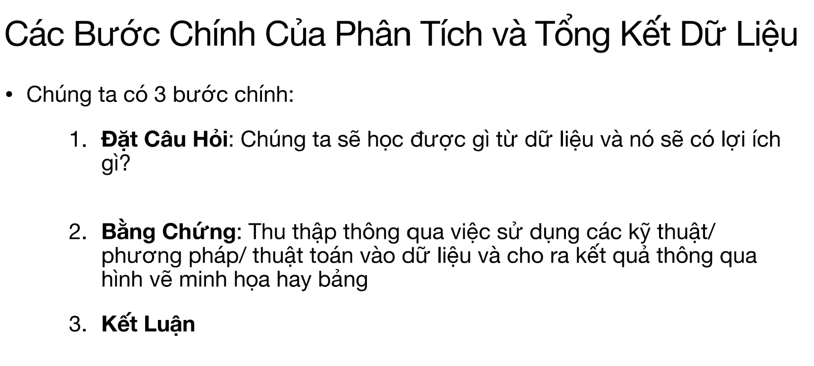
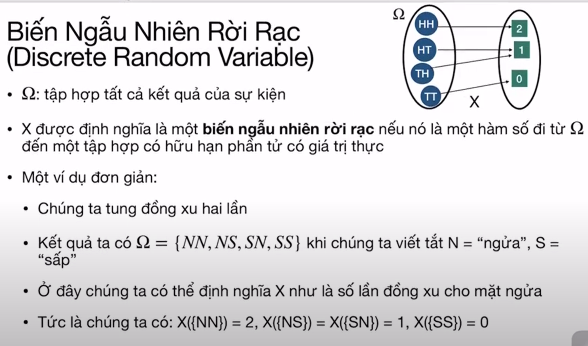
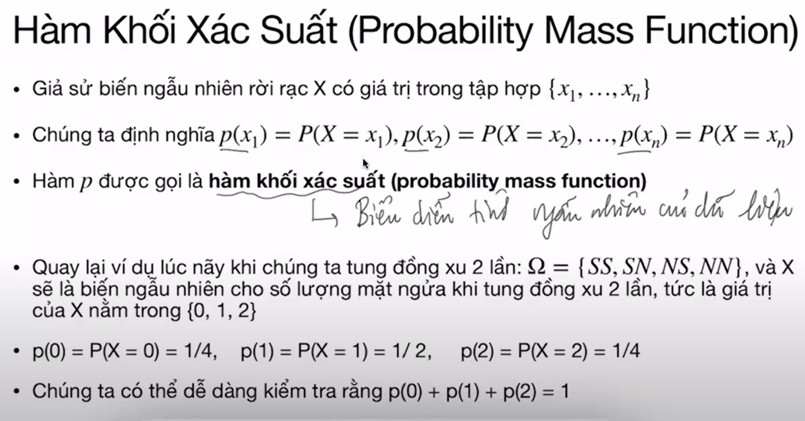
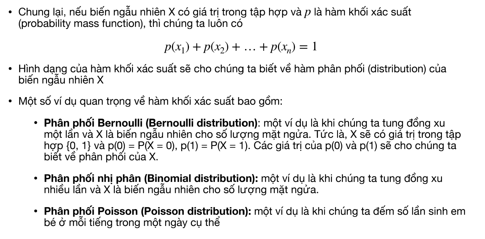

# Bài 3
https://drive.google.com/drive/folders/17s9KBf1GhgP4xoIDsNmTeEEuhiQnJkDG

## Biến ngẫu nhiên rời rạc (discrete random var), kỳ vọng và phương sai

Buổi hôm sau sẽ đi vào mô hình trong học máy và học dữ liệu. Những khái niệm ta học hôm này về kỳ vọng va phương sai rất là quan trọng, nên mình dành một buổi riêng ra để dạy về 2 khái niệm này thôi. Thông qua kỳ vọng và phương sai chúng ta sẽ hiểu hơn về bản chất của dữ liệu, và từ 2 thông tin này chúng ta có thể dự đoán được nhiều thông tin quan trọng về dữ liệu.

Trước tiên mình sẽ đi lại một xíu về thế nào là biến ngẫu nhiên và tại sao ta lại quan tâm tới biến ngẫu nhiên. Một trong những nền tảng quan trọng của học máy là xác suất. Tức là __chúng ta gắn liền dữ liệu với một số khái niệm về xác suất__. Dữ liệu của chúng ra rất là phức tạp, tuy nhiên chúng ta sẽ tìm một cách nào đó để biểu diễn dữ liệu mặc dù dữ liệu của chúng ta không có tính chất về logic, hay là về thứ tự đi, nhưng chúng ta vẫn muốn có một cách nào đó để biểu diễn dữ liệu. Một cách là biểu diễu dữ liệu dưới dạng toán học dưới các khái niệm và nền tảng chắc chắn. Đồng thời chúng ta cũng có nhiều tính chất thứ tự trong toán học luôn. Và dưới biểu diễn toán học ta có thể hiểu về dữ liệu. 

Với các kết quả của một sự kiện, ta có thể biểu diễn dưới dạng số thứ tự để có thể áp dụng được các thao tác (toán học  như cộng trừ) trên các kết quả đó dễ dàng hơn. __Đó là động lực để chúng ta cố gắng biểu diễu dữ liệu dưới dạng toán học__.

!! Một trong những thứ quan trọng nhất của ML là chúng tìm được biểu diễn dữ liệu dưới dạng toán học !! Trên thực tế biểu diễn dưới dạng toán học không phải là tối ưu nhất đâu, bởi vì qua máy học chúng ta đã mất đi nhiều tính chất quan trọng của dữ liệu rồi. Chẳng hạn chúng ta có 1 câu từ đi, và khi chúng ta biểu diễn câu từ đó bằng số học thì dĩ nhiên nó không còn mang nhiều khái niệm về ngôn ngữ nữa. Thành ra là khi học ngôn ngữ mà ta dùng công cụ AI thì chúng ta sẽ bị rất nhiều hạn chế là vậy.

Thành ra câu hỏi ở đây là: __liệu có cách nào biểu diễn dữ liệu tốt hơn được không?__. Đây là câu hỏi rất là khó, vì ta biết biểu diễn toán học có lịch sử lâu đời rồi, tuy nhiên trong lĩnh vực ngôn ngữ chẳng hạn, thì biểu diễn toán học nó lại mất đi cái tính chất khái niệm ngôn ngữ. Hiện nay chúng ta có những công cụ bên học sâu, họ hy vọng rằng các công cụ học sâu sẽ giúp chúng ta capture / biểu diễn được các tính chất phức tạp trong ngôn ngữ. Tuy nhiên cái đó vẫn rất là khó. Thành ra hiện tại chưa có nhiều đột phá trong việc làm sao học ngôn ngữ bằng máy tính.

## Hàm khối xác xuất

Ví dụ về dữ liệu ảnh mặt người, có người mũi cao, mũi thấp, tóc dài ngắn, mắt to nhỏ khác nhau, thì ở đây ta có thể hiểu X là một cái map biểu diễn từng điểm ảnh trong ảnh đầu vào, thành một cái giá trị thực trong không gian cao chiều, thành ra chúng ta hiểu được cái hàm khối xác xuất của cái điểm ảnh, chúng ta sẽ hiểu được cái tính ngẫu nhiên, hay tính biểu diễn của cái ảnh mặt người đó. Vì thế tại sao chúng ta quan tâm __học hàm khối xác suất__. Hàm khối xác xuất giúp chúng ta hiểu được cách biểu diễn dữ liệu, hiểu được tính ngẫu nhiên của dữ liệu, từ đó chúng ta có thể sản sinh ra được dữ liệu mới.

Hầu hết các nhiệm vụ trong AI đều phải thông qua hàm khối xác xuất này vì nó giúp ta hiểu hơn về dữ liệu. Nó có thể là một cấu trúc rất phức tạo nhưng eventually nó sẽ là cái gì đó liên quan tới hàm khối xác suất này. Vậy nên chúng ta phải hiểu khái niệm này rõ ràng thì mới đi xa được trong việc chúng ta xây dựng mô hình.

Hàm biến ngẫu nhiên có 2 khái niệm thôi: Kỳ vọng + phương sai.
- Kỳ vọng là cách tính trung bình của dữ liệu thôi
- Phương sai giống như chúng ta tính mức độ biến thiên của dữ liệu xung quanh cái kỳ vọng.

=> __Kỳ vọng + phương sai giúp chúng ta hiểu những tính chất cơ bản của hàm khối xác suất__

!!! Tuy nhiên tính kỳ vọng và phương sai rất là khó, hầu hết ta không tính được !!! Chúng ta chỉ tính được xấp xỉ thôi. Thành ra là nếu ta tính càng tốt kỳ vọng và phương sai thì chúng ta càng có một hệ thống AI rất là tốt.

__Định lý giới hạn trung tâm__: mọi phân bố xác xuất đều có thể biểu diễn lại bằng một tập các phân bố chuẩn (Gaussian).
Như GMM: Gausian Mixture Model được sử dụng trong HMM vậy.
