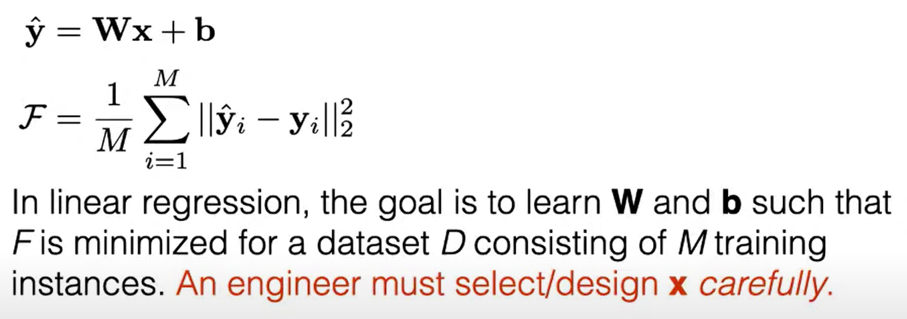

# Lecture 4: Neural Structured Models (Chris Dyer)
https://youtu.be/Hws6EfkWOGU?t=242

- RNN
	- App: Language Model
- Learning challenges and solutions
	- Vanishing gradients
	- LSTM
	- GRU
- Conditional LMs
- Encoder-decoder architectures
- Seq2seq with Attn & RNNs
- Transformers ans self-attn

## Trình bày lại dữ liệu dạng chuỗi (RNNs)

Lots of (most??) interesting data is sequential in natura.
- words in sentences, documents, conversations
- DNA, amino acids
- stock market returns
- token in a program, actions taken by an agent, pixels in an images ...

### Feature induction https://youtu.be/Hws6EfkWOGU?t=689

