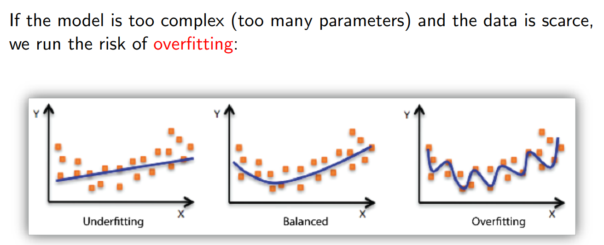
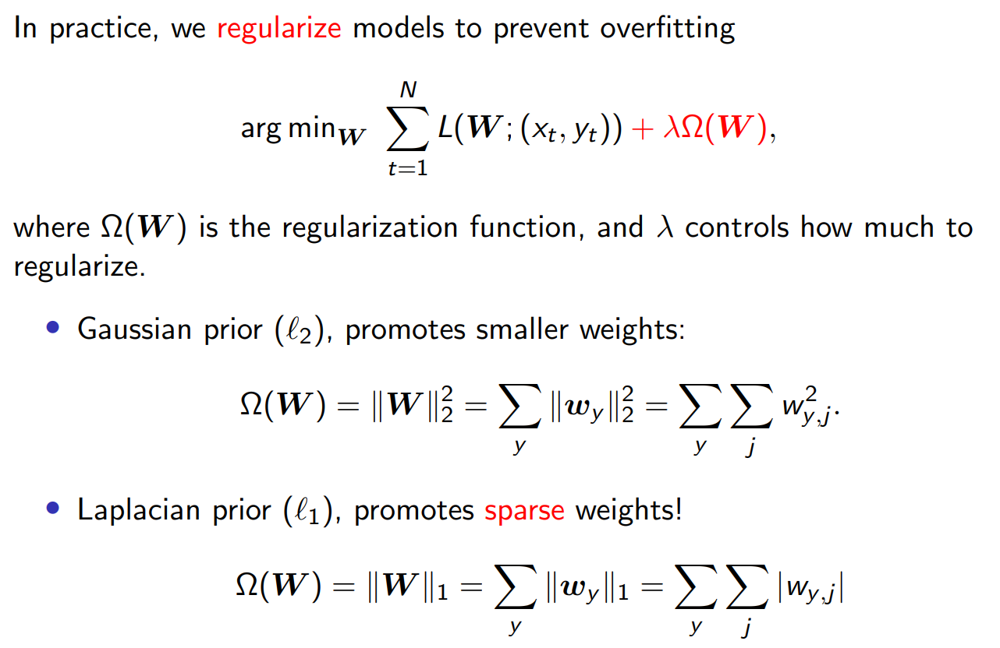
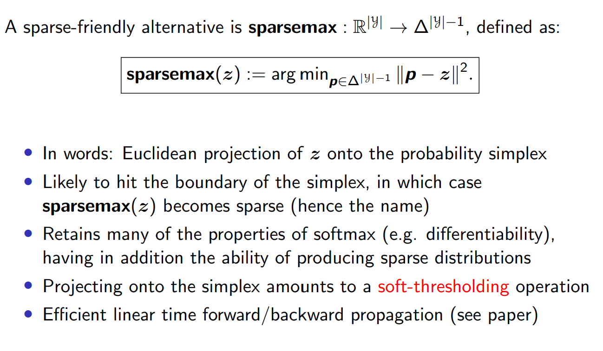
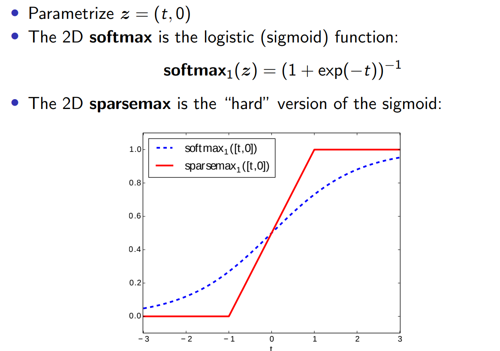
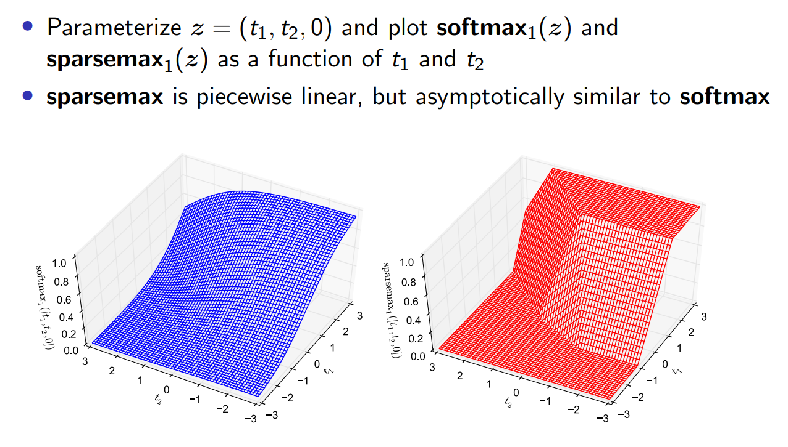
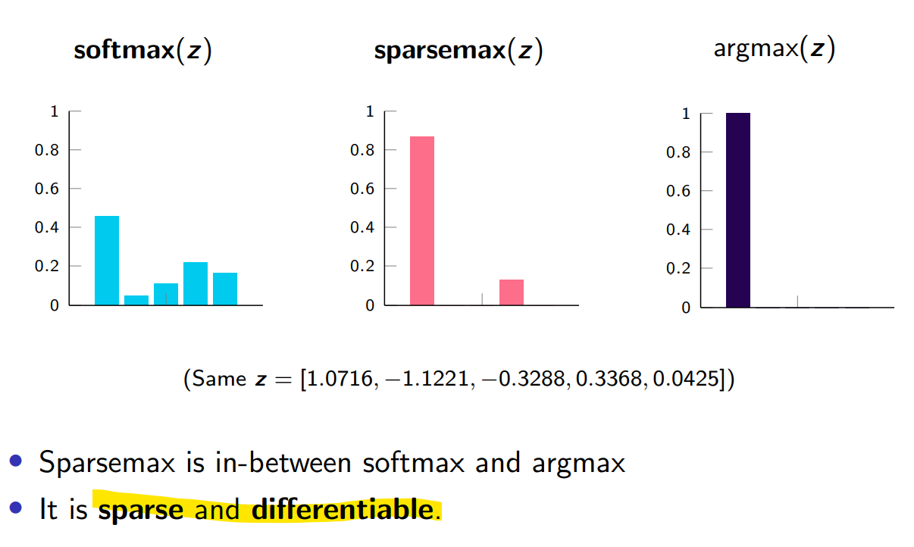

# Introduction to Machine Learning and Linear Learners
https://www.youtube.com/watch?v=nuLPvzI_ei8

http://lxmls.it.pt/2022/slides/andre.pdf

It’s 2023 and everybody uses neural networks. Why a lecture on linear classifiers?
- The underlying machine learning concepts are the same
- The theory (statistics and optimization) are much better understood
- Linear classifiers are still widely used (and very effective when data is scarce)
- Linear classifiers are a component of neural networks.

## Regularization https://youtu.be/nuLPvzI_ei8?t=10677

Nếu lamda quá lớn sẽ underfitting, lamda = 0, không bình thường hóa, thì sẽ overfitting.

l_1 có mối liên hệ với độ thưa thớt, dùng l_1 promote weight thưa.

