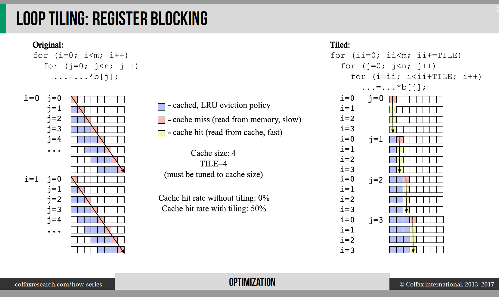
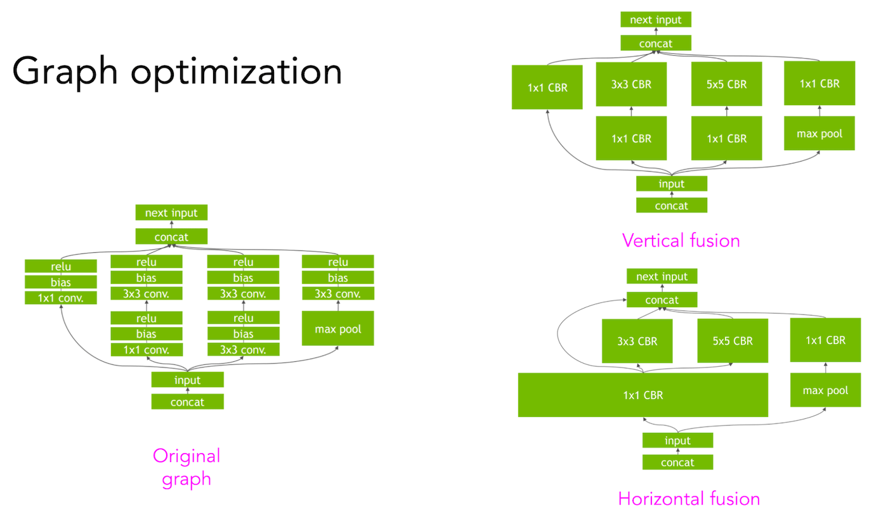
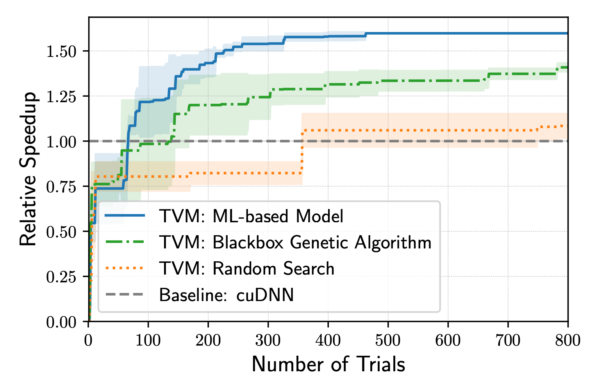

https://mlc.ai/summer22/schedule

## [A friendly introduction to machine learning compilers and optimizers](https://huyenchip.com/2021/09/07/a-friendly-introduction-to-machine-learning-compilers-and-optimizers.html)

Ideally, the compiler would be invisible and everything would “just work”. However, we are still many years away from that.

As more and more companies want to bring ML to the edge, and more and more hardware is being developed for ML models, more and more compilers are being developed to bridge the gap between ML models and hardware accelerators—MLIR dialects, TVM, XLA, PyTorch Glow, cuDNN, etc.. 

According to Soumith Chintala, creator of PyTorch, as the ML adoption matures, companies will compete on who can [`compile and optimize their models better`](https://venturebeat.com/ai/top-minds-in-machine-learning-predict-where-ai-is-going-in-2020).

> The next competitions for ML is in compilers (Soumith Chintala, Venture Beat 2020)

### Optimizing: performance

Even though individual functions in these frameworks might be optimized, there’s little to no optimization across frameworks. A naive way of moving data across these functions for computation can cause an order of magnitude slowdown in the whole workflow. A study by researchers at Stanford DAWN lab found that typical ML workloads using NumPy, Pandas and TensorFlow run 23 times slower in one thread compared to hand-optimized code (Palkar et al., ‘18).

Optimization engineers are hard to come by and expensive to hire because they need to have expertise in both ML and hardware architectures. Optimizing compilers (compilers that also optimize your code) is an alternative solution as they can automate the process of optimizing models. In the process of lowering ML model code into machine code, compilers can look at the computation graph of your ML model and the operators it consists of — convolution, loops, cross-entropy — and find a way to speed it up.

### How to optimize your ML models

There are two ways to optimize your ML models: locally and globally. Locally is when you optimize an operator or a set of operators of your model. Globally is when you optimize the entire computation graph end-to-end.

There are standard local optimization techniques that are known to speed up your model, most of them making things run in parallel or reducing memory access on chips. Here are four of the common techniques.

- `vectorization`: given a loop or a nested loop, and instead of executing it one item at a time, use hardware primitives to operate on multiple elements that are contiguous in memory.

- `parallelization`: given an input array (or n-dimensional array), divide it into different, independent work chunks, and do the operation on each chunk individually.

- `loop tiling`: change the data accessing order in a loop to leverage hardware’s memory layout and cache. This kind of optimization is hardware dependent. A good access pattern on CPUs is not a good access pattern on GPUs. See visualization below by Colfax Research.

- `operator fusion`: fuse multiple operators into one to avoid redundant memory access. For example, two operations on the same array require two loops over that array. In a fused case, it’s just a single loop.

According to Shoumik Palkar, the creator of Weld (another compiler), these standard local optimization techniques can be expected to give `~3x speed up`. Of course, this estimate is highly context-dependent.

To obtain a much bigger speedup, you’d need to leverage higher-level structures of your computation graph. For example, given a convolution neural network with the computation graph can be `fused vertically or horizontally` to reduce memory access and speed up the model. See visualization below by NVIDIA’s TensorRT team.

### Hand-designed vs. ML-based compilers

Traditionally, framework and hardware vendors hire optimization engineers who, based on their experience, come up with heuristics on how to best execute the computation graph of a model.

There are a couple of drawbacks to hand-designed rules. The first is that they are non-optimal. There’s no guarantee that the heuristics an engineer comes up with are the best possible solution.

Second, they are non-adaptive. Repeating the process on a new framework or a new hardware architecture requires an enormous amount of effort.

**Using ML to speed up ML models**

he way autoTVM works is quite complicated, but here is the gist:

1. It first breaks your computation graph into subgraphs.
2. It predicts how big each subgraph is.
3. It allocates time to search for the best possible path for each subgraph.
4. It stitches the best possible way to run each subgraph together to execute the entire graph.

autoTVM measures the actual time it takes to run each path it goes down, which gives it ground truth data to train a cost model to predict how long a future path will take. The pro of this approach is that because the model is trained using the data generated during runtime, it can adapt to any type of hardware it runs on. The con is that it takes more time for the cost model to start improving.

Compilers like TVM are adaptive, flexible and can be especially useful when you want to try out new hardware. One example is when Apple released their M1 chips in Nov 2020. M1 is an ARM-based system on a chip, and ARM architectures are more or less well-understood. However, M1 still has a lot of novel components of its ARM implementation and requires significant optimization to make various ML models run fast on it. A month after the release, folks at OctoML showed that the optimization made by autoTVM is almost 30% faster than hand-designed optimization by Apple’s Core ML team. Of course, as M1 matures and hand-designed optimization becomes intensive, it will be hard for auto-optimization to beat hand-designed optimization. But it’s possible for systems engineers to `leverage tools like autoTVM to speed up their optimization`.

### Different types of compilers

The most widely-used type of compiler is domain-specific compilers developed by major framework and hardware vendors targeting a specific combination of framework and hardware. Unsurprisingly, the most popular ones are developed by the biggest vendors.

- `NVCC` (NVIDIA CUDA Compiler): works only with CUDA. Closed-source.

- `XLA` (Accelerated Linear Algebra, Google): originally intended to speed up TensorFlow models, but has been adopted by JAX. Open-source as part of the TensorFlow repository.

- `PyTorch Glow` (Facebook): PyTorch has adopted XLA to enable PyTorch on TPUs, but for other hardware, it relies on PyTorch Glow. Open-source as part of the PyTorch repository.

Third-party compilers are, in general, very ambitious (e.g. you must be really confident to think that you can optimize for GPUs better than NVIDIA can). But third-party compilers are important as they help lower the overhead in making new frameworks, new hardware generations, new models performant, giving small players a chance to compete with established players who have their own compilers heavily tuned for their existing products.

The best third-party compiler I see is Apache TVM, which works with a wide range of frameworks (including TensorFlow, MXNet, PyTorch, Keras, CNTK) and a wide range of hardware backends (including CPUs, server GPUs, ARMs, x86, mobile GPUs, and FPGA-based accelerators).

Another project that I find exciting is MLIR, which was originally started at Google also by Chris Lattner (the creator of LLVM). However, it’s now under the LLVM organization. MLIR is not really a compiler but a meta compiler, infrastructure that allows you to build your own compiler. MLIR can run multiple IRs, including TVM’s IRs, as well as LLVM IR and TensorFlow graphs.

Even though there has been huge progress in compilers for machine learning, there’s still a lot of work to be done before we can abstract compilers completely from general ML practitioners. Think about traditional compilers like GCC. You write your code in C or C++, and GCC automatically lowers your code into machine code. Most C programmers don’t even care what the intermediate representations GCC generates.

In the future, ML compilers can be the same way. You use a framework to create an ML model in the form of a computation graph, and your ML compiler can generate machine-native code for whatever hardware you run on. You won’t even need to worry about intermediate representations.

Tools like TVM are steps towards making that future possible.
