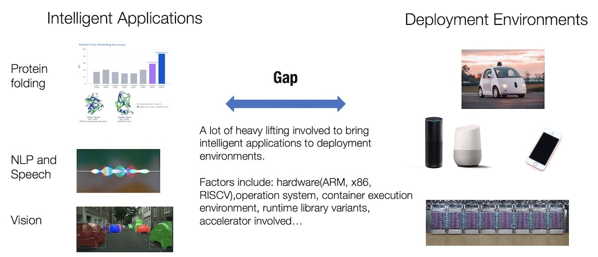
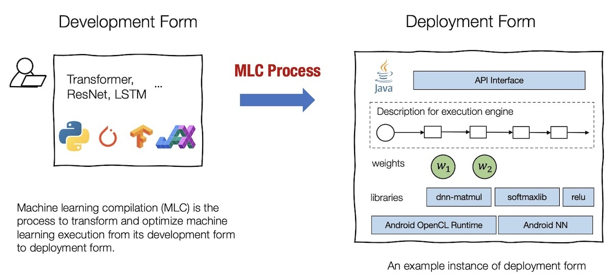
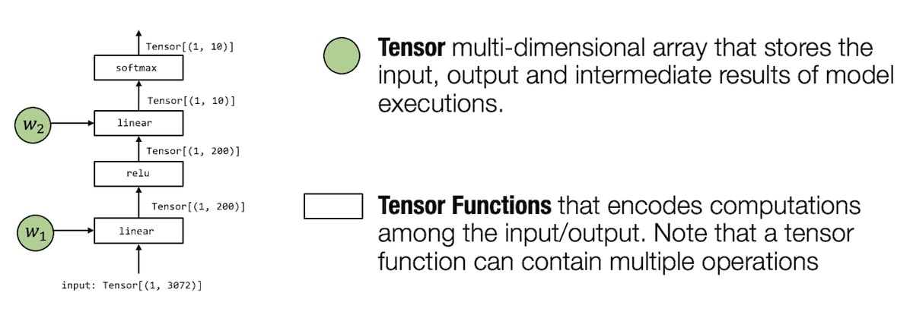
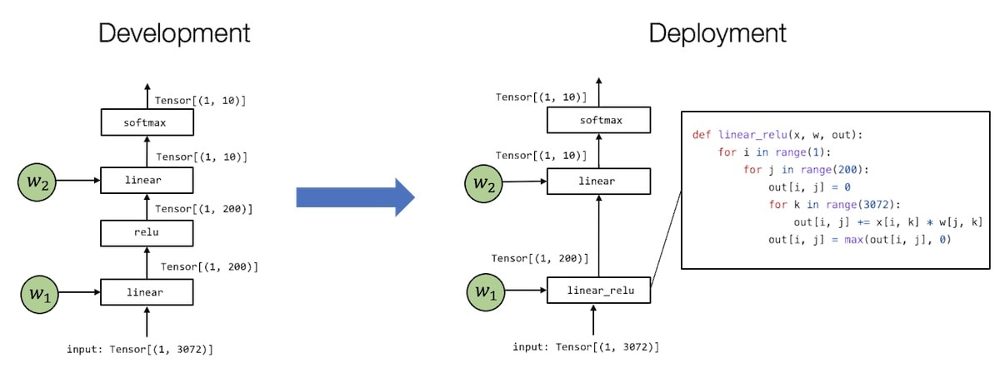
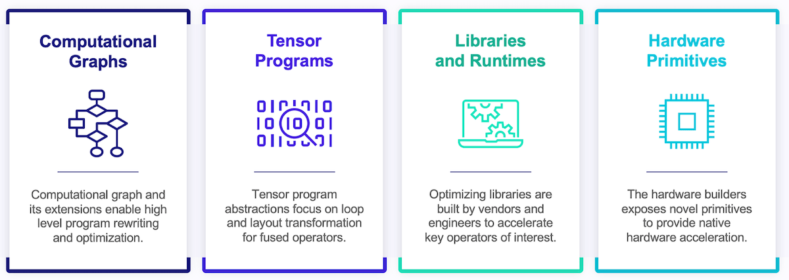

# Episode 1
- https://mlc.ai/summer22/slides/1-Introduction.pdf
- https://youtu.be/Oc_wVXdnrrM
- https://mlc.ai/chapter_introduction

Giới thiệu về Biên dịch Học máy (MLC). Là khóa học đầu tiên thuộc thể loại này. Giáo sư CMU Tianqi Chen giới thiệu lý do tại sao khối lượng công việc suy luận và đào tạo AI cần biên dịch học máy để chuyển đổi và tối ưu hóa các mô hình học máy từ trạng thái phát triển của chúng (như trong PyTorch và TensorFlow) thành dạng triển khai trên CPU và GPU. MLC giúp giải quyết vấn đề bùng nổ tổ hợp của các mô hình học máy và các nền tảng phần cứng triển khai.

*Có rất nhiều việc cần làm để mang những ứng dụng thông minh vào cuộc sống (deployment environments). Các yếu tố như: phần cứng (ARM, x86, RISC-V), hệ điều hành, thư viện thời gian chạy, bộ tăng tốc (accelerator)...*

## Biên dịch học máy là gì?

Biên dịch học máy (MLC) là quá trình chuyển đổi và tối ưu hóa việc thực thi học máy từ dạng phát triển sang dạng triển khai của nó.

Dạng phát triển đề cập đến tập hợp các phần tử mà chúng ta sử dụng khi phát triển các mô hình học máy. Một dạng phát triển điển hình liên quan đến các mô tả mô hình được viết trong các thư viện phổ biến như PyTorch, TensorFlow hoặc JAX, cũng như các trọng số liên quan đến chúng.

Dạng triển khai đề cập đến tập hợp các phần tử cần thiết để thực thi các ứng dụng học máy. Nó thường liên quan đến một bộ mã được tạo để hỗ trợ từng bước của mô hình học máy, quy trình quản lý tài nguyên (ví dụ: bộ nhớ) và giao diện với môi trường phát triển ứng dụng (ví dụ: APIs cho ứng dụng Android).

*Biên dịch học máy là quá trình chuyển đổi và tối ưu thực thi học máy từ dạng phát triển sang dạng triển khai.*

Chúng tôi sử dụng thuật ngữ “biên dịch” vì quy trình có thể được xem gần giống với những gì trình biên dịch truyền thống làm - một trình biên dịch đưa các ứng dụng ở dạng phát triển và biên dịch chúng vào các thư viện có thể được triển khai. Tuy nhiên, cách biên dịch bằng máy học vẫn khác với cách biên dịch truyền thống về nhiều mặt.

Trước hết, quá trình này không nhất thiết phải liên quan đến việc tạo mã. Ví dụ, biểu mẫu triển khai có thể là một tập hợp các chức năng thư viện được xác định trước và việc biên dịch học máy chỉ chuyển các biểu mẫu phát triển thành các lời gọi vào các thư viện đó. Các thách thức và giải pháp cũng khá khác nhau. Đó là lý do tại sao việc nghiên cứu biên dịch học máy như một chủ đề riêng của nó là đáng giá, độc lập với biên dịch truyền thống. Tuy nhiên, chúng ta cũng sẽ tìm thấy một số khái niệm biên dịch truyền thống hữu ích trong quá trình biên dịch học máy.

## Các thành tố chính của biên dịch máy học

- Tensor: mảng đa chiều lưu trữ đầu vào, đầu ra và các kết quả trung gian khi thực thi mô hình
- các hàm Tensor: mã hóa tính toán từ đầu vào thành đầu ra. Một hàm tensor có thể có nhiều phép tính.

Hình trên là một mạng nơ-ron 2 lớp điển hình, đầu vào là một vector các điểm ảnh của hình ảnh đầu vào. Sau đó áp dụng biến đổi tuyến tính ánh xạ vector đầu vào thành vector độ dài 200 với hàm kích hoạt Relu. Cuối cùng ánh xạ vào vector độ dài 10 thể hiện khả năng hình ảnh đầu vào thuộc vào các lớp cho trước.

*Có nhiều cách để thể hiện hàm tensor. Ví dụ với `linear_relu` có thể được biểu diễn bởi một ô trong đồ thị hoặc biểu diễn bởi dòng lặp của hàm dưới dạng mã nguồn*

4 loại trừu tượng:
- `Đồ thị tính toán` giúp viết lại và tối ưu hóa tính toán
- `Chương trình Tensor` tập trung vào vòng lặp và các lớp biến đổi của các thao tác hợp nhất
- `Thư viện và thời gian chạy` tối ưu hóa thư viện được xây dựng bởi nhà cung cấp và các kỹ sư để tăng tốc các phép tính được quan tâm.
- `Các thành tố cơ bản nhất của Phần cứng` các nhà phát triển phần cứng cung cấp các thành tố mới giúp tăng tốc tính toán ngay tại phần cứng.
