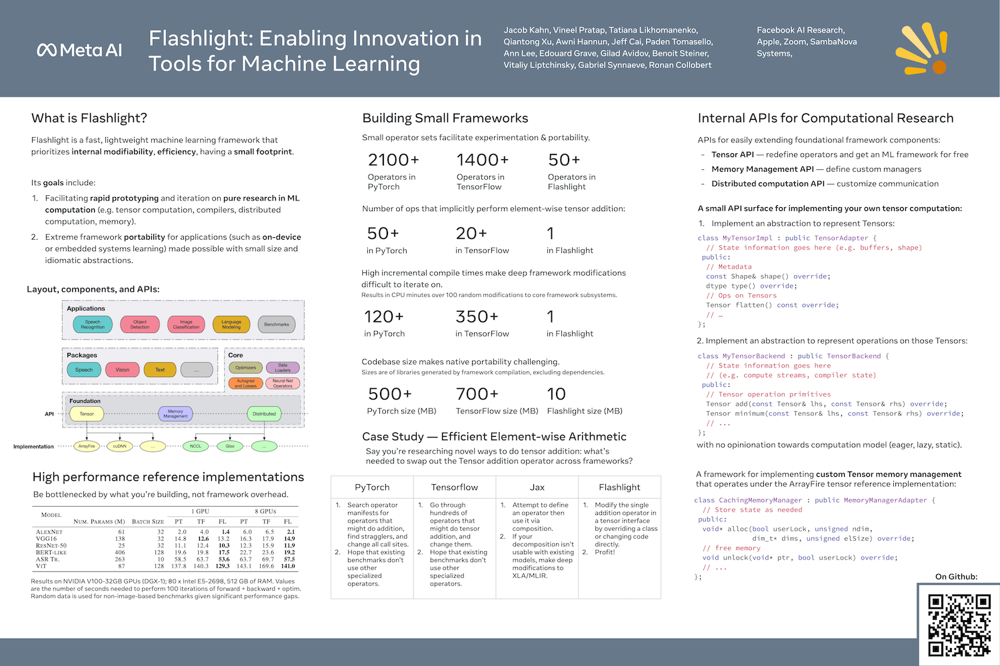
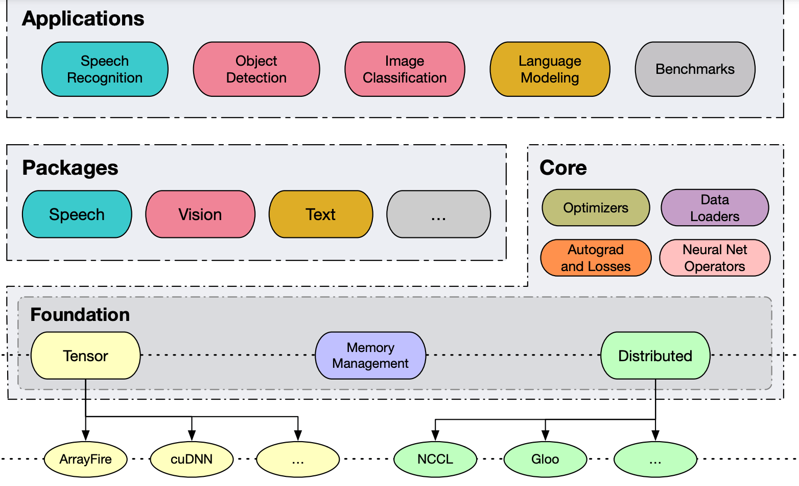
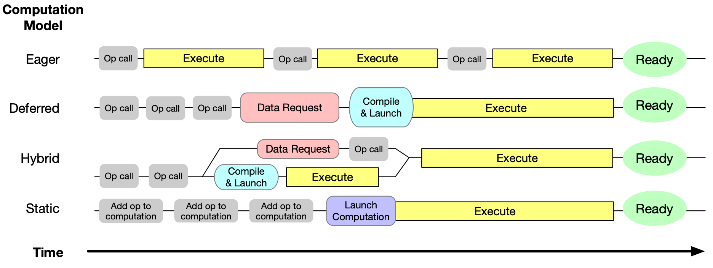
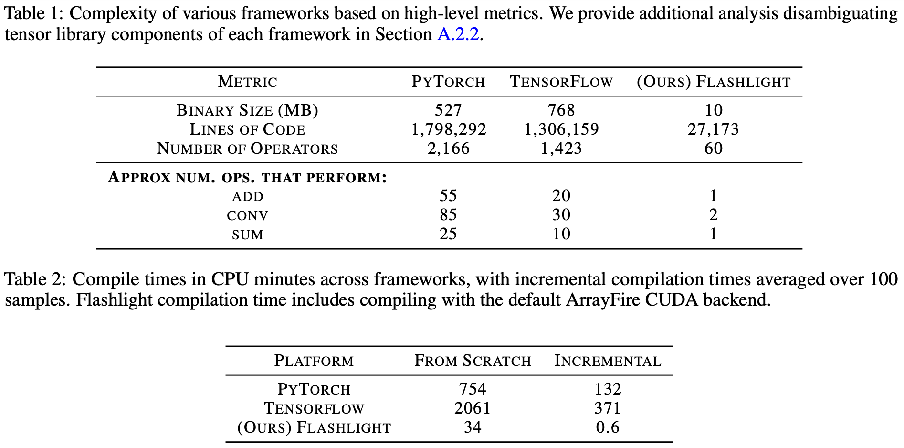
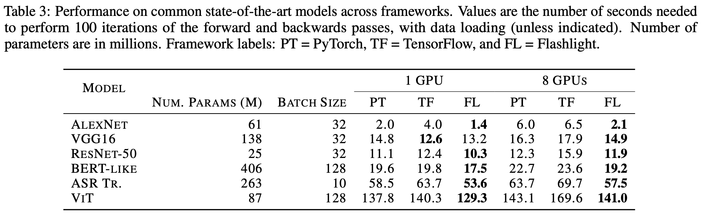

# FLASHLIGHT: ENABLING INNOVATION IN TOOLS FOR MACHINE LEARNING

[paper](https://arxiv.org/pdf/2201.12465.pdf) | [slides](https://icml.cc/media/icml-2022/Slides/17877_aadAdcP.pdf)

We introduce Flashlight, an open-source library built to spur innovation in machine learning tools and systems by prioritizing open, modular, customizable internals and state-of-the-art, research-ready models and training setups across a variety of domains.

Flashlight allows systems researchers to rapidly prototype and experiment with novel ideas in machine learning computation and has low overhead, competing with and often outperforming other popular machine learning frameworks.

We see Flashlight as a tool enabling research that can benefit widely used libraries downstream and bring machine learning and systems researchers closer together.

- - -

Numerous frameworks have been implemented in recent years to support machine learning, including Lush [Bottou and LeCun, 2002], Theano [Bergstra et al., 2010], Torch [Collobert et al., 2011], Caffe [Jia et al., 2014], MXNet [Chen et al., 2015], deeplearning4j [Team, 2016], TensorFlow [Abadi et al., 2016], Flux [Innes, 2018], Jax [Bradbury et al., 2018], PyTorch [Paszke et al., 2019], Chainer [Tokui et al., 2019], and PaddlePaddle [Ma et al., 2019].

These frameworks offer programming models designed around multidimensional arrays (tensor), modeled as first-class objects and supported by a comprehensive set of mathematical primitives (or operators) to manipulate them. To provide the computing power required by deep learning-based methods, most natively support hardware accelerators such as general-purpose GPUs or custom-designed ASICs such as TPUs. Generally, framework implementations follow one of a few computational

Generally, framework implementations follow one of a few computational models:

- In the `deferred execution model`, the neural network to be trained is first encoded as a dataflow graph which can be optimized for a specific set of target hardware devices. The neural network is then executed in a distinct second phase. Since the dataflow graph represents the entire computation, both local and global optimizations can be applied, making the subsequent execution very efficient. However, only programs that can be represented as dataflow graphs can be processed with this approach, thus limiting flexibility. Frameworks such as Theano, Caffe, TensorFlow 2.0, or MXNet fall into this category.

- In the `eager model`, an interpreter (such as Python) is extended with the high level kernel-based operations needed to train a neural network. These operations are executed immediately when called, though this precludes many optimizations. By weaving neural network-related operations into a Turing complete programming language, this approach is extremely flexible. Furthermore, the imperative nature of the underlying
programming language allows for fine-grained control over the execution order and memory utilization, which enables more specific user-driven optimization. Frameworks such as Torch, TensorFlow 2.0 Eager, PyTorch, or Chainer exemplify this approach.

- In the `static model`, computation is explicitly specified ahead-of-time either via an implicit or explicit schedule. Operations are executed inside runtime sessions. Given that the entire graph of computation is fully-specified before execution, significant global optimizations can be applied here, such as explicit ahead-of-time (AOT) scheduling. Frameworks such as TensorFlow 1.0 fall into this category.

- The hybrid model simply combines multiple of the above computation models.

- - -

*Flashlight is a viable solution for machine learning research, shipping with a comprehensive set of benchmarks and research setups for state-of-the-art neural network architectures such as CNN, Transformer, ... ViT, Bert, wave2letter*

Benchmarks built on these state-of-the-art models make Flashlight a turn key solution for system researchers who want to quickly evaluate their design and implementation choices without needing to build test benches from the groundup. More importantly, Flashlight makes possible end-to-end benchmarking on real models rather than microbenchmarks or small-scale tests.

## Design

*Flashlight’s Tensor API supports backend implementations with any of the above computation modes (or entirely new modes that may result from further research).*

## Evaluation

## Performance

