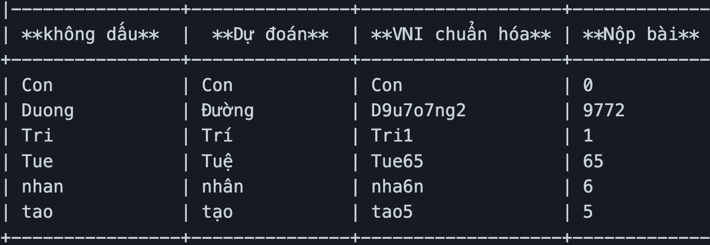
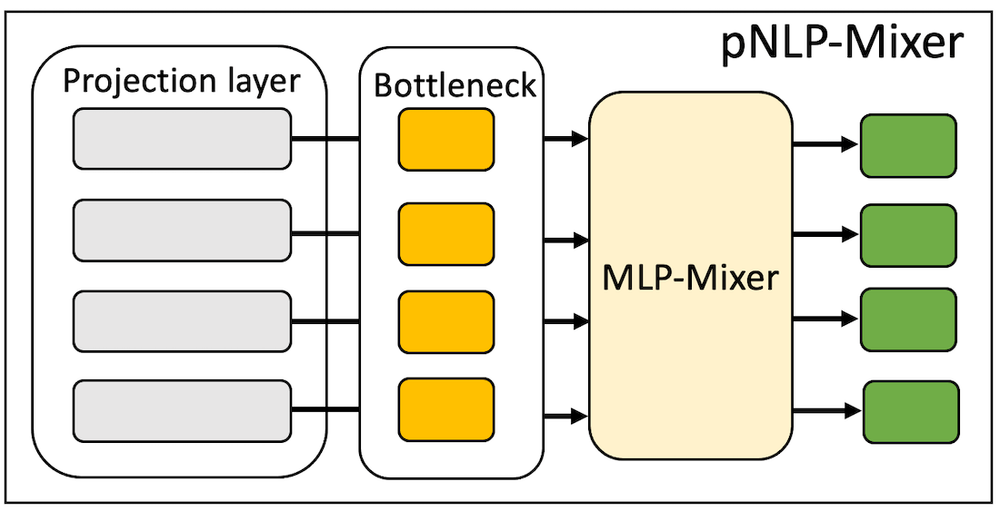

# Ứng dụng học sâu vào bộ gõ tiếng Việt

Rất nhiều ứng dụng AI đang làm thay đổi cách chúng ta tương tác với máy tính và trợ giúp đắc lực trong từng tác vụ cụ thể: từ khóa mở điện thoại bằng khuôn mặt, dịch ngoại ngữ sang tiếng bản địa và ngược lại, nhập liệu bằng tiếng nói cho các thiết bị thông minh (ti-vi, máy in vé gửi xe) cho tới hỗ trợ lập trình viên soản thảo mã nguồn (co-pilot của Github).

https://user-images.githubusercontent.com/8133/192935040-094f4fbe-ef15-4c73-98cf-7ef5a5327860.mp4

Có một mảng ứng dụng mà người Việt nào khi tương tác với máy tính và điện thoại cũng dùng là bộ gõ (cụ thể là cách gõ Telex và VNI). Tuy dùng nhiều như vậy nhưng trong khoảng 20 năm qua hầu như không có cải tiến nào thực sự mới mẻ. Chúng tôi tin rằng với sự tiến bộ của trí tuệ nhân tạo, cụ thể là học sâu, thì việc kết hợp các kết quả nghiên cứu mới nhất trong lĩnh vực xử lý ngôn ngữ tự nhiên với phân tích đặc trưng riêng của ngôn ngữ tiếng Việt sẽ giúp cải tiến bộ gõ tiếng Việt lên một tầm mức mới và là nền tảng cho một bộ các ứng dụng ngôn ngữ tiếng Việt thông minh, giúp người dùng diễn đạt được những gì họ muốn nói nhanh gọn, và “chuẩn” hơn - như những gì Grammarly đã làm được cho tiếng Anh.


*Nguồn https://techcrunch.com/2021/11/17/grammarly-raises-200m-at-a-13b-valuation*

## Tự động bỏ dấu thanh tiếng Việt

Ý tưởng đầu tiên chúng tôi muốn thử nghiệm (và có thể áp dụng ngay để bộ gõ trở nên "thông minh" trong mắt người dùng) là tự động bỏ dấu và thanh điệu để tăng tốc độ nhập liệu (xem video minh họa dưới).

https://user-images.githubusercontent.com/8133/191021069-fd3e9604-8acb-40e9-9583-e9edfb9e9fe1.mp4


Ý tưởng không mới và đã có vài thử nghiệm dựa trên mô hình máy dịch (từ chuỗi đầu vào sinh ra một  chuỗi đầu ra mới). Chúng tôi đề xuất một cách tiếp cận khác đơn giản hơn, dựa trên phân tích ngữ âm tiếng Việt, là sử dụng mô hình gán nhãn cho các âm tiết không dấu. Ví dụ:
```
“Troi hom nay dep qua” => 
“Troi|w2 hom|z0 nay| dep|_5 qua|_6” => 
“Trời hôm nay dẹp quá”
```

Chúng tôi thấy rằng chỉ cần sử dụng 3 ký hiệu `_ z w` để thể hiện phần dấu cho các nguyên âm không dấu (`e,y,u,i,o,a`), các nguyên âm có dấu ^ (`â, ê, ô`) và các nguyên âm có dấu còn lại (`ư, ơ, ă`). Tổ hợp với 6 thanh điệu tiếng Việt (`0: thanh không, 1: sắc, 2: huyền, 3: hỏi, 4: ngã, 5: nặng`) ta có tổng số `18 nhãn` cần đánh cho từng âm tiết tiếng Việt không dấu (Lưu ý: trường hợp cá biệt ‘d => đ’ xử lý sau để giảm thiểu số nhãn cần đánh).

Theo cách mã hóa thường dùng như trong một cuộc thi thêm dấu tiếng Việt, thì có tới 108 (2 x 3 x 3 x 6) tổ hợp đầu ra (2 lựa chọn cho d vs đ, 3 lựa chọn cho cách bỏ dấu của nguyên âm số 1, 3 lựa chọn bỏ dấu cho nguyên âm số 2, và 6 lựa chọn thanh điệu).

*Nguồn: https://github.com/aivivn/vietnamese_tone_prediction_utils*

Như vậy chỉ cần phân tích dữ liệu khéo léo hơn ta đã giảm số lượng nhãn đi rất nhiều.

## Các bước thực hiện

- Thu thập ngữ liệu tiếng Việt, phân tách âm tiết không dấu và nhãn.

- Tiếp theo là “nhúng” (embedding) tập dữ liệu tiếng Việt không dấu vào không gian vec-tơ n-chiều trước khi áp dụng các phương pháp gán nhãn. Cách làm tốt nhất hiện nay là nhúng kèm ngữ cảnh sử dụng Bert (một cải tiến từ mô hình Transformer), tức là mỗi biểu diễn vec-tơ của một âm tiết thay đổi theo từng ngữ cảnh, nó bao gồm thông tin của các âm tiết xuất hiện trước và sau nó trong ngữ cảnh. Mô hình này cần rất nhiều tính toán. Ví dụ: PhởBert được huấn luyện trên khoảng vài chục GB ngữ liệu tiếng Việt, trong vòng 1 tuần trên một máy tính có nhiều GPUs - đây là một khối lượng tính toán lớn, cần máy tính đủ mạnh. Để giảm khối tượng tính toán, chúng tôi sẽ tiến hành thử nghiệm trên một tập huấn luyện nhỏ trước (vài GB ngữ liệu).

- Huấn luyện các mô hình gán nhãn sau khi đã chuyển đổi từng âm tiết thành vec-tơ
Kiểm thử các mô hình gán nhãn để chọn ra mô hình cân bằng giữa độ chính xác và tốt độ suy diễn kết quả.

- Kết hợp mô hình vào bộ gõ để triển khai thực tế, và có những giải pháp tương tác với người dùng phù hợp (như đưa ra gợi ý cho người dùng lựa chọn trong trường hợp độ nhập nhằng cao).

## Mở rộng

### Cập nhật tham số cho tài liệu đang gõ

Bài toán cải tiến bộ gõ là bài toán động, dữ liệu liên tục sinh ra khi người dùng gõ tài liệu, và với từng tài liệu đang gõ, thì sự lặp lại của các đoạn văn khá nhiều. Ta có thể sử dụng dữ liệu cục bộ đó để cải thiện độ chính xác của ứng dụng tự động bỏ dấu thanh tiếng Việt theo từng văn bản và theo thời gian thực (on-the-fly). Chúng tôi tin rằng, người dùng càng tương tác nhiều với bộ gõ, bộ gõ càng học hỏi tốt hơn và đưa ra kết quả gợi ý ngày càng tin cậy, tới mức độ sai số gần như không có.

## Bài toán chữa lỗi chính tả

Có thể thấy bài toán tự động bỏ dấu thanh tiếng Việt là rút gọn của bài toán tự động chữa lỗi chính tả (với lỗi chính tả ở đây là gõ thiếu dấu và thanh). Bài toán thêm dấu thanh được giải quyết tốt sẽ là tiền đề đề xử lý bài toán khó hơn là tự động phát hiện và gợi ý chữa lỗi chính tả.

- - -

## Phụ lục

### Các lời giải đã có (seq2seq)

- https://phamdinhkhanh.github.io/2020/05/28/TransformerThemDauTV.html

- https://phamdinhkhanh.github.io/2019/08/19/CorrectSpellingVietnamseTonePrediction.html

- https://github.com/aivivn/vietnamese_tone_prediction_utils

- https://web.archive.org/web/20201202215102/https://forum.machinelearningcoban.com/t/aivivn-3-vietnamese-tone-prediction-1st-place-solution/5721

- https://github.com/iotayo/aivivn-tone

- https://m.facebook.com/nt/screen/?params=%7B%22note_id%22%3A898468740683308%7D&path=%2Fnotes%2Fnote%2F


### Quy về bài toán tagging với tag ở đây là dấu và thanh (mark+tone) cho từng âm tiết

`Embedding (Bert, Flair, ELMo, Word2Vec ...) + LSTM + CRF`


### Flair

- [Training your own Flair Embeddings](https://github.com/flairNLP/flair/blob/master/resources/docs/TUTORIAL_9_TRAINING_LM_EMBEDDINGS.md)
  (chạy Flair Embedding với 5 triệu câu trên Google Colab chậm! Thường bị ngắt trước khi huấn luyện xong).

- [Training a Tagger](https://github.com/flairNLP/flair/blob/master/resources/docs/TUTORIAL_7_TRAINING_A_MODEL.md)

- [Tuning](https://github.com/flairNLP/flair/blob/master/resources/docs/TUTORIAL_8_MODEL_OPTIMIZATION.md)


### Các giải pháp tăng tốc

pNLP-Mixer cho tầng Embedding?



### Khác

- [Grammatical Error Correction: Tag, Not Rewrite](https://aclanthology.org/020.bea-1.16.pdf)
