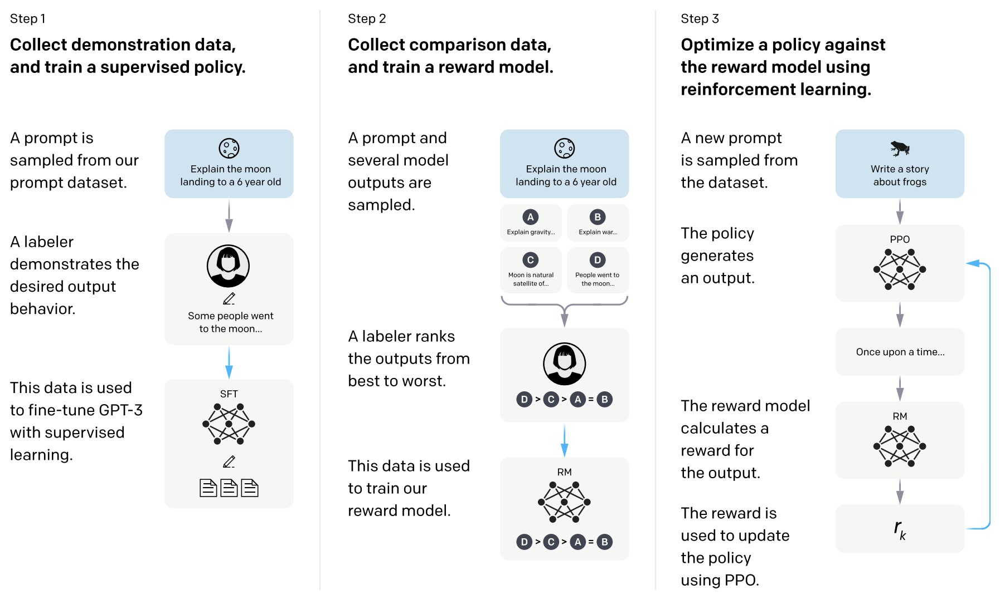

# Scaling Instruction-Finetuned Language Models (Flan-PaLM)
https://www.youtube.com/watch?v=QdwETwqyREY

# Training language models to follow instructions with human feedback
https://arxiv.org/pdf/2203.02155.pdf

Making language models bigger does not inherently make them better at following
a user’s intent. For example, large language models can generate outputs that
are untruthful, toxic, or simply not helpful to the user. In other words, these
models are not aligned with their users. 

Starting with a set of labeler-written prompts and prompts
submitted through the OpenAI API, we collect a dataset of labeler demonstrations
of the desired model behavior, which we use to fine-tune GPT-3 using supervised
learning.

We then collect a dataset of rankings of model outputs, which we use to
further fine-tune this supervised model using reinforcement learning from human
feedback. We call the resulting models InstructGPT.

In human evaluations on
our prompt distribution, outputs from the 1.3B parameter InstructGPT model are
preferred to outputs from the 175B GPT-3, despite having __100x fewer parameters__.
Moreover, InstructGPT models show improvements in truthfulness and reductions
in toxic output generation while having minimal performance regressions on public
NLP datasets. Even though InstructGPT still makes simple mistakes, our results
show that __fine-tuning with human feedback__ is a promising direction for aligning
language models with human intent.

Figure 2: A diagram illustrating the three steps of our method: (1) supervised fine-tuning (SFT), (2)
reward model (RM) training, and (3) reinforcement learning via proximal policy optimization (PPO)
on this reward model. Blue arrows indicate that this data is used to train one of our models. In Step 2,
boxes A-D are samples from our models that get ranked by labelers. See Section 3 for more details
on our method.

3.5 Models

We start with the GPT-3 pretrained language models from Brown et al. (2020). These models are
trained on a broad distribution of Internet data and are adaptable to a wide range of downstream tasks,
but have poorly characterized behavior. Starting from these models, we then train models with three
different techniques:

__Supervised fine-tuning (SFT).__ We fine-tune GPT-3 on our labeler demonstrations using supervised
learning. We trained for 16 epochs, using a cosine learning rate decay, and residual dropout of 0.2.
We do our final SFT model selection based on the RM score on the validation set. Similarly to Wu
et al. (2021), we find that our SFT models overfit on validation loss after 1 epoch; however, we find
that training for more epochs helps both the RM score and human preference ratings, despite this
overfitting.

__Reward modeling (RM).__ Starting from the SFT model with the final unembedding layer removed,
we trained a model to take in a prompt and response, and output a scalar reward. In this paper we
only use 6B RMs, as this saves a lot of compute, and we found that 175B RM training could be
unstable and thus was less suitable to be used as the value function during RL (see Appendix C for
more details).

